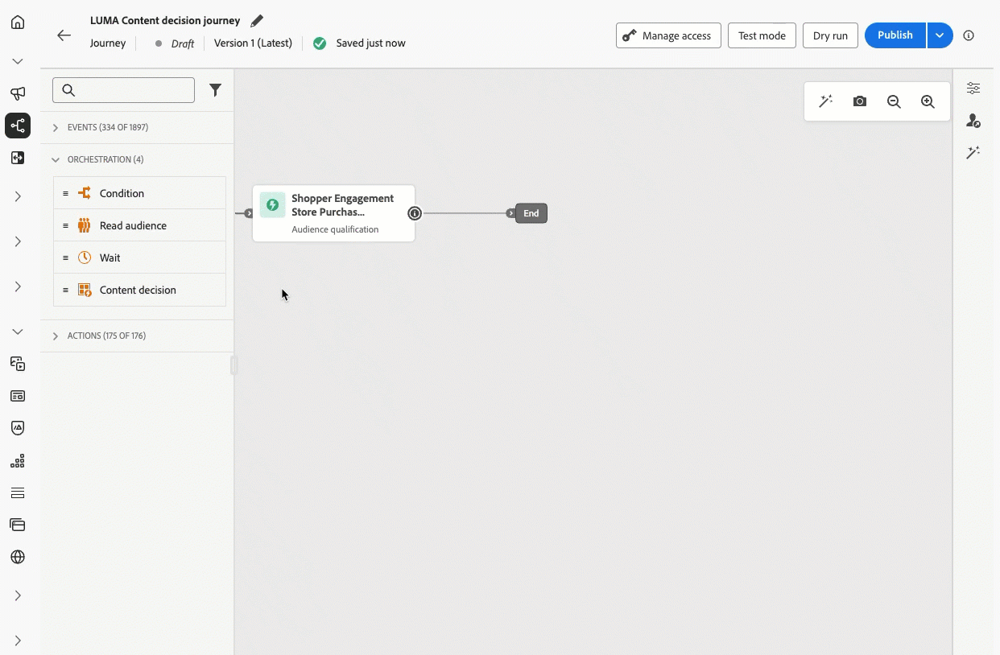

# Notas de la versión {#release-notes}

>[!CONTEXTUALHELP]
>id="ajo_homepage_card1"
>title="Novedades"
>abstract="**Adobe Journey Optimizer** ofrece continuamente nuevas funciones, mejoras en las existentes y correcciones de errores. Todos los cambios se consolidan la última semana de cada mes en estas notas de la versión."

[!DNL Adobe Journey Optimizer] sigue un modelo de envío continuo, lo que permite a Adobe ofrecer nuevas funciones, mejoras y correcciones de forma continua. Este enfoque permite un despliegue escalable y gradual de las funciones para garantizar el rendimiento y la estabilidad en todos los entornos.

Debido a este modelo, las notas de la versión se actualizan entre versiones mensuales. Para obtener información detallada acerca del ciclo de lanzamiento y las fases de disponibilidad, consulte [Ciclo de lanzamiento de Journey Optimizer](releases.md).

[!DNL Adobe Journey Optimizer] está creado de forma nativa en [!DNL Adobe Experience Platform] y hereda sus últimas innovaciones y mejoras. Obtenga más información sobre estos cambios en las [Notas de la versión de Adobe Experience Platform](https://experienceleague.adobe.com/docs/experience-platform/release-notes/latest.html?lang=es){target="_blank"}.

## Notas de la versión de febrero de 2026 {#feb-26-01-rn}

Las secciones [Nuevas funcionalidades](#feb-26-01-features) y [Mejoras](#feb-26-01-improv) abarcan funcionalidades que ya están disponibles. La sección [Próximamente](#coming-soon) enumera las funciones y mejoras programadas para su lanzamiento en febrero.

<!--**The pre-release notes below are subject to change without prior notice until the release availability date**. Links, screens and updated documentation are published in the release notes, at the release date.

See also [Adobe Experience Platform Pre-release notes](https://experienceleague.adobe.com/en/docs/experience-platform/release-notes/pre-release-notes){target="_blank"}.-->

<!--**Release date**: February 17-18, 2026-->

### Nuevas funciones {#feb-26-01-features}

<!--
<table>
<thead>
<tr>
<th><strong>Mobile Live Activities</strong> </th>
</tr>
</thead>
<tbody>
<tr>
<td>

<strong>Live Activities</strong> provide real-time updates and interactive experiences within mobile apps, allowing users to stay informed about ongoing events or tasks directly on their device's screen. This feature enhances engagement by delivering live information, such as progress tracking, event updates, or interactive content, without requiring users to open the app.

Previously released in beta, this capability is now available to all environments (General Availability).

</td>
</tr>
</tbody>
</table>
-->

<table>
<thead>
<tr>
<th><strong>Migrar subdominios a delegación personalizada</strong> </th>
</tr>
</thead>
<tbody>
<tr>
<td>

Ahora puede migrar subdominios utilizando el modo de delegación CNAME a delegación personalizada directamente desde la interfaz, de modo que pueda cumplir políticas de seguridad más estrictas en línea con las directrices de su empresa sin volver a crear configuraciones de canal.

Esta versión solo está disponible para un conjunto de organizaciones (disponibilidad limitada). Para obtener acceso, póngase en contacto con su representante de Adobe.

Fecha de disponibilidad: viernes, 19 de febrero de 2026

</td>
</tr>
</tbody>
</table>

<table>
<thead>
<tr>
<th><strong>Canal de notificaciones push web</strong> </th>
</tr>
</thead>
<tbody>
<tr>
<td>

Adobe Journey Optimizer ahora admite <strong>notificaciones push web</strong>, lo que expande el canal push más allá del móvil. Puede enviar notificaciones sin problemas a <strong>exploradores móviles y de escritorio</strong>, lo que permite llegar a los clientes directamente a través de sus dispositivos sin necesidad de una aplicación. Esta mejora le permite atraer a los usuarios con mensajes personalizados y oportunos en tiempo real, aprovechando los mismos flujos de trabajo de creación y las mismas funcionalidades de segmentación ya disponibles para las notificaciones push móviles.

Esta funcionalidad, lanzada anteriormente en Beta, estará disponible para todos los entornos (disponibilidad general).

Para obtener más información, consulte la <a href="../push/push-configuration-web.md">documentación detallada</a>.

Fecha de disponibilidad: sábado, 13 de febrero de 2026

</td>
</tr>
</tbody>
</table>

<table>
<thead>
<tr>
<th><strong>Actividad de decisión de contenido</strong> </th>
</tr>
</thead>
<tbody>
<tr>
<td>

Ahora hay disponible una nueva <strong>actividad de decisión de contenido</strong> en el lienzo de recorrido para integrar ofertas personalizadas directamente en las recorridos de los clientes. Esta actividad le permite entregar contenido basado en decisiones y hacer referencia a esas ofertas en todo el recorrido: en condiciones para crear ramas basadas en la idoneidad, en acciones personalizadas para pasar datos de ofertas a sistemas externos y en otras actividades para crear experiencias de cliente totalmente personalizadas.

Esta funcionalidad, lanzada anteriormente con disponibilidad limitada, ya está disponible en todos los entornos (disponibilidad general).

Para obtener más información, consulte la <a href="../building-journeys/content-decision.md">documentación detallada</a>.

Fecha de disponibilidad: miércoles, 10 de febrero de 2026

</td>
</tr>
</tbody>
</table>

### Mejoras {#feb-26-01-improv}

A continuación, se describen las mejoras incluidas en esta versión.

#### Configuración

* **Uso de eventos de experiencia en expresiones de recorrido**: a partir del 1 de abril de 2026, el uso de atributos de eventos de experiencia en expresiones de recorrido dejará de ser compatible con las organizaciones que no hayan utilizado esta capacidad en los últimos 90 días. Esta capacidad ya no está disponible para las nuevas organizaciones de clientes desde el 8 de julio de 2025. Para ver alternativas, consulte [Búsqueda de eventos de experiencia en recorrido](../building-journeys/exp-event-lookup.md).

#### Diseñador de correo electrónico

* **Sangría de texto**: ahora puede aplicar sangría izquierda personalizable a la primera línea de párrafos de los componentes de texto directamente desde el panel de propiedades. <!--The new **Indentation** control lets you define indentation in pixels or percentage via a numeric input or slider, with live preview on the canvas. -->Esto mejora la legibilidad del contenido de formato largo, como editoriales y artículos.

  Fecha de disponibilidad: 18 de febrero de 2026.

#### Plantillas de contenido

* **Usar temáticas para convertir imágenes en plantillas de correo electrónico**: al convertir una imagen en una plantilla de correo electrónico en Journey Optimizer, ahora puede usar una temática como entrada para que el HTML generado siga los parámetros de su marca. El estilo, como el color de fondo, el color del botón, las fuentes, el interlineado, los márgenes y el relleno, se aplica automáticamente, lo que reduce el trabajo de diseño manual y proporciona una plantilla lista para usar con ediciones mínimas. [Más información](../content-management/image-to-html.md)

  Fecha de disponibilidad: 17 de febrero de 2026.

#### Decisiones sobre experiencias

* **Compatibilidad de entrada de Edge con el uso de datos de Adobe Experience Platform en Decisioning**. El uso de datos de Adobe Experience Platform en Decisioning ahora admite casos de uso de entrada perimetral, además de acciones personalizadas y de correo electrónico en recorrido. [Más información](../experience-decisioning/aep-data-exd.md)

  **Nota**: Esta funcionalidad solo está disponible para un conjunto de organizaciones (<strong>Disponibilidad limitada</strong>). Para obtener acceso, póngase en contacto con su representante de Adobe.

* **Adjuntar fragmentos a elementos de decisión**: Journey Optimizer ahora proporciona la capacidad de adjuntar fragmentos a elementos de decisión que se pueden aprovechar en campañas de experiencia basadas en código mediante políticas de decisión. [Más información](../experience-decisioning/fragments-decision-policies.md)

  **Nota**: Publicada anteriormente en Disponibilidad limitada, esta capacidad ya está disponible para todos los entornos (Disponibilidad general).

  Fecha de disponibilidad: 12 de febrero de 2026.

## Próximamente {#coming-soon}

Las funciones y mejoras siguientes están previstas para su lanzamiento en febrero. Las fechas y el alcance del lanzamiento pueden cambiar sin previo aviso.

<table>
<thead>
<tr>
<th><strong>Journey Agent: Creación de contenido de canal</strong> </th>
</tr>
</thead>
<tbody>
<tr>
<td>

Con tecnología de <strong>Adobe Experience Platform Agent Orchestrator</strong>, <strong>Journey Agent</strong> está disponible en Journey Optimizer y le permite analizar recorridos a través de una interfaz de lenguaje natural. Ahora también puede generar y administrar contenido específico del canal directamente en Journey Agent, creando contenido para canales como correo electrónico y push, aplicando y previsualizando plantillas, refinando el tono y el estilo mediante mensajes y abriendo contenido en <strong>Content Designer</strong> para la edición en contexto.

Fecha de disponibilidad: sábado, 20 de febrero de 2026

</td>
</tr>
</tbody>
</table>

<table>
<thead>
<tr>
<th><strong>Envío de ondas de mensajes salientes</strong> </th>
</tr>
</thead>
<tbody>
<tr>
<td>

Ahora puede programar mensajes salientes de campañas o recorridos de Journey Optimizer para que se entreguen en lotes controlados a lo largo del tiempo.

El envío de ondas ofrece las siguientes ventajas:

<ul>
<li>Mejor capacidad de entrega: la propagación envía con el tiempo para ayudar a mantener una sólida reputación del remitente y reducir el riesgo de ser marcado como correo no deseado.</li>
<li>Control de carga: evite saturar los sistemas descendentes (por ejemplo, centros de llamadas, páginas de aterrizaje) limitando la cantidad de mensajes que se emiten a la vez.</li>
<li>Casos de uso de gran volumen y sensibles al tiempo: adecuados para audiencias grandes o cuando necesite controlar el tiempo (por ejemplo, capacidad del centro de llamadas, ampliación u ofertas con límite de tiempo).</li>
</ul>

En las campañas, esta capacidad está disponible para todos los entornos (disponibilidad general).

En recorrido, esta capacidad solo está disponible para un conjunto de organizaciones (disponibilidad limitada). Para obtener acceso, póngase en contacto con su representante de Adobe.

Fecha de disponibilidad: sábado, 20 de febrero de 2026

</td>
</tr>
</tbody>
</table>

<table>
<thead>
<tr>
<th><strong>arbitraje de recorrido</strong> </th>
</tr>
</thead>
<tbody>
<tr>
<td>

Ahora puede usar <strong>fórmulas de clasificación</strong> y <strong>modelos de IA</strong> para aumentar automáticamente las puntuaciones de prioridad de recorrido en función de los atributos de perfil del cliente y los factores contextuales, asegurándose de que los clientes ingresen los recorridos más relevantes.

Esta versión solo está disponible para un conjunto de organizaciones (disponibilidad limitada). Para obtener acceso, póngase en contacto con su representante de Adobe.

Fecha de disponibilidad: miércoles, 24 de febrero de 2026

</td>
</tr>
</tbody>
</table>

<table>
<thead>
<tr>
<th><strong>Actividad de acción en recorridos</strong> </th>
</tr>
</thead>
<tbody>
<tr>
<td>

Journey Optimizer admite una nueva actividad <strong>Action</strong> genérica que permite configurar tanto acciones únicas como grupos de acciones entrantes de varias acciones, lo que permite una configuración de acciones optimizada dentro del lienzo de recorrido. En particular, esta nueva función permite lo siguiente:

<ul>
<li>Una configuración de acción nativa simplificada dentro del lienzo de recorrido.</li>
<li>La capacidad para crear grupos de acciones entrantes de varias acciones.</li>
<li>Capacidad de añadir optimización a cualquier acción de canal integrada.</li>
<li>La capacidad de añadir opciones de experimentación y multilingües a cualquier acción.</li>
</ul>

Esta funcionalidad, lanzada anteriormente con disponibilidad limitada, ya está disponible en todos los entornos (disponibilidad general).

Fecha de disponibilidad: sábado, 20 de febrero de 2026

</td>
</tr>
</tbody>
</table>

<table>
<thead>
<tr>
<th><strong>Supervisión del modelo de IA</strong> </th>
</tr>
</thead>
<tbody>
<tr>
<td>

Journey Optimizer ahora le permite monitorizar el estado, el estado de formación y el rendimiento de sus modelos de IA de decisiones. Esto le permite verificar el éxito de la formación, solucionar problemas de errores y comprender el impacto en los resultados para seleccionar las mejores ofertas para cada cliente que utiliza IA. Tenga en cuenta que esta capacidad solo está disponible para <strong>Decisioning</strong> (no para los modelos de Administración de decisiones heredados).

Actualmente, esta funcionalidad solo está disponible para <strong>modelos de optimización personalizada</strong> (no para la optimización automática).

Fecha de disponibilidad: sábado, 20 de febrero de 2026

</td>
</tr>
</tbody>
</table>

### Mejoras {#coming-soon-improv}

* **Vista previa de Experience Decisioning en el canal de experiencia basado en código**: ahora puede obtener una vista previa de los elementos de decisión al configurar Experience Decisioning con el canal de experiencia basado en código. La vista previa está disponible directamente en la interfaz de creación antes de lanzarse.

  Fecha de disponibilidad: 20 de febrero de 2026.

* **Integración de modelos Firefly personalizados y modelos de generación de imágenes de terceros**: permita la integración perfecta de modelos Firefly estándar y personalizados, junto con modelos de imágenes de terceros aprobados (por ejemplo, NanoBanana), para proporcionar mayor flexibilidad, control y alineación de marca al generar imágenes. Esto le permite seleccionar el mejor modelo para cada caso de uso: Firefly estándar para necesidades generales, Firefly personalizado para la generación sin marca o modelos de terceros aprobados para escenarios especializados o experimentales.

  Fecha de disponibilidad: 20 de febrero de 2026.

