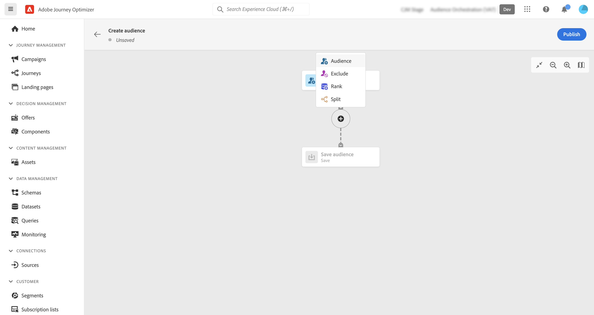
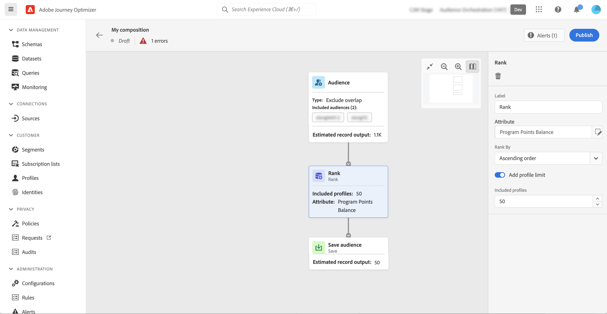

# Trabajo con el lienzo de composición {#composition-canvas}

El lienzo de la composición es un lienzo visual que le permite crear composiciones aprovechando las audiencias y las actividades (divididas, excluidas...).

Los pasos para configurar una composición en el lienzo de composición son los siguientes:

1. [Definir las audiencias de inicio](#starting-audience)
1. [Añadir una o varias actividades](#action-activities)
1. [Guardar los resultados en una audiencia nueva](#save)

## Seleccionar la audiencia de inicio {#starting-audience}

>[!CONTEXTUALHELP]
>id="ajo_ao_merge_types"
>title="Combinar tipos"
>abstract="Especifique cómo se deben combinar los perfiles de las audiencias seleccionadas."

El primer paso para crear una composición es seleccionar una o varias audiencias existentes como base de la composición.

Seleccione el **[!UICONTROL Audiencia]** a continuación, haga clic en la **[!UICONTROL Añadir audiencia]** a continuación, seleccione una o varias audiencias.

En este ejemplo, queremos segmentar todos los perfiles pertenecientes a las audiencias de oro y plata.

Si selecciona varias audiencias, especifique cómo se deben combinar los perfiles de estas audiencias:

* **[!UICONTROL Unión]**: incluir todos los perfiles de las audiencias seleccionadas,
* **[!UICONTROL Intersección]**: incluir perfiles comunes a todas las audiencias seleccionadas,
* **[!UICONTROL Excluir superposición]**: incluir perfiles que pertenecen a una sola audiencia. No se incluirán los perfiles pertenecientes a más de una audiencia.

## Agregar actividades {#action-activities}

Añada actividades después de seleccionar la audiencia de inicio para restringir la selección.

Para ello, haga clic en el botón + en la ruta de composición y seleccione la actividad deseada. Se abre el panel derecho, que le permite configurar la actividad.

>[!NOTE]
>
>Puede agregar tantos **[!UICONTROL Audiencia]** y **[!UICONTROL Excluir]** actividades según sea necesario en su composición. Sin embargo, no se puede añadir ninguna actividad adicional después de **[!UICONTROL Clasificación]** y **[!UICONTROL Split]** actividades.

Puede quitar una actividad del lienzo en cualquier momento haciendo clic en el botón eliminar del panel derecho. Todas las actividades agregadas después de esta actividad también se eliminarán del lienzo.

Las actividades disponibles son:

* [Audiencia](#audience): incluir perfiles adicionales que pertenecen a una o varias audiencias existentes,
* [Excluir](#exclude): excluir perfiles pertenecientes a una audiencia existente o excluir perfiles según atributos específicos,
* [Clasificación](#rank): clasifique los perfiles según un atributo específico, especifique el número de perfiles que desea conservar e incluirlos en la composición,
* [Split](#split): divida la composición en varias rutas basadas en porcentajes aleatorios o en atributos.

### Actividad de audiencia {#audience}

>[!CONTEXTUALHELP]
>id="ajo_ao_audience"
>title="Actividad de audiencia"
>abstract="La actividad Audiencia le permite incluir en su composición perfiles adicionales que pertenecen a una audiencia existente."

La variable **[!UICONTROL Audiencia]** actividad le permite incluir en su composición perfiles adicionales que pertenecen a una audiencia existente.

La configuración de esta actividad es idéntica a la del inicio [Actividad de audiencia](#starting-audience).

### Excluir actividad {#exclude}

>[!CONTEXTUALHELP]
>id="ajo_ao_exclude_type"
>title="Tipo de exclusión"
>abstract="Utilice el tipo Excluir audiencia para excluir perfiles pertenecientes a una audiencia existente. El tipo Excluir mediante atributo permite excluir perfiles según un atributo específico."

>[!CONTEXTUALHELP]
>id="ajo_ao_exclude"
>title="Excluir actividad"
>abstract="La actividad Excluir permite excluir perfiles de la composición seleccionando una audiencia existente o utilizando una regla."

La variable **[!UICONTROL Excluir]** actividad le permite excluir perfiles de su composición. Hay dos tipos de exclusión disponibles:

* **[!UICONTROL Excluir audiencia]**: Excluir perfiles que pertenecen a una audiencia existente.

   Haga clic en el **[!UICONTROL Añadir audiencia]** a continuación, seleccione la audiencia que desea excluir.

   

* **[!UICONTROL Excluir mediante atributo]**: Excluir perfiles según un atributo específico.

   Seleccione el atributo que desea buscar y, a continuación, especifique el valor que desea excluir. En este ejemplo, excluimos de los perfiles de composición cuya dirección principal está en Japón.

   

### Actividad de clasificación {#rank}

>[!CONTEXTUALHELP]
>id="ajo_ao_ranking"
>title="Actividad de clasificación"
>abstract="La actividad Clasificación le permite clasificar perfiles según un atributo específico e incluirlos en su composición. Por ejemplo, incluya los 50 perfiles con la mayor cantidad de puntos de lealtad."

>[!CONTEXTUALHELP]
>id="ajo_ao_rank_profilelimit_text"
>title="Añadir límite de perfil"
>abstract="Active esta opción para especificar el número máximo de perfiles que desea incluir en la composición.

La variable **[!UICONTROL Clasificación]** actividad le permite clasificar perfiles según un atributo específico e incluirlos en su composición. Por ejemplo, puede incluir los 50 perfiles con la mayor cantidad de puntos de lealtad.

1. Seleccione el atributo que desea buscar y especifique un orden de clasificación (ascendente o descendente).

   >[NOTA]
   >
   >Puede seleccionar atributos con los siguientes tipos de datos: entero, números, abreviado <!--(other?)-->

1. Alternar el **[!UICONTROL Añadir límite de perfil]** y especifique un número máximo de perfiles que se incluirán en la composición.

   

### Dividir actividad {#split}

>[!CONTEXTUALHELP]
>id="ajo_ao_control_group_text"
>title="Grupo de control"
>abstract="Utilice grupos de control para aislar una parte de los perfiles. Esto le permite medir el impacto de una actividad de marketing y comparar el comportamiento del resto de la población."

>[!CONTEXTUALHELP]
>id="ajo_ao_split"
>title="Dividir actividad"
>abstract="La actividad Split permite dividir la composición en varias rutas. Al publicar la composición, se guardará una audiencia en Adobe Experience Platform para cada ruta."

>[!CONTEXTUALHELP]
>id="ajo_ao_split_type"
>title="Tipo de división"
>abstract="Utilice el tipo de división Porcentaje para dividir aleatoriamente los perfiles en varias rutas. El tipo de división Atributo permite dividir perfiles según un atributo específico."

>[!CONTEXTUALHELP]
>id="ajo_ao_split_otherprofiles_text"
>title="Otros perfiles"
>abstract="Active esta opción para crear una ruta adicional con los perfiles restantes que no coinciden con ninguna de las condiciones especificadas en las otras rutas."

La variable **[!UICONTROL Split]** actividad le permite dividir la composición en varias rutas.

Esta operación agrega automáticamente un **[!UICONTROL Guardar]** actividad al final de cada ruta. Al publicar la composición, se guardará una audiencia en Adobe Experience Platform para cada ruta.

Hay dos tipos de operaciones divididas disponibles:

* **[!UICONTROL División porcentual]**: dividir aleatoriamente los perfiles en dos o más rutas. Por ejemplo, puede dividir los perfiles en dos rutas distintas del 45 % cada una y agregar una ruta adicional para el grupo de control.

   

* **[!UICONTROL División de atributo]**: dividir perfiles según un atributo específico. En este ejemplo, se dividen los perfiles según las preferencias de tipo de habitación.

   

   >[!NOTE]
   >
   >La variable **[!UICONTROL Otros perfiles]** permite crear una ruta adicional con los perfiles restantes que no coinciden con ninguna de las condiciones especificadas en las otras rutas.

## Guarde las audiencias {#save}

Configure las audiencias resultantes que se guardarán en Adobe Experience Platform.

Para ello, seleccione la **[!UICONTROL Guardar audiencia]** actividad al final de cada ruta y, a continuación, especifique el nombre de la nueva audiencia que desea crear.

Una vez que la composición esté lista, puede publicarla. [Aprenda a crear composiciones](create-compositions.md)

Más información:

* [Introducción a la composición de audiencias](get-started-audience-orchestration.md)
* [Creación de flujos de trabajo de composición](create-compositions.md)
* [Acceso y administración de audiencias](access-audiences.md)
