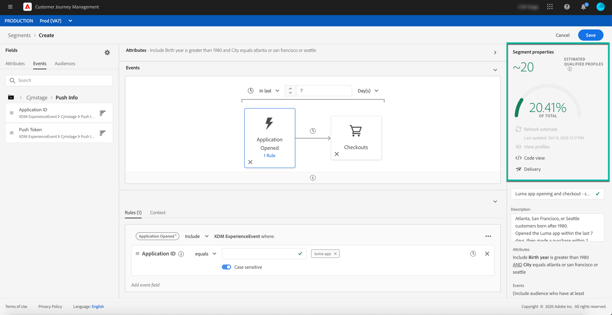

# Generación de segmentos {#build-segments}

En este ejemplo, crearemos un segmento dirigido a todos los clientes que viven en Atlanta, San Francisco o Seattle y que nacieron después de 1980. Todos estos clientes deberían haber abierto la aplicación de Luma en los últimos 7 días y luego realizar una compra en un plazo de 2 horas después de abrir la aplicación.

1. Acceda al menú **[!UICONTROL Segments]** y haga clic en el botón **[!UICONTROL Create segment]**.

   

   La pantalla de definición del segmento le permite configurar todos los campos obligatorios para definir el segmento. Aprenda a configurar segmentos en la [documentación del servicio de segmentación](https://experienceleague.adobe.com/docs/experience-platform/segmentation/ui/overview.html){target=&quot;_blank&quot;}.

   

1. En el panel **[!UICONTROL Segment properties]**, proporcione un nombre y una descripción (opcional) para el segmento.

   

1. Arrastre y suelte los campos deseados del panel izquierdo al espacio de trabajo central y, a continuación, configúrelos según sus necesidades.

   >[!NOTE]
   >
   >Tenga en cuenta que los campos disponibles en el panel izquierdo varían en función de cómo se hayan configurado los esquemas **XDM Individual Profile** y **XDM ExperienceEvent** para su organización.  Obtenga más información en la documentación del [Modelo de datos de experiencia (XDM)](https://experienceleague.adobe.com/docs/experience-platform/xdm/home.html?lang=es){target=&quot;_blank&quot;}.

   

   En este ejemplo, necesitamos confiar en los campos **Attributes** y **Events** para crear el segmento:

   * **Atributos**: perfiles que viven en Atlanta, San Francisco o Seattle nacidos después de 1980

      

   * **Eventos**: perfiles que abrieron la aplicación de Luma en los últimos 7 días y luego realizaron una compra en un plazo de 2 horas después de abrir la aplicación.

      

1. A medida que agrega y configura nuevos campos en el espacio de trabajo, el panel **[!UICONTROL Segment Properties]** se actualiza automáticamente con información sobre los perfiles estimados que pertenecen al segmento.

   

1. Una vez que el segmento esté listo, haga clic en **[!UICONTROL Save]**. Se muestra en la lista de segmentos de Adobe Experience Platform. Tenga en cuenta que hay una barra de búsqueda disponible para ayudarle a buscar un segmento específico en la lista.

El segmento ahora se puede usar en sus recorridos. Para obtener más información, consulte [esta sección](../segment/about-segments.md).

## Tutorial en vídeo{#create-segment-video}

>[!VIDEO](https://video.tv.adobe.com/v/334281?quality=12)
