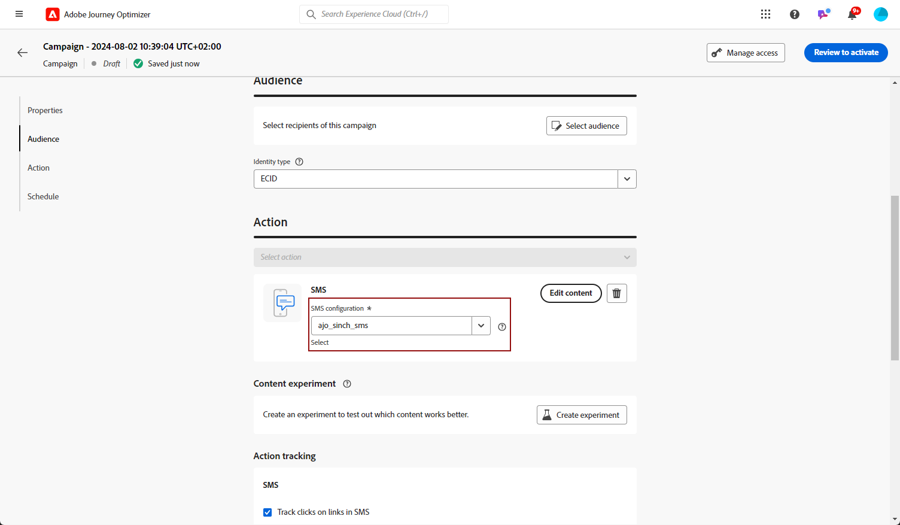

# Creación de un mensaje de texto (SMS/MMS) {#create-sms}

>[!CONTEXTUALHELP]
>id="ajo_message_sms"
>title="Creación de un mensaje de texto"
>abstract="Para crear un mensaje de texto (SMS/MMS), añada una acción SMS en un recorrido o una campaña, y comience a personalizarlo con el editor de personalización."

Puede diseñar y enviar mensajes de texto (SMS) y multimedia (MMS) con Adobe Journey Optimizer. Primero debe agregar una acción SMS en un recorrido o una campaña y luego definir el contenido del mensaje de texto, como se detalla a continuación. Adobe Journey Optimizer también ofrece funciones para probar los mensajes de texto antes de enviarlos, de modo que pueda comprobar el procesamiento, los atributos de personalización y todos los demás ajustes.

>[!NOTE]
>
>De acuerdo con las normas y regulaciones del sector, todos los mensajes de marketing SMS/MMS deben contener una forma para que los destinatarios puedan cancelar la suscripción fácilmente. Para ello, los destinatarios de SMS pueden responder con las palabras clave de inclusión y exclusión. [Aprenda a administrar la exclusión](../privacy/opt-out.md#sms-opt-out-management-sms-opt-out-management)

## Añadir un mensaje de texto {#create-sms-journey-campaign}

Examine las pestañas siguientes para aprender a añadir un mensaje de texto (SMS/MMS) en una campaña o un recorrido.

>[!BEGINTABS]

>[!TAB Agregar un mensaje de texto a un Recorrido]

1. Abra el recorrido y arrastre y suelte una actividad SMS desde la sección **Acciones** de la paleta.

   

1. Proporcione información básica sobre el mensaje (etiqueta, descripción, categoría) y, a continuación, elija la superficie de mensaje que desea utilizar.

   

   Para obtener más información sobre cómo configurar un recorrido, consulte [esta página](../building-journeys/journey-gs.md)

   El campo **[!UICONTROL Superficie]** está rellenado previamente, de forma predeterminada, con la última superficie usada por el usuario para ese canal.

Ahora puede empezar a diseñar el contenido de su mensaje SMS desde el botón **[!UICONTROL Editar contenido]**, como se detalla a continuación.

>[!TAB Agregar un mensaje de texto a una campaña]

1. Cree una nueva campaña programada o desencadenada por API, seleccione **[!UICONTROL SMS]** como acción y elija la **[!UICONTROL superficie de aplicación]** que desea usar. Obtenga más información acerca de la configuración de SMS en [esta página](sms-configuration.md).

   

1. Haga clic en **[!UICONTROL Crear]**.

1. En la sección **[!UICONTROL Propiedades]**, edite el **[!UICONTROL Título]** y la **[!UICONTROL Descripción]** de su campaña.

   

1. Haga clic en el botón **[!UICONTROL Seleccionar audiencia]** para definir la audiencia a la que se dirigirá desde la lista de audiencias de Adobe Experience Platform disponibles. [Más información](../audience/about-audiences.md).

1. En el campo **[!UICONTROL Área de nombres de identidad]**, elija el área de nombres que desea usar para identificar a los individuos de la audiencia seleccionada. [Más información](../event/about-creating.md#select-the-namespace).

   

1. Haga clic en **[!UICONTROL Crear experimento]** para comenzar a configurar el experimento de contenido y crear tratamientos para medir su rendimiento e identificar la mejor opción para la audiencia objetivo. [Más información](../content-management/content-experiment.md)

1. En la sección **[!UICONTROL Seguimiento de acciones]**, especifique si desea rastrear los clics en los vínculos del mensaje SMS.

1. Las campañas están diseñadas para ejecutarse en una fecha específica o en una frecuencia recurrente. Aprenda a configurar la **[!UICONTROL programación]** de su campaña en [esta sección](../campaigns/create-campaign.md#schedule).

1. En el menú **[!UICONTROL déclencheur de acción]**, elige la **[!UICONTROL Frecuencia]** de tu mensaje SMS:

   * Una vez
   * Diaria
   * Semanal
   * Mes

Ahora puede empezar a diseñar el contenido de su mensaje de texto desde el botón **[!UICONTROL Editar contenido]**, como se detalla a continuación.

>[!ENDTABS]

## Definición del contenido de los SMS{#sms-content}

>[!CONTEXTUALHELP]
>id="ajo_message_sms_content"
>title="Definición del contenido de los SMS"
>abstract="Personalice sus mensajes de texto (SMS/MMS) con el editor de personalización para definir el contenido e incorporar elementos dinámicos."

Para configurar el contenido del SMS, siga los pasos a continuación. La configuración de MMS se detalla en [esta sección](#mms-content).

1. En la pantalla de configuración del recorrido o la campaña, haga clic en el botón **[!UICONTROL Editar contenido]** para configurar el contenido del mensaje de texto.

1. Haga clic en el campo **[!UICONTROL Mensaje]** para abrir el editor de personalización.

   

1. Utilice el editor de personalización para definir contenido, añadir personalización y contenido dinámico. Puede utilizar cualquier atributo, como el nombre del perfil o la ciudad, por ejemplo. También puede definir reglas condicionales. Vaya a las páginas siguientes para obtener más información sobre [personalización](../personalization/personalize.md) y [contenido dinámico](../personalization/get-started-dynamic-content.md) en el editor de personalización.

1. Después de definir el contenido, puede agregar direcciones URL rastreadas al mensaje. Para ello, acceda al menú **[!UICONTROL Funciones de ayuda]** y seleccione **[!UICONTROL Ayudantes]**.

   Tenga en cuenta que para utilizar la función de acortamiento de URL, primero debe configurar un subdominio que luego se vinculará a la superficie. [Más información](sms-subdomains.md)

   >[!CAUTION]
   >
   > Para acceder y editar subdominios SMS, debe tener el permiso **[!UICONTROL Administrar subdominios SMS]** en la zona protegida de producción. Puede obtener más información sobre permisos en [esta sección](../administration/high-low-permissions.md).

   

1. En el menú **[!UICONTROL Funciones de ayuda]**, haga clic en **[!UICONTROL Función de URL]** y, a continuación, seleccione **[!UICONTROL Agregar URL]**.

   

1. En el campo `originalUrl`, pegue la dirección URL que desee acortar y haga clic en **[!UICONTROL Guardar]**.

1. Haz clic en **[!UICONTROL Guardar]** y comprueba tu mensaje en la vista previa. Ahora puede probar y comprobar el contenido del mensaje como se detalla en [esta sección](#sms-mms-test).

## Definición del contenido de MMS{#mms-content}

Puede mejorar su comunicación enviando mensajes del Servicio de mensajes multimedia (MMS), lo que permite compartir contenidos como vídeos, imágenes, clips de audio y GIF, etc. Además, el MMS admite hasta 1600 caracteres de texto en el mensaje.

>[!NOTE]
>
>* El canal MMS incluye algunas limitaciones enumeradas en [esta página](../start/guardrails.md#sms-guardrails).

Para crear contenido MMS, siga estos pasos:

1. Cree un SMS como se describe en [esta sección](#create-sms-journey-campaign).

1. Edite su contenido SMS como se detalla en [esta sección](#sms-content).

1. Habilite la opción MMS para añadir contenido multimedia al contenido de SMS.

   

1. Agregue un **[!UICONTROL Título]** a sus medios.

1. Escriba la URL del contenido en el campo **[!UICONTROL Medios]**.

   

1. Haz clic en **[!UICONTROL Guardar]** y comprueba tu mensaje en la vista previa. Ahora puede probar y comprobar el contenido del mensaje como se detalla a continuación.

## Prueba y envío de mensajes {#sms-mms-test}

Utilice el botón **[!UICONTROL Simular contenido]** para obtener una vista previa del contenido del mensaje de texto, las direcciones URL abreviadas y el contenido personalizado.

Una vez que haya realizado las pruebas y validado el contenido, puede enviar el mensaje de texto a la audiencia. Estos pasos se detallan en [esta página](send-sms.md)

Una vez enviado, puede medir el impacto de su SMS dentro de los informes de Campaña o Recorrido. Para obtener más información sobre la creación de informes, consulte [esta sección](../reports/campaign-global-report.md#sms-tab).

**Temas relacionados**

* [Previsualización, prueba y envío del mensaje de texto](send-sms.md)
* [Configuración del canal de SMS](sms-configuration.md)
* [Informes de SMS/MMS](../reports/journey-global-report.md#sms-global)
* [Añadir un mensaje en un recorrido](../building-journeys/journeys-message.md)
* [Añadir un mensaje en una campaña](../campaigns/create-campaign.md)
