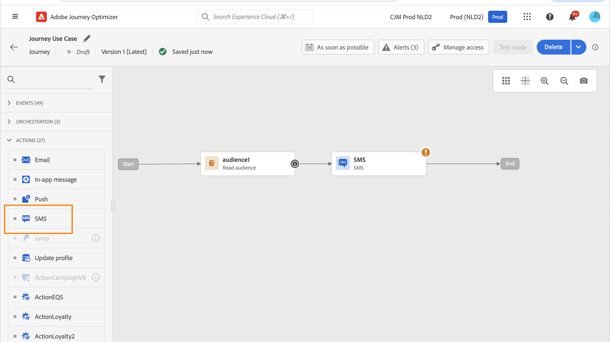
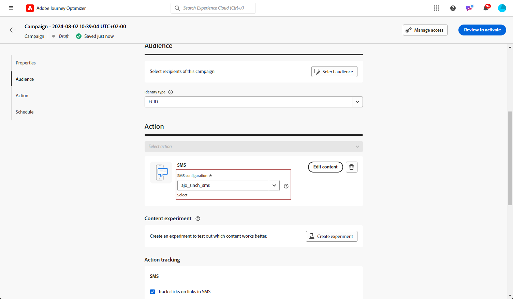

# Creación de un mensaje SMS/MMS/RCS {#create-sms}

>[!CONTEXTUALHELP]
>id="ajo_message_sms"
>title="Creación de un mensaje de texto"
>abstract="Para crear un mensaje de texto (SMS/MMS/RCS), añada una acción de SMS en un recorrido o una campaña, y comience a personalizarlo con el editor de personalización."

>[!AVAILABILITY]
>
>RCS no es un servicio compatible con HIPAA y no debe utilizarse para recopilar, almacenar ni procesar datos personales confidenciales, incluidos datos de salud permitidos, como información de salud personal, que de lo contrario su organización podría procesar en Journey Optimizer.

Puede diseñar y enviar mensajes de texto (SMS), de comunicación enriquecida (RCS) y multimedia (MMS) con Adobe Journey Optimizer. Primero debe agregar una acción SMS en un recorrido o una campaña y luego definir el contenido del mensaje de texto, como se detalla a continuación. Adobe Journey Optimizer también ofrece funciones para probar los mensajes de texto antes de enviarlos, de modo que pueda comprobar el procesamiento, los atributos de personalización y todos los demás ajustes.

De acuerdo con las normas y regulaciones del sector, todos los mensajes de marketing SMS/MMS deben contener una forma para que los destinatarios puedan cancelar la suscripción fácilmente. Para ello, los destinatarios de SMS pueden responder con las palabras clave de inclusión y exclusión. [Aprenda a administrar la exclusión](../privacy/opt-out.md#opt-out-decision-management)

## Añadir un mensaje de texto {#create-sms-journey-campaign}

Examine las pestañas siguientes para aprender a añadir un mensaje de texto (SMS/MMS/RCS) en una campaña o un recorrido.

>[!BEGINTABS]

>[!TAB Agregar un mensaje de texto a un Recorrido]

1. Abra el recorrido y arrastre y suelte una actividad **[!UICONTROL Action]** desde la sección **[!UICONTROL Actions]** de la paleta. Más información sobre la [actividad de acción](../building-journeys/journey-action.md).

   >[!IMPORTANT]
   >
   >Las actividades heredadas de canales nativos (correo electrónico, push, SMS, en la aplicación, web, experiencia basada en código y tarjeta de contenido) quedaron obsoletas a partir de la versión de marzo de 2026. Los recorridos existentes que utilizan estas actividades siguen funcionando sin ningún cambio; no se requiere ninguna migración.

1. Seleccione **[!UICONTROL SMS]** como tipo de acción.

   

1. Escriba una **[!UICONTROL etiqueta]** para identificar la acción en el lienzo de recorrido.

1. Haga clic en el botón **[!UICONTROL Configurar acción]**.

1. Se le dirigirá a la ficha **[!UICONTROL Acciones]**. A partir de ahí, seleccione o cree la configuración de SMS que desea utilizar. [Más información](sms-configuration.md)

   

1. Además, puede aplicar reglas de límite a su acción de SMS seleccionando un conjunto de reglas en la lista desplegable **[!UICONTROL Reglas de negocio]**. [Más información](../conflict-prioritization/channel-capping.md)

1. Seleccione el botón **[!UICONTROL Editar contenido]** y cree el contenido como desee. [Más información](#sms-content)

1. Volver al lienzo de recorrido. Si es necesario, complete el flujo de recorrido arrastrando y soltando acciones o eventos adicionales. [Más información](../building-journeys/about-journey-activities.md)

Para obtener más información sobre cómo crear, configurar y publicar un recorrido, consulte [esta página](../building-journeys/journey-gs.md).

>[!TAB Agregar un mensaje de texto a una campaña]

1. Acceda al menú **[!UICONTROL Campañas]** y haga clic en **[!UICONTROL Crear campaña]**.

1. Seleccione el tipo de campaña que desea ejecutar

   * **Programado - Marketing**: ejecute la campaña inmediatamente o en una fecha especificada. Las campañas programadas están destinadas a enviar mensajes de marketing. Se configuran y ejecutan desde la interfaz de usuario de.

   * **Activado por API - Marketing/Transaccional**: ejecute la campaña mediante una llamada de API. Las campañas activadas por API están destinadas a enviar mensajes de marketing o transaccionales, es decir, mensajes enviados después de una acción realizada por un individuo: restablecimiento de contraseña, compra en el carro de compras, etc.

1. En la sección **[!UICONTROL Propiedades]**, edite el **[!UICONTROL Título]** y la **[!UICONTROL Descripción]** de su campaña.

1. Haga clic en el botón **[!UICONTROL Seleccionar audiencia]** para definir la audiencia a la que se dirigirá desde la lista de audiencias de Adobe Experience Platform disponibles. [Más información](../audience/about-audiences.md).

1. En el campo **[!UICONTROL Área de nombres de identidad]**, elija el área de nombres que desea usar para identificar a los individuos de la audiencia seleccionada. [Más información](../event/about-creating.md#select-the-namespace).

1. En la sección **[!UICONTROL Acciones]**, elija el **[!UICONTROL SMS]** y seleccione o cree una nueva configuración.

   Más información acerca de la configuración de SMS en [esta página](sms-configuration.md).

   

1. Haga clic en **[!UICONTROL Crear experimento]** para comenzar a configurar el experimento de contenido y crear tratamientos para medir su rendimiento e identificar la mejor opción para la audiencia objetivo. [Más información](../content-management/content-experiment.md)

1. En la sección **[!UICONTROL Seguimiento de acciones]**, especifique si desea rastrear los clics en los vínculos del mensaje SMS.

1. Las campañas están diseñadas para ejecutarse en una fecha específica o en una frecuencia recurrente. Aprenda a configurar la **[!UICONTROL programación]** de su campaña en [esta sección](../campaigns/campaign-schedule.md#action-campaign-schedule).

1. En el menú **[!UICONTROL déclencheur de acción]**, elige la **[!UICONTROL Frecuencia]** de tu mensaje SMS:

   * Una vez
   * Diaria
   * Semanal
   * Month

Ahora puede empezar a diseñar el contenido de su mensaje de texto desde el botón **[!UICONTROL Editar contenido]**, como se detalla a continuación.

Para obtener más información sobre cómo crear, configurar y activar una campaña, consulte [esta página](../campaigns/get-started-with-campaigns.md).

>[!ENDTABS]

## Definición del contenido de SMS/RCS{#sms-content}

>[!CONTEXTUALHELP]
>id="ajo_message_sms_content"
>title="Definición del contenido de los SMS"
>abstract="Personalice sus mensajes de texto (SMS/MMS/RCS) con el editor de personalización para definir el contenido e incorporar elementos dinámicos."


Para configurar el contenido del mensaje, siga los pasos a continuación. La configuración de MMS se detalla en [esta sección](#mms-content).

1. En la pantalla de configuración del recorrido o la campaña, haga clic en el botón **[!UICONTROL Editar contenido]** para configurar el contenido del mensaje de texto.

1. Haga clic en el campo **[!UICONTROL Mensaje]** para abrir el editor de personalización.

   Para la mensajería RCS con Infobip, Twilio u otros proveedores de terceros, pegue la carga útil JSON necesaria en su [configuración de SMS personalizada](sms-configuration-custom.md#api-credential).

   

1. Genere mensajes de texto atractivos y adaptados a su audiencia usando [AI Assistant para la generación de texto](../content-management/generative-text.md).

1. Utilice el editor de personalización para definir contenido, añadir personalización y contenido dinámico. Puede utilizar cualquier atributo, como el nombre del perfil o la ciudad, por ejemplo. También puede definir reglas condicionales. Vaya a las páginas siguientes para obtener más información sobre [personalización](../personalization/personalize.md) y [contenido dinámico](../personalization/get-started-dynamic-content.md) en el editor de personalización.

1. Después de definir el contenido, puede agregar direcciones URL rastreadas al mensaje. Para ello, acceda al menú **[!UICONTROL Funciones de ayuda]** y seleccione **[!UICONTROL Ayudantes]**.

   

1. Seleccione **[!UICONTROL URL]** y haga clic en **[!UICONTROL Agregar URL]**.

   

1. Para acortar la dirección URL, péguela en el campo `originalUrl` y haga clic en **[!UICONTROL Guardar]**.

   >[!CAUTION]
   >
   >Para utilizar la función de acortamiento de URL, primero debe configurar un subdominio que luego se vinculará a la configuración. [Más información](sms-subdomains.md)
   >
   > La duración de las URL cortas es de 30 días. Después de este período, ya no se podrá obtener acceso a estas direcciones URL cortas y se mostrará el mensaje: `404 short-code not found`.

1. Para agregar un vínculo profundo que abra una pantalla específica en su aplicación móvil, utilice el asistente de URL con el tipo `DEEPLINK`. [Más información sobre los vínculos profundos](../email/deeplinks.md)

   ```
   {{url originalUrl='<<deeplink_url>>' type='DEEPLINK' action='CLICK'}}
   ```

   >[!IMPORTANT]
   >
   >Antes de usar la vinculación profunda, asegúrese de completar los [pasos de configuración](../email/deeplinks.md#configuration) correspondientes en Journey Optimizer e implementar la [administración de vínculos profundos](../email/deeplinks.md#mobile-implementation) en su aplicación móvil. Si no lo ha hecho, el vínculo profundo no dirigirá a los usuarios al contenido incluido en la aplicación.
   >
   >Además, asegúrese de que el seguimiento de vínculos esté habilitado en la sección **[!UICONTROL Acciones]** de su recorrido o campaña para que la URL se reescriba a través de los sistemas de Adobe.

1. Use **[!UICONTROL Recuento de caracteres]** para supervisar la longitud de los SMS mientras redacta el mensaje. Se actualiza en tiempo real e indica cuándo el contenido se enviará en varios segmentos.

   

1. Haga clic en **[!UICONTROL Guardar]** y compruebe el mensaje en la vista previa. Ahora puede probar y comprobar el contenido del mensaje como se detalla en [esta sección](#sms-mms-test).

## Personalización con decisiones {#decisioning-sms}

Puede personalizar y optimizar el contenido de sus mensajes SMS con **Decisioning**. Esta capacidad le permite utilizar puntuaciones de prioridad, fórmulas o modelos de IA para seleccionar y mostrar dinámicamente el mejor contenido a sus clientes.

Para obtener más información sobre cómo crear y usar directivas de decisión en mensajes SMS, consulte [esta sección](../experience-decisioning/create-decision.md).

## Definición del contenido de MMS{#mms-content}

Puede mejorar su comunicación enviando mensajes del Servicio de mensajes multimedia (MMS), lo que permite compartir medios como vídeos, imágenes, clips de audio y GIF, etc. Además, el MMS admite hasta 1600 caracteres de texto en el mensaje.

>[!NOTE]
>
> El canal MMS incluye algunas limitaciones en [esta página](../start/guardrails.md#sms-guardrails).

Para crear contenido MMS, siga estos pasos:

1. Cree un SMS como se describe en [esta sección](#create-sms-journey-campaign).

1. Edite su contenido SMS como se detalla en [esta sección](#sms-content).

1. Habilite la opción MMS para añadir contenido multimedia al contenido de SMS.

   

1. Agregue un **[!UICONTROL Título]** a sus medios.

1. Escriba la URL del contenido en el campo **[!UICONTROL Medios]**.

   

1. Haga clic en **[!UICONTROL Guardar]** y compruebe el mensaje en la vista previa. Ahora puede probar y comprobar el contenido del mensaje como se detalla a continuación.

## Prueba y envío de mensajes {#sms-mms-test}

Utilice el botón **[!UICONTROL Simular contenido]** para obtener una vista previa del contenido del mensaje de texto, las direcciones URL abreviadas y el contenido personalizado.


Una vez que haya realizado las pruebas y validado el contenido, puede enviar el mensaje de texto a la audiencia. Estos pasos se detallan en [esta página](send-sms.md)

Una vez enviado, puede medir el impacto de su SMS dentro de los informes de Campaña o Recorrido. Para obtener más información sobre la creación de informes, consulte [esta sección](../reports/campaign-global-report-cja-sms.md).

**Temas relacionados**

* [Previsualización, prueba y envío del mensaje de texto](send-sms.md)
* [Configuración del canal de SMS](sms-configuration.md)
* [Informes de SMS/MMS](../reports/journey-global-report-cja-sms.md)
* [Añadir un mensaje en un recorrido](../building-journeys/journey-action.md)
* [Añadir un mensaje en una campaña](../campaigns/create-campaign.md)
