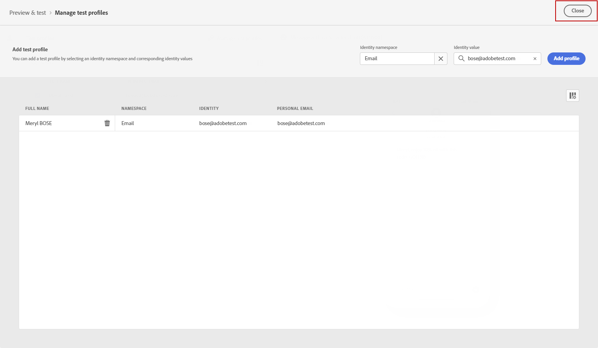

# Enviar mensaje SMS {#send-sms}

## Previsualice el mensaje SMS {#preview-sms}

Una vez definido el contenido del mensaje, puede utilizar perfiles de prueba para previsualizarlo y probarlo. Si insertó contenido personalizado, puede comprobar cómo se muestra este contenido en el mensaje, aprovechando los datos de perfil de prueba.

1. Haga clic en **[!UICONTROL Simular contenido]**.

1. Haga clic en **[!UICONTROL Administrar perfiles de prueba]** para agregar un perfil de prueba.

1. Busque el perfil de prueba con la variable **[!UICONTROL Área de nombres de identidad]** y **[!UICONTROL Valor de identidad]** campos. A continuación, haga clic en **[!UICONTROL Añadir perfil]**.

   

1. Una vez que haya seleccionado el perfil de prueba, puede cerrar el **[!UICONTROL Añadir perfil de prueba]** ventana.

   

1. En la ventana Preview &amp; test , los datos de perfil de prueba se aprovechan en el contenido del mensaje.

   Por ejemplo, para este mensaje SMS, el contenido del mensaje está personalizado:

   

## Validar el SMS{#sms-preview}

>[!NOTE]
>
> Para mejorar la capacidad de envío, siempre debe utilizar los números de teléfono en los formatos admitidos por el proveedor. Por ejemplo, Twilio y Sinch solo admiten números de teléfono en formato E.164.

También debe comprobar las alertas en la sección superior del editor.  Algunas de ellas son simples advertencias, pero otras pueden impedir que utilice el mensaje. Pueden producirse dos tipos de alertas:

* **Advertencias** consulte recomendaciones y prácticas recomendadas. Por ejemplo, se mostrará un mensaje si el mensaje SMS está vacío.

* **Errores** impida que pruebe o active el recorrido mientras no se resuelvan. Por ejemplo, un mensaje le avisará de que falta la línea de asunto.

Cuando el mensaje SMS esté listo, complete la configuración de su [recorrido](../building-journeys/journey-gs.md) o [campaign](../campaigns/create-campaign.md) para enviarlo.

**Temas relacionados**

* [Configuración del canal de SMS](sms-configuration.md)
* [Informe SMS](../reports/journey-global-report.md#sms-global)
* [Creación de un mensaje SMS](create-sms.md)
* [Adición de un mensaje en un recorrido](../building-journeys/journeys-message.md)
