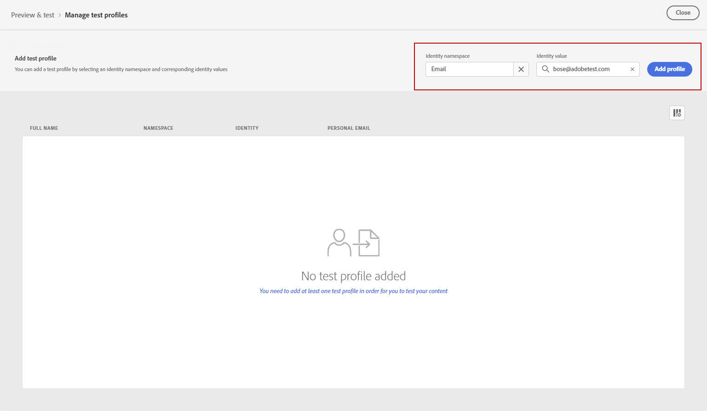

# Compruebe y envíe su mensaje de texto (SMS/MMS){#send-sms}

## Previsualización del mensaje de texto {#preview-sms}

Una vez definido el contenido del mensaje, puede utilizar perfiles de prueba o datos de entrada de muestra (cargados desde un archivo CSV/JSON o añadidos manualmente) para previsualizar su contenido. Si ha insertado contenido personalizado, puede comprobar cómo se muestra este en el mensaje.

Para ello, haga clic en **[!UICONTROL Simular contenido]** y compruebe su mensaje con los datos del perfil de prueba.

Encontrará información detallada sobre cómo obtener una vista previa y probar contenido en la sección [Administración de contenido](../content-management/preview-test.md).

### Codificación de caracteres y límites {#sms-character-limits}

Se muestra un recuento de caracteres al acceder al menú **[!UICONTROL Simular contenido]** para ayudar a planificar y administrar sus mensajes SMS.

Journey Optimizer utiliza la codificación UTF-8 en su editor de SMS, lo que le permite escribir o pegar caracteres de doble byte o Unicode. Estos caracteres se transmiten al proveedor de servicios para su envío. La mayoría de los proveedores de SMS utilizan la codificación de 7 bits GSM para mensajes estándar con un límite de 160 caracteres y cambian a UTF-16 (UCS-2) cuando se detectan caracteres no GSM con un límite de 70 caracteres.

Tenga en cuenta que el recuento de caracteres no refleja las variaciones introducidas por la personalización dinámica o los caracteres especiales de 7 bits no GSM.

>[!IMPORTANT]
>
>Los informes de envío de SMS de Journey Optimizer no tienen en cuenta los mensajes concatenados y la personalización dinámica, por lo que es posible que no reflejen el número real de mensajes enviados desde el proveedor. Para obtener información detallada sobre el uso y la facturación, póngase en contacto con su representante de Adobe.
>
>Para conocer las prácticas recomendadas para minimizar los cargos adicionales por facturación SMS, consulte [Prácticas recomendadas por SMS para la optimización de caracteres](sms-cost-optimization.md).

## Validación del contenido {#sms-validate}

>[!NOTE]
>
> Para mejorar la capacidad de envío, utilice los números de teléfono en los formatos admitidos por el proveedor. Por ejemplo, Twilio y Sinch solo admiten números de teléfono en formato E.164.

Debe comprobar las alertas en la sección superior del editor. Algunas son simples advertencias, pero otras pueden impedir que envíe el mensaje. Pueden producirse dos tipos de alertas: advertencias y errores.

* **Advertencias** se refieren a recomendaciones y prácticas recomendadas. Por ejemplo, se muestra un mensaje de advertencia si el mensaje de texto está vacío o si se pueden superar los límites de caracteres con contenido dinámico.

  **Límites de caracteres:** 160 caracteres por segmento (GSM de 7 bits), 70 para Unicode/emojis, hasta un total de 1500 caracteres.

* **Los errores** le impiden probar o activar la recorrido o publicar la campaña, siempre y cuando no se resuelvan. Por ejemplo, un mensaje de error le advierte cuando falta la línea de asunto.

La alerta **&quot;Se ha superado el límite de caracteres de texto SMS&quot;** puede aparecer incluso cuando el mensaje simulado sea más corto porque la validación calcula la **longitud máxima posible** mediante la evaluación de todas las ramas condicionales, campos de personalización y contenido dinámico en su mayor longitud.

La validación calcula la longitud máxima de todos los datos de perfil posibles, mientras que la simulación muestra la salida real de un perfil de prueba.

## Envíe sus mensajes de texto {#sms-send}

>[!IMPORTANT]
>
> Si la campaña está sujeta a una directiva de aprobación, debe solicitar la aprobación para poder enviar los mensajes de texto. [Más información](../test-approve/gs-approval.md)

Cuando el mensaje de texto esté listo, completa la configuración de tu [recorrido](../building-journeys/journey-gs.md) o [campaña](../campaigns/create-campaign.md) para enviarlo.

**Temas relacionados**

* [Configuración del canal de SMS](sms-configuration.md)
* [Informes de SMS/MMS](../reports/journey-global-report-cja-sms.md)
* [Creación de un mensaje de texto](create-sms.md)
* [Añadir un mensaje en un recorrido](../building-journeys/journeys-message.md)
