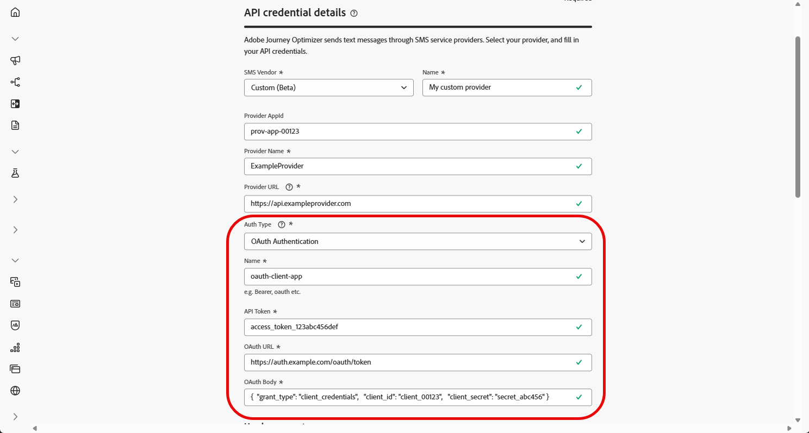

# Configuración de un proveedor personalizado {#sms-configuration-custom}

>[!CONTEXTUALHELP]
>id="ajo_admin_sms_api_byop_provider_url"
>title="URL del proveedor"
>abstract="Especifique la URL de la API externa a la que desea conectarse. Esta URL sirve como punto final para acceder a las funciones y funcionalidades de la API."

>[!CONTEXTUALHELP]
>id="ajo_admin_sms_api_byop_header_parameters"
>title="Parámetros de encabezado"
>abstract="Especifique la etiqueta, el tipo y el valor de los encabezados adicionales para habilitar la autenticación adecuada, el formato del contenido y la comunicación eficaz de la API. "

>[!CONTEXTUALHELP]
>id="ajo_admin_sms_api_byop_provider_payload"
>title="Carga útil del proveedor"
>abstract="Proporcione la carga útil de la solicitud para garantizar que se envían los datos correctos para el procesamiento y la generación de respuestas."

Esta función le permite integrar y configurar sus propios proveedores de mensajería, ofreciendo flexibilidad más allá de las opciones predeterminadas (Sinch, Twilio e Infobip). Esto permite una creación, un envío, una creación de informes y una administración de consentimiento sin problemas tanto para mensajes SMS como RCS.

Con la configuración personalizada del proveedor, puede conectar servicios de mensajería de terceros directamente en Journey Optimizer, personalizar las cargas de mensajes para el contenido dinámico y administrar las preferencias de inclusión/exclusión para garantizar la conformidad en los canales SMS y RCS.

Para configurar el proveedor personalizado, siga los pasos a continuación:

1. [Crear credencial de API](#api-credential)
1. [Crear webhook](#webhook)
1. [Crear configuración de canal](sms-configuration-surface.md)
1. [Creación de un Recorrido o una campaña con una acción de canal SMS](create-sms.md)

## Cree sus credenciales de API {#api-credential}

Para enviar mensajes SMS y RCS en Journey Optimizer mediante un proveedor personalizado no disponible de forma predeterminada por Adobe (por ejemplo, Sinch, Infobip, Twilio), siga estos pasos:

1. En el carril izquierdo, vaya a **[!UICONTROL Administración]** `>` **[!UICONTROL Canales]**, seleccione el menú **[!UICONTROL Credenciales de API]** en **[!UICONTROL Configuración de SMS]** y haga clic en el botón **[!UICONTROL Crear nuevas credenciales de API]**.

   

1. Configure las credenciales de la API de SMS como se detalla a continuación:

   * **[!UICONTROL Proveedor de SMS]**: personalizado.

   * **[!UICONTROL Nombre]**: escriba un nombre para su credencial de API.

   * **[!UICONTROL Id. de aplicación de proveedor]**: escriba el identificador de aplicación proporcionado por su proveedor de SMS.

   * **[!UICONTROL Nombre de proveedor]**: Escriba el nombre de su proveedor de SMS.

   * **[!UICONTROL URL de proveedor]**: escribe la URL de tu proveedor de SMS.

   * **[!UICONTROL Tipo de autenticación&#x200B;]**: seleccione el tipo de autorización y [complete los campos correspondientes](#auth-options) según el método de autenticación elegido.

     

1. Habilite la opción **[!UICONTROL compatibilidad con mTLS]**, que garantiza que tanto el cliente como el servidor se autenticarán mutuamente antes de establecer una conexión segura.

   Para usar solo mTLS, selecciona **[!UICONTROL Sin autenticación]** en la lista desplegable **[!UICONTROL Tipo de autenticación]** y luego habilita la compatibilidad con **[!UICONTROL mTLS]**.

1. En la sección **[!UICONTROL Encabezados]**, haga clic en **[!UICONTROL Agregar nuevo parámetro]** para especificar los encabezados HTTP para el mensaje de solicitud que se enviará al servicio externo.

   Los campos de encabezado **Content-Type** y **Charset** están establecidos de forma predeterminada y no se pueden eliminar.

   

1. Agregue su **[!UICONTROL carga útil del proveedor]** para validar y personalizar las cargas útiles de solicitud.

   Para los mensajes RCS, esta carga útil se usa más adelante durante [diseño de contenido](create-sms.md#sms-content).

1. Haga clic en **[!UICONTROL Enviar]** cuando termine de configurar las credenciales de la API.

1. En el menú **[!UICONTROL Credenciales de API]**, haga clic en el  para eliminar sus credenciales de API.

   

1. Para modificar las credenciales existentes, busque las credenciales de API que desee y haga clic en la opción **[!UICONTROL Editar]** para realizar los cambios necesarios.

   

1. Haga clic en **[!UICONTROL Verificar conexión de SMS]**, a partir de las credenciales de la API existente, para probar y comprobar las credenciales de la API de SMS enviando un mensaje de ejemplo a un dispositivo designado.

1. Rellene los campos **Número** y **Mensaje** y haga clic en **[!UICONTROL Verificar conexión]**.

   >[!IMPORTANT]
   >
   >El mensaje debe estar estructurado para alinearse con el formato de carga útil del proveedor.

   

Después de crear y configurar las credenciales de la API, debes establecer [la configuración de entrada del webhook](#webhook) para los mensajes SMS.

### Opciones de autenticación para proveedores de SMS personalizados {#auth-options}

>[!CONTEXTUALHELP]
>id="ajo_admin_sms_api_byop_auth_type"
>title="Tipo de autenticación"
>abstract="Especifique el método de autenticación necesario para acceder a la API: esto garantiza una comunicación segura y autorizada con el servicio externo."

>[!BEGINTABS]

>[!TAB Clave de API]

Una vez creadas las credenciales de la API, complete los campos necesarios para la autenticación de claves de API:

* **[!UICONTROL Nombre]**&#x200B;: escriba un nombre para la configuración de la clave de API.
* **[!UICONTROL Token de API]**&#x200B;: escriba el token de API proporcionado por su proveedor de SMS.

>[!TAB Autenticación de MAC]

Una vez creadas las credenciales de la API, complete los campos necesarios para la autenticación de MAC:

* **[!UICONTROL Nombre]**&#x200B;: escriba un nombre para la configuración de autenticación de MAC.
* **[!UICONTROL Token de API]**&#x200B;: escriba el token de API proporcionado por su proveedor de SMS.
* **[!UICONTROL Clave secreta de API]**: escriba la clave secreta de API proporcionada por su proveedor de SMS. Esta clave se utiliza para generar el MAC (código de autenticación de mensaje) para una comunicación segura.
* **[!UICONTROL Formato hash de autorización de Mac]**: elija el formato hash para la autenticación de MAC.

>[!TAB Autenticación OAuth]

Una vez creadas las credenciales de la API, complete los campos necesarios para la autenticación OAuth:

* **[!UICONTROL Nombre]**&#x200B;: escriba un nombre para la configuración de autenticación de OAuth.

* **[!UICONTROL Token de API]**&#x200B;: escriba el token de API proporcionado por su proveedor de SMS.

* **[!UICONTROL URL de OAuth]**&#x200B;: introduzca la URL para obtener el token de OAuth.

* **[!UICONTROL Cuerpo de OAuth]**&#x200B;: proporcione el cuerpo de la solicitud de OAuth en formato JSON, incluidos parámetros como `grant_type`, `client_id` y `client_secret`.

>[!TAB Autenticación JWT]

Una vez creadas las credenciales de la API, complete los campos necesarios para la autenticación JWT:

* **[!UICONTROL Nombre]**&#x200B;: escriba un nombre para la configuración de autenticación JWT.

* **[!UICONTROL Token de API]**&#x200B;: escriba el token de API proporcionado por su proveedor de SMS.

* **[!UICONTROL Carga útil JWT]**&#x200B;: introduzca la carga útil JSON que contiene las notificaciones necesarias para JWT, como el emisor, el asunto, la audiencia y la caducidad.

>[!ENDTABS]

## Crear webhook {#webhook}

>[!BEGINSHADEBOX]

Si no se proporcionan las palabras clave de inclusión u exclusión, se utilizan mensajes de consentimiento estándar para respetar la privacidad del usuario. Añadir palabras clave personalizadas anula automáticamente los valores predeterminados.

**Palabras clave predeterminadas:**

* **Inclusión**: SUSCRIBIRSE, SÍ, NO DETENER, INICIAR, CONTINUAR, REANUDAR, INICIAR
* **Exclusión**: DETENER, SALIR, CANCELAR, FINALIZAR, CANCELAR SUSCRIPCIÓN, NO
* **Ayuda**: AYUDA

>[!ENDSHADEBOX]

Una vez que las credenciales de la API se hayan creado correctamente, el siguiente paso es crear un webhook y configurar los ajustes de entrada. Esta configuración garantiza que el sistema pueda recibir y procesar correctamente los datos o mensajes entrantes.

Al configurar un gancho web, puede definir su propósito según el tipo de datos que desee capturar:

* **[!UICONTROL Entrante]**: utilice esta opción si desea capturar las respuestas de consentimiento, como las inclusiones o las exclusiones, y recopilar las preferencias de usuario.

* **[!UICONTROL Comentarios]**: elija esta opción para realizar un seguimiento de los eventos de entrega y participación, incluidos los recibos de lectura y las interacciones del usuario, con el fin de admitir la creación de informes y el análisis.

>[!BEGINTABS]

>[!TAB Entrante]

1. En el carril izquierdo, vaya a **[!UICONTROL Administración]** `>` **[!UICONTROL Canales]**, seleccione el menú **[!UICONTROL Webhooks de SMS]** en **[!UICONTROL Configuración de SMS]** y haga clic en el botón **[!UICONTROL Crear webhook]**.

   

1. Configure las opciones de webhook, tal y como se detalla a continuación:

   * **[!UICONTROL Nombre]**: escribe un nombre para tu webhook.

   * **[!UICONTROL Seleccionar proveedor de SMS]**: personalizado.

   * **[!UICONTROL Tipo]**: Entrante.

   * **[!UICONTROL Credenciales de API]**: elija en la lista desplegable sus [credenciales de API configuradas anteriormente](#api-credential).

   * **[!UICONTROL Número de teléfono del remitente]**: escribe el número de teléfono del remitente &#x200B;que quieras usar para tus comunicaciones.

     

1. Haga clic en  para agregar las categorías de palabras clave y, a continuación, configúrelas de la siguiente manera:

   * **[!UICONTROL Categoría de palabras clave entrantes]**: elige las categorías de palabras clave **[!UICONTROL Inclusión]**, **[!UICONTROL Exclusión]**, **[!UICONTROL Ayuda]** o **[!UICONTROL Predeterminado]**.

   * **[!UICONTROL Escriba una palabra clave]**: escriba las palabras clave predeterminadas o personalizadas que almacenarán automáticamente en déclencheur el mensaje. Haga clic en  para agregar varias palabras clave.

   * **[!UICONTROL Mensaje de respuesta]**: seleccione en la lista desplegable la respuesta personalizada que se enviará automáticamente.

   

1. Haga clic en **[!UICONTROL Ver editor de carga útil]** para validar y personalizar las cargas útiles de solicitud.

   Puede personalizar dinámicamente la carga útil mediante atributos de perfil y garantizar que se envíen datos precisos para el procesamiento y la generación de respuestas con la ayuda de funciones de ayuda integradas.

1. Haga clic en **[!UICONTROL Enviar]** cuando termine de configurar su webhook.

1. En el menú de **[!UICONTROL Webhooks]**, haz clic en el  para eliminar tu webhook.

1. Para modificar la configuración existente, busque el webhook deseado y haga clic en la opción **[!UICONTROL Editar]** para realizar los cambios necesarios.

1. Acceda y copie su nueva **[!UICONTROL URL de webhook]** desde el **[!UICONTROL webhook]** que envió anteriormente.

   

Después de crear y configurar las opciones de entrada para el webhook, debes crear una [configuración de canal](sms-configuration-surface.md) para los mensajes SMS.

Una vez configuradas, puede aprovechar todas las funcionalidades de canal integradas, como la creación de mensajes, la personalización, el seguimiento de vínculos y la creación de informes.

>[!TAB Comentarios]

1. En el carril izquierdo, vaya a **[!UICONTROL Administración]** `>` **[!UICONTROL Canales]**, seleccione el menú **[!UICONTROL Webhooks de SMS]** en **[!UICONTROL Configuración de SMS]** y haga clic en el botón **[!UICONTROL Crear webhook]**.

   

1. Configure las opciones de webhook, tal y como se detalla a continuación:

   * **[!UICONTROL Nombre]**: escribe un nombre para tu webhook.

   * **[!UICONTROL Seleccionar proveedor de SMS]**: personalizado.

   * **[!UICONTROL Tipo]**: Comentarios.

   

1. Haga clic en **[!UICONTROL Ver editor de carga útil]** para validar y personalizar las cargas útiles de solicitud.

   Puede personalizar dinámicamente la carga útil mediante atributos de perfil y garantizar que se envíen datos precisos para el procesamiento y la generación de respuestas con la ayuda de funciones de ayuda integradas.

1. Haga clic en **[!UICONTROL Enviar]** cuando termine de configurar su webhook.

1. En el menú de **[!UICONTROL Webhooks]**, haz clic en el  para eliminar tu webhook.

1. Para modificar la configuración existente, busque el webhook deseado y haga clic en la opción **[!UICONTROL Editar]** para realizar los cambios necesarios.

1. Acceda y copie su nueva **[!UICONTROL URL de webhook]** desde el **[!UICONTROL webhook]** que envió anteriormente.

   

Después de crear y configurar las opciones de entrada para el webhook, debes crear una [configuración de canal](sms-configuration-surface.md) para los mensajes SMS.

Una vez configuradas, puede aprovechar todas las funcionalidades de canal integradas, como la creación de mensajes, la personalización, el seguimiento de vínculos y la creación de informes.

>[!ENDTABS]

## Vídeo práctico {#video}

>[!VIDEO](https://video.tv.adobe.com/v/3431625)

