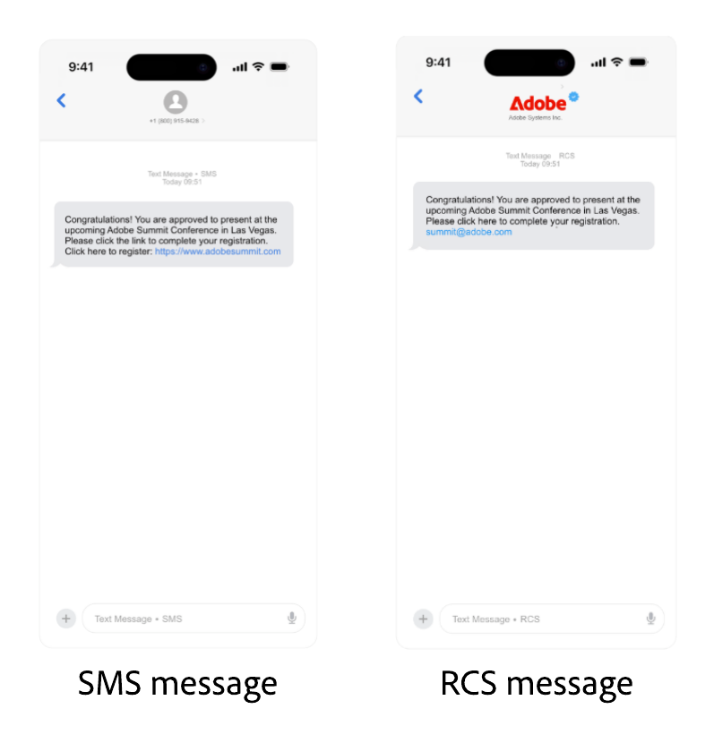

# Configuración del proveedor Sinch {#sms-configuration-sinch}

Al utilizar el proveedor de Sinch con Journey Optimizer, puede encontrar tres opciones distintas:

* **Configuración de SMS**: configura tus credenciales de la API de Sinch para enviar mensajes SMS sin problemas.

* **Configuración de MMS**: para la mensajería multimedia (MMS), configure sus credenciales de API de MMS de Sinch. Tenga en cuenta que el seguimiento y la respuesta a los mensajes entrantes se gestionan mediante la configuración de SMS. La configuración de MMS solo es para la entrega saliente del mensaje MMS.

* **Configuración de RCS**: configure sus credenciales de API de Sinch para enviar mensajes RCS sin problemas.

## Configuración de credenciales de API para SMS{#create-api}

>[!BEGINSHADEBOX]

Si no se proporcionan las palabras clave de inclusión u exclusión, se utilizan mensajes de consentimiento estándar para respetar la privacidad del usuario. Añadir palabras clave personalizadas anula automáticamente los valores predeterminados.

**Palabras clave predeterminadas:**

* **Inclusión**: SUSCRIBIRSE, SÍ, NO DETENER, INICIAR, CONTINUAR, REANUDAR, INICIAR
* **Exclusión**: DETENER, SALIR, CANCELAR, FINALIZAR, CANCELAR SUSCRIPCIÓN, NO
* **Ayuda**: AYUDA

>[!ENDSHADEBOX]

Para configurar su proveedor de Sinch para que envíe mensajes SMS y MMS con Journey Optimizer, siga estos pasos:

1. En el carril izquierdo, vaya a **[!UICONTROL Administración]** > **[!UICONTROL Canales]** `>` **[!UICONTROL Configuración de SMS]** y seleccione el menú **[!UICONTROL Credenciales de API]**. Haga clic en el botón **[!UICONTROL Crear nuevas credenciales de API]**.

1. Configure las credenciales de la API de SMS como se detalla a continuación:

   +++ Lista de credenciales de SMS para la configuración

   | Campos de configuración | Descripción |
   |---|---|    
   | Proveedor de SMS | Sinch |
   | Nombre | Elija un nombre para su credencial de API. |
   | ID de servicio y token de API | Acceda a la página de API y encontrará sus credenciales en la pestaña SMS. Obtenga más información en [Documentación de Sinch](https://developers.sinch.com/docs/sms/getting-started/){target="_blank"}. |
   | Palabras clave de inclusión | Introduzca las palabras clave predeterminadas o personalizadas que almacenarán en déclencheur automáticamente su mensaje de inclusión. Para varias palabras clave, utilice valores separados por comas. |
   | Mensaje de inclusión | Introduzca la respuesta personalizada que se envía automáticamente como mensaje de inclusión. |
   | Palabras clave de exclusión | Introduzca las palabras clave predeterminadas o personalizadas que almacenarán en déclencheur automáticamente el mensaje de exclusión. Para varias palabras clave, utilice valores separados por comas. |
   | Mensaje de exclusión | Introduzca la respuesta personalizada que se enviará automáticamente como mensaje de exclusión. |
   | Palabras clave de ayuda | Escriba las palabras clave predeterminadas o personalizadas que almacenarán en déclencheur automáticamente su **mensaje de ayuda**. Para varias palabras clave, utilice valores separados por comas. |
   | Mensaje de ayuda | Escriba la respuesta personalizada que se enviará automáticamente como **mensaje de ayuda**. |
   | Palabras clave de inclusión doble | Introduzca las palabras clave que almacenan en déclencheur el proceso de inclusión doble. Si no existe ningún perfil de usuario, se crea tras una confirmación correcta. Para varias palabras clave, utilice valores separados por comas. [Más información sobre la inclusión doble de SMS](https://video.tv.adobe.com/v/3427129/?learn=on). |
   | Mensaje de inclusión doble | Introduzca la respuesta personalizada que se envía automáticamente en respuesta a la confirmación de doble inclusión. |
   | Número entrante | Añada su número de entrada único o código corto. Esto le permite utilizar las mismas credenciales de API en diferentes entornos limitados, cada uno con su propio número de entrada o código corto. |
   | Palabras clave de entrada personalizadas | Defina palabras clave únicas no relacionadas con el consentimiento para las acciones basadas en lotes, por ejemplo, DESCUENTO, OFERTAS, INSCRIBIRSE. Estas palabras clave se capturan y almacenan como atributos en el perfil, lo que le permite almacenar en déclencheur una calificación de segmentos por lotes dentro del recorrido y enviar una respuesta o acción personalizada. |
   | Mensaje de respuesta entrante predeterminado | Introduzca la respuesta predeterminada que se envía cuando un usuario final envía un SMS entrante que no coincide con ninguna de las palabras clave definidas. |
   | Anular URL | Introduzca la URL personalizada para reemplazar los puntos finales predeterminados para los informes de entrega de SMS, los datos de comentarios, los mensajes entrantes o las notificaciones de eventos. Sinch enviará todas las actualizaciones relevantes a esta URL en lugar de a las predefinidas. |

   +++

1. Habilite la opción **[!UICONTROL exclusión aproximada]** para detectar mensajes que se parezcan a palabras clave de exclusión (por ejemplo, &quot;CANCIL&quot;) y personalizar la respuesta de confirmación en el campo **[!UICONTROL Respuesta automática aproximada]**.

   **[!UICONTROL Exclusión parcial]** identifica los mensajes SMS que indican que un usuario desea cancelar la suscripción, aunque el mensaje no coincida exactamente con una palabra clave de exclusión definida. Puede detectar frases de exclusión comunes y ciertos términos ofensivos, lo que ayuda a garantizar que las campañas respeten las preferencias del usuario y sigan cumpliendo las normas.

1. Haga clic en **[!UICONTROL Enviar]** cuando termine de configurar las credenciales de la API.

1. En el menú **[!UICONTROL Credenciales de API]**, haga clic en el icono bin para eliminar sus credenciales de API.

1. Para modificar las credenciales existentes, busque las credenciales de API que desee y haga clic en la opción **[!UICONTROL Editar]** para realizar los cambios necesarios.

1. Haga clic en **[!UICONTROL Verificar conexión de SMS]**, a partir de las credenciales de la API existente, para probar y comprobar las credenciales de la API de SMS enviando un mensaje de ejemplo a un dispositivo designado.

1. Rellene los campos **Número** y **Mensaje** y haga clic en **[!UICONTROL Verificar conexión]**.

   >[!IMPORTANT]
   >
   >El mensaje debe estar estructurado para alinearse con el formato de carga útil del proveedor.

   

Después de crear y configurar las credenciales de la API, debe crear una configuración de canal para los mensajes SMS. [Más información](sms-configuration-surface.md)

## Configurar credenciales de API para MMS{#sinch-mms}

>[!IMPORTANT]
>
> Junto con la configuración de MMS, también debe crear credenciales de API de Sinch específicamente para rastrear mensajes entrantes y administrar solicitudes de consentimiento.

Para configurar Sinch MMS para enviar MMS con Journey Optimizer, siga estos pasos:

1. En el carril izquierdo, vaya a **[!UICONTROL Administración]** > **[!UICONTROL Canales]** `>` **[!UICONTROL Configuración de SMS]** y seleccione el menú **[!UICONTROL Credenciales de API]**. Haga clic en el botón **[!UICONTROL Crear nuevas credenciales de API]**.

1. Configure las credenciales de la API de MMS como se detalla a continuación:

   * **[!UICONTROL Proveedor de SMS]**: Sinch MMS.

   * **[!UICONTROL Nombre]**: elige un nombre para tu credencial de API.

   * **[!UICONTROL ID de proyecto]**, **[!UICONTROL ID de aplicación]** y **[!UICONTROL token de API]**: siga los pasos a continuación para recopilar sus credenciales de API de MMS.

      * Para **[!UICONTROL ID de proyecto]** e **[!UICONTROL ID de aplicación]**: acceda a la página [Información general de la API de conversación](https://dashboard.sinch.com/convapi/overview) de su proyecto de Sinch en su panel de Sinch.
      * Para **[!UICONTROL token de API]**: obtenga las [claves de acceso](https://community.sinch.com/t5/Customer-Dashboard/Sinch-Access-Keys/ta-p/12638) para su proyecto Sinch y genere un **Token de API Base64** de su proyecto Sinch **Claves de acceso**.

1. Haga clic en **[!UICONTROL Enviar]** cuando termine de configurar las credenciales de la API.

1. En el menú **[!UICONTROL Credenciales de API]**, haga clic en el icono bin para eliminar sus credenciales de API.

1. Para modificar las credenciales existentes, busque las credenciales de API que desee y haga clic en la opción **[!UICONTROL Editar]** para realizar los cambios necesarios.

Después de crear y configurar las credenciales de la API, debe crear una configuración de canal para los mensajes MMS. [Más información](sms-configuration-surface.md)

## Configurar las credenciales de API para RCS

<!---->

La mensajería RCS (servicios de comunicación enriquecidos) es compatible con Journey Optimizer a través de Sinch, lo que permite enviar mensajes básicos utilizando perfiles comerciales verificados con elementos de marca como logotipos y nombres de remitente.

Tenga en cuenta que los mensajes vuelven automáticamente a SMS cuando el dispositivo del perfil no admite RCS o no se puede acceder a él temporalmente mediante RCS.

<!--
### Basic RCS Messages

>[!AVAILABILITY]
>
> Basic RCS messages is only available upon Adobe RCS add-on offering.

1. **Set up your branded RCS agent**

    Create a branded RCS agent in the Sinch Dashboard. [Learn more on branded RCS agent](https://community.sinch.com/t5/RCS/Getting-Started-with-RCS-using-Conversation-API/ta-p/17844)

1. **Set up your [Custom API credentials](sms-configuration-custom.md)**
    
    Once your RCS agent is approved, you need to set up your Sinch API credentials, which include your access key, secret, and service plan ID. These credentials will be used by Journey Optimizer to authenticate and send messages through Sinch's platform.

1. **Create a [channel configuration](sms-configuration-surface.md) for your RCS messages**

    Configure a channel surface in Journey Optimizer by linking your Sinch credentials and defining the messaging parameters. This setup enables you to compose and send RCS messages from Journey Optimizer.

1. **Create and personalize your [SMS message](../sms/create-sms.md)**

    Your messages automatically falls back to SMS when the profile's device does not support RCS or is temporarily unreachable via RCS.
-->

### Mensajes multimedia RCS

>[!AVAILABILITY]
>
> Los mensajes RCS avanzados solo están disponibles con una cuenta directa administrada por Sinch.

1. **Configure su agente RCS de marca**

   Cree un agente de RCS de marca en el panel de Sinch. [Más información sobre el agente de RCS de marca](https://community.sinch.com/t5/RCS/Getting-Started-with-RCS-using-Conversation-API/ta-p/17844)

1. **Configure sus [credenciales de API personalizadas](sms-configuration-custom.md)**

   Una vez aprobado el agente de RCS, debe configurar las credenciales de API personalizadas, que incluyen su AppId, nombre, dirección URL y tipo de autenticación.

1. **Configure su RCS con la carga útil del proveedor.**

   En sus [credenciales de API personalizadas](sms-configuration-custom.md), agregue la carga útil del proveedor para validar y personalizar los mensajes RCS.

1. **Cree una [configuración de canal](sms-configuration-surface.md) para sus mensajes RCS**

   Configure una superficie de canal en Journey Optimizer vinculando las credenciales de Sinch y definiendo los parámetros de mensajería. Esta configuración le permite componer y enviar mensajes RCS desde Journey Optimizer.

1. **Crea y personaliza tu [mensaje SMS](../sms/create-sms.md)**

   Pegue su carga útil directamente en el contenido del SMS para incrustar y enviar los mensajes de los servicios de comunicación enriquecidos (RCS).

   ➡️ [Explore cómo Sinch admite RCS en la documentación de Sinch](https://sinch.com/blog/rcs-api-guide/)

