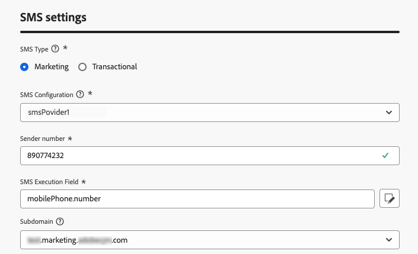

# Creación de una configuración de SMS/MMS/RCS {#message-preset-sms}

>[!CONTEXTUALHELP]
>id="ajo_admin_surface_sms_type"
>title="Definir la categoría de mensaje"
>abstract="Seleccione el tipo de mensajes de texto con esta configuración: Marketing para mensajes promocionales, que requieren el consentimiento del usuario, o Transaccional para mensajes no comerciales, como el restablecimiento de contraseña."
>additional-url="https://experienceleague.adobe.com/docs/journey-optimizer/using/privacy/consent/opt-out.html?lang=es#sms-opt-out-management" text="Exclusión en mensajes de texto de marketing"

Una vez configurado el canal SMS/MMS/RCS, debe crear una configuración de canal para poder enviar mensajes SMS, RCS y MMS desde **[!DNL Journey Optimizer]**.

Para crear una configuración de canal, siga estos pasos:

1. En el carril izquierdo, vaya a **[!UICONTROL Administración]** > **[!UICONTROL Canales]** y seleccione **[!UICONTROL Configuración general]** > **[!UICONTROL Configuraciones de canal]**. Haga clic en el botón **[!UICONTROL Crear configuración de canal]**.

   

1. Introduzca un nombre y una descripción (opcional) para la configuración y, a continuación, seleccione el canal SMS.

   

   >[!NOTE]
   >
   > Los nombres deben comenzar por una letra (A-Z). Solo puede contener caracteres alfanuméricos. También puede utilizar caracteres de guion bajo `_`, punto `.` y guion `-`.

1. Defina la **configuración de SMS**.

   

   Comience por seleccionar el **[!UICONTROL tipo de SMS]** que se enviará con la configuración: **[!UICONTROL Transaccional]** o **[!UICONTROL Marketing]**.

   * Elija **Marketing** para los mensajes de texto promocionales: estos mensajes requieren el consentimiento del usuario.
   * Elija **Transaccional** para mensajes no comerciales como confirmaciones de pedidos, notificaciones de restablecimiento de contraseña o información de entrega, por ejemplo.

   Al crear un SMS/MMS, debe elegir una configuración de canal válida que coincida con la categoría seleccionada para el mensaje.

   >[!CAUTION]
   >
   >**Los mensajes transaccionales** se pueden enviar a perfiles que cancelaron la suscripción a comunicaciones de marketing. Estos mensajes solo se pueden enviar en contextos específicos.

1. Seleccione la **[!UICONTROL configuración de SMS]** que se asociará con la configuración.

   Para obtener más información sobre cómo configurar su entorno para enviar mensajes SMS, consulte [esta sección](#create-api).

1. Escriba el **[!UICONTROL número de remitente]** &#x200B;que desee usar para sus comunicaciones.

1. Seleccione su **[!UICONTROL campo de ejecución de SMS]** para seleccionar el **[!UICONTROL atributo de perfil]** asociado a los números de teléfono de los perfiles.

1. Si deseas usar la función de acortamiento de URL en tus mensajes SMS, selecciona un elemento de la lista **[!UICONTROL Subdominio]**.

   >[!NOTE]
   >
   >Para poder seleccionar un subdominio, asegúrese de haber configurado previamente al menos un subdominio SMS/MMS. [Descubra cómo](sms-subdomains.md)

1. Una vez configurados todos los parámetros, haga clic en **[!UICONTROL Enviar]** para confirmar. También puede guardar la configuración de canal como borrador y reanudarla más adelante.

   

1. Una vez creada la configuración del canal, se muestra en la lista con el estado **[!UICONTROL Procesando]**.

   >[!NOTE]
   >
   >Si las comprobaciones no se realizan correctamente, obtenga más información sobre los posibles motivos de error en [esta sección](../configuration/channel-surfaces.md).

1. Una vez que las comprobaciones son correctas, la configuración del canal obtiene el estado **[!UICONTROL Activo]**. Está listo para utilizarse para enviar mensajes.

   

Ya está listo para enviar mensajes de texto con Journey Optimizer.
