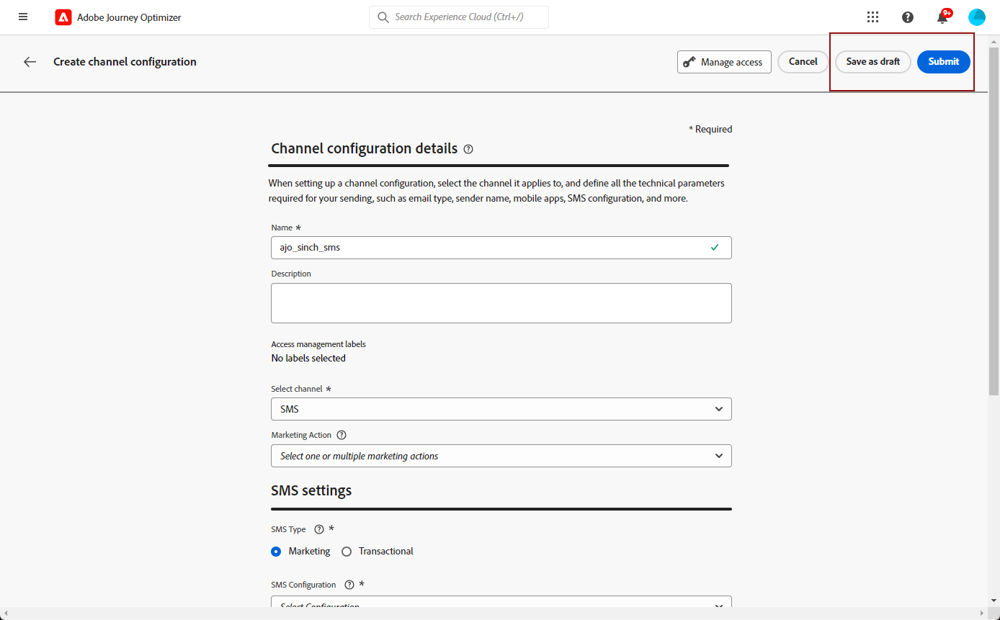

# Crear una superficie de SMS/MMS {#message-preset-sms}

>[!CONTEXTUALHELP]
>id="ajo_admin_surface_sms_type"
>title="Definir la categoría de mensaje"
>abstract="Seleccione el tipo de mensajes de texto con esta superficie: Marketing para mensajes promocionales, que requieren el consentimiento del usuario, o Transaccional para mensajes SMS no comerciales, como el restablecimiento de contraseña."
>additional-url="https://experienceleague.adobe.com/docs/journey-optimizer/using/privacy/consent/opt-out.html?lang=es#sms-opt-out-management" text="Exclusión en mensajes de texto de marketing"

Una vez configurado el canal SMS/MMS, debe crear una superficie de canal para poder enviar mensajes SMS y MMS desde **[!DNL Journey Optimizer]**.

Para crear una superficie de canal, siga estos pasos:

1. En el carril izquierdo, vaya a **[!UICONTROL Administration]** > **[!UICONTROL Canales]** y seleccione **[!UICONTROL Marca]** > **[!UICONTROL Superficies de canal]**. Haga clic en **[!UICONTROL Crear superficie de canal]** botón.

   

1. Introduzca un nombre y una descripción (opcional) para la superficie y, a continuación, seleccione el canal SMS.

   

   >[!NOTE]
   >
   > Los nombres deben comenzar por una letra (A-Z). Solo puede contener caracteres alfanuméricos. También puede utilizar guiones bajos `_`, punto`.` y guiones `-` caracteres.

1. Defina el **Configuración de SMS**.

   

   Comience por seleccionar la **[!UICONTROL Tipo de SMS]** que se enviarán con la superficie: **[!UICONTROL Transaccional]** o **[!UICONTROL Marketing]**.

   * Elegir **Marketing** para mensajes de texto promocionales: estos mensajes requieren el consentimiento del usuario.
   * Elegir **Transaccional** para mensajes no comerciales, como confirmaciones de pedidos, notificaciones de restablecimiento de contraseña o información de entrega, por ejemplo.

   Al crear un SMS/MMS, debe elegir una superficie de canal válida que coincida con la categoría seleccionada para el mensaje.

   >[!CAUTION]
   >
   >**Transaccional** los mensajes se pueden enviar a perfiles que cancelaron la suscripción a comunicaciones de marketing. Estos mensajes solo se pueden enviar en contextos específicos.

1. Seleccione el **[!UICONTROL Configuración de SMS]** para asociarlo con la superficie.

   Para obtener más información sobre cómo configurar su entorno para enviar mensajes SMS, consulte [esta sección](#create-api).

1. Introduzca el **[!UICONTROL Número de remitente]** &#x200B;desea utilizar para sus comunicaciones.

1. Seleccione su **[!UICONTROL Campo de ejecución de SMS]** para seleccionar **[!UICONTROL Atributo de perfil]** asociado a los números de teléfono de los perfiles.

1. Si desea utilizar la función de acortamiento de URL en los mensajes SMS, seleccione un elemento del **[!UICONTROL Subdominio]** lista.

   >[!NOTE]
   >
   >Para poder seleccionar un subdominio, asegúrese de haber configurado previamente al menos un subdominio SMS/MMS. [Descubra cómo](sms-subdomains.md)

1. Introduzca el **[!UICONTROL Número de exclusión]** que desee utilizar para esta superficie. Cuando los perfiles se excluyen de este número, aún puede enviarles mensajes de otros números que pueda estar utilizando para enviar mensajes de texto con [!DNL Journey Optimizer].

   >[!NOTE]
   >
   >Entrada [!DNL Journey Optimizer]Por lo tanto, la exclusión de mensajes de texto ya no se administra en el nivel de canal. Ahora es específico de un número.

1. Una vez configurados todos los parámetros, haga clic en **[!UICONTROL Enviar]** para confirmar. También se puede guardar la superficie de canal como inclinación y reanudar su configuración más adelante.

   

1. Una vez creada la superficie de canal, esta se muestra en la lista con el **[!UICONTROL Procesando]** estado.

   >[!NOTE]
   >
   >Si las comprobaciones no se realizan correctamente, obtenga más información sobre los posibles motivos de error en [esta sección](#monitor-channel-surfaces).

1. Una vez que las comprobaciones son correctas, la superficie de canal obtiene el **[!UICONTROL Activo]** estado. Está listo para utilizarse para enviar mensajes.

   

Ya está listo para enviar mensajes de texto con Journey Optimizer.
