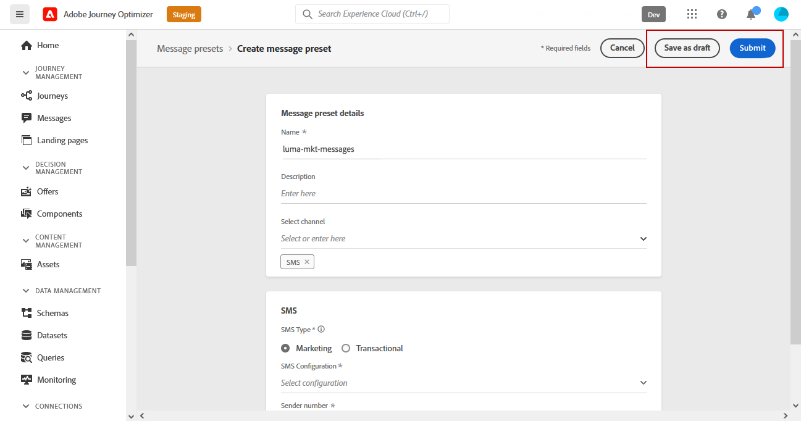

# Configuración del canal de SMS {#sms-configuration}

[!DNL Journey Optimizer] le permite crear sus recorridos y enviar mensajes a la audiencia de destino.

Antes de enviar SMS, configure la instancia. Tienes que hacerlo [integración de la configuración del proveedor](#create-api) con Journey Optimizer y [creación de una superficie SMS](#message-preset-sms) (es decir, ajuste preestablecido de SMS). Estos pasos debe realizarlos un [administrador del sistema de Adobe Journey Optimizer](../start/path/administrator.md).

## Requisitos previos{#sms-prerequisites}

Adobe Journey Optimizer se integra actualmente con proveedores de terceros como Sinch y Twilio, que ofrecen servicios de SMS independientes de Adobe Journey Optimizer.

Antes de configurar el SMS, debe crear una cuenta con uno de estos proveedores de SMS para recibir el token de API y el ID de servicio que le permitirán establecer la conexión entre Adobe Journey Optimizer y el proveedor de SMS correspondiente.

El uso de los servicios SMS estará sujeto a términos y condiciones adicionales por parte del proveedor de SMS correspondiente. Dado que Sinch y Twilio son productos de terceros disponibles para los usuarios de Adobe Journey Optimizer a través de una integración, para cualquier problema o consulta relacionada con los servicios SMS, los usuarios de Sinch o Twilio deberán ponerse en contacto con el proveedor de SMS correspondiente para obtener ayuda. El Adobe no controla y no es responsable de los productos de terceros.

>[!CAUTION]
>
>Para acceder y editar subdominios SMS, debe tener los siguientes **[!UICONTROL Administrar subdominios de SMS]** en la zona protegida de producción.

## Crear nueva credencial de API {#create-api}

>[!CONTEXTUALHELP]
>id="ajo_admin_sms_api_header"
>title="Configurar el proveedor de SMS con Journey Optimizer"
>abstract="Seleccione su proveedor y rellene sus credenciales de API de SMS."

>[!CONTEXTUALHELP]
>id="ajo_admin_sms_api"
>title="Configurar el proveedor de SMS con Journey Optimizer"
>abstract="Antes de enviar SMS, debe integrar la configuración del proveedor con Journey Optimizer. Una vez finalizado, deberá crear una superficie SMS. Estos pasos debe realizarlos un administrador del sistema de Adobe Journey Optimizer."
>additional-url="https://experienceleague.adobe.com/docs/journey-optimizer/using/sms/sms-configuration.html?lang=es#message-preset-sms" text="Crear una superficie de canal SMS"

>[!CONTEXTUALHELP]
>id="ajo_admin_sms_configuration"
>title="Seleccione la configuración del proveedor de SMS"
>abstract="Seleccione las credenciales de API configuradas para su proveedor de SMS."

Para configurar el proveedor de SMS con Journey Optimizer, siga estos pasos:

1. En el carril izquierdo, vaya a **[!UICONTROL Administration]** > **[!UICONTROL Canales]** y seleccione la **[!UICONTROL Credenciales de API]** menú. Haga clic en **[!UICONTROL Crear nuevas credenciales de API]** botón.

   

1. Configure las credenciales de la API de SMS:

   * En el caso de **[!DNL Sinch]**:

      * **[!UICONTROL Nombre]**: elija un nombre para la credencial de la API.

      * **[!UICONTROL ID de servicio]** y **[!UICONTROL Token de API]**: acceda a la página de las API y encontrará sus credenciales en la pestaña SMS.  [Más información](https://developers.sinch.com/docs/sms/getting-started/)
   * En el caso de **[!DNL Twilio]**:

      * **[!UICONTROL Nombre]**: elija un nombre para la credencial de la API.

      * **[!UICONTROL SID de cuenta]** y **[!UICONTROL Token de autenticación]**: acceda al panel Información de cuenta de la página Twilio Console Dashboard para buscar sus credenciales.

      * **[!UICONTROL SID de mensaje]**: introduzca el identificador único asignado a cada mensaje creado por la API de Twilio. [Más información](https://support.twilio.com/hc/en-us/articles/223134387-What-is-a-Message-SID-)
   * En el caso de **[!DNL Infobip]**:

      * **[!UICONTROL Nombre]**: elija un nombre para la credencial de la API.

      * **[!UICONTROL URL base de API]** y **[!UICONTROL Token de API]**: acceda a la página de inicio de la interfaz web o a la página de administración de claves de API para encontrar sus credenciales. [Más información](https://www.infobip.com/docs/api)

   

1. Clic **[!UICONTROL Enviar]** cuando haya terminado de configurar las credenciales de la API.

Después de crear y configurar las credenciales de la API, debe crear una superficie de canal (es decir, un ajuste preestablecido de mensaje) para los mensajes SMS.

## Creación de una superficie SMS {#message-preset-sms}

>[!CONTEXTUALHELP]
>id="ajo_admin_surface_sms_type"
>title="Definir la categoría de SMS"
>abstract="Seleccione el tipo de mensajes SMS con esta superficie: Marketing para mensajes SMS promocionales, que requieren el consentimiento del usuario, o Transaccional para mensajes SMS no comerciales, como restablecimiento de contraseña."
>additional-url="https://experienceleague.adobe.com/docs/journey-optimizer/using/privacy/consent/opt-out.html?lang=es#sms-opt-out-management" text="Exclusión en mensajes SMS de marketing"

Una vez configurado el canal SMS, debe crear una superficie de canal para poder enviar mensajes SMS desde **[!DNL Journey Optimizer]**.

Para crear una superficie de canal, siga estos pasos:

1. En el carril izquierdo, vaya a **[!UICONTROL Administration]** > **[!UICONTROL Canales]** y seleccione **[!UICONTROL Marca]** > **[!UICONTROL Superficies de canal]**. Haga clic en **[!UICONTROL Crear superficie de canal]** botón.

   

1. Introduzca un nombre y una descripción (opcional) para la superficie y, a continuación, seleccione el canal SMS.

   

   >[!NOTE]
   >
   > Los nombres deben comenzar por una letra (A-Z). Solo puede contener caracteres alfanuméricos. También puede utilizar guiones bajos `_`, punto`.` y guiones `-` caracteres.

1. Defina el **Configuración de SMS**.

   

   * Seleccione el **[!UICONTROL Tipo de SMS]** que se enviarán con la superficie: **[!UICONTROL Transaccional]** o **[!UICONTROL Marketing]**.

      * Elegir **Marketing** para SMS promocionales: estos mensajes requieren el consentimiento del usuario.
      * Elegir **Transaccional** para mensajes no comerciales, como confirmaciones de pedidos, notificaciones de restablecimiento de contraseña o información de entrega, por ejemplo.

      >[!CAUTION]
      >
      >**Transaccional** Los mensajes SMS se pueden enviar a perfiles que cancelaron la suscripción a comunicaciones de marketing. Estos mensajes solo se pueden enviar en contextos específicos.

      Al crear un mensaje SMS, debe elegir una superficie de canal válida que coincida con la categoría seleccionada para el mensaje.

   * Seleccione el **[!UICONTROL Configuración de SMS]** para asociarlo con la superficie.

      Para obtener más información sobre cómo configurar su entorno para enviar mensajes SMS, consulte [esta sección](#create-api).

   * Introduzca el **[!UICONTROL Número de remitente]** &#x200B;desea utilizar para sus comunicaciones.

   * Seleccione su **[!UICONTROL Campo de ejecución de SMS]** para seleccionar **[!UICONTROL Atributo de perfil]** asociado a los números de teléfono de los perfiles.

1. Si desea utilizar la función de acortamiento de URL en los mensajes SMS, seleccione un elemento del **[!UICONTROL Subdominio]** lista.

   >[!NOTE]
   >
   >Para poder seleccionar un subdominio, asegúrese de haber configurado previamente al menos un subdominio de SMS. [Descubra cómo](sms-subdomains.md)

1. Una vez configurados todos los parámetros, haga clic en **[!UICONTROL Enviar]** para confirmar. También se puede guardar la superficie de canal como inclinación y reanudar su configuración más adelante.

   

1. Una vez creada la superficie de canal, esta se muestra en la lista con el **[!UICONTROL Procesando]** estado.

   >[!NOTE]
   >
   >Si las comprobaciones no se realizan correctamente, obtenga más información sobre los posibles motivos de error en [esta sección](#monitor-channel-surfaces).

1. Una vez que las comprobaciones son correctas, la superficie de canal obtiene el **[!UICONTROL Activo]** estado. Está listo para utilizarse para enviar mensajes.

   

Ya está listo para enviar mensajes SMS con Journey Optimizer.

**Temas relacionados**

* [Creación de un mensaje SMS](create-sms.md)
* [Adición de un mensaje en un recorrido](../building-journeys/journeys-message.md)
* [Añadir un mensaje en una campaña](../campaigns/create-campaign.md)

