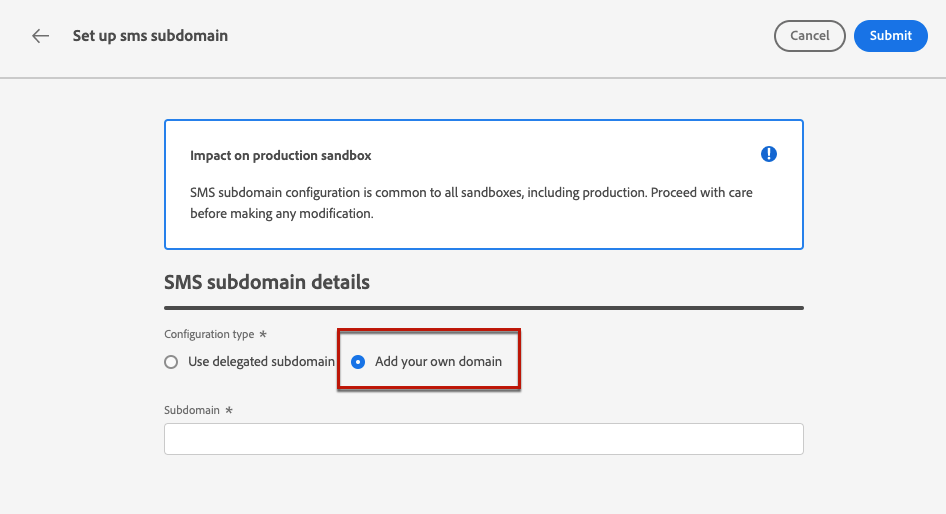

# Configuración de subdominios de SMS {#sms-mms-subdomains}

>[!CONTEXTUALHELP]
>id="ajo_admin_subdomain_sms_header"
>title="Delegación de un subdominio de SMS/MMS"
>abstract="Configure su subdominio para mensajes de texto (SMS/MMS). Puede utilizar un subdominio que ya se haya delegado a Adobe o bien configurar uno nuevo."

>[!CONTEXTUALHELP]
>id="ajo_admin_subdomain_sms"
>title="Delegación de un subdominio de SMS/MMS"
>abstract="Debe configurar un subdominio para utilizarlo en sus mensajes de texto, ya que lo necesitará para crear una configuración de SMS. Seleccione entre los subdominios ya delegados a Adobe o configure un nuevo subdominio."
>additional-url="https://experienceleague.adobe.com/es/docs/journey-optimizer/using/channels/sms/configure-sms/sms-configuration-surface" text="Creación de una configuración de SMS"

>[!CONTEXTUALHELP]
>id="ajo_admin_config_sms_subdomain"
>title="Selección de un subdominio SMS/MMS"
>abstract="Para poder crear una configuración de SMS, asegúrese de haber configurado previamente al menos un subdominio de SMS para seleccionarlo en la lista de nombres Subdominio."
>additional-url="https://experienceleague.adobe.com/es/docs/journey-optimizer/using/channels/sms/configure-sms/sms-configuration-surface" text="Creación de una configuración de SMS"

## Introducción a los subdominios SMS {#gs-sms-mms-subdomains}

Para poder acortar las URL agregadas a tus mensajes SMS/MMS, debes configurar el subdominio que seleccionarás al [crear una configuración de SMS](sms-configuration.md#message-preset-sms).

Puede utilizar un subdominio que ya se haya delegado a Adobe o configurar otro subdominio. Obtenga más información acerca de la delegación de subdominios a Adobe en [esta sección](../configuration/delegate-subdomain.md).

La configuración del subdominio SMS está **compartida entre todos los entornos**. Por lo tanto, cualquier modificación en un subdominio de SMS también afecta a otros entornos limitados de producción.

Para acceder y editar subdominios SMS, debe tener el permiso **[!UICONTROL Administrar subdominios SMS]** en la zona protegida de producción. Puede obtener más información sobre permisos en [esta sección](../administration/high-low-permissions.md).

## Usar un subdominio existente {#sms-use-existing-subdomain}

Para utilizar un subdominio que ya se haya delegado a Adobe, siga los pasos a continuación.

1. Vaya al menú **[!UICONTROL Administración]** > **[!UICONTROL Canales]** y seleccione **[!UICONTROL Configuración de SMS]** > **[!UICONTROL subdominios de SMS]**.

1. Haga clic en **[!UICONTROL Configurar subdominio]**.

   

1. Seleccione **[!UICONTROL Usar subdominio delegado]** de la sección **[!UICONTROL Tipo de configuración]**.

   

1. Introduzca el prefijo que se mostrará en la dirección URL de su SMS.

   Solo se permiten caracteres alfanuméricos y guiones.

   >[!CAUTION]
   >
   >No use los prefijos `cdn` o `data`, ya que están reservados para uso interno. También deben evitarse otros prefijos restringidos o reservados como `dmarc` o `spf`.

1. Seleccione un subdominio delegado de la lista.

   No puede seleccionar un subdominio que ya se esté utilizando como subdominio SMS.

   <!--Capital letters are not allowed in subdomains. TBC by PM-->

   

   <!--Note that you cannot use multiple delegated subdomains of the same parent domain. For example, if 'marketing1.yourcompany.com' is already delegated to Adobe for your SMS messages, you will not be able to use 'marketing2.yourcompany.com'. However, multi-level subdomains being supported for SMS, you may proceed using a subdomain of 'marketing1.yourcompany.com' (such as 'email.marketing1.yourcompany.com'), or a different parent domain.-->

   >[!CAUTION]
   >
   >Si selecciona un dominio delegado a Adobe mediante el [método CNAME](../configuration/delegate-subdomain.md#cname-subdomain-setup), debe crear el registro DNS en su plataforma de alojamiento. Para generar el registro DNS, el proceso es el mismo que al configurar un nuevo subdominio SMS. Aprenda en [esta sección](#sms-configure-new-subdomain).

1. Haga clic en **[!UICONTROL Enviar]**.

1. Una vez enviado, el subdominio se muestra en la lista con el estado **[!UICONTROL Procesando]**. Para obtener más información sobre los estados de los subdominios, consulte [esta sección](../configuration/delegate-subdomain.md#access-delegated-subdomains).<!--Same statuses?-->

   Antes de poder usar ese subdominio para enviar mensajes, debe esperar hasta que Adobe realice las comprobaciones necesarias, que pueden tardar **hasta cuatro horas**.<!--Learn more in [this section](delegate-subdomain.md#subdomain-validation).-->

1. Una vez que las comprobaciones son correctas, el subdominio obtiene el estado **[!UICONTROL Success]**. Está listo para utilizarse para crear configuraciones de canal SMS.

## Configuración de un nuevo subdominio {#sms-configure-new-subdomain}

>[!CONTEXTUALHELP]
>id="ajo_admin_sms_subdomain_dns"
>title="Generar el registro DNS coincidente"
>abstract="Para configurar un nuevo subdominio de SMS, debe copiar la información del servidor de nombres de Adobe que se muestra en la interfaz de Journey Optimizer y pegarla en la solución de alojamiento de dominios para generar el registro DNS coincidente. Una vez realizadas las comprobaciones pertinentes, el subdominio está listo para crear la configuración de SMS."

Para configurar un nuevo subdominio, siga los pasos a continuación.

1. Vaya al menú **[!UICONTROL Administración]** > **[!UICONTROL Canales]** y, a continuación, seleccione **[!UICONTROL Configuración de SMS]** > **[!UICONTROL subdominios de SMS]**.

1. Haga clic en **[!UICONTROL Configurar subdominio]**.

   

1. Seleccione **[!UICONTROL Agregar su propio dominio]** de la sección **[!UICONTROL Tipo de configuración]**.

   

1. Especifique el subdominio que desea delegar.

   >[!CAUTION]
   >
   >* No puede utilizar un subdominio de SMS existente.
   >
   >* No se permiten mayúsculas en los subdominios.

   No se permite delegar un subdominio no válido a Adobe. Asegúrese de introducir un subdominio válido que sea propiedad de su organización, como marketing.yourcompany.com.

   Se admiten subdominios de varios niveles (del mismo dominio principal). Por ejemplo, puede utilizar &quot;sms.marketing.yourcompany.com&quot;.

1. Se muestra el registro que se va a colocar en los servidores DNS. Copie este registro o descargue un archivo CSV y, a continuación, vaya a la solución de alojamiento de dominios para generar el registro DNS correspondiente.

1. Asegúrese de que se ha generado un registro DNS en la solución de alojamiento de dominios. Si todo está configurado correctamente, marque la casilla &quot;Confirmo...&quot; y luego haga clic en **[!UICONTROL Enviar]**.

   

   Al configurar un nuevo subdominio de SMS, siempre apunta a un registro CNAME.

1. Una vez enviada la delegación del subdominio, este se muestra en la lista con el estado **[!UICONTROL Procesando]**. Para obtener más información sobre los estados de los subdominios, consulte [esta sección](../configuration/delegate-subdomain.md#access-delegated-subdomains).<!--Same statuses?-->

Antes de usar un subdominio para enviar mensajes SMS, debe esperar hasta que Adobe realice las comprobaciones necesarias, que pueden tardar hasta cuatro horas.<!--Learn more in [this section](#subdomain-validation).--> Una vez que las comprobaciones son correctas, el subdominio obtiene el estado **[!UICONTROL Correcto]**. Está listo para utilizarse para crear configuraciones de canal SMS.

Tenga en cuenta que el subdominio se marcará como **[!UICONTROL Error]** si no crea el registro de validación en la solución de alojamiento.

## Mecanismos de protección {#guardrails}

Actualmente, la interfaz de usuario [!DNL Journey Optimizer] no admite la eliminación o la cancelación de la delegación de subdominios SMS una vez configurados.

Sin embargo, al probar características en [!DNL Journey Optimizer], puede ser necesario crear un subdominio de SMS. Una vez finalizada la prueba, esto puede llevar a entornos agrupados con configuraciones innecesarias, ya que la interfaz de usuario no permite eliminar ni desdelegar subdominios SMS.

Estos son algunos pasos y consideraciones recomendados:

<!--As an alternative action, create a new SMS subdomain for future use cases and avoid using the existing one if it is no longer needed.-->

* Como práctica recomendada, mantenga el entorno ordenado creando únicamente los componentes y las configuraciones necesarios.
* En situaciones en las que haya un impacto comercial, póngase en contacto con su representante de Adobe, que podrá ayudarle con la eliminación/cancelación de la delegación del subdominio SMS. [Más información](#undelegate-subdomain)
* Si necesita más asistencia, póngase en contacto con Adobe para obtener instrucciones sobre cómo administrar su instancia de forma eficaz.

## Anular la delegación de un subdominio {#undelegate-subdomain}

Si desea desdelegar un subdominio de SMS, póngase en contacto con su representante de Adobe con el subdominio que desee desdelegar.

Si el subdominio SMS apunta a un registro CNAME, puede eliminar el registro DNS CNAME que creó para el subdominio SMS de su solución de alojamiento (pero no elimine el subdominio de correo electrónico original, si lo hay).

>[!NOTE]
>
>Un subdominio de SMS puede señalar a un registro CNAME porque era un [subdominio existente](#sms-use-existing-subdomain) delegado a Adobe mediante el [método CNAME](../configuration/delegate-subdomain.md#cname-subdomain-setup) o un [nuevo subdominio de SMS](#sms-configure-new-subdomain) que usted configuró.

Una vez que Adobe administra la solicitud, el dominio no delegado ya no se muestra en la página de inventario de subdominios.
