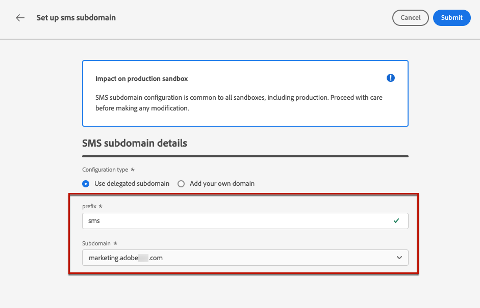

# Configurar subdominios de SMS {#lp-subdomains}

>[!CONTEXTUALHELP]
>id="ajo_admin_subdomain_sms_header"
>title="Delegación de un subdominio de SMS"
>abstract="Establecerá su subdominio para uso SMS. Puede utilizar un subdominio que ya esté delegado en el Adobe o configurar otro subdominio."

>[!CONTEXTUALHELP]
>id="ajo_admin_subdomain_sms"
>title="Delegación de un subdominio de SMS"
>abstract="Debe configurar un subdominio para utilizarlo en los mensajes SMS, ya que necesitará este subdominio para crear una superficie SMS. Puede utilizar un subdominio ya delegado a Adobe o configurar un nuevo subdominio."
>additional-url="https://experienceleague.adobe.com/docs/journey-optimizer/using/sms/sms-configuration.html#message-preset-sms" text="Crear superficies de SMS"

>[!CONTEXTUALHELP]
>id="ajo_admin_config_sms_subdomain"
>title="Seleccionar un subdominio de SMS"
>abstract="Para poder crear una superficie SMS, asegúrese de haber configurado anteriormente al menos un subdominio SMS para seleccionarlo de la lista de nombres de subdominio."
>additional-url="https://experienceleague.adobe.com/docs/journey-optimizer/using/sms/sms-configuration.html#message-preset-sms" text="Crear superficies de SMS"

Para poder acortar las direcciones URL agregadas a los mensajes SMS, debe configurar el subdominio que seleccione cuando [creación de una superficie SMS](sms-configuration.md#message-preset-sms).

Puede utilizar un subdominio que ya esté delegado en Adobe o configurar otro subdominio. Obtenga más información sobre la delegación de subdominios al Adobe en [esta sección](../configuration/delegate-subdomain.md).

>[!CAUTION]
>
>La configuración del subdominio SMS es común a todos los entornos. Por lo tanto:
>
>* Para acceder y editar subdominios de SMS, debe tener la variable **[!UICONTROL Administrar subdominios de SMS]** permiso en el simulador de pruebas de producción.
>
> * Cualquier modificación en un subdominio de SMS también afectará a los entornos limitados de producción.

## Usar un subdominio existente {#sms-use-existing-subdomain}

Para utilizar un subdominio que ya está delegado en Adobe, siga los pasos a continuación.

1. Acceda a la **[!UICONTROL Administración]** > **[!UICONTROL Canales]** a continuación, seleccione **[!UICONTROL Configuración de SMS]** > **[!UICONTROL Subdominios de SMS]**.

   

1. Haga clic en **[!UICONTROL Configurar subdominio]**.

   

1. Select **[!UICONTROL Usar subdominio delegado]** de la variable **[!UICONTROL Tipo de configuración]** para obtener más información.

   

1. Introduzca el prefijo que se mostrará en la dirección URL del SMS.

   >[!NOTE]
   >
   >Solo se permiten caracteres alfanuméricos y guiones.

1. Seleccione un subdominio delegado de la lista.

   >[!NOTE]
   >
   >No puede seleccionar un subdominio que ya se esté utilizando como subdominio SMS.

   <!--Capital letters are not allowed in subdomains. TBC by PM-->

   

   <!--Note that you cannot use multiple delegated subdomains of the same parent domain. For example, if 'marketing1.yourcompany.com' is already delegated to Adobe for your SMS messages, you will not be able to use 'marketing2.yourcompany.com'. However, multi-level subdomains being supported for SMS, you may proceed using a subdomain of 'marketing1.yourcompany.com' (such as 'email.marketing1.yourcompany.com'), or a different parent domain.-->

   >[!CAUTION]
   >
   >Si selecciona un dominio delegado a Adobe mediante la variable [método CNAME](../configuration/delegate-subdomain.md#cname-subdomain-delegation), debe crear el registro DNS en la plataforma de alojamiento. Para generar el registro DNS, el proceso es el mismo que al configurar un nuevo subdominio SMS. Obtenga información sobre cómo [esta sección](#sms-configure-new-subdomain).

1. Haga clic en **[!UICONTROL Enviar]**.

1. Una vez enviado, el subdominio se muestra en la lista con la variable **[!UICONTROL Procesamiento]** estado. Para obtener más información sobre los estados de los subdominios, consulte [esta sección](../configuration/about-subdomain-delegation.md#access-delegated-subdomains).<!--Same statuses?-->

   >[!NOTE]
   >
   >Antes de poder usar ese subdominio para enviar mensajes, debe esperar hasta que el Adobe realice las comprobaciones necesarias, que pueden tardar hasta 4 horas.<!--Learn more in [this section](delegate-subdomain.md#subdomain-validation).-->

1. Una vez realizadas las comprobaciones correctamente, el subdominio recibe la variable **[!UICONTROL Correcto]** estado. Está listo para utilizarse para crear superficies de canal SMS.

## Configuración de un nuevo subdominio {#sms-configure-new-subdomain}

>[!CONTEXTUALHELP]
>id="ajo_admin_sms_subdomain_dns"
>title="Generar el registro DNS correspondiente"
>abstract="Para configurar un nuevo subdominio SMS, debe copiar la información del servidor de nombres de Adobe que se muestra en la interfaz de Journey Optimizer y pegarla en la solución de alojamiento de dominios para generar el registro DNS correspondiente. Una vez realizadas las comprobaciones correctamente, el subdominio está listo para utilizarse para crear superficies SMS."

Para configurar un nuevo subdominio, siga los pasos a continuación.

1. Acceda a la **[!UICONTROL Administración]** > **[!UICONTROL Canales]** a continuación, seleccione **[!UICONTROL Configuración de SMS]** > **[!UICONTROL Subdominios de SMS]**.

1. Haga clic en **[!UICONTROL Configurar subdominio]**.

1. Select **[!UICONTROL Añadir su propio dominio]** de la variable **[!UICONTROL Tipo de configuración]** para obtener más información.

   

1. Especifique el subdominio que desea delegar.

   >[!CAUTION]
   >
   >No puede usar un subdominio de SMS existente.
   >
   >Las mayúsculas no están permitidas en los subdominios.

   No se permite delegar un subdominio no válido al Adobe. Asegúrese de introducir un subdominio válido que sea propiedad de su organización, como marketing.yourcompany.com.

   >[!NOTE]
   >
   >Se admiten subdominios de varios niveles (del mismo dominio principal). Por ejemplo, puede utilizar &quot;sms.marketing.yourcompany.com&quot;.

1. Se muestra el registro que se va a colocar en los servidores DNS. Copie este registro o descargue un archivo CSV y, a continuación, vaya a la solución de alojamiento de dominios para generar el registro DNS correspondiente.

1. Asegúrese de que el registro DNS se haya generado en la solución de alojamiento de dominios. Si todo está configurado correctamente, marque la casilla &quot;Confirmo...&quot; y luego haga clic en **[!UICONTROL Submit]**.

   

   >[!NOTE]
   >
   >Al configurar un nuevo subdominio SMS, siempre señalará a un registro CNAME.

1. Una vez enviada la delegación de subdominios, el subdominio se muestra en la lista con la variable **[!UICONTROL Procesamiento]** estado. Para obtener más información sobre los estados de los subdominios, consulte [esta sección](../configuration/about-subdomain-delegation.md#access-delegated-subdomains).<!--Same statuses?-->

   >[!NOTE]
   >
   >Antes de poder usar ese subdominio para enviar mensajes SMS, debe esperar hasta que el Adobe realice las comprobaciones necesarias, que pueden tardar hasta 4 horas.<!--Learn more in [this section](#subdomain-validation).-->

1. Una vez realizadas las comprobaciones correctamente, el subdominio recibe la variable **[!UICONTROL Correcto]** estado. Está listo para utilizarse para crear superficies de canal SMS.

   Tenga en cuenta que el subdominio se marcará como **[!UICONTROL Error]** si no puede crear el registro de validación en la solución de alojamiento.
