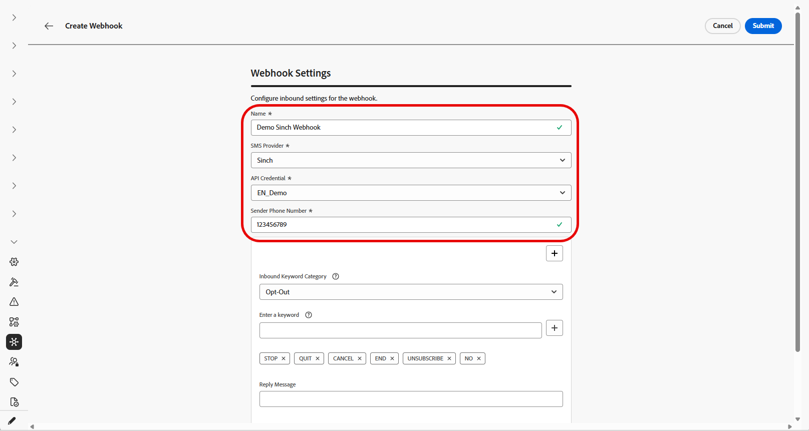
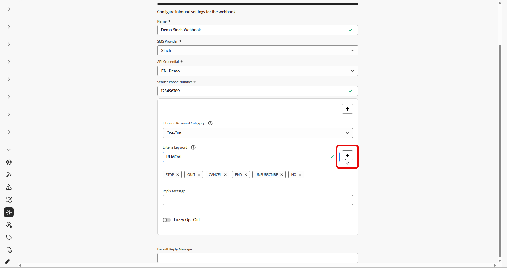

# Crear webhook {#webhook}

>[!CONTEXTUALHELP]
>id="ajo_channels_sms_webhook_settings_create"
>title="Crear un webhook de SMS"
>abstract="Puede configurar Webhooks para que capture las respuestas entrantes para administrar el consentimiento de inclusión y exclusión, y para recibir informes de entrega, incluidas confirmaciones de lectura, cuando estén disponibles."

>[!CONTEXTUALHELP]
>id="ajo_admin_sms_webhook_flow_type"
>title="Elija su tipo de webhook"
>abstract="Al configurar un webhook, elige **Entrante** para capturar las respuestas de consentimiento y las preferencias del usuario, o **[!UICONTROL Comentarios]** para rastrear los eventos de envío y participación para informes y análisis."

>[!BEGINSHADEBOX]

Cuando se crean nuevas credenciales de API en Journey Optimizer, los webhooks de SMS ahora son la forma de capturar palabras clave entrantes y eventos de comentarios como envíos y errores. Dado que cada proveedor tiene diferentes capacidades, hay instrucciones independientes para habilitar los webhooks.
Ahora que los webhooks admiten el proveedor personalizado, es posible recopilar comentarios y recopilar palabras clave entrantes de cualquier proveedor para notificarlos y actuar en consecuencia en Journey Optimizer.

* **Clientes nuevos:** Se pueden seguir las instrucciones aquí para configurar correctamente los enlaces web de SMS.

* **Clientes existentes:** Puede migrar de la información almacenada en las credenciales de la API a los Webhooks y no hay una cronología para que los clientes migren. Para los clientes existentes que sí desean migrar a los webhooks de SMS, los pasos de migración deben realizarse tal como se documenta en la guía de migración.

>[!ENDSHADEBOX]

## Información general {#overview}

Una vez que se hayan creado correctamente las credenciales de la API, ahora puede configurar los webhooks para capturar las respuestas entrantes para administrar el consentimiento de inclusión y de exclusión, y para recibir informes de entrega que incluyan confirmaciones de lectura cuando estén disponibles.

Al configurar un gancho web, puede definir su propósito según el tipo de datos que desee capturar:

* **Entrante**: utilice esta opción si desea capturar las respuestas de consentimiento, como las inclusiones o las exclusiones, y recopilar las preferencias de usuario.

* **Comentarios**: elija esta opción para realizar un seguimiento de los eventos de entrega y participación, incluidos los envíos, los errores salientes y las confirmaciones de lectura (si corresponde) para admitir la creación de informes y el análisis.

Según el proveedor, habrá diferentes expectativas sobre lo que se debe configurar para tener una implementación correcta de SMS:

* **Conversaciones Sinch y Sinch**: cree un gancho web que administre eventos entrantes y de comentarios. No se requiere ninguna configuración de carga útil.

* **Infobip**: crea dos webhooks separados, uno para eventos entrantes y otro para eventos de comentarios. No se requiere ninguna configuración de carga útil para ninguno de los ganchos web.

* **Twilio**: los webhooks no están disponibles. La recopilación de datos de entrada y comentarios no es compatible.

* **Proveedor personalizado**: cree dos webhooks independientes, uno para eventos entrantes y otro para eventos de comentarios. La configuración de carga útil es necesaria para que ambos webhooks funcionen correctamente.

### Asistencia del proveedor {#provider-support}

>[!NOTE]
>
>El único formato de gancho web admitido es JSON. No se admiten datos de formulario para webhooks.

La siguiente tabla muestra qué proveedores admiten webhooks de entrada y comentarios, y si se requiere la creación de la carga útil:

| Proveedor | Webhook entrante | Webhook de comentarios | Palabras clave | Creación de carga útil necesaria | Se necesita webhook | Creación de carga útil |
| --- | --- | --- | --- | --- | --- | --- |
| Infobip | Configurable | Configurable | Configurable | No obligatorio | Requerido | No obligatorio |
| Sinch | Configurable | Configurable | Configurable | No obligatorio | No. Integrado | N/A |
| Sinch Conversational | Configurable | Configurable | Configurable | No obligatorio | No. Integrado | N/A |
| Twilio | No disponible | No disponible | No disponible | No disponible | No disponible | N/A |
| Personalizado | Configurable | Configurable | Configurable | Requerido | Requerido | Requerido |

Para los clientes que pasan de credenciales de API a webhooks de SMS, la información sobre la ruta de migración se encuentra en la guía de migración.

## Crear webhook

### Para Sinch y Sinch Conversational {#create-webhook-sinch}

Para Sinch y Sinch Conversational, cree un único webhook que administre eventos entrantes y de comentarios. No se requiere ninguna configuración de carga útil personalizada.

1. En el carril izquierdo, vaya a **[!UICONTROL Administración]** `>` **[!UICONTROL Canales]**, seleccione el menú **[!UICONTROL Webhooks de SMS]** en **[!UICONTROL Configuración de SMS]** y haga clic en el botón **[!UICONTROL Crear webhook]**.

   

1. Configure las opciones del webhook, como se detalla a continuación:

   * **[!UICONTROL Nombre]**: escribe un nombre para el webhook.

   * **[!UICONTROL Seleccionar proveedor de SMS]**: Sinch o Sinch Conversational.

   * **[!UICONTROL Credenciales de API]**: elija en la lista desplegable sus [credenciales de API configuradas anteriormente](sms-configuration-sinch.md).

   * **[!UICONTROL Número de teléfono del remitente]**: escribe el número de teléfono del remitente que quieras usar para tus comunicaciones.

   

1. Comience a configurar las palabras clave de entrada introduciendo palabras clave en el campo **[!UICONTROL Escribir una palabra clave]**. Se pueden agregar y eliminar varias palabras clave. Tenga en cuenta que las palabras clave no distinguen entre mayúsculas y minúsculas.

   

1. Seleccione una categoría de palabra clave de la lista desplegable **[!UICONTROL Categoría de palabra clave entrante]** para configurarla:

   * 
     +++ Inclusión

      * Habilite palabras clave que incluyan a los usuarios con su consentimiento. Cuando el mensaje de un usuario coincide con una palabra clave configurada, su número de teléfono se incluye para recibir mensajes SMS.

      * De forma predeterminada, están habilitadas las siguientes palabras clave: Subscribe, Yes, Unstop, Continue, Resume y Begin. Elimine cualquier palabra clave predeterminada haciendo clic en .

      * Utilice el campo **[!UICONTROL Mensaje de respuesta]** para crear un mensaje que se enviará automáticamente cuando el mensaje entrante de un usuario coincida con una palabra clave de inclusión.

   +++

   * 
     +++ Opción de exclusión

      * Habilite palabras clave para excluir usuarios y eliminar el consentimiento para enviar mensajes de texto. Cuando el mensaje de un usuario coincide con una palabra clave configurada, su número de teléfono se excluye de la recepción de mensajes SMS.

      * De forma predeterminada, están habilitadas las siguientes palabras clave: Stop, Quit, Cancel, End, Unsubscribe, No. Elimine cualquier palabra clave predeterminada haciendo clic en .

      * Utilice el campo **[!UICONTROL Mensaje de respuesta]** para crear un mensaje que se enviará automáticamente cuando el mensaje entrante de un usuario coincida con una palabra clave de exclusión.

      * Habilite **[!UICONTROL Lógica aproximada]** para detectar palabras clave similares a las palabras clave de exclusión configuradas. Si la respuesta de un usuario es cercana pero no exacta, se enviará el mensaje introducido en el campo **[!UICONTROL Respuesta automática difusa]**. Normalmente, este mensaje indica que no se produjo la exclusión y especifica la palabra clave exacta necesaria para cancelar la suscripción.

   +++

   * 
     +++ Inclusión doble

      * Habilite palabras clave para el requisito de doble inclusión. Cuando el mensaje de un usuario coincide con una palabra clave configurada, no se incluye por completo en este momento. Este flujo de trabajo de consentimiento en dos pasos requiere que los usuarios confirmen su inclusión con una segunda palabra clave.

      * Utilice el campo **[!UICONTROL Mensaje de respuesta]** para crear un mensaje que se enviará automáticamente cuando coincida una palabra clave de inclusión doble. Este mensaje indica al usuario que introduzca una palabra clave de inclusión para completar el proceso de inclusión.

   +++

   * 
     +++ Ayuda

      * Habilite palabras clave que proporcionen una respuesta estándar cuando se solicite ayuda. Cuando el mensaje de un usuario coincide con una palabra clave configurada, recibe el mensaje de respuesta a la Ayuda.

      * De forma predeterminada, están habilitadas las siguientes palabras clave: Ayuda, Información, Información. Elimine cualquier palabra clave predeterminada haciendo clic en .

      * Utilice el campo **[!UICONTROL Mensaje de respuesta]** para crear un mensaje que se enviará automáticamente cuando el mensaje entrante de un usuario coincida con una palabra clave de la Ayuda.

   +++

   * 
     +++ Personalizado

      * Configure una sola palabra clave personalizada. Cuando el mensaje de un usuario coincide con esta palabra clave, esta se escribe en el conjunto de datos **[!UICONTROL Seguimiento de comentarios de mensajes]** para la generación de informes y audiencias.

      * Cree una audiencia (de flujo continuo o por lotes) que haga referencia a esta palabra clave para usarla en sus recorridos y campañas.

   +++

1. Escriba un **[!UICONTROL mensaje de respuesta predeterminado]**. Este mensaje se envía automáticamente cuando la respuesta de un usuario no coincide con ninguna palabra clave configurada.

   

1. Haga clic en **[!UICONTROL Enviar]** para guardar la configuración del gancho web.

1. Desde el menú **[!UICONTROL Webhooks]**, puedes editar o eliminar los webhooks existentes.

1. Acceda a su webhook recién creado y copie la **[!UICONTROL URL de webhook]**.

   

1. Use su **[!UICONTROL URL de enlace web]** para permitir que los eventos **Feedback** y **Inbound** entren en Journey Optimizer.

   * Para el canal SMS, [obtenga más información en la documentación de Sinch](https://community.sinch.com/t5/SMS/How-do-I-assign-a-callback-URL-to-an-SMS-service/ta-p/8414)

   * Para el canal MMS, [obtenga más información en la documentación de Sinch](https://developers.sinch.com/docs/conversation/getting-started#5-handle-incoming-messages)

   * Para los clientes que compraron SMS directamente a través de Journey Optimizer, presente un ticket de asistencia con el servicio de asistencia de Adobe. El equipo de cuenta de Adobe configurará la dirección URL del gancho web por usted.
     

Si su webhook utiliza credenciales de API adjuntas a una configuración de canal existente, el webhook surtirá efecto inmediatamente. De lo contrario, cree una nueva configuración de canal.

➡️[Más información sobre la configuración del canal](sms-configuration-surface.md)

### Para Infobip {#create-webhook-infobip}

Para Infobip, cree dos webhooks independientes: uno para los eventos de comentarios y otro para los eventos de entrada.

1. En el carril izquierdo, vaya a **[!UICONTROL Administración]** `>` **[!UICONTROL Canales]**, seleccione el menú **[!UICONTROL Webhooks de SMS]** en **[!UICONTROL Configuración de SMS]** y haga clic en el botón **[!UICONTROL Crear webhook]**.

   

1. Configure las opciones del webhook, como se detalla a continuación:

   * **[!UICONTROL Nombre]**: escribe un nombre para el webhook.

   * **[!UICONTROL Seleccionar proveedor de SMS]**: Infobip.

   * **[!UICONTROL Tipo]**: elija Comentarios o Entrante. Debe crear ambas por separado. Aquí, empezamos con Entrante.

   * **[!UICONTROL Credenciales de API]**: elija en la lista desplegable sus [credenciales de API configuradas anteriormente](sms-configuration-infobip.md#api-credential).

   * **[!UICONTROL Número de teléfono del remitente]**: escribe el número de teléfono del remitente que quieras usar para tus comunicaciones.

   

1. Comience a configurar las palabras clave de entrada introduciendo palabras clave en el campo **[!UICONTROL Escribir una palabra clave]**. Se pueden agregar y eliminar varias palabras clave. Tenga en cuenta que las palabras clave no distinguen entre mayúsculas y minúsculas.

   

1. Seleccione una categoría de palabra clave de la lista desplegable **[!UICONTROL Categoría de palabra clave entrante]** para configurarla:

   * 
     +++ Inclusión

      * Habilite palabras clave que incluyan a los usuarios con su consentimiento. Cuando el mensaje de un usuario coincide con una palabra clave configurada, su número de teléfono se incluye para recibir mensajes SMS.

      * De forma predeterminada, están habilitadas las siguientes palabras clave: Subscribe, Yes, Unstop, Continue, Resume y Begin. Elimine cualquier palabra clave predeterminada haciendo clic en .

      * Utilice el campo **[!UICONTROL Mensaje de respuesta]** para crear un mensaje que se enviará automáticamente cuando el mensaje entrante de un usuario coincida con una palabra clave de inclusión.

   +++

   * 
     +++ Opción de exclusión

      * Habilite palabras clave para excluir usuarios y eliminar el consentimiento para enviar mensajes de texto. Cuando el mensaje de un usuario coincide con una palabra clave configurada, su número de teléfono se excluye de la recepción de mensajes SMS.

      * De forma predeterminada, están habilitadas las siguientes palabras clave: Stop, Quit, Cancel, End, Unsubscribe, No. Elimine cualquier palabra clave predeterminada haciendo clic en .

      * Utilice el campo **[!UICONTROL Mensaje de respuesta]** para crear un mensaje que se enviará automáticamente cuando el mensaje entrante de un usuario coincida con una palabra clave de exclusión.

      * Habilite **[!UICONTROL Lógica aproximada]** para detectar palabras clave similares a las palabras clave de exclusión configuradas. Si la respuesta de un usuario es cercana pero no exacta, se enviará el mensaje introducido en el campo **[!UICONTROL Respuesta automática difusa]**. Normalmente, este mensaje indica que no se produjo la exclusión y especifica la palabra clave exacta necesaria para cancelar la suscripción.

   +++

   * 
     +++ Inclusión doble

      * Habilite palabras clave para el requisito de doble inclusión. Cuando el mensaje de un usuario coincide con una palabra clave configurada, no se incluye por completo en este momento. Este flujo de trabajo de consentimiento en dos pasos requiere que los usuarios confirmen su inclusión con una segunda palabra clave.

      * Utilice el campo **[!UICONTROL Mensaje de respuesta]** para crear un mensaje que se enviará automáticamente cuando coincida una palabra clave de inclusión doble. Este mensaje indica al usuario que introduzca una palabra clave de inclusión para completar el proceso de inclusión.

   +++

   * 
     +++ Ayuda

      * Habilite palabras clave que proporcionen una respuesta estándar cuando se solicite ayuda. Cuando el mensaje de un usuario coincide con una palabra clave configurada, recibe el mensaje de respuesta a la Ayuda.

      * De forma predeterminada, están habilitadas las siguientes palabras clave: Ayuda, Información, Información. Elimine cualquier palabra clave predeterminada haciendo clic en .

      * Utilice el campo **[!UICONTROL Mensaje de respuesta]** para crear un mensaje que se enviará automáticamente cuando el mensaje entrante de un usuario coincida con una palabra clave de la Ayuda.

   +++

   * 
     +++ Personalizado

      * Configure una sola palabra clave personalizada. Cuando el mensaje de un usuario coincide con esta palabra clave, esta se escribe en el conjunto de datos **[!UICONTROL Seguimiento de comentarios de mensajes]** para la generación de informes y audiencias.

      * Cree una audiencia (de flujo continuo o por lotes) que haga referencia a esta palabra clave para usarla en sus recorridos y campañas.

   +++

1. Escriba un **[!UICONTROL mensaje de respuesta predeterminado]**. Este mensaje se envía automáticamente cuando la respuesta de un usuario no coincide con ninguna palabra clave configurada.

   

1. Haga clic en **[!UICONTROL Enviar]** para guardar la configuración del gancho web.

1. En el menú de **[!UICONTROL Webhooks]**, ahora necesitas crear un webhook de **Comentarios** para Infobip.

1. Configure las opciones del webhook, como se detalla a continuación:

   * **[!UICONTROL Nombre]**: escribe un nombre para el webhook.

   * **[!UICONTROL Seleccionar proveedor de SMS]**: Infobip.

   * **[!UICONTROL Tipo]**: elige un comentario.

   

1. Haga clic en **[!UICONTROL Enviar]** para guardar la configuración del webhook de comentarios.

1. Desde el menú **[!UICONTROL Webhooks]**, puedes editar o eliminar los webhooks existentes.

1. Acceda a sus Webhooks recién creados y copie la **[!UICONTROL URL de Webhook]** de cada uno de sus Webhooks.

   

1. Ahora puede utilizar esas direcciones URL para permitir que las direcciones URL de devolución de llamada traigan comentarios y eventos entrantes a Journey Optimizer.

Si su webhook utiliza credenciales de API adjuntas a una configuración de canal existente, el webhook surtirá efecto inmediatamente. De lo contrario, cree una nueva configuración de canal.

➡️[Más información sobre la configuración del canal](sms-configuration-surface.md)

### Para el proveedor personalizado {#create-webhook-custom}

Para los proveedores de SMS personalizados, cree dos webhooks independientes: uno para los eventos de comentarios y otro para los eventos entrantes.

1. En el carril izquierdo, vaya a **[!UICONTROL Administración]** `>` **[!UICONTROL Canales]**, seleccione el menú **[!UICONTROL Webhooks de SMS]** en **[!UICONTROL Configuración de SMS]** y haga clic en el botón **[!UICONTROL Crear webhook]**.

   

1. Configure las opciones del webhook, como se detalla a continuación:

   * **[!UICONTROL Nombre]**: escribe un nombre para el webhook.

   * **[!UICONTROL Seleccionar proveedor de SMS]**: personalizado.

   * **[!UICONTROL Tipo]**: elija Comentarios o Entrante. Debe crear ambas por separado. Aquí, empezamos con Entrante.

   * **[!UICONTROL Credenciales de API]**: elija en la lista desplegable sus [credenciales de API configuradas anteriormente](sms-configuration-custom.md).

   * **[!UICONTROL Número de teléfono del remitente]**: escribe el número de teléfono del remitente que quieras usar para tus comunicaciones.

   

1. Comience a configurar las palabras clave de entrada introduciendo palabras clave en el campo **[!UICONTROL Escribir una palabra clave]**. Se pueden agregar y eliminar varias palabras clave. Tenga en cuenta que las palabras clave no distinguen entre mayúsculas y minúsculas.

   

1. Seleccione una categoría de palabra clave de la lista desplegable **[!UICONTROL Categoría de palabra clave entrante]** para configurarla:

   * 
     +++ Inclusión

      * Habilite palabras clave que incluyan a los usuarios con su consentimiento. Cuando el mensaje de un usuario coincide con una palabra clave configurada, su número de teléfono se incluye para recibir mensajes SMS.

      * De forma predeterminada, están habilitadas las siguientes palabras clave: Subscribe, Yes, Unstop, Continue, Resume y Begin. Elimine cualquier palabra clave predeterminada haciendo clic en .

      * Utilice el campo **[!UICONTROL Mensaje de respuesta]** para crear un mensaje que se enviará automáticamente cuando el mensaje entrante de un usuario coincida con una palabra clave de inclusión.

   +++

   * 
     +++ Opción de exclusión

      * Habilite palabras clave para excluir usuarios y eliminar el consentimiento para enviar mensajes de texto. Cuando el mensaje de un usuario coincide con una palabra clave configurada, su número de teléfono se excluye de la recepción de mensajes SMS.

      * De forma predeterminada, están habilitadas las siguientes palabras clave: Stop, Quit, Cancel, End, Unsubscribe, No. Elimine cualquier palabra clave predeterminada haciendo clic en .

      * Utilice el campo **[!UICONTROL Mensaje de respuesta]** para crear un mensaje que se enviará automáticamente cuando el mensaje entrante de un usuario coincida con una palabra clave de exclusión.

      * Habilite **[!UICONTROL Lógica aproximada]** para detectar palabras clave similares a las palabras clave de exclusión configuradas. Si la respuesta de un usuario es cercana pero no exacta, se enviará el mensaje introducido en el campo **[!UICONTROL Respuesta automática difusa]**. Normalmente, este mensaje indica que no se produjo la exclusión y especifica la palabra clave exacta necesaria para cancelar la suscripción.

   +++

   * 
     +++ Inclusión doble

      * Habilite palabras clave para el requisito de doble inclusión. Cuando el mensaje de un usuario coincide con una palabra clave configurada, no se incluye por completo en este momento. Este flujo de trabajo de consentimiento en dos pasos requiere que los usuarios confirmen su inclusión con una segunda palabra clave.

      * Utilice el campo **[!UICONTROL Mensaje de respuesta]** para crear un mensaje que se enviará automáticamente cuando coincida una palabra clave de inclusión doble. Este mensaje indica al usuario que introduzca una palabra clave de inclusión para completar el proceso de inclusión.

   +++

   * 
     +++ Ayuda

      * Habilite palabras clave que proporcionen una respuesta estándar cuando se solicite ayuda. Cuando el mensaje de un usuario coincide con una palabra clave configurada, recibe el mensaje de respuesta a la Ayuda.

      * De forma predeterminada, están habilitadas las siguientes palabras clave: Ayuda, Información, Información. Elimine cualquier palabra clave predeterminada haciendo clic en .

      * Utilice el campo **[!UICONTROL Mensaje de respuesta]** para crear un mensaje que se enviará automáticamente cuando el mensaje entrante de un usuario coincida con una palabra clave de la Ayuda.

   +++

   * 
     +++ Personalizado

      * Configure una sola palabra clave personalizada. Cuando el mensaje de un usuario coincide con esta palabra clave, esta se escribe en el conjunto de datos **[!UICONTROL Seguimiento de comentarios de mensajes]** para la generación de informes y audiencias.

      * Cree una audiencia (de flujo continuo o por lotes) que haga referencia a esta palabra clave para usarla en sus recorridos y campañas.

   +++

1. Escriba un **[!UICONTROL mensaje de respuesta predeterminado]**. Este mensaje se envía automáticamente cuando la respuesta de un usuario no coincide con ninguna palabra clave configurada.

   

1. Cree una carga útil personalizada que coincida con el JSON proveniente del proveedor. Tenga en cuenta que el único formato de gancho web admitido es JSON. No se admiten datos de formulario para webhooks.

   El webhook entrante requiere que los siguientes campos reciban los valores del webhook del proveedor:

   * **InboundMessage**: El mensaje o palabra clave entrante recibido del usuario.
   * **ProfileNumber**: número de teléfono del usuario que envió el mensaje.
   * **RequestID**: Identificador único proporcionado por su proveedor de SMS para identificar una transacción específica.
   * **OriginTimestamp**: La marca de tiempo cuando se recibió el mensaje, en formato UTC.
   * **InboundNumber**: El número de teléfono usado para esta configuración de webhook.

   +++Ejemplo de carga útil

       &quot;json
       {
       &quot;inboundMessage&quot;: &quot;{{inboundMessage}}&quot;,
       &quot;profileNumber&quot;: &quot;{{profileNumber}}&quot;,
       &quot;requestId&quot;: &quot;{{requestId}}&quot;,
       &quot;originTimestamp&quot;: &quot;{{originTimestamp}}&quot;,
       &quot;inboundNumber&quot;: &quot;{{inboundNumber}}&quot;
       
       &quot;
   +++

1. Cuando se cree el archivo JSON, haga clic en **[!UICONTROL Ver editor de carga útil]**, luego copie y pegue la carga útil JSON en el editor y guárdela.

   

1. Haga clic en **[!UICONTROL Enviar]** para guardar la configuración del gancho web.

1. En el menú de **[!UICONTROL Webhooks]**, ahora necesitas crear un webhook de **Comentarios** para el proveedor personalizado.

1. Configure las opciones del webhook, como se detalla a continuación:

   * **[!UICONTROL Nombre]**: escribe un nombre para el webhook.

   * **[!UICONTROL Seleccionar proveedor de SMS]**: personalizado.

   * **[!UICONTROL Tipo]**: elige un comentario.

   

1. Cree una carga útil personalizada que coincida con el formato JSON de su proveedor. Tenga en cuenta que el único formato de gancho web admitido es JSON. No se admiten datos de formulario para webhooks.

   El webhook de comentarios requiere que los siguientes campos reciban valores del webhook de su proveedor:

   * **Referencia de cliente**: Identificador único devuelto en la carga con fines de registro.
   * **Código**: El código de error proporcionado por su proveedor de SMS.
   * **Estado**: El estado de error proporcionado por su proveedor de SMS.

   +++Ejemplo de carga útil

       &quot;json
       {
       &quot;clientReference&quot;: &quot;{{client_reference}}&quot;,
       &quot;estados&quot;: [
       {
       &quot;código&quot;: &quot;{{failureCode}}&quot;,
       &quot;estado&quot;: &quot;{{feedbackStatus}}&quot;
       
       ]
       
       &quot;
   
   +++

1. Haga clic en **[!UICONTROL Ver editor de carga útil]**, luego copie y pegue su carga útil JSON en el editor y guárdela.

   

1. Haga clic en **[!UICONTROL Enviar]** para guardar la configuración del webhook de comentarios.

1. Desde el menú **[!UICONTROL Webhooks]**, puedes editar o eliminar los webhooks existentes.

1. Acceda a sus Webhooks recién creados y copie la **[!UICONTROL URL de Webhook]** de cada uno de sus Webhooks.

1. Configure su proveedor de SMS para enviar **comentarios** y **eventos entrantes** a estas URL de ganchos web en Journey Optimizer.

   Las instrucciones de configuración varían según el proveedor de SMS. Consulte la documentación de su proveedor para obtener más información sobre la configuración de las URL de devolución de llamada.

Si su webhook utiliza credenciales de API adjuntas a una configuración de canal existente, el webhook surtirá efecto inmediatamente. De lo contrario, cree una nueva configuración de canal.

➡️[Más información sobre la configuración del canal](sms-configuration-surface.md)
