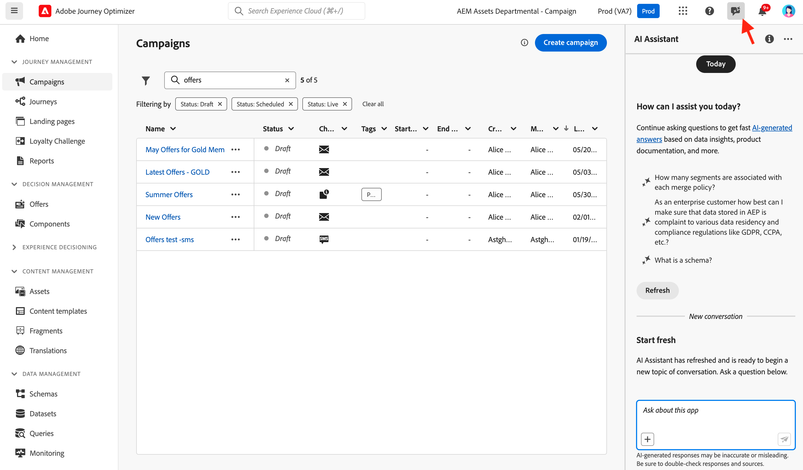

# IA y funciones inteligentes {#ai-features}

Adobe Journey Optimizer aprovecha el poder de la inteligencia artificial y el aprendizaje automático para ayudarle a crear, optimizar y ofrecer experiencias de cliente excepcionales. Desde la generación de contenido personalizado hasta la predicción de tiempos de envío óptimos, las capacidades de IA optimizan el flujo de trabajo y maximizan el impacto. Los manuales de casos de uso proporcionan plantillas creadas previamente para implementar rápidamente escenarios de marketing comunes.

## Asistente de IA {#ai-assistant}

El asistente de IA es su guía conversacional de Adobe Journey Optimizer. Utilícelo para obtener respuestas instantáneas sobre las funciones del producto, información operativa sobre sus recorridos y ayuda para navegar por la plataforma.

### Acceso al Asistente de IA

Haga clic en el icono Ayudante de IA en la barra superior para abrir el panel del asistente en el lado derecho de la pantalla.

>[!IMPORTANT]
>
>Debe aceptar las [Directrices del usuario de IA generativa de Adobe Experience Cloud](https://experienceleague.adobe.com/es/docs/experience-platform/ai-assistant/home){target="_blank"} antes de usar el Asistente de IA.

### Qué puede hacer el asistente de IA

**Conocimiento del producto**: haga preguntas sobre las características y conceptos de Adobe Journey Optimizer:

* &quot;¿Cómo configuro una campaña en Adobe Journey Optimizer?&quot;
* &quot;¿Cómo se crea una acción personalizada para usarla en los recorridos?&quot;
* &quot;¿Cuántas actividades en directo puedo tener en una zona protegida?&quot;

**Operational Insights (Beta)** - Obtenga información en tiempo real sobre sus recorridos:

* &quot;¿Cuántos recorridos de vida tengo?&quot;
* &quot;Dame una lista de todos los recorridos programados&quot;
* &quot;¿Cuántos recorridos se han creado en los últimos siete días?&quot;

>[!NOTE]
>
>Actualmente, las perspectivas operativas solo están disponibles para **Recorridos** y reflejan los datos de su zona protegida actual.

### Cómo utilizar el asistente de IA

1. Escriba su pregunta en el campo de texto de la parte inferior del panel
2. Pulse Intro para enviar la consulta
3. Revise la respuesta generada por IA
4. Haga clic en **Mostrar orígenes** para obtener acceso a la documentación relacionada
5. Utilice los pulgares hacia arriba/hacia abajo para valorar la calidad de la respuesta

{width="40%" align="left"}

[Más información sobre el Asistente de IA en Experience Platform](https://experienceleague.adobe.com/es/docs/experience-platform/ai-assistant/home){target="_blank"}

## Agentes de IA avanzados para la optimización del Recorrido {#ai-agents}

Basándose en las capacidades conversacionales de AI Assistant, Adobe Journey Optimizer ofrece agentes de IA especializados que proporcionan análisis profundos y recomendaciones procesables para la optimización y experimentación de recorridos.

### Journey Agent {#journey-agent}

Journey Agent incluye dos habilidades en el asistente de IA: Analizar y Crear. Utilícelos para optimizar los recorridos existentes o crear otros nuevos a partir de las indicaciones del lenguaje natural.

+++**Se requieren permisos**

* **Ver Recorridos**: vea información sobre recorridos directamente en el Asistente de IA
* **Administrar Recorridos** - Crear nuevos recorridos directamente en el Asistente de IA
* **Ver segmentos**: vea información sobre audiencias y busque audiencias existentes
* **Administrar segmentos** - Crear nuevas audiencias directamente en el Asistente de IA
* **Ver eventos, fuentes de datos y acciones de Recorrido** - Necesario para que la habilidad Crear busque eventos de recorrido y acciones personalizadas

+++

#### Recorrido Analizar aptitud {#journey-analyze-skill}

[Agente de análisis de Recorrido](https://experienceleague.adobe.com/es/docs/experience-cloud-ai/experience-cloud-ai/agents/ajo-agent-analyze){target="_blank"} le ayuda a optimizar el rendimiento del recorrido mediante el análisis de lenguaje natural:

+++**Capacidades clave**

* **Análisis de visitas en el orden previsto del Recorrido**: identifique dónde y por qué los clientes abandonan durante los recorridos y detecte patrones de desconexión
* **Detección de superposición de audiencias**: analice la superposición de audiencias en varios recorridos para evitar que la fatiga sobrepase la segmentación
* **Detección de conflictos de programación**: identifique los conflictos de tiempo entre recorridos programados dirigidos a la misma audiencia
* **Perspectivas operativas**: obtenga perspectivas basadas en mensajes de solicitud como &quot;muéstreme todos los recorridos en directo&quot; o &quot;qué audiencias se utilizan en más de X recorridos&quot;

+++

+++**Indicadores de ejemplo**

* &quot;Realizar un análisis de abandonos para el recorrido \[Nombre del Recorrido\]&quot;
* &quot;¿Hay algún conflicto de programación para el recorrido \[Nombre del Recorrido\]?&quot;
* &quot;Mostrar conflictos de superposición de audiencias para el recorrido \[Nombre del Recorrido\]&quot;
* &quot;¿Qué audiencias se utilizan en más de 5 recorridos?&quot;

+++

+++

#### Recorrido Crear aptitud {#journey-create-skill}

El [Agente de creación de Recorrido](https://experienceleague.adobe.com/en/docs/experience-cloud-ai/experience-cloud-ai/agents/ajo-agent-create){target="_blank"} le ayuda a generar recorridos a partir de mensajes en lenguaje natural, lo que traduce sus objetivos en configuraciones de recorrido estructuradas:

+++**Capacidades clave**

* **Creación de Recorrido en lenguaje natural** - Describa su recorrido deseado y haga que se cree automáticamente
* **Inicios basados en eventos y audiencias**: cree recorridos de calificación de audiencia, eventos empresariales o activados por eventos
* **Lógica condicional** - Generar rutas divididas basadas en atributos o comportamiento del cliente
* **Mensajería multicanal** - Agregar acciones de correo electrónico, push y SMS
* **Programación** - Configure las fechas de inicio y el tiempo entre pasos

+++

+++**Indicadores de ejemplo**

* &quot;Cree un recorrido que se inicie cuando un cliente realice una compra en línea y envíe una notificación push de agradecimiento&quot;.
* &quot;Construye un recorrido dirigido a mi audiencia de excursionistas con tres correos electrónicos en dos semanas, a partir del 20/12&quot;.
* &quot;Cree un recorrido que se inicie cuando un usuario entre en mi ubicación de tienda y realice un seguimiento en función de si tiene una dirección de correo electrónico válida&quot;.

+++

### Experimentation Agent {#experimentation-agent}

[Experimentation Agent](https://experienceleague.adobe.com/es/docs/experience-cloud-ai/experience-cloud-ai/agents/agent-experiment){target="_blank"} moderniza la forma en que ejecutas y administras experimentos digitales en sitios web, correos electrónicos, mensajes push y aplicaciones:

+++**Capacidades clave**

* **Análisis de rendimiento** - Vista clara de lo que ocurrió en los experimentos
* **Generación de perspectivas** - Explicación de por qué se produjeron los resultados
* **Descubrimiento de oportunidades**: instrucciones sobre las siguientes acciones que se deben realizar
* **Análisis de contenido**: examine los elementos de mensajería para comprender por qué ciertos tratamientos superaron a otros
* **Generación de recomendaciones** - Sugerir nuevos tratamientos o ajustes basados en datos

+++

+++**Indicadores de ejemplo**

* &quot;¿Qué experimentos se están ejecutando para \[Campaign Name\]?&quot;
* &quot;Para mi \[Nombre del experimento\], ¿qué tratamiento conlleva?&quot;
* &quot;¿Qué aprendimos de \[Nombre del experimento\]?&quot;
* &quot;¿Qué recomiendan que haga después de este experimento?&quot;
* &quot;¿Qué patrones comunes están surgiendo de las pruebas recientes?&quot;

+++

+++**Se requieren permisos**

* **Ver experimentos**: vea información sobre experimentos en el asistente de IA
* **Administrar metadatos de experimento** - Crear nuevos experimentos en el asistente de IA

**Nota:** Disponible con licencia de Journey Optimizer Experimentation Accelerator.

+++

### Agentes de IA adicionales

**Audience Agent**: para la exploración y administración de audiencias conversacionales en Adobe Experience Platform, incluida la detección de duplicados y el seguimiento de tamaño. [Más información sobre Audience Agent](https://experienceleague.adobe.com/es/docs/experience-cloud-ai/experience-cloud-ai/agents/audience){target="_blank"}

**Agent Orchestrator**: coordina varios agentes especializados para resolver desafíos de marketing complejos en varios pasos. El orquestador determina automáticamente qué agentes implicar y secuenciar su trabajo de forma eficaz. [Más información sobre Agent Orchestrator](https://experienceleague.adobe.com/es/docs/experience-cloud-ai/experience-cloud-ai/agents/agent-orchestrator){target="_blank"}

## Generación de contenido con tecnología de IA {#content-generation}

Utilice IA generativa para crear y personalizar el contenido en varios canales, lo que acelera el proceso de creación de contenido y mantiene la coherencia de la marca. El asistente de IA para la generación de contenido está disponible para las experiencias [correo electrónico](../email/get-started-email.md), [notificaciones push](../push/get-started-push.md), [SMS](../sms/get-started-sms.md) y [web](../web/get-started-web.md), lo que le ayuda a generar líneas de asunto, texto independiente, imágenes y variaciones completas de mensajes.

### Características principales

* **Generación de texto**: crea una copia atractiva basada en la voz y los objetivos de tu marca. [Generar texto con IA](../content-management/generative-text.md)
* **Generación de imágenes** - Generar imágenes personalizadas mediante Adobe Firefly. [Generar imágenes con IA](../content-management/generative-image.md)
* **Variaciones de contenido**: produzca varias variaciones para las pruebas A/B. [Experimento de contenido con IA](../content-management/generative-experimentation.md)
* **Alineación de marca**: asegúrese de que el contenido generado coincida con las directrices de marca. [Evaluar alineación de marca](../content-management/brands-score.md)
* **Compatibilidad con plantillas** - Aproveche las plantillas de correo electrónico existentes. [Trabajo con plantillas de contenido](../content-management/content-templates.md)

### Prácticas recomendadas

* **Sea específico**: proporcione indicaciones claras y detalladas para obtener mejores resultados
* **Cargar recursos de marca**: use archivos PDF, imágenes o ZIP (máximo de 50 MB) para mantener la coherencia de la marca.
* **Usar plantillas personalizadas**: aprovecha las plantillas específicas de la marca con hasta 8-10 imágenes
* **Proporcionar comentarios**: puntúe las salidas para ayudar a mejorar los modelos de IA
* **Revisar todo el contenido**: revise siempre el contenido generado por IA para comprobar su precisión antes de publicarlo

[Más información sobre la generación de contenido de IA](../content-management/gs-generative.md)

## Optimización del tiempo de envío {#send-time-optimization}

Utilice la IA para predecir el momento óptimo para enviar cada mensaje en función de los patrones de comportamiento de los clientes individuales, lo que maximiza la participación.

### Cómo funciona

La optimización del tiempo de envío analiza los datos de participación históricos (aperturas y clics) para predecir cuándo es más probable que cada cliente interactúe con sus mensajes. El sistema programa automáticamente la entrega en el plazo especificado.

### Cuándo se debe utilizar

| Mejor para | No Recomendado Para |
|----------|---------------------|
| Campañas de marketing y boletines | Mensajes operativos con distinción de tiempo (confirmaciones de pedidos, restablecimientos de contraseñas) |
| Mensajes promocionales | Notificaciones urgentes (retrasos de vuelos, alertas de emergencia) |
| Contenido educativo | Mensajes basados en eventos con requisitos de tiempo específicos |
| Campañas de participación | |

[Más información sobre Optimización del tiempo de envío](../building-journeys/send-time-optimization.md)

## Modelos de IA para toma de decisiones {#ai-decisioning}

Cree modelos de clasificación inteligentes que optimicen automáticamente qué ofertas mostrar a cada cliente, maximizando los objetivos comerciales.

### Tipos de modelo

**Optimización automática**: aprende de las interacciones de los clientes para mejorar automáticamente el rendimiento de las ofertas con el tiempo

**Optimización personalizada**: utiliza atributos y comportamiento de perfil del cliente para predecir la mejor oferta para cada individuo

### Requisitos

* Al menos 2 ofertas con datos de interacción suficientes:
   * Más de 100 eventos de visualización
   * Más de 5 eventos de clic
   * En los últimos 14 días
* Máximo de 5 modelos de clasificación de IA por organización

[Más información sobre los modelos de IA para la toma de decisiones](../experience-decisioning/ranking/ai-models.md) | [Crear modelos de clasificación de IA](../experience-decisioning/ranking/create-ai-models.md)

## Experimento de contenido con IA {#experimentation}

**Acelerador de experimentos** te ayuda a ejecutar experimentos más rápido con perspectivas y recomendaciones impulsadas por IA, identificando las variaciones de contenido ganadoras más rápidamente.

Funcionalidades clave:

* Generar varias variaciones de contenido automáticamente
* Recibir recomendaciones de IA para el diseño de experimentos
* Obtenga indicadores tempranos de las tendencias de rendimiento
* Acelerar el tiempo hasta alcanzar la relevancia estadística

[Más información sobre el Acelerador de experimentos](../content-management/experiment-accelerator-gs.md)

## Manuales de tácticas de casos de uso {#playbooks}

Los manuales de casos de uso son flujos de trabajo creados previamente que le ayudan a implementar situaciones de marketing comunes de forma rápida. Cada manual incluye recorridos, mensajes, esquemas y segmentos listos para usar.

### Cómo funcionan los libros de reproducción

1. **Examine** la biblioteca de libros de reproducción para encontrar casos de uso que coincidan con sus metas
2. **Habilite** un manual para generar automáticamente todos los recursos necesarios
3. **Personalice** los recursos generados para que coincidan con su marca y sus requisitos
4. **Implementar** en producción o prueba en una zona protegida de desarrollo

### Libros de reproducción disponibles

Examine los libros de reproducción de Journey Optimizer para conocer escenarios comunes como:

* Recuperación del carro abandonado
* Serie de bienvenida para nuevos clientes
* Participación posterior a la compra
* Mensajes de cumpleaños
* Campañas de renovación de participación

+++**Requisitos previos**

* Zona protegida con los permisos adecuados
* Configuraciones de canal para correo electrónico, push o SMS
* Permisos de usuario para crear recorridos y mensajes

+++

[Ver todos los libros de reproducción disponibles](https://experienceleague.adobe.com/docs/experience-platform/use-case-playbooks/playbooks/playbooks-list.html?lang=es){target="_blank"} | [Obtenga más información en la documentación de Experience Platform](https://experienceleague.adobe.com/docs/experience-platform/use-case-playbooks/playbooks/overview.html){target="_blank"}

## Capacidades adicionales de IA {#additional-capabilities}

### Conversor de imagen a HTML

Transforme diseños de imagen estáticos (JPEG, PNG) en plantillas de correo electrónico editables de HTML mediante la tecnología de conversión con tecnología de IA.

[Más información sobre la Imagen en HTML](../email/image-to-html.md)

### Puntuación de la alineación de marca

Evalúe la alineación del contenido con las directrices de su marca mediante puntuación con tecnología de IA que mide el tono, la voz y la coherencia de la mensajería.

[Más información sobre la Alineación de marca](../content-management/brands-score.md)

## Preguntas frecuentes {#faq}

+++**¿Qué permisos necesito para las características de IA?**

* **[Asistente de IA para la generación de contenido](#content-generation)** - Requiere el permiso &quot;Generar contenido&quot;
* Conocimiento del producto **[Ayudante de IA](#ai-assistant)** - Requiere acuerdo con las Directrices del usuario de IA generativa de Adobe
* **[Agente de análisis de Recorrido](#journey-agent)**: requiere permisos de Ver/Administrar Recorridos y Ver/Administrar segmentos
* **[Agente de creación de Recorrido](#journey-create-agent)**: requiere permisos de administración de Recorridos, visualización de eventos de Recorrido/fuentes de datos/acciones, visualización de segmentos y administración de segmentos
* **[Experimentation Agent](#experimentation-agent)**: requiere permisos para Ver experimentos y Administrar metadatos de experimento

Todos los agentes de IA requieren acceso al asistente de IA y acuerdo con las directrices del usuario de IA generativa de Adobe Experience Cloud.

[Obtenga más información sobre permisos](../administration/ootb-permissions.md)

+++

+++**¿El contenido generado por IA siempre es preciso?**

No. Revise siempre [el contenido generado por IA](#content-generation) para comprobar la precisión y la idoneidad de la marca. Utilice las herramientas de comentarios (miniaturas arriba/abajo) para ayudar a mejorar los modelos.

+++

+++**¿Cuáles son las limitaciones principales?**

* **[Optimización del tiempo de envío](#send-time-optimization)**: solo disponible para recorridos de correo electrónico y de inserción; requiere un período de formación de 30 días
* **[Generación de contenido de IA](#content-generation)** - No disponible para correo directo, tarjetas de contenido, LINE o WhatsApp
* **[Modelos de clasificación de IA](#ai-decisioning)**: máximo de 5 modelos por organización; requiere datos mínimos de interacción

+++

+++**¿Cómo obtengo acceso a estas características?**

La mayoría de las funciones de IA se incluyen con Adobe Journey Optimizer. Algunas funcionalidades como [Optimización del tiempo de envío](#send-time-optimization) o [Agentes de IA](#ai-agents) pueden requerir la habilitación por parte de Adobe. Póngase en contacto con su representante de Adobe para obtener más información sobre su licencia específica y las funciones disponibles.

+++
