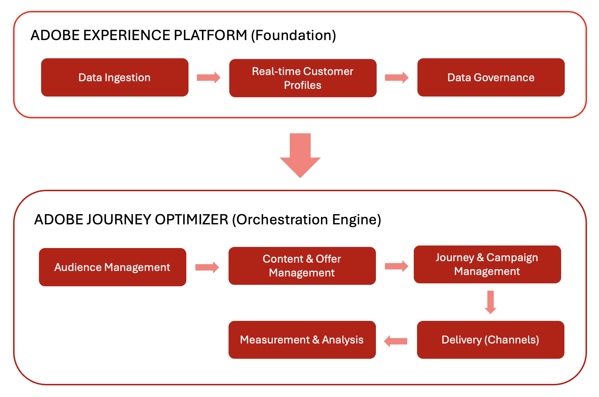

# Arquitectura

## El panorama general: Cómo encaja Adobe Journey Optimizer

Adobe Journey Optimizer (AJO) y Adobe Experience Platform (AEP) trabajan juntos para permitir la personalización basada en datos a escala. Este ecosistema funciona como un flujo continuo en el que se recopilan, analizan y aplican datos para crear recorridos personalizados con los clientes.

### Foundation: Adobe Experience Platform (AEP)

Adobe Experience Platform sirve como columna vertebral, permitiendo a las marcas centralizar los datos de los clientes y activarlos para experiencias personalizadas.

- **Plataforma de datos**: AEP funciona como el concentrador central para recopilar, administrar y estructurar datos de clientes con el fin de garantizar la coherencia en todos los sistemas.
- **Ingesta de datos (fuentes)**: Las marcas importan datos de varios sistemas, como plataformas CRM, sitios web, aplicaciones móviles y almacenamiento en la nube, usando conectores generados previamente. Por ejemplo, un conector de Source ingiere datos de compra de una plataforma de comercio electrónico.
- **Perfil del cliente en tiempo real**: Esta característica crea perfiles unificados mediante la combinación de datos de varias fuentes. Por ejemplo, un perfil combina interacciones por correo electrónico y compras en tienda para proporcionar una vista completa de un cliente.
- **Nivel de control**: Este nivel controla el acceso a los datos, el cumplimiento de la privacidad y la seguridad. Garantiza que las marcas utilicen los datos de los clientes de forma segura y cumplan con las regulaciones.

### Motor de orquestaciones: Adobe Journey Optimizer (AJO)

Adobe Journey Optimizer aplica los datos y las perspectivas de AEP para ofrecer experiencias de cliente inteligentes y personalizadas en varios canales.

- **Comprensión del cliente**: Los perfiles del cliente en tiempo real habilitan la segmentación en Audiencias para la mensajería de destino. Por ejemplo, una audiencia incluye compradores frecuentes identificados a través del historial de compras.
- **Contenido y ofertas**:
   - **Administración de contenido**: Esta característica proporciona herramientas para crear, administrar y personalizar contenido en varios canales. Por ejemplo, puede crear un fragmento de contenido reutilizable para un encabezado de correo electrónico promocional.
   - **Administración de decisiones**: Este sistema usa lógica en tiempo real para seleccionar la mejor oferta o mensaje para cada individuo. Por ejemplo, un cliente elegible podría recibir una oferta de descuento basada en su historial de navegación.
- **Administración de Recorridos y campañas**: Esta característica automatiza secuencias de interacciones (Recorridos) o programa mensajes de destino únicos (Campañas). Por ejemplo, un Recorrido déclencheur correos electrónicos de seguimiento después de una vista de producto.
- **Envío (Conexiones)**:
   - **Canales**: Esta característica ofrece mensajes y ofertas a través de plataformas de comunicación como correo electrónico, SMS, notificaciones push y correo directo.
   - **Destinos**: esta característica exporta datos de perfiles y audiencias a sistemas externos para su activación o análisis. Por ejemplo, los datos de audiencia se envían a una plataforma de medios sociales para la segmentación de anuncios.
- **Medición y análisis**: Esta característica hace un seguimiento de la participación de los clientes y del rendimiento de las campañas con los informes. Estas perspectivas permiten una mejora continua.

## Ciclo de optimización continua

Este ecosistema funciona como un ciclo de optimización continua. Los datos mejoran la comprensión del cliente, que informa el contenido personalizado y las decisiones. Se organizan en recorridos, se entregan en varios canales, se miden para obtener eficacia y se refinan con el tiempo.

## Arquitectura detallada

## Privacidad y seguridad

Las prácticas de privacidad y seguridad de Adobe Experience Cloud se aplican a Adobe Journey Optimizer. Estas medidas garantizan el cumplimiento de las regulaciones de privacidad, lo que permite a las marcas ofrecer experiencias personalizadas sin dejar de mantener la confianza de los clientes.
