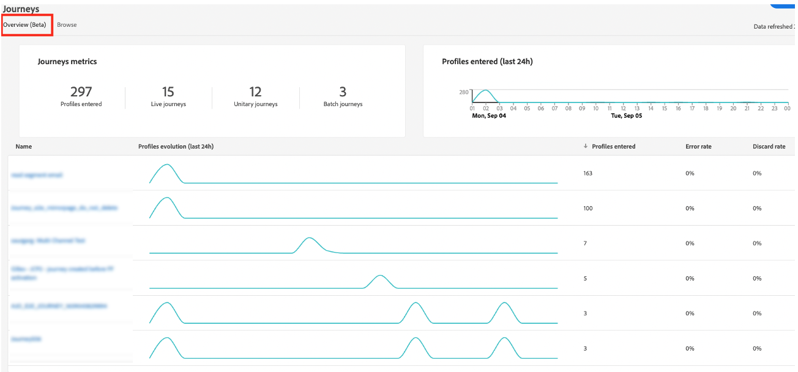

# Prácticas recomendadas {#best-practices}

## Caso de uso en tiempo real y directrices de personalización omnicanal {#real-time-guidance}

Después de la actualización de Identity Service 2.0, la vinculación de identidad en tiempo real ha evolucionado.

Adobe Journey Optimizer aprovecha Identity Service para combinar perfiles y personalizar experiencias para el usuario. Como resultado, hay que tener en cuenta algunos aspectos importantes del servicio a medida que crea sus casos de uso. Como marca, busca ofrecer una experiencia a una persona. El gráfico de identidad permite a los especialistas en marketing comprender con qué dispositivos está asociada una persona en varios canales. El gráfico puede contener identidades que representan a una persona (CRMID) o un explorador web (ECID). El servicio de identidad vincula esta información, lo que permite crear una &quot;vista de 360 grados&quot; de una persona o un perfil combinado. Es decir, cuando alguien explora el sitio y luego inicia sesión, todos los datos anteriores de esa sesión se pueden asociar al usuario que ha iniciado sesión. Esta acción se produce en unos pocos pasos diferentes:

1. Vinculación inicial de identidades: cuando una persona inicia sesión, el identificador de inicio de sesión (CRMID) se asocia al identificador del explorador web (sesión de aplicación web o móvil):

   * Esto puede tardar entre 30 min y 4 horas en completarse.
   * Normalmente, este evento de inicio de sesión genera un gráfico de identidad que vincula el CRMID con el ECID.

1. Después de la vinculación inicial, los datos enviados con cualquiera de las dos identidades se asociarán al perfil combinado y estarán disponibles para su personalización en Journey Optimizer en tiempo real. La actualización del perfil con los datos de comportamiento más recientes puede tardar hasta 1 minuto en completarse. Consulte [esta página](https://experienceleague.adobe.com/docs/experience-platform/ingestion/streaming/overview.html?lang=es).

Al crear casos de uso, tenga en cuenta lo siguiente:

1. La marca quiere volver a atraer a un visitante del sitio 30 minutos después del abandono (por ejemplo, correo electrónico de carro de compras abandonado):

   Usar la identidad con los datos: ECID. Si desea capturar el 100 % de los visitantes que han proporcionado su dirección de correo electrónico o instalación de la aplicación en los últimos 30 minutos, debe utilizar la identidad basada en cookies para iniciar este recorrido (ECID). Esto supone que su dirección de correo electrónico, token push u otra dirección para la experiencia está asociada al ECID.

1. Participación omnicanal en la web, el correo electrónico, la notificación push, etc.:

   * En el momento de la participación, debe tener las direcciones de comunicación disponibles en el perfil. Para garantizar que esto suceda de forma coherente y oportuna, asegúrese de que los datos estén asociados a la identidad que desee utilizar.
   * Si necesita utilizar información de una aplicación o sesión del explorador recién instalada combinada con información conocida o de inicio de sesión, esta comunicación debe enviarse después de que se haya producido la vinculación de estas identidades. Esto puede variar según el cliente. Le recomendamos esperar un mínimo de 30 minutos para obtener el mayor volumen de perfiles.

## Escala con barandillas de Recorrido {#scale}

Esta sección le guiará en la escala con las dos limitaciones siguientes:

* Journey Optimizer tiene una protección de 50 actividades en un lienzo de recorrido. Esta protección está diseñada para ayudar en la legibilidad, el control de calidad y la resolución de problemas. El número de actividades de un recorrido aparecerá en la sección superior izquierda del lienzo de recorrido cuando se encuentre dentro de las 10 actividades de este límite.

* A medida que publica recorridos, Journey Optimizer se adapta y ajusta automáticamente para garantizar el máximo rendimiento y estabilidad. A medida que se acerca al hito de 100 recorridos activos a la vez en una zona protegida, verá una superposición naranja y un signo de advertencia en la interfaz sobre este logro. Si recibe esta notificación y necesita extender sus recorridos más allá de los 100 recorridos en directo a la vez, cree un ticket para el servicio de atención al cliente y le ayudaremos a alcanzar sus objetivos.

<!--DOCAC-10977

* As you publish journeys, Journey Optimizer automatically scales and adjusts to ensure maximum throughput and stability. As you near the milestone of 500 live journeys at one time in a sandbox, you will see an orange overlay and warning sign appear in the interface on this achievement. If you see this notification and have a need to extend your journeys beyond 500 live journeys at a time, please create a ticket for customer care and we will help you reach your goals.-->

Puede adoptar una serie de prácticas recomendadas que le ayudarán a mantenerse dentro de las barreras y a utilizar el sistema de forma eficaz.

* Si se acerca al límite de recorridos activos, el primer paso que puede dar es ir a la ficha **Información general** en **Recorridos** para ver cuántos recorridos estuvieron activos en las últimas 24 horas en los recorridos que tenían perfiles activos. Puede comprobar el número de perfiles que entran y salen del recorrido en esta sección para determinar eso.

  

* A continuación, en la sección Inventario de Recorridos, puede filtrar todos los recorridos por Estado = &quot;Activo&quot; y Tipo = &quot;Leer audiencia&quot;. A continuación, ordene por Fecha de publicación (de más antigua a más reciente). Haga clic en el recorrido y vaya a la programación. Detener todos los recorridos activos que tengan una programación para ejecutarse **Una vez** o **Tan pronto como sea posible** que tengan más de un día y solo tengan una acción.

  

* Si el recorrido de **Leer audiencia** solo tiene una acción, no tiene esperas/decisiones ni optimización del tiempo de envío, considere la posibilidad de moverlos a Campañas de Journey Optimizer. Las campañas son más adecuadas para la participación de una sola etapa. Una de las diferencias clave entre Campaign y Recorrido es si cree que es importante escuchar activamente la participación del usuario para determinar el siguiente paso y comprometerse con otra acción.
* Para reducir el número de actividades dentro de un recorrido, compruebe los pasos de condición. Habrá muchas instancias en las que puede mover las condiciones a la definición de segmento o a la composición de audiencia.
* Si las mismas condiciones se repiten en varios recorridos (comprobaciones de consentimiento, supresiones), considere la posibilidad de moverlas como parte de la definición del segmento. Por ejemplo, si tiene una condición para comprobar que la dirección de correo electrónico no está vacía en varios recorridos, incluya esa condición como parte de la definición del segmento.
* Si el recorrido tiene varias condiciones para dividir la audiencia y ver los números en cada paso, considere la posibilidad de utilizar Customer Journey Analytics u otra solución de creación de informes más adecuada para el análisis.
* Si se acerca al límite de nodos en el lienzo, considere la posibilidad de consolidar acciones con parámetros dinámicos o contenido para ofrecer el contenido correcto en lugar de nodos explícitos.

* Si tiene un recorrido de **Leer audiencia** con segmento por lotes (A) y usa dentro del recorrido en el segmento de flujo de audiencia (B) para excluir (es decir, realizar A-B), considere mover esa lógica a la lógica de segmentación y use la exclusión como parte de la propia lógica de segmentación.