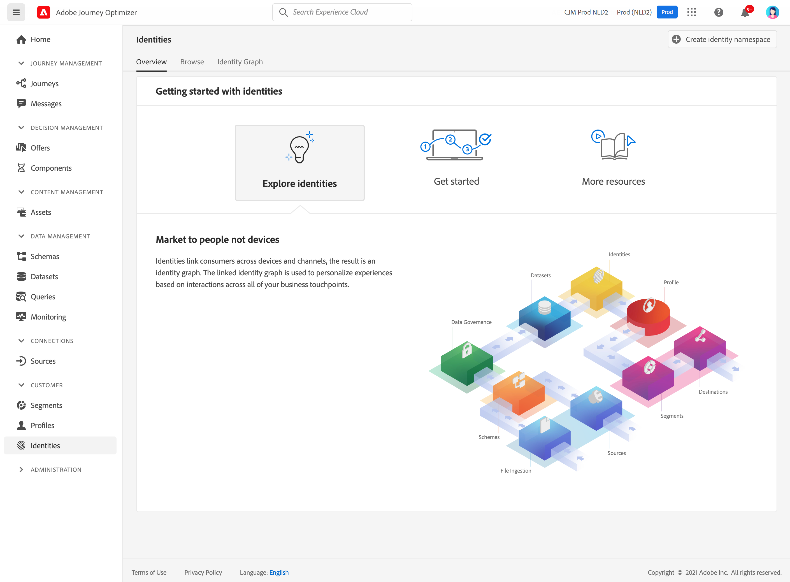

# Introducción a las identidades {#identities-gs}

Una identidad es datos que son exclusivos de una entidad, normalmente de una persona individual. Una identidad como, por ejemplo, un ID de inicio de sesión, un ECID o un ID de lealtad se denomina identidad conocida.

La información de identificación personal (PII), como la dirección de correo electrónico y el número de teléfono, sirve para identificar directamente a un cliente. Como resultado, la PII se utiliza para hacer coincidir las múltiples identidades de un cliente en todos los sistemas.

En [!DNL Adobe Journey Optimizer], **Identidades** vincular consumidores entre dispositivos y canales, el resultado es un [gráfico de identidad](#id-graph). El gráfico de identidad vinculado se utiliza para personalizar las experiencias en función de las interacciones en todos los puntos de contacto empresariales.

Más información sobre **Servicio de identidad** en [esta documentación](https://experienceleague.adobe.com/docs/experience-platform/sandbox/home.html?lang=es){target=&quot;_blank&quot;}.

## Espacios de nombres de identidad {#identity-namespaces}

**** Las áreas de nombres de identidad son un componente de Identity Service de   que sirve de indicadores del contexto al que se relaciona una identidad. Por ejemplo, distinguen un valor de `name@email.com` como dirección de correo electrónico o `443522` como ID de CRM numérico. El trabajo con áreas de nombres de identidad requiere comprender los distintos servicios de Adobe Experience Platform involucrados. Antes de comenzar a trabajar con áreas de nombres, revise la documentación de los siguientes servicios:

Más información sobre **Espacios de nombres de identidad** en [esta documentación](https://experienceleague.adobe.com/docs/experience-platform/identity/namespaces.html?lang=es){target=&quot;_blank&quot;}.

## Gráfico de identidad{#id-graph}

La variable **Gráfico de identidad** es un mapa de las relaciones entre las distintas identidades de un cliente concreto, que proporciona una representación visual de cómo el cliente interactúa con la marca a través de diferentes canales. El servicio de identidad de Adobe Experience Platform administra y actualiza todos los gráficos de identidad de los clientes de forma colectiva casi en tiempo real como respuesta a la actividad de los clientes.

El visor de gráficos de identidad en [!DNL Adobe Journey Optimizer] la interfaz de usuario de le permite visualizar y comprender mejor qué identidades de cliente se vinculan entre sí y de qué manera. El visor le permite arrastrar e interactuar con diferentes partes del gráfico, lo que le permite examinar relaciones de identidad complejas, depurar de forma más eficaz y beneficiarse de una mayor transparencia con la forma en que se utiliza la información.

Más información sobre **Gráfico de identidad** en [esta documentación](https://experienceleague.adobe.com/docs/experience-platform/identity/ui/identity-graph-viewer.html){target=&quot;_blank&quot;}.
