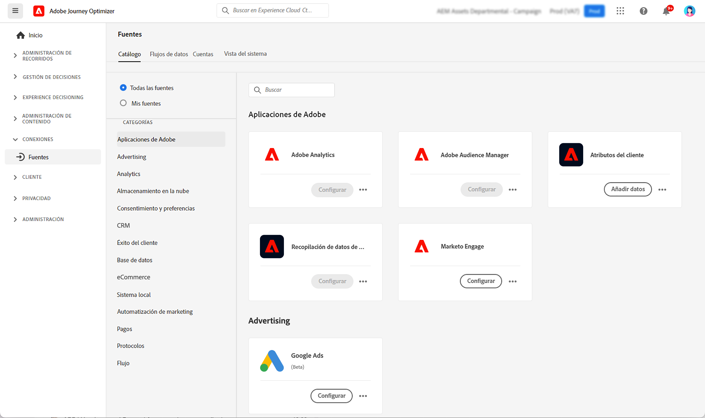

# Introducción a los conectores de fuentes {#sources-gs}

Adobe Journey Optimizer permite la introducción de datos de fuentes externas, al tiempo que le ofrece la capacidad de estructurar, etiquetar y mejorar los datos entrantes mediante los servicios de Platform. Puede ingerir datos de una variedad de fuentes, como aplicaciones de Adobe, almacenamiento basado en la nube, bases de datos y muchas otras.

Obtenga información acerca de los conectores de fuentes y cómo configurarlos en Journey Optimizer:

>[!VIDEO](https://video.tv.adobe.com/v/335919?quality=12)

Obtenga más información sobre cómo ingerir datos de fuentes externas con conectores Source en [Documentación de Adobe Experience Platform](https://experienceleague.adobe.com/docs/experience-platform/sources/home.html?lang=es){target="_blank"}.
