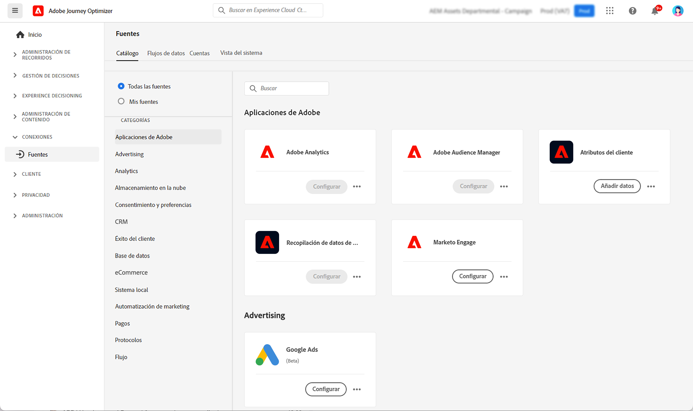

# Introducción a los conectores de origen {#sources-gs}

>[!BEGINSHADEBOX]

**En esta página:** comprenda qué son los conectores de origen y cómo traen datos de su CRM, almacenamiento en la nube y bases de datos a Adobe Journey Optimizer, para que pueda impulsar recorridos de clientes personalizados y basados en datos.

>[!ENDSHADEBOX]

## ¿Qué es una fuente? {#what-is-source}

Una **fuente** es un conector que lleva datos externos a Adobe Journey Optimizer. Las fuentes le permiten importar información de clientes desde sistemas que ya utiliza, como plataformas CRM, almacenamiento en la nube o bases de datos, y hacer que los datos estén disponibles para crear recorridos personalizados de clientes.

Considere las fuentes como puentes entre Journey Optimizer y sus sistemas de datos externos. Sincronizan los datos automáticamente para que siempre tenga información de clientes actualizada para impulsar sus campañas de marketing.

## Por qué importan las fuentes {#why-sources-matter}

Las fuentes son esenciales para crear experiencias de cliente personalizadas y basadas en datos en Journey Optimizer. He aquí por qué:

* **Vista unificada del cliente**: combine datos de varios sistemas para ver la imagen completa de cada cliente
* **Personalización en tiempo real**: use datos nuevos para enviar mensajes relevantes y oportunos en sus recorridos
* **Sincronización automática de datos**: mantenga actualizada la información del cliente sin importar manualmente los datos
* **Flujos de trabajo eficientes**: conéctese una vez y los datos fluirán automáticamente a sus recorridos

Por ejemplo, puede utilizar fuentes para importar el historial de compras desde su plataforma de comercio electrónico y, a continuación, crear recorridos que envíen recomendaciones de productos personalizadas basadas en lo que han comprado los clientes.

## Qué puede hacer con las fuentes {#sources-use-cases}

Los casos de uso comunes de las fuentes en Journey Optimizer incluyen:

* **Importar datos de clientes desde sistemas CRM**: sincronizar información de contacto, preferencias e historial de participación desde plataformas como Salesforce o Microsoft Dynamics
* **Conectar datos de compra**: incorporar el historial de pedidos y las preferencias de productos de las plataformas de comercio electrónico para personalizar las ofertas
* **Integrar datos del programa de fidelidad**: puntos de acceso e información de nivel para recompensar a los clientes más activos
* **Sincronizar datos de comportamiento**: importe interacciones con sitios web y patrones de uso de aplicaciones para activar recorridos relevantes
* **Actualizar atributos de perfil**: mantenga los perfiles de los clientes actualizados con los datos del almacenamiento o las bases de datos en la nube

## Tipos de fuentes comunes {#source-types}

Journey Optimizer admite varios tipos de fuentes para conectarse con los sistemas existentes:

**Aplicaciones de Adobe:**
* Adobe Analytics
* Adobe Audience Manager
* Adobe Campaign
* Adobe Commerce

**Almacenamiento en la nube:**
* Amazon S3
* Azure Blob Storage
* Almacenamiento en la nube de Google
* SFTP

**Bases de datos:**
* Amazon Redshift
* Google BigQuery
* Microsoft SQL Server
* MySQL
* PostgreSQL

**Automatización de marketing y CRM:**
* Microsoft Dynamics
* Salesforce
* Marketing Cloud de Salesforce

**Fidelidad y recompensas:**
* Talon.One
* Capilar
* Kobie

➡️ Vea la lista completa en el [catálogo de fuentes de Experience Platform](https://experienceleague.adobe.com/docs/experience-platform/sources/home.html?lang=es#sources-catalog){target="_blank"}

## Antes de empezar {#prerequisites}

Antes de configurar las fuentes, asegúrese de lo siguiente:

* **Permisos adecuados**: acceso para administrar las fuentes en Adobe Experience Platform
* **Credenciales del sistema de origen**: detalles de autenticación del sistema externo al que desea conectarse
* **Comprensión de los datos**: sepa qué campos de datos necesita y cómo se asignan a los perfiles de Journey Optimizer

➡️ Más información acerca de [control de acceso y permisos](../administration/permissions.md)

## Cómo funcionan las fuentes {#how-sources-work}

Adobe Journey Optimizer utiliza el marco de trabajo de fuentes de Adobe Experience Platform. Este es el flujo de trabajo básico:

1. **Conectar**: configure la autenticación en su sistema de datos externo
2. **Seleccionar datos**: elija qué datos importar y con qué frecuencia sincronizar
3. **Asignar campos**: defina cómo se corresponden los campos de datos externos con los atributos de perfil de Journey Optimizer
4. **Programar**: configure intervalos de actualización automática de datos
5. **Supervisar**: efectúe el seguimiento del flujo de datos y resuelva los problemas de sincronización

Una vez configuradas, las fuentes se ejecutan automáticamente en segundo plano, lo que mantiene los datos de los clientes actualizados y listos para usarlos en los recorridos.

>[!NOTE]
>
>**Ingesta de datos para campañas orquestadas**: para los orígenes de captura de datos modificados basados en archivos que se usan con campañas orquestadas, se requiere el campo `_change_request_type`. Los valores admitidos son `u` (actualización o inserción) o `d` (eliminación). Estos valores deben estar en minúsculas `u` y `d`, no en mayúsculas `U` y `D`. [Más información sobre las medidas de seguridad y las limitaciones de las campañas orquestadas](../orchestrated/guardrails.md)

## Más información {#learn-more}

Vea este vídeo para comprender los conectores de origen y cómo configurarlos en Journey Optimizer:

>[!VIDEO](https://video.tv.adobe.com/v/3422582?captions=spa&quality=12)

Para obtener información detallada sobre cómo configurar y administrar fuentes, consulte la [documentación de fuentes de Adobe Experience Platform](https://experienceleague.adobe.com/docs/experience-platform/sources/home.html?lang=es){target="_blank"}.

## Próximos pasos {#next-steps}

Ahora que comprende cuáles son las fuentes y por qué son importantes:

* Explore el [catálogo de fuentes](https://experienceleague.adobe.com/docs/experience-platform/sources/home.html?lang=es#sources-catalog){target="_blank"} para encontrar conectores para sus sistemas
* Obtenga información sobre cómo [crear una conexión de origen](https://experienceleague.adobe.com/docs/experience-platform/sources/ui-tutorials/create/overview.html?lang=es){target="_blank"}
* Aprenda en qué consiste la [asignación y transformación de datos](https://experienceleague.adobe.com/docs/experience-platform/sources/ui-tutorials/dataflow/overview.html?lang=es){target="_blank"}
* Descubra cómo [usar datos importados en recorridos](../building-journeys/journey-gs.md)
* Revise la información general de [Introducción a la administración de datos](../data/gs-data.md) para comprender cómo encajan las fuentes en la configuración de datos completa de Journey Optimizer
