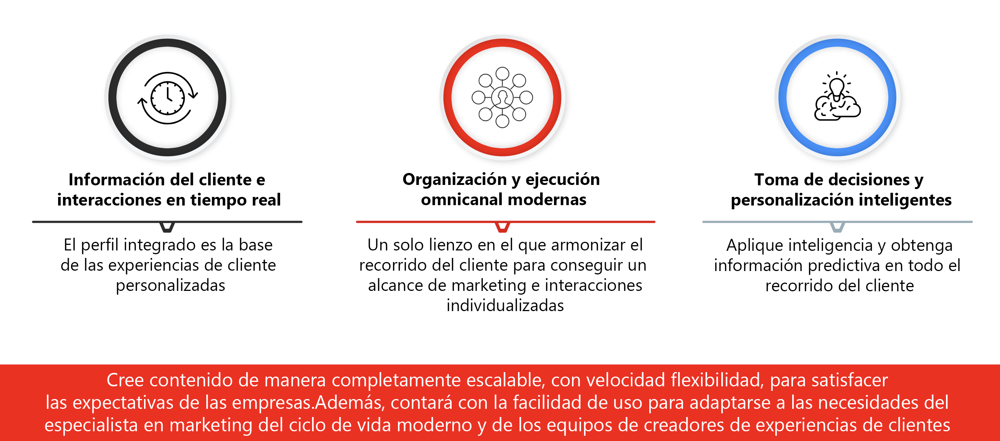

# Introducción a Journey Optimizer {#cjm-gs}

## ¿Qué es [!DNL Adobe Journey Optimizer]?{#about-cjm}

[!DNL Adobe Journey Optimizer] ayuda a las empresas a ofrecer a sus clientes experiencias conectadas, contextuales y personalizadas. El recorrido del cliente es todo el proceso de interacciones de un cliente con la marca, desde el primer momento de contacto hasta que el cliente se marcha. Comienza con la fase de sensibilización, en la que el cliente aprende sobre la marca y comienza a interactuar. A continuación, el cliente interactuará con la marca, visitará sitios en línea y físicos y realizará compras, enviará mensajes o revisará las publicaciones.

[!DNL Adobe Journey Optimizer] se basa de forma nativa en [!DNL Adobe Experience Platform] y combina un perfil del cliente unificado en tiempo real, un marco de trabajo abierto con una API con prioridad, Offer Decisioning centralizado, inteligencia artificial (IA) y aprendizaje automático para la personalización y la optimización. Journey Optimizer permite que las marcas determinen de forma inteligente la siguiente mejor interacción con la escala, la velocidad y la flexibilidad en todo el recorrido del cliente. Con [!DNL Adobe Journey Optimizer], las empresas pueden crear y entregar campañas de marketing programadas (como promociones semanales de una tienda minorista) y comunicaciones individuales personalizadas (como una notificación push de un artículo que un cliente de una aplicación de lealtad podría haber visto antes sin existencias) desde la misma aplicación.

➡️ [Descubrimiento de Journey Optimizer](https://experienceleague.adobe.com/docs/journey-optimizer-learn/tutorials/introduction-to-journey-optimizer/introduction.html?lang=es){target="_blank"} (vídeo)

<!-- Use [!DNL Adobe Journey Optimizer] to build multi-step customer journeys that initiate a sequence of interactions, offers, and messages across channels in real time. This approach ensures customers are engaged at the optimal moments based on their actions and relevant business signals. Learn how to build journeys in [this section](../building-journeys/journey-gs.md).

You can also create audience-based campaigns to send messages.-->

## Casos de uso {#use-cases}

* Los especialistas en marketing pueden utilizar [!DNL Adobe Journey Optimizer] para enviar comunicaciones individualizadas y comunicaciones por lotes basadas en públicos. Por ejemplo: una tienda de ropa suele enviar estudios posteriores a la compra a todos los clientes que han comprado productos en la última semana. Debido a las inclemencias del tiempo, algunos envíos experimentaron retrasos. Al ver que la clientela no ha recibido sus envíos, la tienda de ropa puede excluirla del envío de satisfacción del cliente programado y, en su lugar, hacerles llegar un correo electrónico personalizado pidiendo disculpas por el retraso y ofreciéndoles un código de descuento con recomendaciones de productos basadas en las compras anteriores del cliente.

  Los expertos en marketing también pueden utilizar la aplicación para enviar comunicaciones basadas en comportamientos en tiempo real. Por ejemplo, el mismo minorista podría atraer a un cliente fiel que entra en el aparcamiento de la tienda en tiempo real enviándole una notificación push acerca de un suéter que vuelve a estar en existencias con su talla.

* Los no especialistas en marketing, como los equipos de operaciones y el servicio de asistencia al cliente que participan en la experiencia del cliente, pueden utilizar [!DNL Adobe Journey Optimizer] para administrar una variedad de tareas, como notificaciones operacionales, o incluso para monitorizar el proceso de incorporación. Por ejemplo, un parque de atracciones donde los visitantes descargan una aplicación móvil como parte de la experiencia. El personal de mantenimiento puede utilizar [!DNL Adobe Journey Optimizer] para notificar a los visitantes del parque de las atracciones que están actualmente cerradas por mantenimiento.

## Funcionalidades clave {#key-capabilities}

[!DNL Adobe Journey Optimizer] es una aplicación ágil y escalable para crear y ofrecer experiencias del cliente personalizadas, conectadas y puntuales en cualquier aplicación, dispositivo o canal.

Las funcionalidades clave incluyen:

* **Datos y participación del cliente en tiempo real**: un perfil integrado fusiona los datos en tiempo real de todas las fuentes en distintos puntos de contacto del cliente, incluidos los datos de comportamiento, transaccionales, financieros y operativos para optimizar las experiencias personales y contextuales para los clientes en su tiempo.

* **Orquestación y ejecución modernas omnicanal**: un lienzo único en el que armonizar y optimizar el recorrido del cliente para una participación del cliente y alcance de marketing 1:1 que ayude a las marcas a proporcionar más valor a lo largo del ciclo de vida del cliente. Los recorridos de cliente diseñados en [!DNL Adobe Journey Optimizer] pueden ser dinámicos y estar basados en eventos para ayudar a las marcas a reaccionar a las señales en tiempo real, así como a conectar esas interacciones con campañas programadas, de modo que se tomen las decisiones correctas acerca de qué comunicaciones enviar a un cliente, cuándo y a través de qué canales.

* **Decisiones inteligentes y Personalization**: las marcas pueden aplicar decisiones centralizadas e incorporar inteligencia artificial y aprendizaje automático para configurar perspectivas predictivas a través de la experiencia del cliente, lo que facilita la automatización de decisiones y la optimización de la experiencia a escala. Decisioning alimenta las ofertas centralizadas entre canales a escala a través de [!DNL Adobe Journey Optimizer].

>[!NOTE]
>
>* Los componentes y las funciones disponibles en su entorno dependen de los [permisos](../administration/permissions.md) y del [paquete de licencias](https://helpx.adobe.com/es/legal/product-descriptions/adobe-journey-optimizer.html){target="_blank"}. Para cualquier pregunta, póngase en contacto con Adobe Customer Success Manager o su representante de Adobe.
>
>* Los procedimientos y directrices generales de privacidad de Adobe Experience Cloud se aplican a [!DNL Journey Optimizer]. [Obtenga más información sobre la privacidad de Adobe Experience Cloud](https://www.adobe.com/es/privacy/experience-cloud.html){target="_blank"}.

## Arquitectura {#architecture}

Comprenda la arquitectura básica de [!DNL Adobe Journey Optimizer], los puntos de integración y la relación entre [!DNL Journey Optimizer] y [!DNL Experience Platform] en el diagrama siguiente.

Adobe Experience Platform es una base de datos potente, flexible, abierta y centralizada que recopila, estandariza, controla, aplica conocimientos de la IA  y unifica datos para ofrecer experiencias digitales fundamentadas y relevantes a los clientes.

{width="70%" zoomable="yes"}

Hay cuatro aplicaciones integradas de forma nativa en Experience Platform: Adobe Real-Time Customer Data Platform, Journey Optimizer, Customer Journey Analytics y Adobe Mix Modeler.

La funcionalidad y los servicios principales de Journey Optimizer funcionan con los componentes básicos de Adobe Experience Platform, que incluyen el perfil del cliente en tiempo real. Aunque Journey Optimizer funciona sin problemas y es interoperable con Real-Time CDP y Customer Journey Analytics, también puede funcionar de forma independiente como aplicación independiente.

{width="70%" zoomable="yes"}

### Modelos de Adobe Journey Optimizer

Los modelos de experiencia digital proporcionan diagramas de la arquitectura del flujo de datos y del sistema para comprender mejor cómo se integran e implementan las aplicaciones de Adobe Experience Platform. Los modelos proporcionan una representación visual de los flujos de contenido y datos entre sistemas y componentes, la secuencia de operaciones y las dependencias para ayudar a informar el diseño de casos de uso y la arquitectura de Adobe Experience Platform y aplicaciones.

Vea los [modelos de Adobe Journey Optimizer](https://experienceleague.adobe.com/es/docs/blueprints-learn/architecture/customer-journeys/journey-optimizer/journey-optimizer-overview){target="_blank"}.

>[!MORELIKETHIS]
>
>* [Pasos clave para empezar](quick-start.md)
>* [Diseño de recorridos y envío de mensajes](../building-journeys/journey-gs.md)
>* [Informes en directo](../reports/live-report.md)
>* [Información general sobre la seguridad de Journey Optimizer](https://www.adobe.com/content/dam/cc/en/security/pdfs/AJO_SecurityOverview.pdf) (PDF)
>* [Descripción del producto Journey Optimizer](https://helpx.adobe.com/es/legal/product-descriptions/adobe-journey-optimizer.html){target="_blank"}
