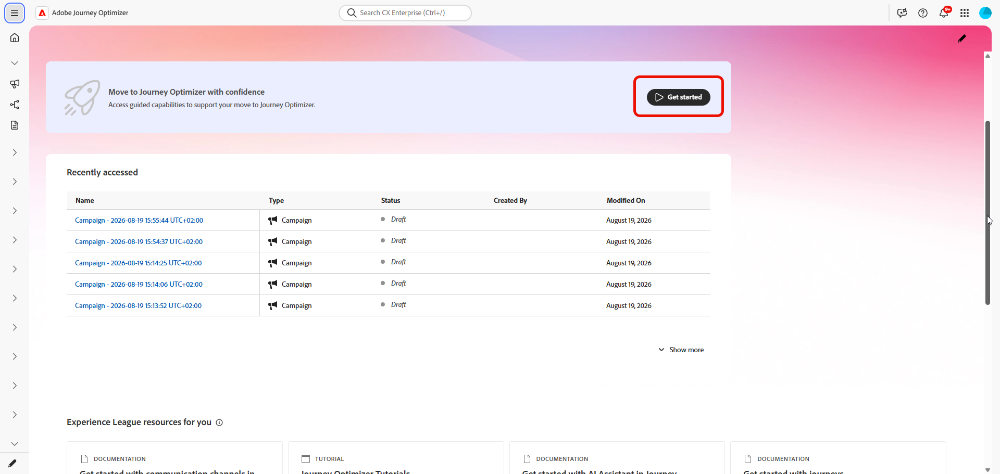
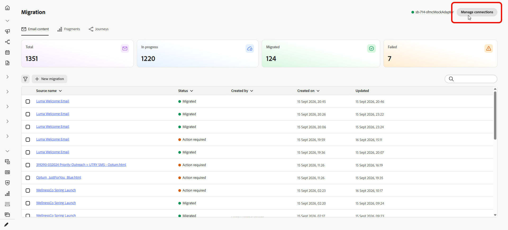
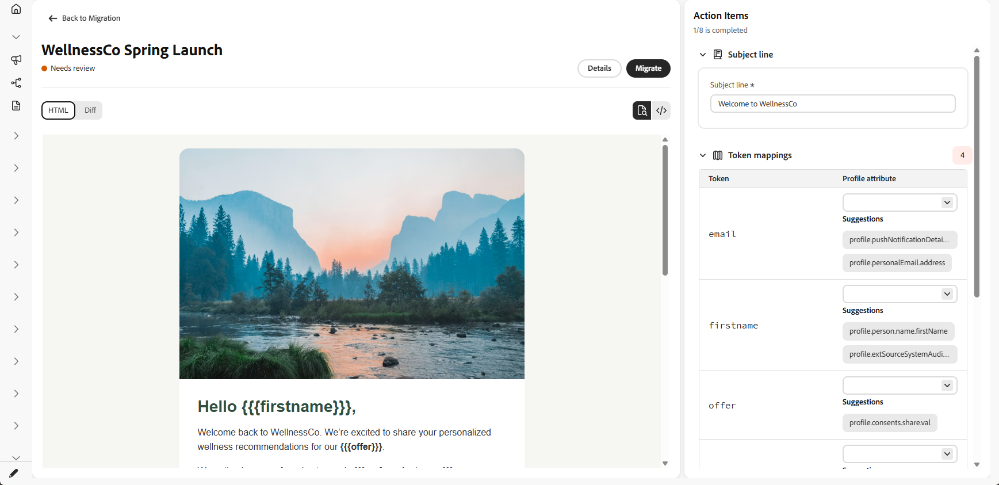
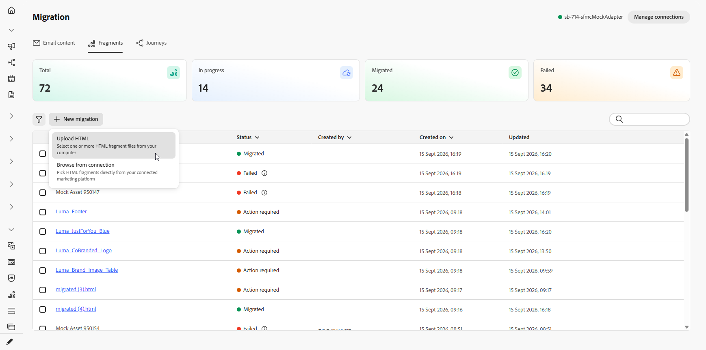
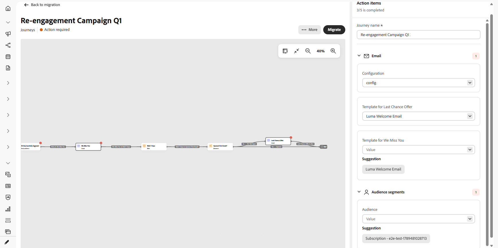
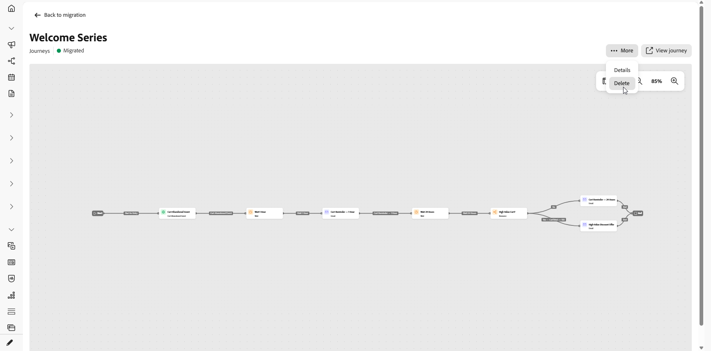

# Migración de contenido y recorridos {#migrate-content-and-journeys}

>[!AVAILABILITY]
>
>Esta versión solo está disponible para un conjunto de organizaciones (disponibilidad limitada). Para obtener acceso, póngase en contacto con su representante de Adobe.

Si se está moviendo a [!DNL Journey Optimizer] desde otra plataforma de marketing, no es necesario que comience desde una pizarra en blanco. Journey Optimizer incluye un espacio de trabajo dedicado que importa el contenido y los recorridos de correo electrónico existentes. Los convierte en [!DNL Journey Optimizer] plantillas de contenido y recorridos, para que pueda continuar donde lo dejó en lugar de reconstruir todo desde cero.

Para migrar el contenido y los recorridos a Journey Optimizer, necesita los siguientes permisos: Administrar campañas, Administrar Recorridos, Administrar mensajes, Administrar segmentos, Administrar elementos de biblioteca, Ver y administrar zonas protegidas y Administrar la configuración de integración de AJO. [Más información sobre roles y permisos](../administration/permissions.md)

Puede tener acceso a este área de trabajo directamente desde la página principal de [!DNL Journey Optimizer].

## Configuración de una conexión {#set-up-a-connection}

>[!CONTEXTUALHELP]
>id="ajo_migration_connection_name"
>title="Nombre de conexión"
>abstract="Un nombre descriptivo que identifique el sistema de origen (por ejemplo, “Marketing-Automation-Prod”). Debe comenzar por una letra y contener solo caracteres alfanuméricos, guiones bajos o guiones (entre cuatro y cincuenta caracteres)."

>[!CONTEXTUALHELP]
>id="ajo_migration_base_api_url"
>title="URL de API básica"
>abstract="Dirección URL raíz de la API, sin rutas de recursos ni cadenas de consulta, por ejemplo: https://api.example.com."

>[!CONTEXTUALHELP]
>id="ajo_migration_authentication_method"
>title="Elección de un método de autenticación"
>abstract="La clave de API envía una sola credencial con cada solicitud, mientras que OAuth 2.0 utiliza un protocolo basado en tokens más adecuado para las API de empresa y de terceros."

>[!CONTEXTUALHELP]
>id="ajo_migration_client_id"
>title="ID de cliente"
>abstract="El identificador público de su aplicación, emitido al registrarse en el servidor de autorización."

>[!CONTEXTUALHELP]
>id="ajo_migration_client_secret"
>title="Secreto del cliente"
>abstract="Una credencial confidencial conocida solo por su aplicación y el servidor de autorización. Nunca lo exponga en código del lado del cliente."

>[!CONTEXTUALHELP]
>id="ajo_migration_token_url"
>title="URL de token"
>abstract="Punto final del servidor de autorización que emite tokens de acceso para el flujo de credenciales del cliente, que normalmente termina en /oauth/token o /token."

>[!NOTE]
>
>No es necesaria una conexión si carga archivos o capturas de pantalla de HTML en lugar de importarlos a través de una API.

Para importar contenido o recorridos a través de una API, primero conecte [!DNL Journey Optimizer] a la plataforma de origen:

1. En el área de trabajo, seleccione **[!UICONTROL Administrar conexiones]**.

   

1. Haga clic en **[!UICONTROL Nueva conexión]**.

   

1. Complete los siguientes detalles:

   * **[!UICONTROL Nombre de conexión]**: Un nombre que identifica el sistema de origen, como `Marketing-Automation-Prod`. Los nombres deben comenzar por una letra y solo pueden contener letras, números, guiones bajos o guiones, de entre 4 y 50 caracteres.
   * **[!UICONTROL URL de API base]**: URL raíz de la API del sistema de origen, sin ninguna ruta de recursos ni cadena de consulta, como `https://api.example.com`.
   * **[!UICONTROL Descripción]**: contexto opcional para ayudarle a usted y a otros usuarios a identificar el propósito de esta conexión.
   * **[!UICONTROL Método de autenticación]**: Cómo se autentica [!DNL Journey Optimizer] en el sistema de origen. Elija **Clave API** para enviar una sola credencial con cada solicitud. Elija **OAuth 2.0** para usar un protocolo basado en tokens que se adapte mejor a las API de empresas y de terceros.
   * **[!UICONTROL ID de cliente]**: Identificador público asignado a su aplicación cuando la registró en el servidor de autorización. Necesario para conexiones OAuth 2.0.
   * **[!UICONTROL Secreto de cliente]**: La credencial confidencial asociada con su ID de cliente. Manténgalo privado, ya que solo lo conocen su aplicación y el servidor de autorización. Necesario para conexiones OAuth 2.0.
   * **[!UICONTROL URL del token]**: El extremo del servidor de autorización que emite tokens de acceso para el flujo de credenciales del cliente, que normalmente termina en `/oauth/token` o `/token`. Necesario para conexiones OAuth 2.0.

     

1. Seleccione **[!UICONTROL Crear]**.

1. Una vez configurada la conexión, utilice el menú avanzado para eliminarla o para marcarla como predeterminada de modo que se preseleccione la próxima vez que importe contenido o recorridos.

   

## Importar contenido de correo electrónico {#import-email-content}

Una vez que tenga un origen para el contenido, ya sea un archivo HTML o una conexión con la plataforma de origen, impórtelo al área de trabajo para convertirlo en una plantilla de contenido [!DNL Journey Optimizer].

1. En la pestaña **[!UICONTROL Contenido de correo electrónico]**, elija cómo desea importar el contenido de su correo electrónico:

   * **[!UICONTROL Cargar HTML]**: selecciona uno o más archivos de correo electrónico de HTML de tu equipo.

   * **[!UICONTROL Examinar desde la conexión]**: examine y seleccione correos electrónicos directamente desde la plataforma de marketing conectada, sin necesidad de exportar y cargar archivos manualmente.

   

1. Para una carga de HTML, busque el archivo o arrástrelo y suéltelo en el área de carga. Haga clic en **[!UICONTROL Cargar]** una vez finalizado.

   Los archivos deben tener el formato `.html` o `.htm` y no deben superar los 10 MB.

   

1. Para importar desde la conexión, elija en la lista Correos electrónicos y haga clic en **[!UICONTROL Importar]**.

1. Acceda al correo electrónico importado y revise el HTML importado.

1. Agregue su **[!UICONTROL Línea de asunto]** y asigne cada marcador de posición de personalización al atributo de perfil correspondiente.

   El espacio de trabajo convierte automáticamente la sintaxis de la secuencia de comandos de origen a la sintaxis Handlebars. Para obtener una lista de los operadores admitidos, consulte [Operadores](https://experienceleague.adobe.com/es/docs/journey-optimizer/using/content-management/personalization/functions/operators).

   

   >[!NOTE]
   >
   >Algunos tokens de fecha de origen se asignan automáticamente y no aparecen como marcadores de posición de personalización para asignar. También se ha mejorado la detección y asignación de tokens para lograr una mayor precisión.

1. Si el correo electrónico hace referencia a algún bloque de contenido, resuelva el problema como fragmentos. Ver [Importar fragmentos](#import-fragments).

1. Seleccione una carpeta para cargar las imágenes del correo electrónico en [!DNL Experience Manager Assets] y haga clic en **[!UICONTROL Cargar recursos]**.

   

1. Una vez que el correo electrónico esté listo, selecciona **[!UICONTROL Migrar]**, luego selecciona **Ver correo electrónico** para abrir la nueva plantilla de contenido.

   

La plantilla de contenido ya está disponible en [!DNL Journey Optimizer] y lista para usarla en sus recorridos.

➡️ [Más información sobre la plantilla de contenido](../content-management/use-content-templates.md)

## Importar fragmentos {#import-fragments}

Los fragmentos son bloques de creación reutilizables dentro de un correo electrónico, como encabezados, pies de página o bloques promocionales, que se generan una vez y se reutilizan en varios correos electrónicos para lograr una mayor coherencia y agilizar la creación. Al migrar un mensaje de correo electrónico, [!DNL Journey Optimizer] identifica los bloques de contenido a los que hace referencia y los presenta como un elemento de acción, para que pueda migrarlos junto con el correo electrónico.

1. En la ficha **[!UICONTROL Fragmentos]**, elija cómo desea importar el fragmento:

   * **[!UICONTROL Cargar HTML]**: selecciona uno o más archivos de fragmento de HTML de tu equipo.

   * **[!UICONTROL Examinar desde la conexión]**: examine y seleccione fragmentos directamente desde la plataforma de marketing conectada, sin necesidad de exportar y cargar archivos manualmente.

   

1. También puede importar fragmentos al migrar un correo electrónico. A medida que migra el correo electrónico, [!DNL Journey Optimizer] lo analiza, identifica los bloques de contenido a los que se hace referencia y los presenta como elementos de acción de fragmento en el correo electrónico, de modo que pueda resolverlos sin abandonar el flujo de migración de correo electrónico.

   

1. Para importar desde la conexión, elija en la lista Fragmentos y haga clic en **[!UICONTROL Importar]**.

1. Abra el fragmento importado y resuelva los elementos de acción restantes, por ejemplo, recursos o atributos de perfil correspondientes.

   

1. Una vez que el fragmento esté listo, selecciona **[!UICONTROL Migrar]** y, a continuación, selecciona **Ver fragmento** para abrirlo.

## Importar recorridos {#import-journeys}

Vuelva a crear los recorridos importando una captura de pantalla del flujo de recorrido o conectándose a la plataforma de origen. Los recorridos se preparan como borradores editables que se pueden revisar en un lienzo visual antes de migrarlos, por lo que se obtiene una lista de comprobación guiada de todo lo que necesita primero la entrada, en lugar de migrar a ciegas.

1. En la ficha **[!UICONTROL Recorridos]**, elija cómo desea importar los recorridos:

   * **[!UICONTROL Cargar capturas de pantalla]**: selecciona una o más capturas de pantalla de recorrido de tu equipo.

   * **[!UICONTROL Examinar desde la conexión]**: examine y seleccione recorridos directamente desde la plataforma de marketing conectada, sin necesidad de exportar y cargar capturas de pantalla manualmente.

   

1. Para cargar una captura de pantalla, busque el archivo o arrástrelo y suéltelo en el área de carga. Haga clic en **[!UICONTROL Cargar]** una vez finalizado.

   Los archivos deben tener el formato .png, .jpg, .gif, .webp y no deben superar los 5 MB.

   

1. Para importar desde una conexión, elija en la lista recorridos y haga clic en **[!UICONTROL Importar]**.

1. Abra el recorrido para previsualizarlo en el lienzo interactivo. El recorrido completo se representa como un lienzo de nodo y borde, y los nodos que requieren atención se identifican en línea.

1. En el panel **[!UICONTROL Elementos de acción]**, resuelva cada elemento antes de migrar. El encabezado del panel muestra un recuento activo de los elementos resueltos del total y, al seleccionar un elemento de acción, se resalta el nodo coincidente del lienzo. Los elementos de acción incluyen:

   * **[!UICONTROL nombre de Recorrido]**: establezca el nombre del recorrido antes de la migración.
   * **[!UICONTROL Plantillas de contenido]**: seleccione la plantilla de contenido adecuada para las acciones de recorrido que la requieran. Las plantillas de correo electrónico se validan a medida que se seleccionan, y los problemas de validación se muestran directamente en el elemento de acción.
   * **[!UICONTROL Configuraciones de canal]**: seleccione la configuración necesaria para canales como correo electrónico y SMS.
   * **[!UICONTROL Segmentos de audiencia]**: asigne audiencias de origen a las audiencias [!DNL Journey Optimizer] apropiadas.

   

1. Una vez resueltos todos los elementos de acción, seleccione **[!UICONTROL Migrar]**.

   [!DNL Journey Optimizer] ejecuta una comprobación final del recorrido, volviendo a validar las plantillas de correo electrónico y confirmando que se ha establecido el nombre del recorrido. Cualquier información que falte o que no sea válida bloquea la migración y aparece en línea en los elementos de acción relevantes. Una vez superada la comprobación, un paso de confirmación se protege contra migraciones accidentales y, a continuación, la página refleja el estado de procesamiento.

1. Si ya no necesita una migración de recorrido, elimínela de la lista de recorrido o del menú dentro de un recorrido abierto.

   

El recorrido está ahora disponible en [!DNL Journey Optimizer], donde puede revisar el lienzo, realizar los ajustes finales y activarlo cuando esté listo para su lanzamiento. Seleccione **[!UICONTROL Ver recorrido]** para abrir el recorrido migrado directamente en [!DNL Journey Optimizer]. Si se completa una migración pero no se pueden aplicar algunos elementos de acción, se le indicará exactamente cuántos elementos y se dirigirá a [!DNL Journey Optimizer] para que los finalice.

➡️ [Más información sobre la creación de Recorridos](../building-journeys/journey-gs.md)

## Seguimiento de migración {#track-migration-progress}

La descripción general del espacio de trabajo le ayuda a realizar un seguimiento de cada correo electrónico o recorrido que ha importado y a encontrar rápidamente los que aún esperan acción. Un conjunto de KPI en la parte superior de la pantalla le ofrece un recuento rápido de elementos en cada estado:

* **Total**: El número total de elementos importados en el área de trabajo.
* **En curso**: elementos que aún se están revisando o asignando antes de que se puedan migrar.
* **Migrados**: elementos que se convirtieron correctamente y que están disponibles en [!DNL Journey Optimizer].
* **Error**: elementos que no se pudieron migrar y que requieren atención.

Un conjunto de filtros le permite reducir la lista de contenido importado para que pueda centrarse en un subconjunto específico en lugar de desplazarse por cada elemento. Combine uno o más de los siguientes filtros para encontrar lo que está buscando:

* **[!UICONTROL Acción necesaria]**: el elemento tiene elementos de acción sin resolver y necesita sus datos para poder migrarlo.
* **[!UICONTROL Procesando]**: el elemento se está migrando en este momento.
* **[!UICONTROL Migrado]**: el elemento se migró correctamente y está disponible en [!DNL Journey Optimizer].
* **[!UICONTROL Error]**: la migración no se pudo completar y requiere atención.

{{$include /help/_includes/do-not-localize/start/ai-augmented-migrate-content-and-journeys.md}}
