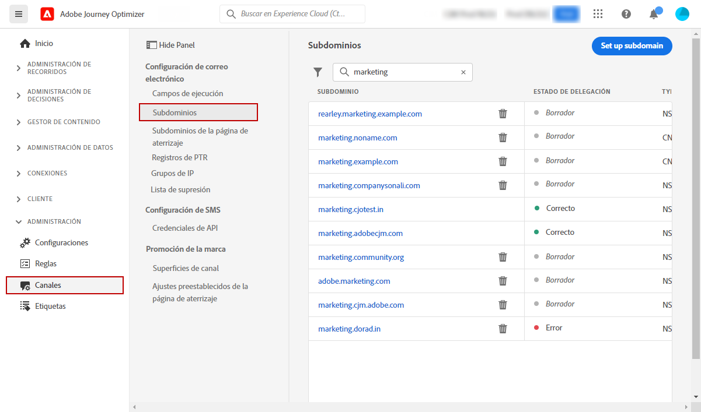
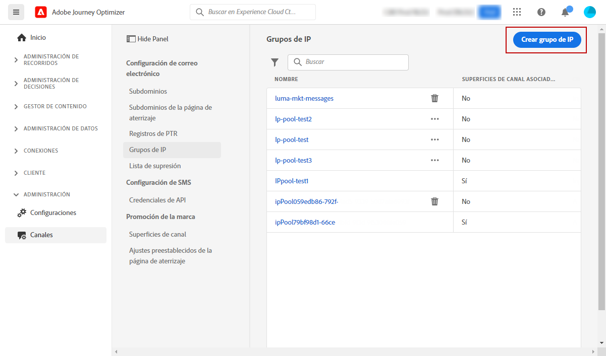
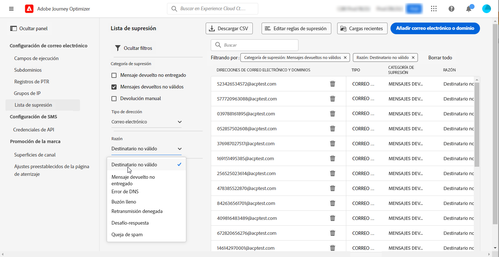

# Introducción para administradores de sistemas {#get-started-sys-admins}

Como **Administrador del sistema**, usted configura el entorno de Journey Optimizer y administra el acceso para permitir que sus equipos trabajen de manera eficiente y segura. Realice los pasos de configuración esenciales para que el [Ingeniero de datos](data-engineer.md), el [Desarrollador](developer.md) y el [Experto en marketing](marketer.md) puedan empezar a trabajar con [!DNL Adobe Journey Optimizer].

Sus responsabilidades principales incluyen la configuración de grupos de usuarios y permisos, la creación y administración de zonas protegidas para dividir datos y recorridos para diferentes grupos de usuarios y la configuración de canales de envío y ajustes preestablecidos de mensajes para garantizar una marca coherente en los distintos mensajes y recursos enviados a través de Journey Optimizer. Usted garantiza que las personas adecuadas tengan acceso a las capacidades adecuadas y, al mismo tiempo, mantiene la seguridad y la gobernanza.

Estas funcionalidades pueden gestionarlas los **[!UICONTROL Administradores de productos]** que tengan acceso al producto Permisos. [Obtenga más información sobre permisos](../../administration/permissions.md){target="_blank"}.

## Configuración de acceso y permisos

Siga estos pasos para configurar la administración de acceso:

1. **Crear zonas protegidas** para dividir las instancias en entornos virtuales independientes y aislados. Las **zonas protegidas** se crean en [!DNL Journey Optimizer]. Obtenga más información en la sección [Zonas protegidas](../../administration/sandboxes.md).

   >[!NOTE]
   >Como **Administrador del sistema**, si no puede ver el menú **[!UICONTROL Zonas protegidas]** en [!DNL Journey Optimizer], debe actualizar sus permisos. Obtenga información sobre cómo actualizar su función en [esta página](../../administration/permissions.md#edit-product-profile).

1. **Conozca las funciones**. Las funciones son un conjunto de derechos unitarios que permiten a los usuarios acceder a determinadas funcionalidades u objetos de la interfaz. Obtenga más información en la sección [Funciones predeterminadas](../../administration/ootb-product-profiles.md).

1. **Establezca permisos** para funciones, incluidas las **zonas protegidas**, y otorgue acceso a los integrantes del equipo asignándolos a diferentes funciones. Los permisos son derechos unitarios que le permiten definir las autorizaciones asignadas a la **[!UICONTROL función]**. Cada permiso se recopila en funcionalidades, por ejemplo, Recorrido u Ofertas, que representan las diferentes funcionalidades u objetos de [!DNL Journey Optimizer]. Obtenga más información en la sección [Niveles de permisos](../../administration/high-low-permissions.md).

1. **Use control de acceso de nivel de objeto** (opcional). Aplique etiquetas de acceso a objetos como recorridos, campañas y configuraciones de canal para controlar qué usuarios pueden acceder a recursos específicos. Más información sobre [Control de acceso de nivel de objeto (OLAC)](../../administration/object-based-access.md).

Además, debe añadir usuarios que necesiten acceso a Assets Essentials para las funciones **Usuarios consumidores de Assets Essentials** o **Usuarios de Assets Essentials**. [Obtenga más información en la documentación de Assets Essentials](https://experienceleague.adobe.com/docs/experience-manager-assets-essentials/help/deploy-administer.html?lang=es){target="_blank"}.

Al acceder a [!DNL Journey Optimizer] por primera vez, se le aprovisiona una zona protegida de producción y se le asigna un determinado número de direcciones IP en función de su contrato.

## Configuración de canales y mensajes

Para permitir que los [Expertos en marketing](marketer.md) creen y envíen mensajes, acceda al menú **ADMINISTRACIÓN**. Examine el menú **[!UICONTROL Canales]** para establecer la configuración de canal.

>[!NOTE]
>Como **Administrador del sistema**, si no puede ver el menú **[!UICONTROL Canales]** en [!DNL Journey Optimizer], actualice sus permisos en el producto [Permisos](../../administration/permissions.md){target="_blank"}. 

Siga estos pasos:

1. **Establezca las configuraciones de canal**. Defina todos los parámetros técnicos necesarios para el correo electrónico, los SMS, las notificaciones push y otros canales:

   * Defina la **configuración de notificaciones push** tanto en [!DNL Adobe Experience Platform] como en la recopilación de datos de Adobe Experience Platform. [Más información](../../push/push-gs.md)

   * Cree **configuraciones de canal** para configurar todos los parámetros técnicos necesarios para el correo electrónico, SMS, push, en la aplicación, web y otros canales. [Más información](../../configuration/channel-surfaces.md)

   * Configure el **Canal de SMS** para configurar todos los parámetros técnicos necesarios para SMS. [Más información](../../sms/sms-configuration.md)

   * Administre el número de días durante los cuales se realizan **reintentos** antes de enviar direcciones de correo electrónico a la lista de supresión. [Más información](../../configuration/manage-suppression-list.md)

1. **Delegue subdominios**: para cualquier nuevo subdominio que se vaya a utilizar en Journey Optimizer, el primer paso será delegarlo. [Más información](../../configuration/about-subdomain-delegation.md)

   

1. **Cree grupos de IP**: mejore su capacidad de entrega de correo electrónico y su reputación agrupando direcciones IP aprovisionadas con su instancia. [Más información](../../configuration/ip-pools.md)

   

1. **Administre las listas de supresión y las listas de permitidos**: mejore la capacidad de entrega con las listas de supresión y las de permitidos

   * Una [lista de supresión](../../reports/suppression-list.md) consiste en las direcciones de correo electrónico que desea excluir de las entregas, ya que el envío a estos contactos podría dañar su reputación y las tasas de entrega. Puede monitorizar todas las direcciones de correo electrónico que se excluyen automáticamente del envío de un recorrido. Por ejemplo, direcciones no válidas, direcciones con mensajes devueltos no entregados de forma frecuente y que podrían afectar negativamente a su reputación de correo electrónico y destinatarios que presentan una queja de correo no deseado de algún tipo contra uno de sus mensajes por correo electrónico. Obtenga información sobre cómo administrar la [lista de supresión](../../configuration/manage-suppression-list.md) y los [reintentos](../../configuration/retries.md).

   

   * La [lista de permitidos](../../configuration/allow-list.md) permite especificar direcciones de correo electrónico o dominios individuales que serán los únicos destinatarios o dominios autorizados para recibir los correos electrónicos que envía desde una zona protegida específica. Esto puede impedir que envíe correos electrónicos accidentalmente a direcciones de clientes reales cuando se encuentre en un entorno de prueba. Obtenga información sobre cómo [habilitar la lista de permitidos](../../configuration/allow-list.md).

   Obtenga más información acerca de la administración de la entregabilidad de [!DNL Adobe Journey Optimizer] [en esta página](../../reports/deliverability.md).

## Funciones adicionales

A medida que aumenten las necesidades de su organización, tenga en cuenta estas funciones avanzadas:

* **Políticas de consentimiento**: si su organización ha adquirido Healthcare Shield o Privacy and Security Shield, cree políticas de consentimiento para respetar las preferencias de los clientes en todos los canales. [Más información](../../action/consent.md)

* **Políticas de gobernanza de datos**: aplique etiquetas y políticas de uso de datos para controlar cómo se utilizan los datos en las acciones de marketing. [Más información](../../action/action-privacy.md)

* **Planes de calentamiento de IP**: aumente gradualmente los volúmenes de envío de correo electrónico para crear reputación de remitente con los proveedores de correo electrónico. [Más información](../../configuration/ip-warmup-gs.md)

## Colaboración entre funciones

Su trabajo administrativo permite que todos los equipos tengan éxito:

>[!BEGINTABS]

>[!TAB Apoye a los ingenieros de datos]

Colabore con los [ingenieros de datos](data-engineer.md) en la administración de datos y el acceso:

* Conceda permisos para la administración de datos y la creación de esquemas
* Apruebe el acceso a la zona protegida para desarrollo y pruebas
* Coordine en las políticas de retención de datos y las reglas de gobernanza
* Habilite el acceso a funciones avanzadas como la Composición de público federado

>[!TAB Habilite a desarrolladores]

Colabore con [desarrolladores](developer.md) en el acceso y las pruebas de API:

* Proporcione credenciales de API a través de Adobe Developer Console
* Configure entornos de zona protegida para desarrollo y pruebas
* Apruebe configuraciones de canal (certificados push, proveedores de SMS)
* Coordine en entornos de prueba y estrategia de implementación

>[!TAB Empodere a los expertos en marketing]

Colabore con [expertos en marketing](marketer.md) en la configuración de permisos y canales:

* Asigne los permisos adecuados para crear recorridos y campañas
* Configure los canales que utilizarán (correo electrónico, push, SMS, etc.)
* Apoye entornos de prueba de soporte y flujos de trabajo de aprobación
* Habilite el acceso a las nuevas funciones y capacidades

>[!ENDTABS]

## Próximos pasos

Una vez configurado el entorno:

1. **Verifique la configuración**: confirme que todos los integrantes del equipo pueden acceder a las funciones requeridas
2. **Monitorice el uso**: utilice los paneles de administración para rastrear el uso del sistema e identificar problemas
3. **Mantenga permisos**: revise y actualice los permisos con regularidad a medida que evolucionen las funciones del equipo
