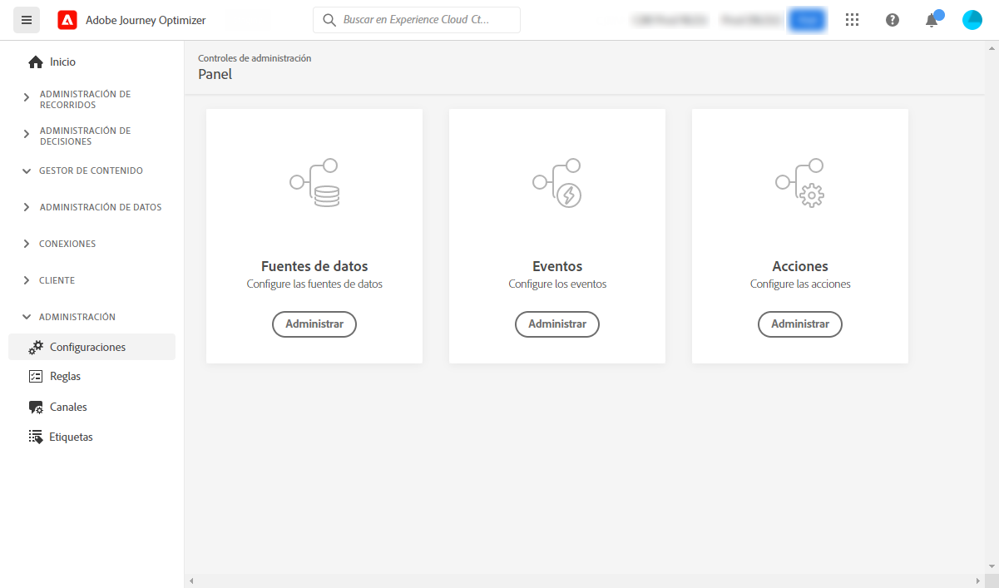

# Introducción para ingenieros de datos {#data-engineer}

Como **Ingeniero de datos de Adobe Journey Optimizer**, prepara y mantiene los datos de perfil del cliente para potenciar las experiencias orquestadas por [!DNL Journey Optimizer], modela los datos de cliente y empresa en esquemas y configura los conectores de origen para la ingesta de datos. Puede comenzar a trabajar con [!DNL Adobe Journey Optimizer] una vez que el [Administrador de sistemas](administrator.md) le conceda acceso y prepare su entorno.

>[!NOTE]
>
>Obtenga más información sobre la **ingesta de datos** en la [documentación de Adobe Experience Platform](https://experienceleague.adobe.com/docs/experience-platform/ingestion/home.html?lang=es){target="_blank"}.

## Pasos esenciales de configuración de datos

Siga estos pasos para configurar la base de datos para Journey Optimizer:

1. **Crear áreas de nombres de identidad**. En Adobe [!DNL Journey Optimizer], las **Identidades** vinculan los consumidores con dispositivos y canales, y el resultado es un gráfico de identidad. El gráfico de identidad vinculado se utiliza para personalizar las experiencias en función de las interacciones en todos los puntos de contacto comerciales. Obtenga más información acerca de identidades y espacios de nombres de identidad [en esta página](../../audience/get-started-identity.md).

   Además, configure **identificadores suplementarios** para permitir que el mismo perfil introduzca varias instancias de recorrido basadas en identificadores secundarios como ID de pedidos o ID de reservas. Obtenga información acerca de [identificadores suplementarios](../../building-journeys/supplemental-identifier.md).

1. **Crear esquemas** y habilitarlos para perfiles. Un esquema es un conjunto de reglas que representan y validan la estructura y el formato de los datos. En un nivel superior, los esquemas proporcionan una definición abstracta de un objeto del mundo real (como una persona) y describen qué datos deben incluirse en cada instancia de ese objeto (como nombre, apellido, cumpleaños, etc.).

   * Para recorridos y campañas estándar: use [esquemas XDM](../../data/get-started-schemas.md)
   * Para campañas orquestadas: cree [esquemas relacionales](../../orchestrated/gs-schemas.md) para habilitar la segmentación de varias entidades

1. **Cree conjuntos de datos** y actívelos para los perfiles. Un conjunto de datos es una construcción de almacenamiento y administración para una colección de datos, normalmente una tabla, que contiene un esquema (columnas) y campos (filas). Los conjuntos de datos también contienen metadatos que describen varios aspectos de los datos que almacenan. Una vez creado un conjunto de datos, puede asignarlo a un esquema existente y agregarle datos. Más información acerca de los conjuntos de datos [en esta página](../../data/get-started-datasets.md).

   En escenarios avanzados, prepare **conjuntos de datos para búsquedas en tiempo de ejecución** a fin de enriquecer la ejecución del recorrido con datos en tiempo real de conjuntos de datos de registros. Obtenga información acerca de [búsqueda de conjuntos de datos](../../building-journeys/dataset-lookup.md).

1. **Configurar conectores de origen**. Adobe Journey Optimizer permite la ingesta de datos de fuentes externas, al tiempo que ofrece la posibilidad de estructurar, etiquetar y mejorar los datos entrantes mediante los servicios de Platform. Puede ingerir datos de una variedad de fuentes, como aplicaciones de Adobe, almacenamiento basado en la nube, bases de datos y muchas otras. Obtenga más información acerca de los conectores de fuentes [en esta página](../get-started-sources.md).

1. **Creación de perfiles de prueba**. Los perfiles de prueba son obligatorios al usar el [modo de prueba](../../building-journeys/testing-the-journey.md) en un recorrido y para [previsualizar y probar los mensajes](../../content-management/preview-test.md) antes de enviarlos. Los pasos para crear perfiles de prueba se detallan [en esta página](../../audience/creating-test-profiles.md).

1. **Configurar atributos calculados** (opcional). Cree atributos derivados a partir de datos de perfil para simplificar la segmentación y la personalización. Los atributos calculados calculan automáticamente métricas complejas como &quot;compras totales en los últimos 90 días&quot; o &quot;valor de pedido promedio&quot;. Obtenga información sobre [atributos calculados](../../audience/computed-attributes.md).

Además, para poder enviar mensajes en recorridos, debe configurar **[!UICONTROL Fuentes de datos]**, **[!UICONTROL Eventos]** y **[!UICONTROL Acciones]**. Obtenga más información [en esta sección](../../configuration/about-data-sources-events-actions.md).

* La configuración de la **fuente de datos** permite definir una conexión con un sistema para recuperar información adicional que se utilizará en los recorridos. Obtenga más información acerca de las fuentes de datos [en esta sección](../../datasource/about-data-sources.md).

* Los **Eventos** le permiten activar sus recorridos de forma unitaria para enviar mensajes, en tiempo real, a la persona que entra en el recorrido. En la configuración de eventos, se configuran los eventos esperados en los recorridos. Los datos entrantes de los eventos se normalizan siguiendo el Modelo de datos de experiencia de Adobe (XDM). Los eventos provienen de las API de ingesta de streaming para eventos autenticados y no autenticados (como eventos del SDK de Adobe Mobile). Obtenga más información acerca de los eventos [en esta sección](../../event/about-events.md).

* [!DNL Journey Optimizer] viene con funcionalidades de mensajes integradas: puede crear los mensajes dentro de un recorrido y diseñar el contenido. Si utiliza un sistema de terceros para enviar mensajes, como Adobe Campaign, cree una **acción personalizada**. Obtenga más información acerca de las acciones [en esta sección](../../action/action.md).

## Monitorización y análisis de datos de recorrido

Una vez que se estén ejecutando los recorridos, puede consultar los eventos de paso del recorrido en el lago de datos para monitorizar el rendimiento, solucionar problemas y analizar el comportamiento de los clientes. Utilice consultas SQL para analizar:

* Patrones de entrada y salida de perfil
* Tasas de error y motivos de descarte
* Leer rendimiento del trabajo de exportación de Audience
* Métricas de rendimiento de acciones personalizadas
* Estados de instancias de recorrido y cuellos de botella

Explore [ejemplos de consultas listos para usar para el análisis de recorrido](../../reports/query-examples.md) para comenzar con el análisis de datos y la solución de problemas.

## Manténgase al día

Manténgase al tanto de las últimas funciones y mejoras de Journey Optimizer:

* **[Notas de la versión](../../rn/release-notes.md)**: revise las nuevas funciones, mejoras y correcciones publicadas cada mes
* **[Actualizaciones de documentación](../../rn/documentation-updates.md)**: haga un seguimiento de los cambios recientes en la documentación, incluidas las páginas nuevas y el contenido actualizado
* **Notificaciones de productos**: habilita las notificaciones en tu [perfil de Adobe Experience Cloud](https://experience.adobe.com/preferences){target="_blank"} para recibir alertas sobre:
   * Nuevas versiones y funciones de productos
   * Ventanas de mantenimiento y actualizaciones del sistema
   * Anuncios y cambios importantes

  Para habilitar las notificaciones, haz clic en tu icono de perfil en la parte superior derecha de Adobe Experience Cloud, ve a **Preferencias > Notificaciones** y configura tus preferencias de notificaciones de Journey Optimizer.
