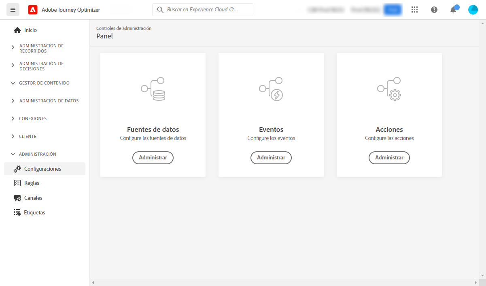

# Introducción para ingenieros de datos {#data-engineer}

>[!BEGINSHADEBOX]

**En esta página:** Cree los esquemas, conjuntos de datos, identidades y fuentes de datos que alimentan Adobe Journey Optimizer para que sus equipos puedan ofrecer experiencias de cliente personalizadas en tiempo real.

>[!ENDSHADEBOX]

Como **arquitecto de datos** o **ingeniero de datos**, usted configura y mantiene los datos de perfil del cliente y otras fuentes de datos que alimentan las experiencias orquestadas por [!DNL Journey Optimizer]. Esto incluye la integración de todos los datos de clientes y empresas, ya sean de fuentes web, CRM o sin conexión, en una vista unificada del cliente de 360 grados. Modele los datos de perfil del cliente y los datos empresariales para crear esquemas, configure los conectores de origen para la ingesta de datos y garantice que los datos fluyan sin problemas para habilitar la participación y las perspectivas de los clientes en tiempo real. Puede comenzar a trabajar con [!DNL Adobe Journey Optimizer] una vez que el [Administrador de sistemas](administrator.md) le conceda acceso y prepare su entorno.

>[!NOTE]
>
>**Orden de implementación:** [Administrador](administrator.md) → Usted está aquí: **Ingeniero de datos** → [Desarrollador](developer.md) → [Especialista en mercadotecnia](marketer.md)
>
>Complete la [configuración del administrador](administrator.md) antes de iniciar el trabajo de base de datos.

>[!NOTE]
>
>Obtenga más información sobre la **ingesta de datos** en la [documentación de Adobe Experience Platform](https://experienceleague.adobe.com/docs/experience-platform/ingestion/home.html?lang=es){target="_blank"}.

>[!TIP]
>
>¿Es su primera vez en Journey Optimizer? Comience con la información general de [Introducción a la administración de datos](../../data/gs-data.md) para comprender los esquemas, conjuntos de datos, identidades, el modelo de fragmentos de perfil y la lista de comprobación de preparación de datos completa antes de adentrarse en la configuración.

## Pasos esenciales de configuración de datos

Siga estos pasos para configurar la base de datos para Journey Optimizer:

1. **Crear espacio de nombres de identidad**. En Adobe [!DNL Journey Optimizer], las **Identidades** vinculan los consumidores con dispositivos y canales, y el resultado es un gráfico de identidad. El gráfico de identidad vinculado se utiliza para personalizar las experiencias en función de las interacciones en todos los puntos de contacto empresariales. Obtenga más información acerca de identidades y espacios de nombres de identidad [en esta página](../../audience/get-started-identity.md).

   Además, configure **identificadores suplementarios** para permitir que el mismo perfil introduzca varias instancias de recorrido basadas en identificadores secundarios como el ID de pedidos o el ID de reservas. Obtenga información acerca de [identificadores suplementarios](../../building-journeys/supplemental-identifier.md).

1. **Cree esquemas** y habilítelos para los perfiles. Un esquema es un conjunto de reglas que representan y validan la estructura y el formato de los datos. En un nivel superior, los esquemas proporcionan una definición abstracta de un objeto del mundo real (como una persona) y describen qué datos deben incluirse en cada instancia de ese objeto (como nombre, apellido, cumpleaños, etc.).

   * Para recorridos y campañas estándar: use [esquemas XDM](../../data/get-started-schemas.md)
   * Para campañas orquestadas: cree [esquemas relacionales](../../orchestrated/gs-schemas.md) para habilitar la segmentación de varias entidades

1. **Cree conjuntos de datos** y habilítelos para los perfiles. Un conjunto de datos es una construcción de almacenamiento y administración para una colección de datos, normalmente una tabla, que contiene un esquema (columnas) y campos (filas). Los conjuntos de datos también contienen metadatos que describen varios aspectos de los datos que almacenan. Una vez creado un conjunto de datos, puede asignarlo a un esquema existente y agregarle datos. Más información acerca de los conjuntos de datos [en esta página](../../data/get-started-datasets.md).

   En escenarios avanzados, prepare **conjuntos de datos para búsquedas en tiempo de ejecución** a fin de enriquecer la ejecución del recorrido con datos en tiempo real de conjuntos de datos de registros. Obtenga información acerca de [búsqueda de conjuntos de datos](../../building-journeys/dataset-lookup.md).

1. **Configuración de conectores de origen**. Adobe Journey Optimizer permite la ingesta de datos de fuentes externas, al tiempo que ofrece la posibilidad de estructurar, etiquetar y mejorar los datos entrantes mediante los servicios de Platform. Puede ingerir datos de una variedad de fuentes, como aplicaciones de Adobe, almacenamiento basado en la nube, bases de datos y muchas otras. Obtenga más información acerca de los conectores de fuentes [en esta página](../get-started-sources.md).

1. **Creación de perfiles de prueba**. Los perfiles de prueba son obligatorios al usar el [modo de prueba](../../building-journeys/testing-the-journey.md) en un recorrido y para [previsualizar y probar los mensajes](../../content-management/preview-test.md) antes de enviarlos. Los pasos para crear perfiles de prueba se detallan [en esta página](../../audience/creating-test-profiles.md).

1. **Configurar atributos calculados** (opcional). Cree atributos derivados a partir de datos de perfil para simplificar la segmentación y la personalización. Los atributos calculados calculan automáticamente métricas complejas como &quot;compras totales en los últimos 90 días&quot; o &quot;valor de pedido promedio&quot;. Conozca los [atributos computados](../../audience/computed-attributes.md).

1. **Conjuntos de datos de exportación de mensajes** (opcional). Cuando la exportación de mensajes está habilitada en el nivel de configuración de canal, el contenido de los mensajes de correo electrónico y SMS enviados se exporta automáticamente a un conjunto de datos de Experience Platform específico para la conformidad, el archivado o el análisis descendente. Más información sobre [exportación de mensajes](../../configuration/message-export.md).

Además, para poder enviar mensajes en recorridos, debe configurar **[!UICONTROL Fuentes de datos]**, **[!UICONTROL Eventos]** y **[!UICONTROL Acciones]**. Obtenga más información [en esta sección](../../configuration/about-data-sources-events-actions.md).

* La configuración de la **fuente de datos** permite definir una conexión con un sistema para recuperar información adicional que se utilizará en los recorridos. Obtenga más información acerca de las fuentes de datos [en esta sección](../../datasource/about-data-sources.md).

* Los **Eventos** le permiten activar sus recorridos de forma unitaria para enviar mensajes, en tiempo real, a la persona que entra en el recorrido. En la configuración de eventos, se configuran los eventos esperados en los recorridos. Los datos entrantes de los eventos se normalizan siguiendo el Modelo de datos de experiencia de Adobe (XDM). Los eventos provienen de las API de ingesta de streaming para eventos autenticados y no autenticados (como eventos del SDK de Adobe Mobile). Obtenga más información acerca de los eventos [en esta sección](../../event/about-events.md).

* [!DNL Journey Optimizer] viene con funcionalidades de mensajes integradas: puede crear los mensajes dentro de un recorrido y diseñar el contenido. Si utiliza un sistema de terceros para enviar mensajes, como Adobe Campaign, cree una **acción personalizada**. Puede obtener más información sobre acciones [en esta sección](../../action/action.md).

## Monitorización y análisis de datos de recorrido

Una vez que se estén ejecutando los recorridos, puede consultar los eventos de paso del recorrido en el lago de datos para monitorizar el rendimiento, solucionar problemas y analizar el comportamiento de los clientes. Utilice consultas SQL para analizar:

* Patrones de entrada y salida de perfil
* Tasas de error y motivos de descarte
* Leer rendimiento del trabajo de exportación de Audience
* Métricas de rendimiento de acciones personalizadas
* Estados de instancias de recorrido y obstáculos

Explore [ejemplos de consultas listos para usar para el análisis de recorrido](../../reports/query-examples.md) para comenzar con el análisis de datos y la solución de problemas.

## Colaboración entre funciones

El trabajo de configuración de datos es esencial para otros equipos:

>[!BEGINTABS]

>[!TAB Trabaje con administradores]

Colabore con [administradores](administrator.md) en el acceso y la gobernanza:

* Solicitar los permisos necesarios para la administración de datos y la creación de esquemas
* Coordinación del acceso a la zona protegida para desarrollo y pruebas
* Alinear en políticas de gobernanza de datos y gestión del consentimiento
* Análisis de las políticas de retención de datos y los requisitos de almacenamiento

>[!TAB Trabaje con desarrolladores]

Colabore con [desarrolladores](developer.md) en la estructura y los eventos de datos:

* Proporcione los esquemas XDM y las estructuras de eventos que necesitan implementar
* Defina qué eventos deben enviarse y su formato de carga útil requerido
* Alinee los requisitos de recopilación de datos y los estándares de calidad de datos
* Pruebe conjuntamente la entrega de eventos y la ingesta de datos

>[!TAB Trabaje con expertos en marketing]

Colabore con [expertos en marketing](marketer.md) en públicos y datos:

* Cree atributos calculados para la personalización y la segmentación
* Cree públicos en función de sus necesidades de campaña y recorrido
* Configure esquemas relacionales para campañas orquestadas
* Compatibilidad con la segmentación de varias entidades para casos de uso avanzados

>[!ENDTABS]

## Otras guías de funciones {#other-role-guides}

| Función | Guía |
|------|-------|
| Administrador | [Introducción para administradores](administrator.md) |
| Ingeniero de datos | [Introducción para ingenieros de datos](data-engineer.md) |
| Desarrollador | [Introducción para desarrolladores](developer.md) |
| Experto en marketing | [Introducción para expertos en marketing](marketer.md) |

Volver a [Resumen de funciones y responsabilidades](../quick-start.md) · Volver a [Introducción](../../../rp_landing_pages/get-started-landing-page.md)
