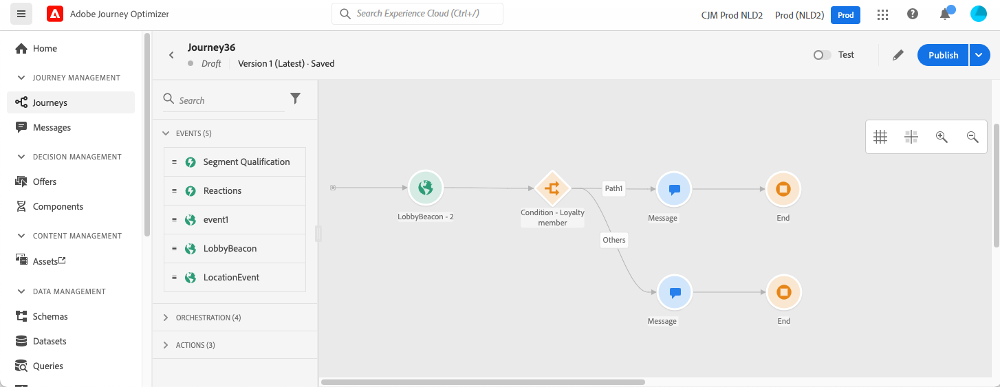

# Get started for Marketers {#get-started-marketers}

******** [!DNL Adobe Journey Optimizer]

Refer to the following sections to set up your first journey, add offers and assets, and send messages:

1. **Creación de segmentos**. ****   

1. **Crear mensajes**. 

   

1. **Adición de personalización**. Leverage Journey Optimizer personalization capabilities to adapt your message to your audience. 

   

1. **** [!DNL Adobe Experience Manager Assets Essentials] Obtenga más información [en esta sección](../../messages/assets-essentials.md).

1. **Agregar ofertas**. Utilice [!DNL Journey Optimizer] para ofrecer la mejor oferta y experiencia a sus clientes en todos los puntos de contacto y en el momento adecuado. Una vez diseñadas, las audiencias se segmentarán con ofertas personalizadas. 

   

1. **** Once your message content has been defined, you can use test profiles to preview and test it.  ****[!DNL Journey Optimizer]**** You can then ensure your email content looks great and works properly in every inbox. 

1. **** [!DNL Journey Optimizer] Design multistep advanced scenarios powered by following capabilities:

   * ********

   * ****

   * ****[!DNL Journey Optimizer]****

   * ****

   

   

1. **** [!DNL Journey Optimizer] 
