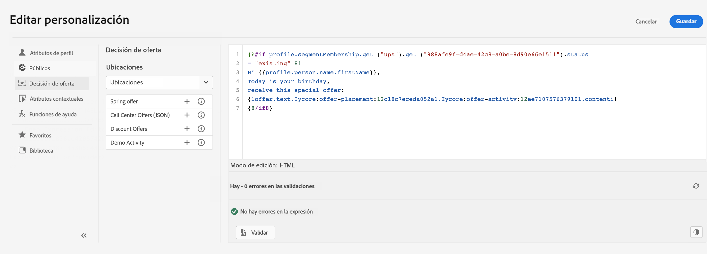
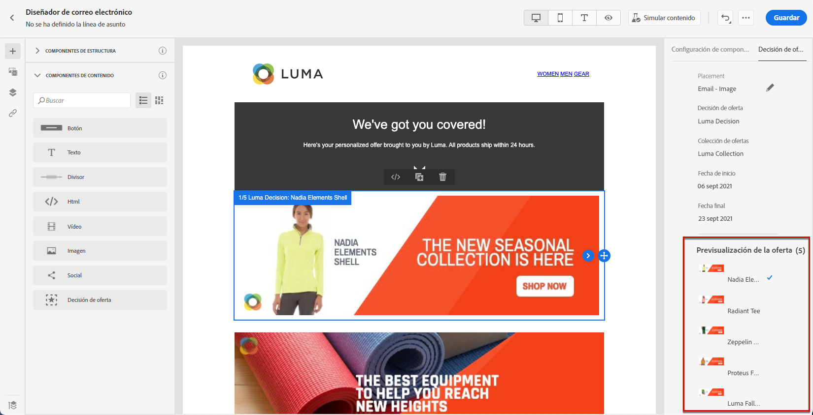
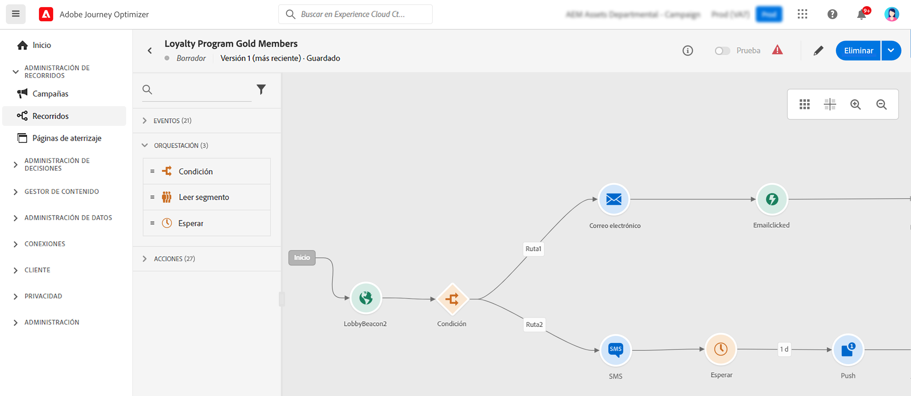

# Introducción para expertos en marketing {#get-started-marketers}

Como **experto en marketing** o **profesional empresarial**, diseña recorridos de clientes para ofrecer experiencias personales y contextuales a los clientes. Puede crear y administrar los distintos componentes de estos recorridos personalizados, incluidos los mensajes de correo electrónico y push, las ofertas y los componentes de decisión para personalizar de forma inteligente el contenido del mensaje. Journey Optimizer proporciona una experiencia de usuario unificada en la que puede implementar casos de uso de extremo a extremo completos en un solo lugar. Puede comenzar a trabajar con [!DNL Adobe Journey Optimizer] una vez que la variable [Administrador del sistema](administrator.md) e [Ingeniero de datos](data-engineer.md) le conceda acceso y prepare su entorno.

## Comience con lo esencial

Journey Optimizer aúna en una sola aplicación las perspectivas de los clientes en tiempo real, la orquestación omnicanal moderna y la toma de decisiones inteligente. Cree experiencias de cliente personalizadas y conectadas en correos electrónicos, SMS, push, en aplicaciones, web, tarjetas de contenido y mucho más.

Journey Optimizer ofrece dos poderosos enfoques de orquestación:

* **Recorridos**: participación de persona a persona en tiempo real en la que cada cliente avanza a su propio ritmo, desencadenada por comportamientos o eventos
* **Campañas orquestadas**: campañas por lotes complejas de varios pasos a escala en las que los públicos avanzan juntos a través de flujos de trabajo, perfectos para campañas iniciadas por la marca como promociones de temporada, lanzamientos de productos o comunicaciones basadas en cuentas

Trabaje con sus [administradores](administrator.md) para obtener acceso a [ingenieros de datos](data-engineer.md) y con ellos configurar públicos, datos y esquemas relacionales para la segmentación avanzada.

Siga estos pasos principales para empezar a crear experiencias:

1. **Crear públicos**. Cree públicos a través de definiciones de segmentos, cargue archivos CSV o utilice la composición de público. Journey Optimizer ofrece varias formas de dirigirse a los clientes adecuados. Más información sobre [públicos](../../audience/about-audiences.md) y [creación de definiciones de segmento](../../audience/creating-a-segment-definition.md).

1. **Contenido de diseño**. Cree mensajes atractivos en todos los canales, incluidos correo electrónico, SMS, push, en la aplicación, web y tarjetas de contenido:
   * Use el **Asistente de IA** para generar contenido de correo electrónico, líneas de asunto e imágenes según las directrices de su marca. [Más información sobre la generación de contenido de IA](../../content-management/gs-generative.md)
   * **Personalice mensajes** con datos de clientes, contenido dinámico y lógica condicional. [Más información sobre la personalización](../../personalization/personalize.md)
   * **Itere en datos contextuales** para mostrar listas dinámicas a partir de eventos, acciones personalizadas y búsquedas de conjuntos de datos. [Obtenga información sobre cómo iterar datos contextuales](../../personalization/iterate-contextual-data.md)
   * Cree **plantillas de contenido** y **fragmentos** reutilizables para mantener la coherencia de la marca. [Trabajo con plantillas](../../content-management/content-templates.md)
   * Entregue **tarjetas de contenido** persistentes y no intrusivas en aplicaciones móviles y sitios web. A diferencia de las notificaciones push, las tarjetas de contenido permanecen visibles hasta que se descartan. [Más información sobre las tarjetas de contenido](../../content-card/create-content-card.md)
   * Administre recursos con la integración de **Adobe Experience Manager Assets**. [Más información sobre los recursos](../../integrations/assets.md)

   

1. **Añada ofertas y toma de decisiones**. Ofrezca la mejor oferta a cada cliente en el momento adecuado mediante el uso de toma de decisiones con tecnología de IA. Obtenga información acerca de la [Gestión de decisiones](../../offers/get-started/starting-offer-decisioning.md) y las [Decisiones sobre experiencias](../../experience-decisioning/gs-experience-decisioning.md).

   

1. **Prueba y validación**. Previsualice y pruebe el contenido antes de enviar:
   * Use **perfiles de prueba** para obtener una vista previa de la personalización y comprobar el renderizado en todos los dispositivos
   * Realice pruebas con **datos de muestra** de archivos CSV/JSON
   * Vista previa de **renderizado de correo electrónico** en clientes de correo electrónico populares
   * Ejecute **pruebas y experimentos A/B** para optimizar las variaciones de contenido. Utilice la experimentación de bandidos multiarmados para asignar automáticamente más tráfico a variaciones ganadoras en tiempo real. [Más información sobre la experimentación](../../content-management/content-experiment.md)
   * Configure **flujos de trabajo de aprobación** para campañas y recorridos (requiere licencia adicional). [Más información sobre las aprobaciones](../../test-approve/gs-approval.md)

   Aprenda a [probar y validar mensajes](../../content-management/preview-test.md).

1. **Genere recorridos de cliente**. Cree experiencias personalizadas en tiempo real mediante el lienzo de recorrido:

   * Active recorridos con **eventos** (acciones del cliente) o **públicos** (envíos por lotes)
   * Añada **condiciones** para crear rutas personalizadas basadas en datos de clientes
   * Use **actividades de espera** para crear una sincronización perfecta entre los mensajes
   * Envíe mensajes a través de **varios canales** dentro de un recorrido
   * Aplique **pruebas A/B** y optimice los tiempos de envío para maximizar la participación
   * Use **búsqueda de conjuntos de datos** para enriquecer recorridos con datos en tiempo real de Adobe Experience Platform. [Más información sobre la búsqueda de conjuntos de datos](../../building-journeys/dataset-lookup.md)
   * Aproveche **identificadores suplementarios** para permitir que el mismo perfil introduzca varias instancias de recorrido (por ejemplo, pedidos o reservas diferentes). [Más información sobre los identificadores suplementarios](../../building-journeys/supplemental-identifier.md)

   

   Aprenda a [diseñar y ejecutar recorridos](../../building-journeys/journey-gs.md) y a explorar [casos de uso de recorridos](../../building-journeys/jo-use-cases.md). Conozca los [criterios de entrada y salida](../../building-journeys/entry-exit-criteria-guide.md) para controlar el flujo del perfil.

1. **Inicie campañas orquestadas**. Diseñe campañas por lotes complejas y de varios pasos a escala utilizando un lienzo visual:

   * Genere **públicos a petición** al instante mediante consultas relacionales para conectar los datos de los clientes con cuentas, compras, suscripciones y otras entidades
   * Cree **segmentación de varias entidades** para una segmentación precisa (por ejemplo, “clientes con suscripciones que caducan en 30 días” o “cuentas con compras recientes de alto valor”).
   * Obtenga **visibilidad previa al envío** con recuentos de público precisos antes del inicio
   * Diseñe **flujos de trabajo de varios pasos** para promociones de temporada, lanzamientos de productos, ofertas de fidelidad o marketing basado en cuentas
   * Programe campañas para que se ejecuten de inmediato, en momentos específicos o en programaciones recurrentes (diaria, semanal, mensual)
   * Procese públicos en **modo por lotes** donde todos los perfiles avanzan juntos a través del flujo de trabajo

   Aprenda a [empezar a usar campañas orquestadas](../../orchestrated/gs-orchestrated-campaigns.md) y sepa cuándo [usar campañas en lugar de recorridos](../../orchestrated/orchestrated-campaigns-faq.md).

1. **Supervise y optimice**. Rastree el rendimiento y mejore los resultados con el tiempo:
   * Supervise el rendimiento de un **recorrido activo** e identifique obstáculos
   * Análisis de tasas y métricas de participación en el **envío de mensajes**
   * Uso de **tableros de informes** con la integración de Customer Journey Analytics
   * Rastreo de **conversión** e impacto en la empresa
   * Gestione la **frecuencia de mensajes y priorización** con reglas de administración de conflictos para evitar la sobrecomunicación. [Más información sobre la gestión de conflictos](../../conflict-prioritization/gs-conflict-prioritization.md)

   Aprenda a [supervisar el rendimiento](../../reports/report-gs-cja.md).

## Prácticas recomendadas para el éxito

### Creación de contenido

* **Comience con plantillas**: use plantillas prediseñadas y fragmentos de contenido para acelerar la creación y mantener la coherencia
* **Realice pruebas tempranas y con frecuencia**: obtenga siempre una vista previa del contenido en todos los dispositivos y utilice perfiles de prueba para validar la personalización
* **Aproveche bien la IA**: use el Asistente para IA para los borradores y las variaciones iniciales, pero siempre revise y perfeccione la voz de su marca
* **Simplifique**: los mensajes claros y concisos con llamadas a la acción potentes funcionan mejor que los diseños complejos

### Diseño de recorrido

* **Defina metas claras**: defina métricas de éxito antes de generar su recorrido
* **Asigne la experiencia del cliente**: visualice todo el recorrido antes de la implementación
* **Use las actividades de espera estratégicamente**: dé a los clientes tiempo para interactuar antes de enviar los seguimientos
* **Planee estrategias de salida**: defina cuándo y por qué los clientes deben salir del recorrido
* **Realice la prueba en modo borrador**: valide la lógica del recorrido con el ensayo antes de activarlo

[Conozca las prácticas recomendadas sobre el recorrido](../../building-journeys/entry-exit-criteria-guide.md#best-practices)

### Orquestación de campañas

* **Elija el enfoque correcto**: [Compare tipos de recorridos](../../building-journeys/journey.md#journey-types) para experiencias en tiempo real activadas por comportamientos o [tipos de campañas](../../campaigns/get-started-with-campaigns.md#campaign-types) para campañas programadas por lotes
* **Defina objetivos de campaña claros**: establezca metas antes de diseñar flujos de trabajo de varios pasos
* **Comience con públicos piloto**: valide los recuentos y la lógica de segmentación antes de escalar
* **Aproveche los datos relacionales**: use la segmentación de varias entidades para conectar los datos de los clientes con cuentas, compras y suscripciones para una segmentación precisa.
* **Mantenga la segmentación simple**: optimice el rendimiento y la transparencia con reglas claras y que se puedan mantener
* **Use un nombre coherente**: facilite la administración de campañas con convenciones de nomenclatura claras

### Segmentación de público

* **Segmente cuidadosamente**: cree segmentos de público específicos y procesables basados en criterios claros
* **Actualice con regularidad**: asegúrese de que los públicos estén actualizados configurando las programaciones de evaluación adecuadas
* **Equilibre el tamaño y la precisión**: segmente públicos destinatarios lo suficientemente grandes para la relevancia estadística pero lo suficientemente específicos para ser significativos
* **Use atributos de enriquecimiento**: aproveche los atributos calculados y los datos de enriquecimiento para una personalización más profunda

### Gestión de la frecuencia

* **Respete las preferencias del cliente**: cumpla las cláusulas de exclusión voluntaria y las preferencias de comunicación
* **Defina límites de frecuencia**: utilice conjuntos de reglas para evitar la fatiga de los mensajes entre canales
* **Coordinar campañas**: use la administración de conflictos para asegurarse de que los clientes reciban el mensaje correcto en el momento adecuado
* **Supervise la participación**: observe si hay signos de fatiga (disminución de las tasas de apertura, aumento de las cancelaciones de suscripción)

[Más información sobre la restricción de frecuencia](../../conflict-prioritization/channel-capping.md)

## Explorar casos de uso

Aprenda de los ejemplos prácticos que muestran las funcionalidades de Journey Optimizer:

**Casos de uso de recorrido** (en tiempo real, de persona a persona):

* **Serie de bienvenida**: incorpore nuevos clientes con recorridos personalizados de varios pasos. [Ver caso de uso](https://experienceleague.adobe.com/es/docs/journey-optimizer-learn/tutorials/use-cases/customer-onboarding)
* **Recuperación del carro de compras abandonado**: vuelva a atraer a los clientes que dejaron artículos en el carro de compras. [Ver caso de uso](https://experienceleague.adobe.com/es/docs/journey-optimizer-learn/tutorials/use-cases/abandoned-cart)
* **Mensajería impulsada por eventos**: responda a las acciones de los clientes en tiempo real
* **Campañas de cumpleaños**: envíe mensajes de cumpleaños personalizados activados por fechas de perfil
* **Recomendaciones de productos**: sugiera productos relevantes según el historial de compra y navegación

**Casos de uso de campañas orquestadas** (por lotes, de uno a varios):

* **Promociones de temporada**: inicie campañas coordinadas entre segmentos de clientes (por ejemplo, ventas de vacaciones, regreso al colegio)
* **Lanzamientos de productos**: anuncie nuevos productos a públicos de destino con mensajería secuenciada
* **Ofertas de programas de fidelización**: recompense a los clientes de alto valor con ofertas escalonadas basadas en el historial de compras
* **Marketing basado en cuentas**: segmente cuentas con características específicas y contactos relacionados
* **Renovaciones de suscripciones**: llegue a los clientes con suscripciones que caducarán pronto mediante consultas de varias entidades
* **Campañas de renovación de participación**: recupere clientes inactivos con ofertas segmentadas en modo por lotes. [Ver caso de uso](https://experienceleague.adobe.com/es/docs/experience-platform/rtcdp/use-cases/personalization-insights-engagement/use-cases-luma)

**Patrones de recorrido:**

* [Envíe mensajes a los suscriptores](../../building-journeys/message-to-subscribers-uc.md): Diríjase a listas de suscripción con contenido personalizado
* [Mensajería multicanal](../../building-journeys/journeys-uc.md): combine correo electrónico y push con eventos de reacción
* [Correos electrónicos solo de día laborable](../../building-journeys/weekday-email-uc.md): programe comunicaciones con condiciones basadas en el tiempo

Examine la [biblioteca de casos de uso de recorrido](../../building-journeys/jo-use-cases.md) completa y obtenga más información sobre [campañas orquestadas](../../orchestrated/gs-orchestrated-campaigns.md).

## Colaboración entre funciones

Su trabajo de marketing se conecta con otros equipos:

>[!BEGINTABS]

>[!TAB Trabaje con ingenieros de datos]

Colabore con [ingenieros de datos](data-engineer.md) en las configuraciones de datos y públicos:

* Solicite nuevos atributos calculados para la personalización y segmentación
* Coordinación en esquemas relacionales para campañas orquestadas
* Proporcionar comentarios sobre la calidad del público y la precisión de los datos
* Alineación en los requisitos de datos de varias entidades para una segmentación avanzada

>[!TAB Trabaje con desarrolladores]

Colabore con [desarrolladores](developer.md) en el seguimiento y la implementación de eventos:

* Alineación sobre qué interacciones del usuario deben activar los eventos de recorrido
* Prueba de implementaciones móviles y web antes del lanzamiento
* Validación del seguimiento para el rendimiento del contenido y la participación del usuario
* Solución de problemas con el envío o la personalización de mensajes

>[!TAB Trabaje con administradores]

Colabore con [administradores](administrator.md) en el acceso y las configuraciones:

* Solicite configuraciones de canal para sus campañas y recorridos
* Confirme el acceso a la licencia para campañas orquestadas y otras funciones
* Informar de problemas con permisos o acceso
* Coordinación en los entornos de prueba y habilitación de nuevas funciones

>[!ENDTABS]

## Próximos pasos

1. **Empiece poco a poco**: cree un recorrido de bienvenida simple o una campaña de un solo mensaje para conocer la plataforma
2. **Aproveche la IA**: use el Asistente de IA para hacer preguntas y acelerar la creación de contenido
3. **Únase a la comunidad**: conéctese con otros usuarios de Journey Optimizer en la [Comunidad de Experience League](https://experienceleaguecommunities.adobe.com/t5/journey-optimizer/ct-p/journey-optimizer?profile.language=es){target="_blank"}
4. **Explore tutoriales**: vea vídeos paso a paso en [Experience League](https://experienceleague.adobe.com/docs/journey-optimizer-learn/tutorials/overview.html?lang=es){target="_blank"}
