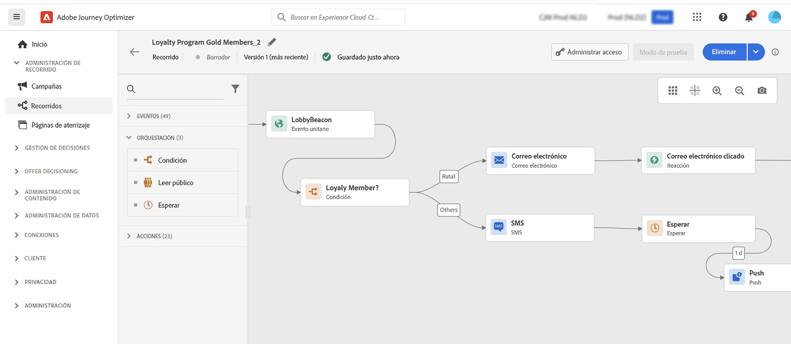

# Introducción para expertos en marketing {#get-started-marketers}

Como **Experto en marketing** o **Profesional en recorridos** es responsable de crear ofertas y recorridos, y diseñar contenido. Puede comenzar a trabajar con [!DNL Adobe Journey Optimizer] una vez que la variable [Administrador del sistema](administrator.md) e [Ingeniero de datos](data-engineer.md) le conceda acceso y prepare su entorno.

Consulte las secciones siguientes para configurar su primer recorrido, agregar ofertas y recursos, y enviar mensajes:

1. **Crear públicos**. Journey Optimizer le permite crear públicos mediante definiciones de segmentos directamente desde el menú **Públicos** y aprovecharlos en sus recorridos.  Más información sobre los públicos [en esta página](../../audience/about-audiences.md). Descubra cómo generar segmentos [en esta muestra](../../audience/creating-a-segment-definition.md).

1. **Añadir personalización y contenido dinámico**. Aproveche las funcionalidades de personalización y contenido dinámico de Journey Optimizer para adaptar el mensaje a su público. Más información sobre [personalización](../../personalization/personalize.md) y [contenido dinámico](../../personalization/get-started-dynamic-content.md).

   

1. **Creación y administración de recursos**. [!DNL Adobe Experience Manager Assets] proporciona un único repositorio centralizado de recursos que puede utilizar para completar los mensajes. Obtenga más información [en esta sección](../../integrations/assets.md).

1. **Agregar ofertas**. Utilice [!DNL Journey Optimizer] para ofrecer la mejor oferta y experiencia a sus clientes en todos los puntos de contacto y en el momento adecuado. Una vez diseñados, los públicos se segmentarán con ofertas personalizadas. Obtenga más información sobre la gestión de deciones [en esta sección](../../offers/get-started/starting-offer-decisioning.md).

   

1. **Prueba y validación**. Una vez definido el contenido, puede utilizar perfiles de prueba o datos de entrada de muestra cargados desde un archivo CSV o JSON, o añadidos manualmente para obtener una vista previa de su contenido.

   Si ha insertado [contenido personalizado](../../personalization/personalize.md), podrá comprobar cómo se muestra este contenido en el mensaje. Además, aproveche la cuenta **Litmus** en [!DNL Journey Optimizer] para previsualizar instantáneamente su **representación de correo electrónico** en clientes de correo electrónico populares. A continuación, puede asegurarse de que el contenido del correo electrónico tenga buen aspecto y funcione correctamente en cada bandeja de entrada. Obtenga información sobre cómo probar y validar los mensajes [en esta sección](../../content-management/preview-test.md).

1. **Diseñar recorridos de clientes** para ofrecer experiencias personalizadas y contextuales. [!DNL Journey Optimizer] permiten crear casos prácticos de orquestación en tiempo real con información contextual almacenada en eventos o fuentes de datos. Diseñe escenarios avanzados de varios pasos con las siguientes capacidades:

   * Envíe en tiempo real un **envío unitario** que se activa cuando se recibe un evento, o **en lote** con los públicos de Adobe Experience Platform.

   * Aprovechar **datos contextuales** desde eventos, información de Adobe Experience Platform o datos de servicios API de terceros.

   * Utilice las **acciones de canal integradas** (correo electrónico, SMS, push, InApp) para enviar mensajes diseñados en [!DNL Journey Optimizer] o cree **acciones personalizadas** si utiliza un sistema de terceros para enviar sus mensajes.

   * Con el **diseñador de recorridos**, genere sus casos de uso de varios pasos: arrastre y suelte fácilmente un evento de entrada o una actividad de lectura de público, agregue condiciones y envíe mensajes personalizados.

   

   Aprenda a diseñar y ejecutar recorridos [en esta sección](../../building-journeys/journey-gs.md)

1. **Monitorización de mensajes y recorridos**. Para asegurarse de que los mensajes se ejecuten, envíen y entreguen correctamente, [!DNL Journey Optimizer] ofrece funciones para supervisar los mensajes que se publican y activan en ese momento. Obtenga información sobre cómo monitorizar el rendimiento [en esta sección](../../reports/report-gs-cja.md).
