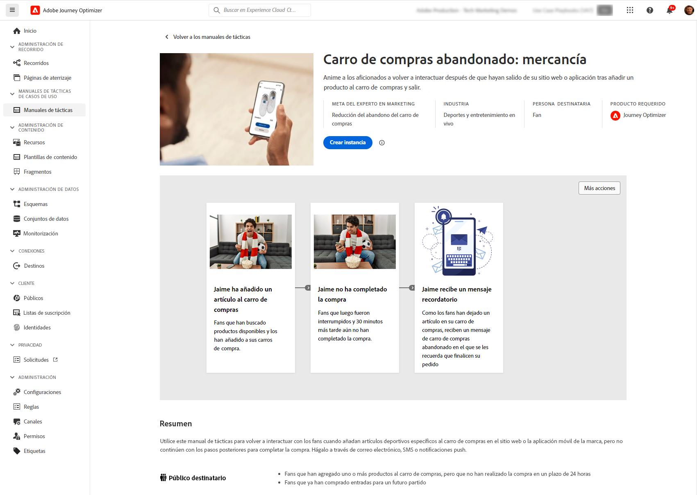

# Manuales de tácticas de casos de uso {#playbooks}

## Qué son los manuales de tácticas de casos de uso {#gs}

Los manuales de tácticas de casos de uso son flujos de trabajo predefinidos que abordan casos de uso comunes que se pueden realizar con Adobe Experience Platform y Journey Optimizer.

{width="85%"}

Cada manual de tácticas ofrece información general completa, incluida la intención, los objetivos, las personas objetivo y los recursos necesarios para implementarla. Además, hay disponible un diagrama de ideas en cada manual de tácticas para representar visualmente los puntos de contacto del cliente en la vida real asociados con el manual de tácticas.

{width="85%"}

## Requisitos previos {#prerequisites}

Se requieren los siguientes pasos de configuración para trabajar con los manuales de tácticas de casos de uso. Encontrará información detallada sobre cada paso en la página [Introducción](https://experienceleague.adobe.com/docs/experience-platform/use-case-playbooks/playbooks/get-started.html?lang=es){target="_blank"} de la documentación de manuales de tácticas de casos de uso.

* Creación de una zona protegida
* Configuración de permisos de usuario
* Ajuste de las configuraciones de canal de Journey Optimizer para notificaciones por correo electrónico, push y SMS

## Acceso y activación de un manual de tácticas {#access}

Para acceder a los manuales de tácticas, vaya a **[!UICONTROL Manuales de tácticas]** situados en el carril de navegación izquierdo. La biblioteca incluye varios manuales de tácticas que se implementan con Adobe Journey Optimizer. Para acceder a ellos fácilmente, utilice los filtros disponibles junto a la barra de búsqueda. Una lista completa de los manuales de tácticas de Journey Optimizer está disponible en la [Documentación de manuales de tácticas de casos de uso](https://experienceleague.adobe.com/docs/experience-platform/use-case-playbooks/playbooks/playbooks-list.html?lang=es){target="_blank"}.

{width="85%"}

Cuando haya elegido el manual de tácticas que mejor se adapte a sus necesidades, puede habilitarlo. Se crea una instancia del manual de tácticas y genera automáticamente los recursos necesarios para admitir el caso de uso específico. Los recursos incluyen recursos de Journey Optimizer como recorridos, mensajes y recursos de Adobe Experience Platform como esquemas o segmentos.

>[!NOTE]
>
>Estos objetos tienen como propósito ayudarle a comprender todos los recursos necesarios para implementar su caso de uso específico. No contienen datos y se crean en zonas protegidas de desarrollo. 

Para implementar su caso de uso, puede navegar a cada objeto para adaptarlo a sus necesidades. También puede compartir la URL de la página de instancia del manual de tácticas entre su equipo para colaborar en la implementación del caso de uso.

Además, puede importar los recursos de los manuales de tácticas a otras zonas protegidas. Esto le permite alinear los recursos generados con los existentes y asegurarse de que sean compatibles con los datos, en caso de que ya haya configurado sus propios esquemas, campos y grupos de campos. Estos pasos se detallan en la documentación de manuales de tácticas de casos de uso: [Publicar recursos generados por manuales de tácticas en otras zonas protegidas](https://experienceleague.adobe.com/docs/experience-platform/use-case-playbooks/playbooks/data-awareness.html?lang=es){target="_blank"}.

## Cree sus propios libros de reproducción (beta privada) {#create}

>[!AVAILABILITY]
>
>En la actualidad, la creación de libros de reproducción de casos de uso solo está disponible para un conjunto de organizaciones como una versión beta privada. Para obtener acceso, póngase en contacto con su representante de Adobe.

Además de aprovechar los manuales de tácticas predefinidos, puede crear y compartir sus propios manuales de tácticas en Adobe Experience Platform.

Puede definir metadatos mediante la asistencia de IA o entradas manuales, asociar activos técnicos como esquemas, segmentos y compartir manuales de tácticas entre diferentes organizaciones de IMS.

Para obtener más información sobre cómo crear y compartir manuales de tácticas, consulte la documentación de libros de reproducción de casos de uso: [Cree y comparta sus propios manuales de tácticas con el Asistente de IA](https://experienceleague.adobe.com/docs/experience-platform/use-case-playbooks/playbooks/author.html?lang=es#sharing-playbooks-sandboxes){target="_blank"}.
