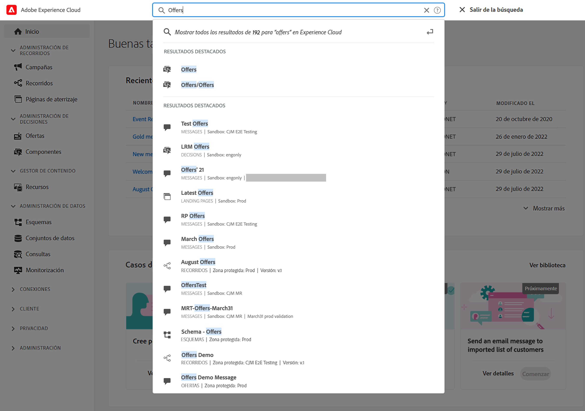
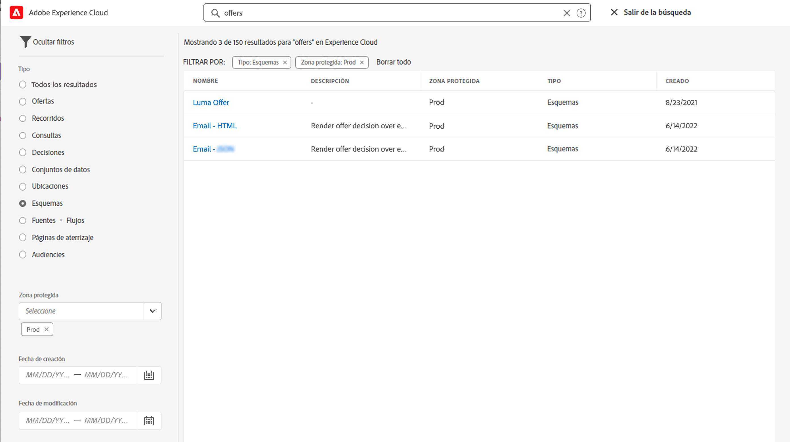
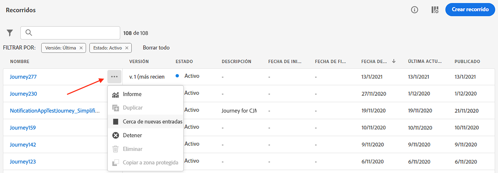
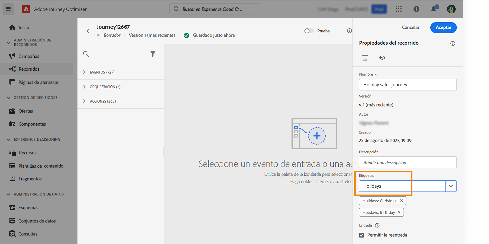
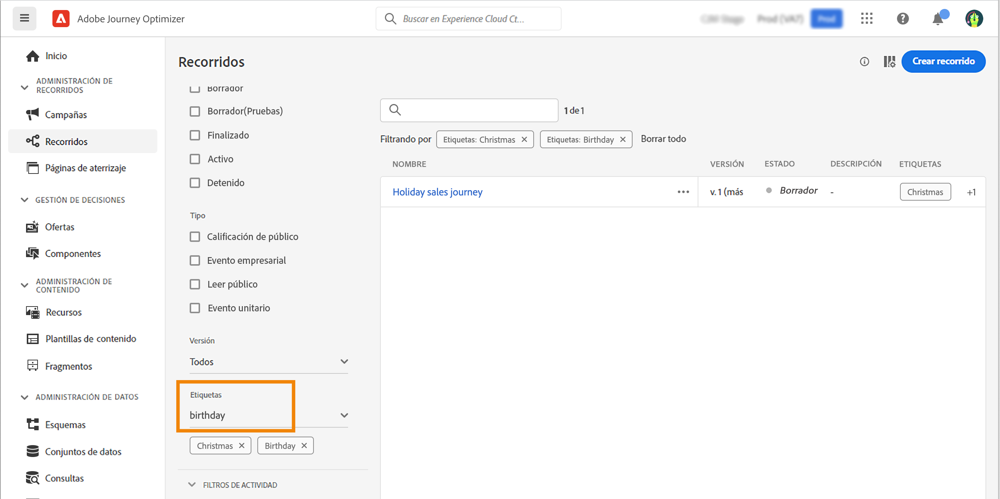
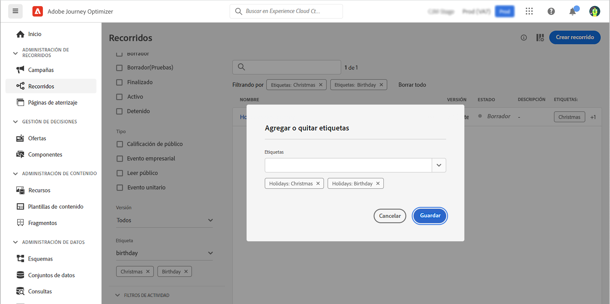

# Buscar, filtrar, organizar {#search-filter-organize}

## Buscar{#unified-search}

En cualquier lugar de la interfaz de Adobe Journey Optimizer, utilice la búsqueda unificada de Adobe Experience Cloud en el centro de la barra superior para buscar recursos, recorridos, conjuntos de datos y más en las zonas protegidas.

Empiece a introducir contenido para mostrar los resultados principales. Los artículos de ayuda sobre las palabras clave introducidas también se muestran en los resultados.

Pulse **Entrar** para acceder a todos los resultados y filtrar por objeto empresarial.

## Filtrar listas{#filter-lists}

En la mayoría de las listas, utilice la barra de búsqueda para buscar elementos específicos y defina los criterios de filtrado.

Se puede acceder a los filtros haciendo clic en el icono de filtro en la parte superior izquierda de la lista. El menú de filtro le permite filtrar los elementos mostrados según diferentes criterios: Puede elegir mostrar solo los elementos de un determinado tipo o estado, los que ha creado o los modificados en los últimos 30 días. Las opciones difieren según el contexto.

Además, puede utilizar etiquetas unificadas para filtrar una lista en función de las etiquetas asignadas a un objeto. Por ahora, las etiquetas están disponibles para recorridos y campañas. [Aprenda a trabajar con etiquetas](#tags)

>[!NOTE]
>
>Tenga en cuenta que las columnas mostradas se pueden personalizar mediante el botón de configuración en la parte superior derecha de las listas. La personalización se guarda para cada usuario.

En las listas, puede realizar acciones básicas por cada elemento. Por ejemplo, puede duplicar o eliminar un elemento.

## Trabajar con etiquetas unificadas {#tags}

Con Adobe Experience Platform [Etiquetas unificadas](https://experienceleague.adobe.com/docs/experience-platform/administrative-tags/overview.html), puede clasificar fácilmente sus recorridos y campañas de Journey Optimizer para mejorar la búsqueda en las listas.

>[!AVAILABILITY]
>
>Las etiquetas unificadas están actualmente en versión beta. La documentación y las funciones están sujetas a cambios.

### Añadir etiquetas a un objeto

La variable **Etiquetas** , en el campo [recorrido](../building-journeys/journey-gs.md#change-properties) o [campaign](../campaigns/create-campaign.md#create) , permite definir etiquetas para el objeto. Puede seleccionar una etiqueta existente o crear una nueva.

Empiece a escribir el nombre de la etiqueta deseada y selecciónela en la lista. Si no está disponible, haga clic en **Crear** para crear uno nuevo y añadirlo. Puede definir tantas etiquetas como sea necesario.

La lista de etiquetas definidas se muestra debajo de la etiqueta **Etiquetas** campo .

>[!NOTE]
>
> Las etiquetas distinguen entre mayúsculas y minúsculas
> 
> Si duplica o crea una nueva versión de un recorrido o campaña, se conservan las etiquetas.

### Filtrar por etiquetas

Las listas de recorridos y campañas muestran una columna dedicada para que pueda visualizar fácilmente las etiquetas.

Un filtro también está disponible para mostrar únicamente recorridos o campañas con determinadas etiquetas.

Puede añadir o eliminar etiquetas de cualquier tipo de recorrido o campaña (activo, borrador, etc.). Para ello, haga clic en el botón **Más acciones** junto al objeto y seleccione **Editar etiquetas**.

### Administrar etiquetas

Los administradores pueden eliminar etiquetas y organizarlas por categorías utilizando la variable **Etiquetas** en **ADMINISTRACIÓN**. Obtenga más información sobre la administración de etiquetas en [Documentación de etiquetas unificadas](https://experienceleague.adobe.com/docs/experience-platform/administrative-tags/ui/managing-tags.html).

>[!NOTE]
>
> Etiquetas creadas directamente a partir de **[!UICONTROL Etiquetas]** en Journey Optimizer se añaden automáticamente a la categoría integrada &quot;Sin categoría&quot;.
