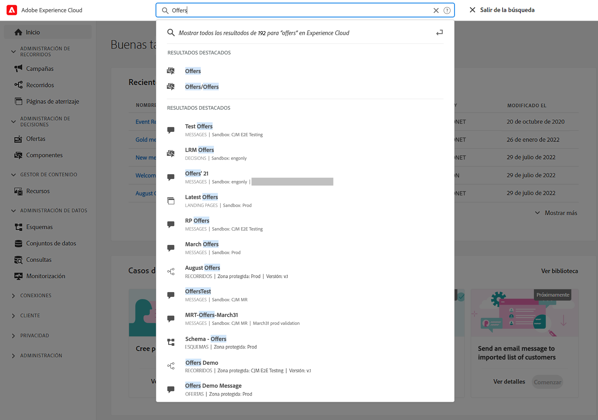
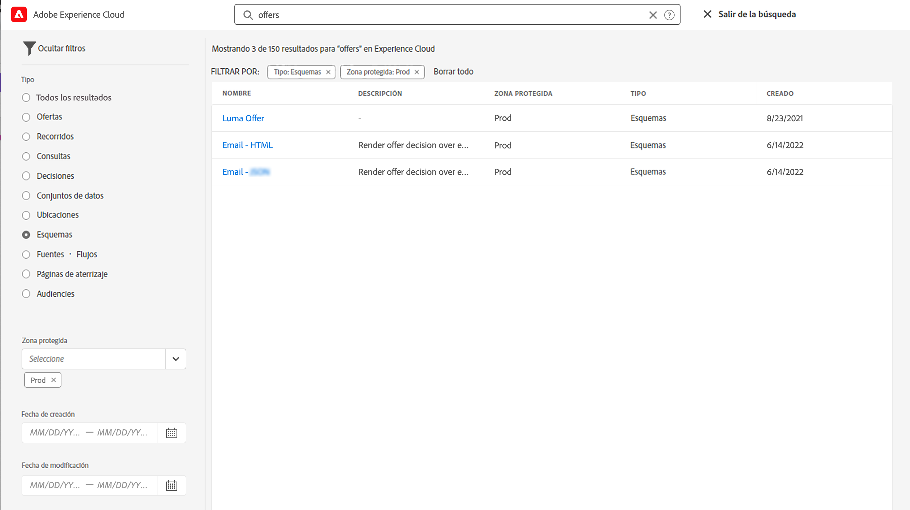
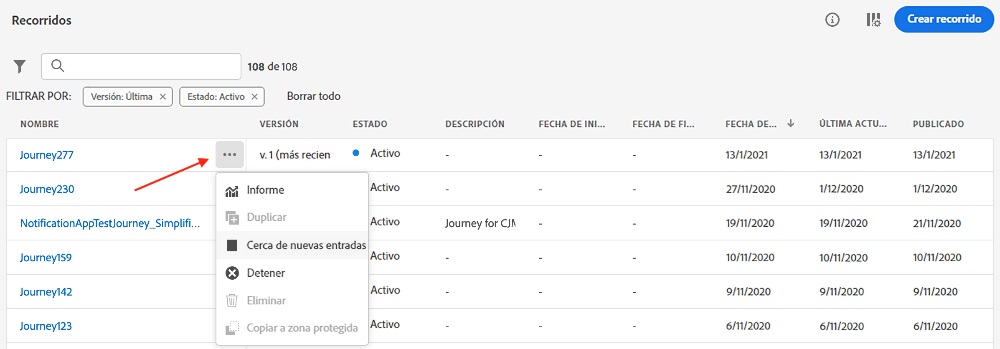
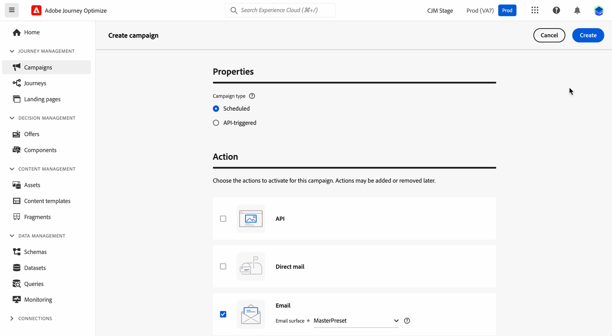
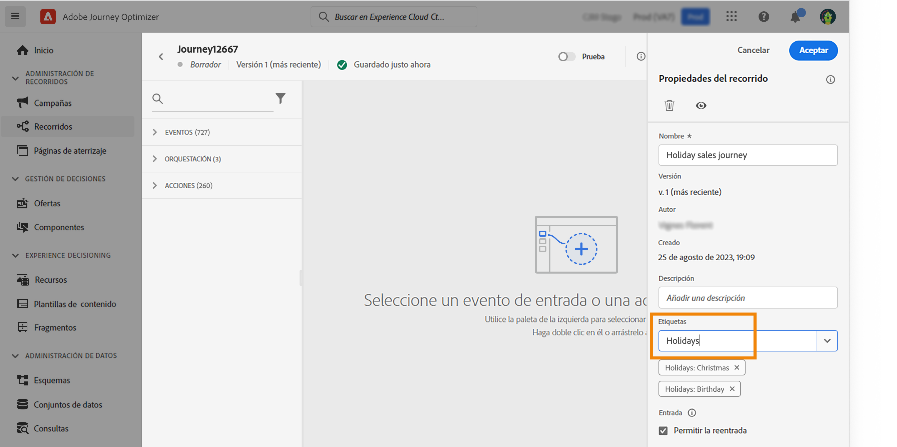
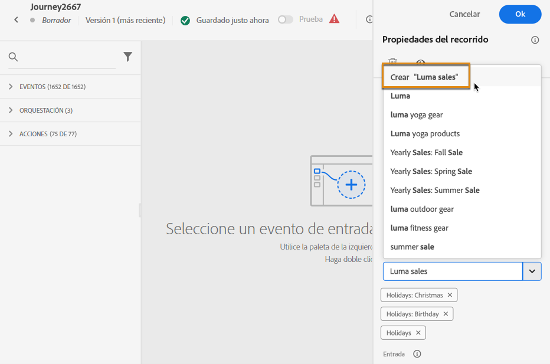
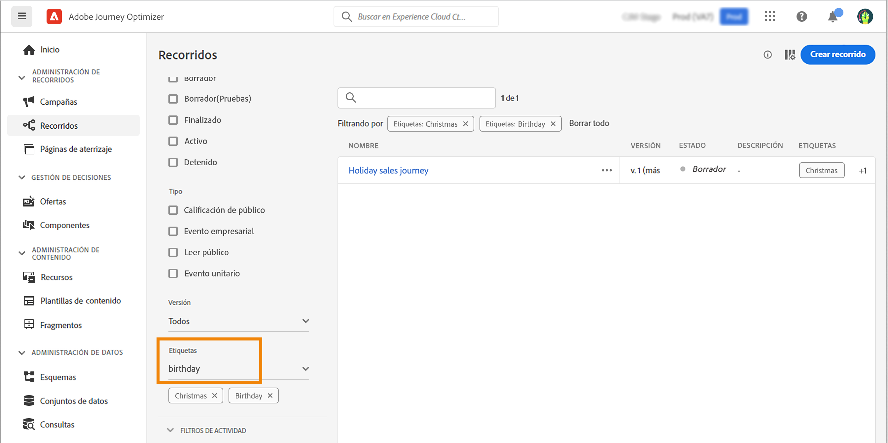
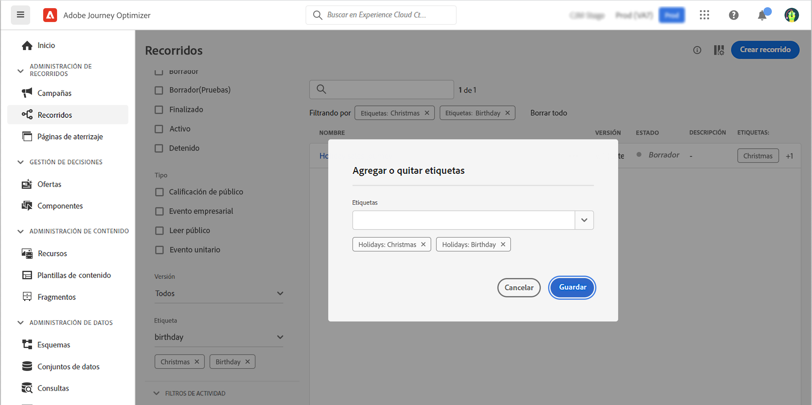

# Buscar, filtrar, organizar {#search-filter-organize}

>[!BEGINSHADEBOX]

**En esta página:** Busque y organice rápidamente recorridos, campañas y recursos con búsqueda universal, filtros de lista y etiquetas para que pueda seguir siendo productivo a medida que crezcan sus proyectos de Journey Optimizer.

>[!ENDSHADEBOX]

A medida que los proyectos de Adobe Journey Optimizer crecen, encontrar y organizar contenido se vuelve esencial para un trabajo eficiente. Esta página muestra cómo localizar rápidamente recorridos, campañas y recursos mediante la búsqueda universal, filtrar listas para centrarse en elementos específicos y organizar su trabajo con etiquetas y categorías. Estas herramientas le ayudan a navegar por grandes volúmenes de contenido, mantener la coherencia entre equipos y optimizar los flujos de trabajo diarios.

## Buscar {#unified-search}

Desde la interfaz de Adobe Journey Optimizer, utilice la función de búsqueda unificada [!DNL Adobe CX Enterprise] en el centro de la barra superior para buscar recursos, recorridos, conjuntos de datos y mucho más en los entornos limitados.

Empiece a introducir contenido para mostrar los resultados principales. Los artículos de ayuda sobre las palabras clave introducidas también se muestran en los resultados.

Pulse **Entrar** para acceder a todos los resultados y filtrar por objeto empresarial.

## Filtrar listas {#filter-lists}

En la mayoría de las listas, utilice la barra de búsqueda para buscar elementos específicos y defina los criterios de filtrado. También puede ordenar los elementos de la lista haciendo clic en cualquier encabezado de columna. En la vista de carpetas Campañas, también se admite la ordenación por **[!UICONTROL Prioridad]** y **[!UICONTROL Configuración del canal]**.

Se puede acceder a los filtros haciendo clic en el icono de filtro en la parte superior izquierda de la lista. El menú de filtro le permite filtrar los elementos mostrados según diferentes criterios: puede elegir mostrar solo los elementos de un determinado tipo o estado, los que ha creado o los modificados en los últimos 30 días. Las opciones difieren según el contexto.

Además, puede utilizar etiquetas unificadas para filtrar una lista en función de las etiquetas asignadas a un objeto. Por ahora, las etiquetas están disponibles para recorridos y campañas. [Descubra cómo trabajar con campañas](#tags)

>[!NOTE]
>
>Tenga en cuenta que las columnas mostradas se pueden personalizar mediante el botón de configuración en la parte superior derecha de las listas. La personalización se guarda para cada usuario.

En las listas, puede realizar acciones básicas por cada elemento. Por ejemplo, puede duplicar o eliminar un elemento.

## Acciones masivas {#bulk-actions}

En las listas **Campañas**, **Fragmentos** y **Plantillas**, puede seleccionar varios elementos a la vez mediante las casillas de verificación y aplicar operaciones a todos ellos desde una barra de acciones masiva que aparece en la parte inferior de la pantalla.

Las siguientes operaciones son posibles:

* **[!UICONTROL Añadir a paquete]**: exporte los elementos seleccionados a otra zona protegida. [Más información sobre cómo exportar objetos →](../configuration/copy-objects-to-sandbox.md)
* **[!UICONTROL Mover a carpeta]**: mueva los elementos seleccionados a una carpeta.
* **[!UICONTROL Editar etiquetas]**: edite las etiquetas asignadas a los elementos seleccionados. [Más información sobre cómo utilizar etiquetas →](#add-tags)
* **[!UICONTROL Administrar acceso]**: aplique etiquetas de acceso a los elementos seleccionados. [Más información sobre el control de acceso a nivel de objeto →](../administration/object-based-access.md)
* **[!UICONTROL Archivar]**: archive los elementos seleccionados. Disponible en fragmentos y plantillas.
* **[!UICONTROL Eliminar]**: elimine permanentemente los elementos seleccionados. Disponible solo en campañas.

## Trabajar con etiquetas unificadas {#tags}

>[!CONTEXTUALHELP]
>id="ajo_campaigns_tags"
>title="Etiquetas"
>abstract="Este campo le permite asignar Etiquetas unificadas de Adobe Experience Platform a la campaña. Esto le permite clasificarlos fácilmente y mejorar la búsqueda desde la lista de campañas."

Con [Etiquetas unificadas](https://experienceleague.adobe.com/docs/experience-platform/administrative-tags/overview.html?lang=es) de Adobe Experience Platform, puede clasificar fácilmente sus objetos de Journey Optimizer para mejorar la búsqueda en las listas.

Si añade etiquetas significativas a los públicos en Journey Optimizer podrá filtrar y buscar más adelante para encontrar públicos más fácilmente. Las etiquetas se pueden utilizar además para organizar públicos en carpetas relevantes en las que se puede buscar, crear ofertas y experiencias personalizadas y utilizarlas en reglas de decisión de experiencias.

### Añadir etiquetas a un objeto {#add-tags}

El campo **[!UICONTROL Etiquetas]** le permite definir etiquetas para el objeto. Las etiquetas están disponibles para los siguientes objetos:

* [Campañas](../campaigns/create-campaign.md)
* [Elementos de decisión](../experience-decisioning/items.md)
* [Fragmentos](../content-management/fragments.md)
* [Fragmentos del recorrido](../building-journeys/journey-fragments.md)
* [Recorridos](../building-journeys/journey-properties.md)
* [Páginas de destino](../landing-pages/create-lp.md)
* [Listas de suscripciones](../landing-pages/subscription-list.md)
* [Plantillas](../content-management/content-templates.md)
* [Configuraciones de canal](../configuration/channel-surfaces.md#channel-config-tags)

Puede seleccionar una etiqueta existente o crear una nueva. Para ello, siga los pasos que aparecen a continuación.

1. Empiece a escribir el nombre de la etiqueta deseada y selecciónela en la lista.

   

   >[!NOTE]
   >
   > Las etiquetas no distinguen entre mayúsculas y minúsculas.

1. Si la etiqueta que está buscando no está disponible, haga clic en **[!UICONTROL Crear &quot;&quot;]** para definir una nueva: se añadirá automáticamente al objeto actual y estará disponible para todos los demás objetos.

   

1. La lista de las etiquetas seleccionadas o creadas se muestra debajo del campo **[!UICONTROL Etiquetas]**. Puede definir tantas etiquetas como sea necesario.

>[!NOTE]
> 
> Si duplica o crea una nueva versión de un objeto, se conservan las etiquetas.

### Filtrar por etiquetas {#filter-on-tags}

Cada lista de objetos muestra una columna dedicada para que pueda visualizar fácilmente sus etiquetas.

Un filtro también está disponible para mostrar únicamente objetos con determinadas etiquetas.

Puede añadir o eliminar etiquetas de cualquier tipo de recorrido o campaña (activa, borrador, etc.). Para ello, haga clic en el icono **[!UICONTROL Más acciones]** junto al objeto y seleccione **[!UICONTROL Editar etiquetas]**.

### Administrar etiquetas {#manage-tags}

Los administradores pueden eliminar etiquetas y organizarlas por categorías utilizando la variable **[!UICONTROL Etiquetas]** en **[!UICONTROL ADMINISTRACIÓN]**. Obtenga más información sobre la administración de etiquetas en [Documentación de etiquetas unificadas](https://experienceleague.adobe.com/docs/experience-platform/administrative-tags/ui/managing-tags.html?lang=es).

>[!NOTE]
>
> Las etiquetas creadas en el campo **[!UICONTROL Etiquetas]** en Journey Optimizer se añaden automáticamente a la categoría integrada “Sin categoría”.
