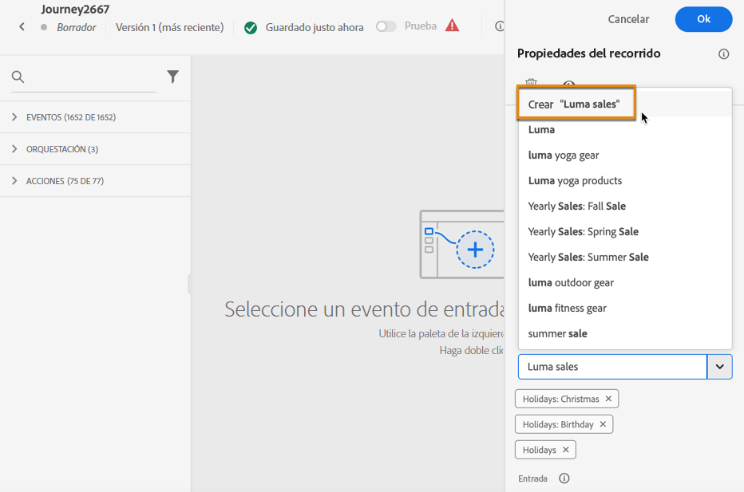

# Buscar, filtrar, organizar {#search-filter-organize}

## Buscar{#unified-search}

En cualquier lugar de la interfaz de Adobe Journey Optimizer, utilice la búsqueda unificada de Adobe Experience Cloud en el centro de la barra superior para buscar recursos, recorridos, conjuntos de datos y más en las zonas protegidas.

Empiece a introducir contenido para mostrar los resultados principales. Los artículos de ayuda sobre las palabras clave introducidas también se muestran en los resultados.

Pulse **Entrar** para acceder a todos los resultados y filtrar por objeto empresarial.

## Filtrar listas{#filter-lists}

En la mayoría de las listas, utilice la barra de búsqueda para buscar elementos específicos y defina los criterios de filtrado.

Se puede acceder a los filtros haciendo clic en el icono de filtro en la parte superior izquierda de la lista. El menú de filtro le permite filtrar los elementos mostrados según diferentes criterios: Puede elegir mostrar solo los elementos de un determinado tipo o estado, los que ha creado o los modificados en los últimos 30 días. Las opciones difieren según el contexto.

Además, puede utilizar etiquetas unificadas para filtrar una lista en función de las etiquetas asignadas a un objeto. Por ahora, las etiquetas están disponibles para recorridos y campañas. [Descubra cómo trabajar con campañas](#tags)

>[!NOTE]
>
>Tenga en cuenta que las columnas mostradas se pueden personalizar mediante el botón de configuración en la parte superior derecha de las listas. La personalización se guarda para cada usuario.

En las listas, puede realizar acciones básicas por cada elemento. Por ejemplo, puede duplicar o eliminar un elemento.

## Trabajar con etiquetas unificadas {#tags}

Con [Etiquetas unificadas](https://experienceleague.adobe.com/docs/experience-platform/administrative-tags/overview.html?lang=es) de Adobe Experience Platform, puede clasificar fácilmente sus recorridos y campañas de Journey Optimizer para mejorar la búsqueda en las listas.

### Añadir etiquetas a un objeto

El campo **[!UICONTROL Etiquetas]** le permite definir etiquetas para el objeto. Las etiquetas están disponibles para los siguientes objetos:

* [Recorridos](../building-journeys/journey-gs.md#change-properties)
* [Campañas](../campaigns/create-campaign.md#create)
* [Plantillas](../content-management/content-templates.md)
* [Fragmentos](../content-management/fragments.md)
* [Listas de suscripciones](../landing-pages/subscription-list.md)
* [Páginas de aterrizaje](../landing-pages/create-lp.md)

Puede seleccionar una etiqueta existente o crear una nueva. Para ello, siga los pasos que aparecen a continuación.

1. Empiece a escribir el nombre de la etiqueta deseada y selecciónela en la lista.

   

   >[!NOTE]
   >
   > Las etiquetas no distinguen entre mayúsculas y minúsculas.

1. Si la etiqueta que está buscando no está disponible, haga clic en **[!UICONTROL Crear &quot;&quot;]** para definir una nueva: se añadirá automáticamente al objeto actual y estará disponible para todos los demás objetos.

   

1. La lista de las etiquetas seleccionadas o creadas se muestra debajo del campo **[!UICONTROL Etiquetas]**. Puede definir tantas etiquetas como sea necesario.

>[!NOTE]
> 
> Si duplica o crea una nueva versión de un objeto, se conservan las etiquetas.

### Filtrar por etiquetas

Cada lista de objetos muestra una columna dedicada para que pueda visualizar fácilmente sus etiquetas.

Un filtro también está disponible para mostrar únicamente objetos con determinadas etiquetas.

Puede añadir o eliminar etiquetas de cualquier tipo de recorrido o campaña (activa, borrador, etc.). Para ello, haga clic en el icono **[!UICONTROL Más acciones]** junto al objeto y seleccione **[!UICONTROL Editar etiquetas]**.

### Administrar etiquetas

Los administradores pueden eliminar etiquetas y organizarlas por categorías utilizando la variable **[!UICONTROL Etiquetas]** en **[!UICONTROL ADMINISTRACIÓN]**. Obtenga más información sobre la administración de etiquetas en [Documentación de etiquetas unificadas](https://experienceleague.adobe.com/docs/experience-platform/administrative-tags/ui/managing-tags.html?lang=es).

>[!NOTE]
>
> Etiquetas creadas directamente a partir del campo **[!UICONTROL Etiquetas]** en Journey Optimizer se añaden automáticamente a la categoría integrada &quot;Sin categoría&quot;.
