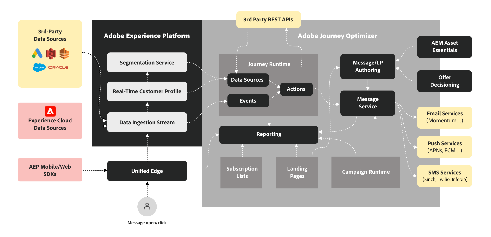

# Explicación de Journey Optimizer {#understanding-ajo}

Adobe Journey Optimizer (AJO) y Adobe Experience Platform (AEP) trabajan juntos para permitir la personalización basada en datos a escala. Esta página explica cómo funcionan estos sistemas y cómo se combinan sus áreas funcionales clave para ofrecer experiencias de cliente excepcionales.

## Cómo funciona Journey Optimizer {#how-it-works}

Adobe Journey Optimizer funciona como un flujo continuo en el que los datos se recopilan, analizan y aplican para crear recorridos personalizados con los clientes.

### Adobe Experience Platform: The Foundation {#aep-foundation}

Adobe Experience Platform sirve como columna vertebral, permitiendo a las marcas centralizar los datos de los clientes y activarlos para experiencias personalizadas:

* **Plataforma de datos**: concentrador central para recopilar, administrar y estructurar datos de clientes con el fin de garantizar la coherencia en todos los sistemas
* **Ingesta de datos (fuentes)**: importe datos de plataformas CRM, sitios web, aplicaciones móviles y almacenamiento en la nube mediante conectores generados previamente.
* **Perfil del cliente en tiempo real**: crea perfiles unificados combinando datos de varias fuentes (interacciones por correo electrónico, compras en la tienda, comportamiento en la web)
* **Nivel de control**: rige el acceso a los datos, el cumplimiento de la privacidad y la seguridad al tiempo que cumple las regulaciones

### Adobe Journey Optimizer: Motor de orquestación {#ajo-orchestration}

Adobe Journey Optimizer aplica los datos y las perspectivas de AEP para ofrecer experiencias de cliente inteligentes y personalizadas:

* **Comprensión del cliente**: los perfiles de cliente en tiempo real habilitan la segmentación en audiencias para la mensajería de destino
* **Contenido y ofertas**: herramientas para crear, administrar y personalizar contenido; lógica en tiempo real para seleccionar la mejor oferta para cada individuo
* **Administración de Recorridos y campañas**: automatiza secuencias de interacciones (recorridos) o programa mensajes de destino únicos (campañas)
* **Envío (conexiones)**: envía mensajes a través de canales como correo electrónico, SMS, notificaciones push y correo directo; exporta datos a sistemas externos
* **Medición y análisis**: Rastrea la participación de los clientes y el rendimiento de las campañas con informes para mejorar continuamente

### El ciclo de optimización continua {#optimization-cycle}

Este ecosistema funciona como un ciclo de optimización continua. Los datos mejoran la comprensión del cliente, que informa el contenido personalizado y las decisiones. Se organizan en recorridos, se entregan en varios canales, se miden para obtener eficacia y se refinan con el tiempo.

## Áreas funcionales clave {#functional-areas}

Journey Optimizer incluye siete áreas funcionales clave que funcionan juntas sin problemas:

| Área funcional | Objetivo | Actividades clave |
|-----------------|---------|----------------|
| **Administración de datos** | Organizar datos de clientes | Definir esquemas, crear conjuntos de datos e importar datos de varios sistemas |
| **Administración de clientes** | Comprenda quiénes son sus clientes | Crear perfiles unificados, resolver identidades, crear audiencias |
| **Administración de contenido** | Creación de mensajes personalizados | Diseñar correos electrónicos, administrar recursos, crear plantillas y fragmentos, personalizar contenido |
| **Gestión de decisiones** | Seleccione la mejor oferta en tiempo real | Administrar la biblioteca de ofertas, definir reglas, aplicar restricciones, establecer lógica de clasificación |
| **Administración de Recorrido** | Diseño de experiencias de cliente automatizadas | Crear recorridos con el diseñador visual, establecer déclencheur, agregar condiciones y pasos de espera |
| **Conexiones** | Conexión de fuentes de datos y canales | Configuración de conectores de origen, configuración de canales, conexión a plataformas externas |
| **Administración y privacidad** | Configuración y conformidad de control | Administrar usuarios, configurar zonas protegidas, configurar canales y gestionar solicitudes de privacidad |

### Cómo funcionan juntas estas áreas {#working-together}

Estas áreas funcionales funcionan en un ciclo continuo:

1. **Ingesta de datos**: los datos fluyen a AEP, estructurados por la administración de datos
2. **Comprensión del cliente**: los perfiles del cliente en tiempo real unifican los datos; la administración de clientes crea audiencias
3. **Estrategia de contenido y ofertas**: la administración de contenido crea mensajes; la administración de decisiones define la lógica de ofertas
4. **Orquestación**: Administración de Recorrido asigna interacciones entre canales mediante datos de clientes, contenido y decisiones
5. **Envío**: las conexiones facilitan la entrega de mensajes a través de canales o comparten datos con sistemas externos
6. **Medición**: los datos de rendimiento devuelven información para refinar audiencias, contenido, decisiones y recorridos
7. **Gobernanza**: los controles de administración y privacidad garantizan el cumplimiento en todo

## Detalles de arquitectura {#architecture-details}

Para los equipos técnicos, este es el diagrama de arquitectura detallado que muestra cómo Journey Optimizer se integra con Adobe Experience Platform:

Hay cuatro aplicaciones creadas de forma nativa en Experience Platform: Adobe Real-Time Customer Data Platform, Journey Optimizer, Customer Journey Analytics y Adobe Mix Modeler. Journey Optimizer funciona a la perfección con estas aplicaciones, pero también de forma independiente.

### Puntos de integración {#integration-points}

Journey Optimizer se integra con Adobe Experience Platform en varios niveles:

* **Capa de datos** - Comparte el mismo perfil de cliente en tiempo real, gráfico de identidad y conjuntos de datos
* **Nivel de servicio**: aprovecha el control, la privacidad y los servicios de consultas de AEP
* **Nivel de aplicación**: proporciona orquestación de recorrido, administración de decisiones y administración de contenido además de AEP

Más información sobre [modelos de Adobe Journey Optimizer](https://experienceleague.adobe.com/es/docs/blueprints-learn/architecture/customer-journeys/journey-optimizer/journey-optimizer-overview){target="_blank"}.

## Privacidad y seguridad {#privacy-security}

Las prácticas de privacidad y seguridad de Adobe Experience Cloud se aplican a Adobe Journey Optimizer. Estas medidas garantizan el cumplimiento de las regulaciones de privacidad como el RGPD, lo que le permite ofrecer experiencias personalizadas sin dejar de mantener la confianza de los clientes.

[Obtenga más información sobre privacidad en Journey Optimizer](../privacy/get-started-privacy.md)

>[!MORELIKETHIS]
>
>* [Introducción a Journey Optimizer](get-started.md)
>* [Terminología clave](terminology.md)
>* [Guía de interfaz de usuario](user-interface.md)
>* [Protecciones y limitaciones](guardrails.md)

