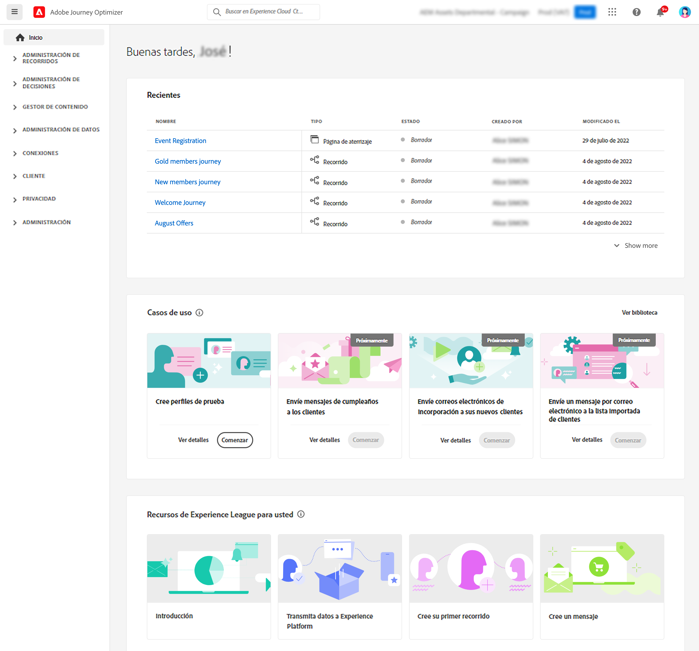
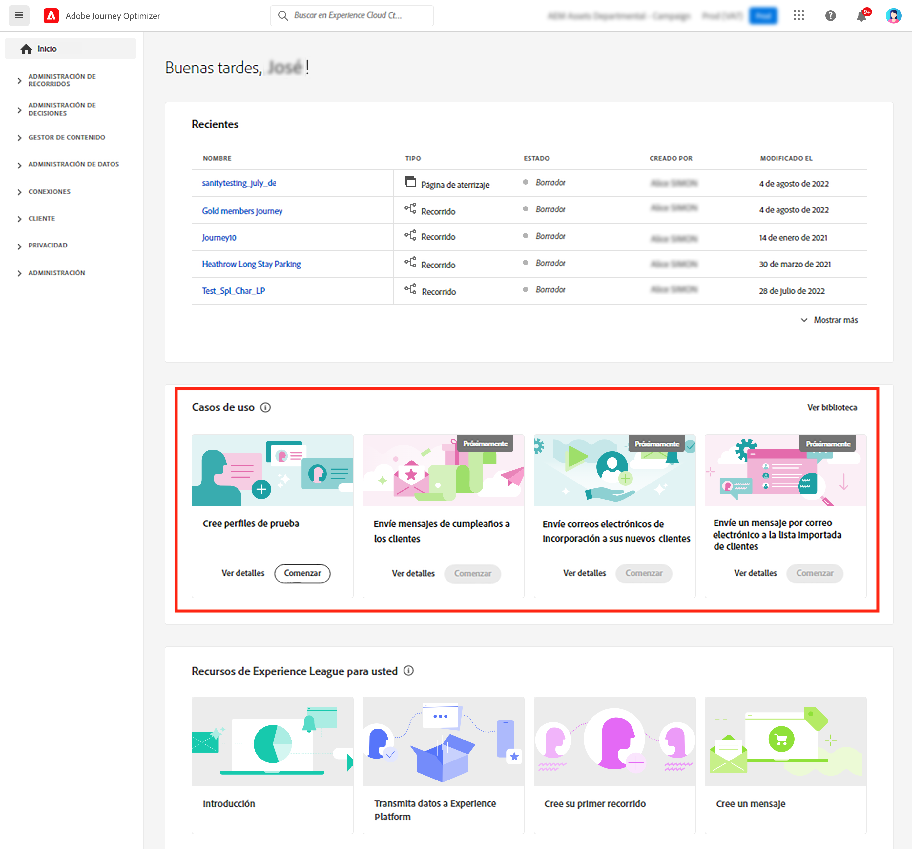
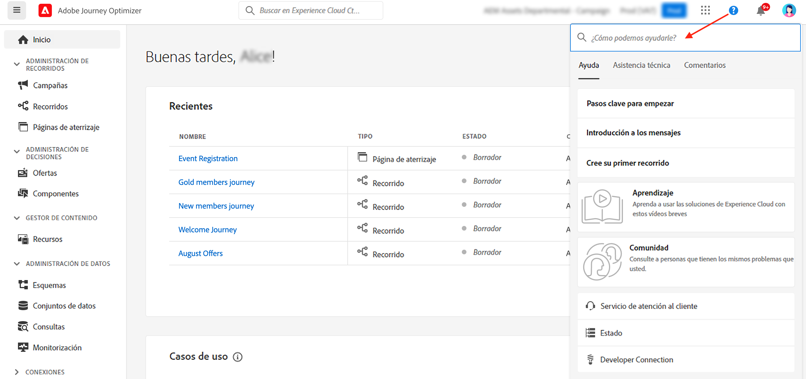
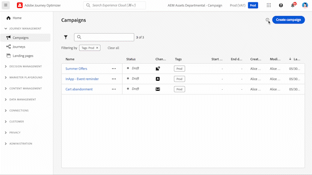
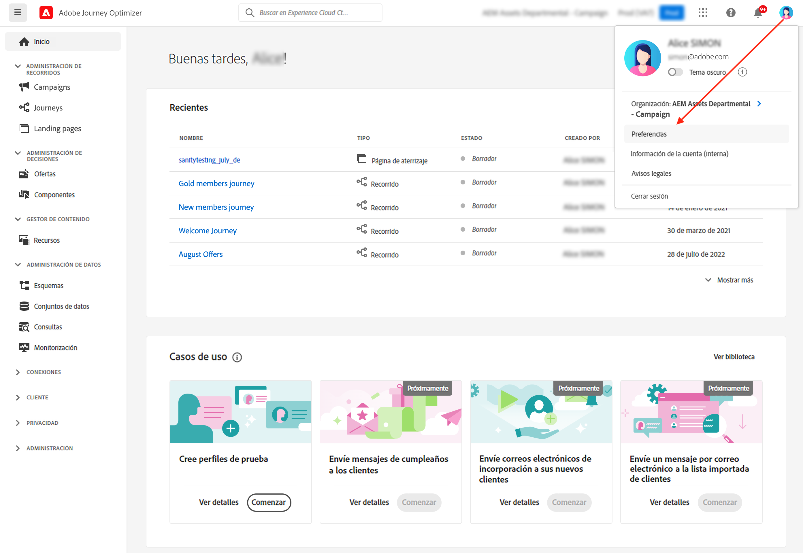
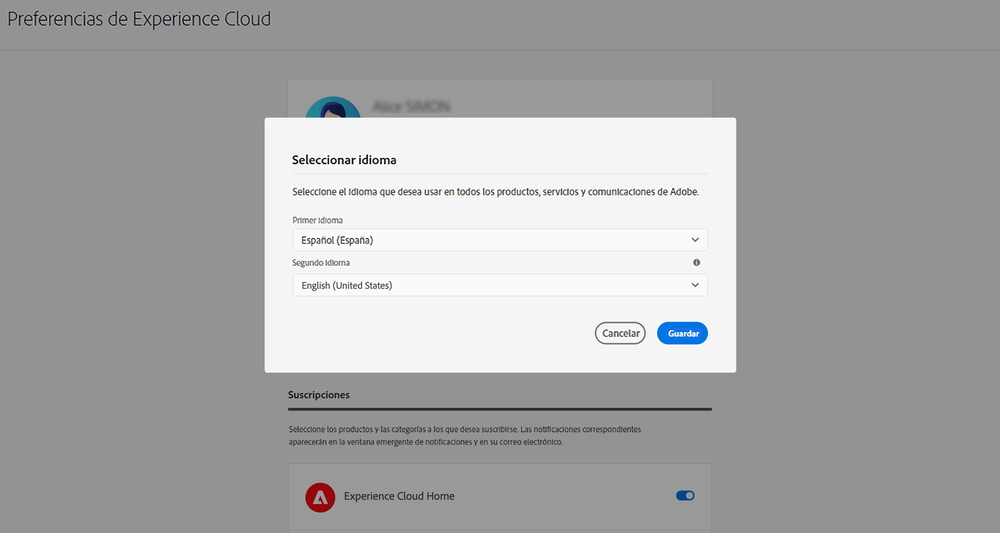

# Interfaz de usuario {#cjm-user-interface}

Para acceder a [!DNL Adobe Journey Optimizer], conéctese a [Adobe Experience Cloud](https://experience.adobe.com) con su Adobe ID y seleccione [!DNL Journey Optimizer].

Los conceptos clave al examinar la interfaz de usuario son habituales en Adobe Experience Platform. Consulte la [documentación de Adobe Experience Platform](https://experienceleague.adobe.com/docs/experience-platform/landing/platform-ui/ui-guide.html?lang=es#adobe-experience-platform-ui-guide){target="_blank"} para obtener más información.

>[!NOTE]
>
>* Los componentes y las funciones disponibles en su entorno dependen de los [permisos](../administration/permissions.md) y del [paquete de licencias](https://helpx.adobe.com/es/legal/product-descriptions/adobe-journey-optimizer.html){target="_blank"}. Para cualquier pregunta, póngase en contacto con Adobe Customer Success Manager o su representante de Adobe.
>
>* Esta documentación se actualiza con frecuencia para reflejar los cambios recientes en la interfaz de usuario del producto. Sin embargo, algunas capturas de pantalla pueden diferir ligeramente de la interfaz de usuario que ve.
>

## Navegación izquierda {#left-nav}

Examine los vínculos de la izquierda para acceder a las funciones de [!DNL Journey Optimizer].

>[!NOTE]
>
>Las capacidades disponibles pueden variar según los permisos y el acuerdo de licencia.

A continuación, hay la lista completa de servicios y capacidades disponibles en la navegación izquierda y vínculos a las páginas de ayuda asociadas.

### Inicio {#left-nav-home}

La página principal de [!DNL Journey Optimizer] contiene vínculos clave y recursos para comenzar. 

La lista **[!UICONTROL Recientes]** proporciona accesos directos a los eventos y recorridos creados recientemente. Esta lista muestra sus fechas de creación y modificación, así como el estado.

Examine los casos de uso dentro del producto para empezar a crear recursos y mensajes. [Más información](#in-product-use-cases).

Utilice los vínculos de la parte inferior de la página principal para aprender a empezar con [!DNL Journey Optimizer]. [Más información](#find-help-and-support).

### [!UICONTROL ADMINISTRACIÓN DE RECORRIDOS] {#left-nav-journey}

Cree campañas y recorridos desde esta sección.

* **[!UICONTROL Campañas]**: cree, configure y organice campañas para entregar contenido de una sola vez a un público específico mediante varios canales. [Más información](../campaigns/get-started-with-campaigns.md)

* **[!UICONTROL Recorridos]**: cree, configure y organice sus recorridos con los clientes: combine los eventos, la orquestación y las actividades de acción para crear sus escenarios de canales cruzados de varios pasos. [Más información](../building-journeys/journey-gs.md#jo-build)

* **[!UICONTROL Informes]**: el sistema de informes de Journey Optimizer está totalmente integrado con las funcionalidades de Customer Journey Analytics, lo que estandariza la creación de informes en ambas plataformas y mejora la coherencia y fiabilidad de los datos. Esta integración perfecta entre Journey Optimizer y Customer Journey Analytics proporciona una visión más clara de las métricas de rendimiento, lo que permite a los usuarios tomar decisiones más fundamentadas. [Más información](../reports/report-gs-cja.md)

### [!UICONTROL GESTIÓN DE DECISIONES] {#left-nav-decision}

Cree ofertas y componentes desde esta sección.

* **[!UICONTROL Ofertas]**: acceda a sus fuentes y conjuntos de datos recientes desde este menú. Utilice esta sección para crear nuevas ofertas. [Más información](../offers/offer-library/creating-personalized-offers.md)

* **[!UICONTROL Componentes]**: cree ubicaciones, reglas y etiquetas. [Más información](../offers/offer-library/key-steps.md)

### [!UICONTROL ADMINISTRACIÓN DE CONTENIDO] {#left-nav-content}

Cree y administre contenido desde esta sección.

* **[!UICONTROL Recursos]** : [!DNL Adobe Experience Manager Assets] es un repositorio centralizado de recursos que puede utilizar para rellenar los mensajes. [Más información](../integrations/assets.md)

* **[!UICONTROL Plantillas de contenido]**: para un proceso de diseño acelerado y mejorado, cree plantillas independientes para reutilizar fácilmente el contenido personalizado en las campañas y recorridos de Journey Optimizer. [Más información](../content-management/content-templates.md)

* **[!UICONTROL Fragmentos]**: cree y administre fragmentos para suavizar el proceso de diseño de correo electrónico: cree bloques de contenido personalizados que se puedan utilizar para combinar rápidamente el contenido del correo electrónico. [Más información](../content-management/fragments.md)

* **[!UICONTROL Páginas de destino]**: crear, diseñar, probar y publicar páginas de aterrizaje: envíe a los usuarios vínculos a formularios en línea en los que pueden optar por su inclusión o exclusión en la recepción de comunicaciones, o suscribirse a servicios específicos. [Más información](../landing-pages/get-started-lp.md)

### [!UICONTROL ADMINISTRACIÓN DE DATOS] {#left-nav-data}

Administre sus datos desde esta sección.

* **[!UICONTROL Esquemas]**: utilice Adobe Experience Platform para crear y administrar esquemas del Modelo de datos de experiencia (XDM) en un lienzo visual interactivo denominado Editor de esquemas. [Más información](../data/get-started-schemas.md)

* **[!UICONTROL Conjuntos de datos]**: todos los datos que se incorporan a Adobe Experience Platform se conservan dentro del lago de datos como conjuntos de datos. Un conjunto de datos es una construcción de almacenamiento y administración para una colección de datos, normalmente una tabla, que contiene un esquema (columnas) y campos (filas). [Más información](../data/get-started-datasets.md)

* **[!UICONTROL Consultas]**: utilice el servicio de consulta de Adobe Experience Platform para escribir y ejecutar consultas, ver consultas ejecutadas anteriormente y acceder a las guardadas por usuarios de su organización. [Más información](../data/get-started-queries.md)

* **[!UICONTROL Monitorización]**: utilice este menú para monitorizar la ingesta de datos en la interfaz de usuario de Adobe Experience Platform. Obtenga más información en la [documentación de Adobe Experience Platform](https://experienceleague.adobe.com/docs/experience-platform/ingestion/quality/monitor-data-ingestion.html?lang=es){target="_blank"}.

### [!UICONTROL CONEXIONES] {#left-nav-connections}

Administre sus conexiones de datos con otras aplicaciones y nubes desde esta sección.

* **[!UICONTROL Fuentes]**: utilice este menú para introducir datos de una variedad de fuentes, como aplicaciones de Adobe, almacenamiento basado en la nube, bases de datos y mucho más. Puede estructurar, etiquetar y mejorar los datos entrantes. [Más información](get-started-sources.md)

* **[!UICONTROL Destinos]**: utilice este menú para crear una conexión activa con ubicaciones de almacenamiento en la nube para exportar el contenido de los conjuntos de datos. [Más información](../data/export-datasets.md)

### [!UICONTROL CLIENTE] {#left-nav-customers}

Administre sus públicos y datos de perfil desde esta sección.

* **[!UICONTROL Públicos]**: cree y administre públicos de Experience Platform para utilizarlos en sus recorridos. [Más información](../audience/about-audiences.md)

* **[!UICONTROL Listas de suscripción]**: en [!DNL Journey Optimizer], los clientes que han elegido un servicio de suscripción se agrupan en una lista de suscripción. [Más información](../landing-pages/subscription-list.md)

* **[!UICONTROL Perfiles]**: el perfil del cliente en tiempo real crea una vista integral de cada uno de sus clientes individuales, combinando datos de varios canales, incluidos datos en línea, sin conexión, CRM y de terceros. [Más información](../audience/get-started-profiles.md)

* **[!UICONTROL Identidades]**: el servicio de identidad de Adobe Experience Platform administra la identificación de sus clientes en varios dispositivos, canales cruzados y casi en tiempo real en lo que se conoce como gráfico de identidad dentro de Adobe Experience Platform. [Más información](../audience/get-started-identity.md)

### [!UICONTROL Privacidad] {#left-nav-privacy}

Controle la administración de la privacidad y las solicitudes desde esta sección.

* **[!UICONTROL Políticas]**: Adobe Experience Platform le permite etiquetar los campos y crear acciones de marketing para cada canal. A continuación, defina una política de gobernanza vinculada a una etiqueta y a una acción de marketing. [Más información](../action/action-privacy.md)

* **[!UICONTROL Solicitudes]**: las solicitudes de privacidad se administran en Adobe Experience Platform Privacy Service. Proporciona una API de RESTful y una interfaz de usuario para ayudarle a administrar las solicitudes de datos de los clientes. [Más información](../privacy/requests.md)

* **[!UICONTROL Auditoría]**: vaya a esta sección para comprobar los registros de actividad. [Más información](../privacy/audit-logs.md)

* **[!UICONTROL Ciclo de vida de datos]**: esta sección le permite configurar y programar operaciones de ciclo de vida de datos, lo que garantiza que sus registros se mantengan correctamente. [Más información](../privacy/data-hygiene.md)

### [!UICONTROL ADMINISTRACIÓN] {#left-nav-admin}

* **[!UICONTROL Configuraciones]**: utilice este menú para configurar [Eventos](../event/about-events.md), [Fuentes de datos](../datasource/about-data-sources.md), y [Acciones](../action/action.md) que se utilizarán en los recorridos.

  También puede acceder a la sección **Creación de informes** para configurar la creación de informes para la experimentación de campañas y web/móvil. [Más información](../reports/reporting-configuration.md)

* **[!UICONTROL Reglas empresariales]**: utilice esta sección para crear reglas empresariales entre canales para controlar la frecuencia con la que los usuarios reciben un mensaje o entran en un recorrido. [Más información](../conflict-prioritization/rule-sets.md)

* **[!UICONTROL Alertas]**: la interfaz de usuario le permite ver un historial de alertas recibidas en función de las métricas reveladas por Adobe Experience Platform Observability Insights. La IU también le permite ver, habilitar y deshabilitar las reglas de alerta disponibles. [Más información](../reports/alerts.md)

* **[!UICONTROL Zonas protegidas]**: Adobe Experience Platform proporciona entornos limitados que dividen una sola instancia en entornos virtuales independientes para ayudarle a desarrollar aplicaciones de experiencia digital y hacer que evolucionen. Además, [!DNL Journey Optimizer] le permite utilizar las posibilidades de exportación e importación de paquetes para copiar objetos como recorridos, plantillas de contenido o fragmentos en varias zonas protegidas limitadas. [Más información](../administration/sandboxes.md)

* **[!UICONTROL Canales]**: utilice esta sección para configurar los canales, incluidos los subdominios, las configuraciones y la configuración de entregabilidad. [Más información](../configuration/get-started-configuration.md)

* **[!UICONTROL Etiquetas]**: con etiquetas unificadas, puede clasificar fácilmente sus recorridos y campañas para mejorar la búsqueda en las listas. [Más información](../start/search-filter-categorize.md#work-with-unified-tags)

## Casos de uso dentro del producto {#in-product-uc}

Desde la página de inicio de [!DNL Adobe Journey Optimizer], los casos de uso de productos proporcionan información rápida para crear perfiles de prueba o sus primeros recorridos con los clientes.

+++ **Casos de uso disponibles**

Los casos de uso disponibles son:

* **Cree perfiles de prueba**, para crear perfiles de prueba con la plantilla CSV a fin de probar mensajes y recorridos personalizados. Aprenda a implementar este caso de uso [en esta página](../audience/creating-test-profiles.md#use-case-1).
* **Envíe un mensaje de cumpleaños a los clientes** para que envíen automáticamente un correo electrónico a fin de felicitar a sus clientes. (próximamente)
* **Envíe correos electrónicos para incorporar nuevos clientes** y enviar fácilmente hasta dos correos electrónicos para dar la bienvenida a sus clientes recién registrados. (próximamente)
* **Envíe mensajes push a la lista importada de clientes** para enviar rápidamente una notificación push a una lista de clientes importados desde un archivo CSV. (próximamente)

+++

Para obtener más información acerca de cada caso de uso, haga clic en el enlace de **[!UICONTROL Ver detalles]**.

Para ejecutar un caso de uso, haga clic en el botón de **[!UICONTROL Comenzar]**.

Puede acceder a los casos de uso ejecutados desde el botón **[!UICONTROL Ver biblioteca]**.

## Buscar ayuda y asistencia {#find-help}

Acceda a las páginas de ayuda clave de Adobe Journey Optimizer desde la sección inferior de la página de inicio.

Utilice el icono de **Ayuda** para acceder a las páginas de ayuda, ponerse en contacto con el servicio de asistencia técnica y compartir comentarios. Puede buscar artículos de ayuda y vídeos en el campo de búsqueda.

En cada página, utilice los botones de ayuda contextual para obtener más información sobre una función y navegue hasta **[!DNL Adobe Experience League]** documentación.

## Notificaciones en el producto {#in-product-notifications}

Puede habilitar las **alertas en el producto y por correo electrónico** para recibir notificaciones sobre varios eventos que puedan ser de su interés: errores detectados por el sistema, solicitudes de aprobación o versiones de producto de [!DNL Journey Optimizer].

Para habilitar estas notificaciones, siga los pasos a continuación.

1. Vaya a [!DNL Adobe Experience Cloud] **[!UICONTROL Preferencias]**.
1. En **[!UICONTROL Notificaciones]**, busque **[!UICONTROL Journey Optimizer]**.
1. Habilite las notificaciones en la aplicación o por correo electrónico según desee:

   * **[!UICONTROL Alertas]**: cuando se produce un error, puede obtener notificaciones del sistema para las alertas a las que está suscrito. [Más información](../reports/alerts.md)
   * **[!UICONTROL Aprobaciones]**: se le notifica cuando alguien le solicita que apruebe un objeto o que acceda a un objeto.
   * **[!UICONTROL Nuevas versiones]**: se le informa de las nuevas versiones de producto de [!DNL Journey Optimizer].

{width="70%" align="left"}

## Asistente de IA {#ai-assistant}

El asistente de IA es una función de la interfaz de usuario que se puede utilizar para navegar, comprender los conceptos de Adobe y obtener datos operativos de su entorno específico. Está disponible en varios productos de Adobe Experience Cloud, incluido Adobe Journey Optimizer.

Para acceder al Asistente de IA, haga clic en el icono de la barra superior. El asistente de IA se muestra en la sección derecha de la pantalla.

Obtenga información sobre cómo acceder y utilizar el Asistente de IA [en esta página](ai-assistant.md).

## Preferencias de idioma {#language-pref}

La interfaz de usuario está disponible en los siguientes idiomas:

* Inglés
* Francés
* Alemán
* Italiano
* Español
* Portugués (Brasil)
* Japonés
* Coreano
* Chino tradicional
* Chino simplificado

El idioma predeterminado de la interfaz está determinado por el idioma preferido especificado en el perfil de usuario.

+++ **Cómo cambiar el idioma**

Para cambiar el idioma, siga estos pasos:

1. Haga clic en **Preferencias** desde el avatar, en la parte superior derecha.
   
1. A continuación, haga clic en el idioma mostrado debajo de su dirección de correo electrónico
1. Seleccione el idioma que prefiera y haga clic en **Guardar**. Puede elegir un segundo idioma en caso de que el componente que utilice no esté localizado en su primero.
   

+++

## Más información {#more}

Empecemos con [!DNL Journey Optimizer]? ¿Usuario experimentado con preguntas específicas? ¿Administrador de la instancia de su empresa? [Elija su propia ruta para alcanzar sus objetivos más rápido.](quick-start.md)

<!--CONTEXTUAL HELP TO DISPATCH IN DOCS ONCE FEATURE LIVE-->

<!--ORCHESTRATED CAMPAIGNS - Overview page-->

<!--OVERVIEW TAB ORCHESTRATED CAMPAIGNS SKU only-->

>[!CONTEXTUALHELP]
>id="ajo_oc_campaign_ovv_1"
>title="Orquestación de campañas"
>abstract="Divida, combine, enriquezca y manipule conjuntos de datos relacionales para definir su público"

>[!CONTEXTUALHELP]
>id="ajo_oc_campaign_ovv_2"
>title="Uso de datos de múltiples entidades"
>abstract="Descubra cómo las campañas orquestadas pueden aprovechar los conjuntos de datos relacionales para enriquecer los datos para la segmentación y personalización."

>[!CONTEXTUALHELP]
>id="ajo_oc_campaign_ovv_3"
>title="Segmentación ad hoc y recuentos exactos"
>abstract="Genere su segmento paso a paso con recuentos exactos"

>[!CONTEXTUALHELP]
>id="ajo_oc_campaign_ovv_4"
>title="Canales disponibles"
>abstract="Correo electrónico, SMS, notificaciones push, correo directo"

<!--OVERVIEW TAB ORCHESTRATED CAMPAIGNS + JOURNEYS SKU -->

>[!CONTEXTUALHELP]
>id="ajo_oc_jo_camppaign_ovv_1"
>title="IU guiada para crear y enviar una campaña"
>abstract="Defina una o varias acciones con un canal, elija un público, defina un contenido y una programación, y todo estará listo para realizar el envío"

>[!CONTEXTUALHELP]
>id="ajo_oc_jo_camppaign_ovv_2"
>title="Canales disponibles"
>abstract="Correo electrónico, SMS, notificaciones push, in-app, web, experiencias basadas en código"

<!--OVERVIEW TAB ORCHESTRATED CAMPAIGNS - API triggered tab -->

>[!CONTEXTUALHELP]
>id="ajo_oc_api_camppaign_ovv_1"
>title="Campañas activadas por API transaccionales"
>abstract="Active mensajes en tiempo real mediante llamadas de API"

>[!CONTEXTUALHELP]
>id="ajo_oc_api_camppaign_ovv_2"
>title="Mensajes de marketing"
>abstract="Contenido promocional (requiere inclusión, sujeto a las reglas empresariales)"

>[!CONTEXTUALHELP]
>id="ajo_oc_api_camppaign_ovv_3"
>title="Mensajes transaccionales"
>abstract="Contenido relacionado con el servicio (confirmación, alertas, no sujeto al consentimiento de marketing)"

>[!CONTEXTUALHELP]
>id="ajo_oc_api_camppaign_ovv_4"
>title="Canales disponibles"
>abstract="Correo electrónico, SMS, notificaciones push"

<!--APPROVAL POLICIES-->

>[!CONTEXTUALHELP]
>id="ajo_campaigns_edit_disabled"
>title="Edición deshabilitada"
>abstract="Edición deshabilitada (campañas)"

>[!CONTEXTUALHELP]
>id="ajo_journey_edit_disabled"
>title="Edición deshabilitada"
>abstract="Edición deshabilitada (recorridos)"

>[!CONTEXTUALHELP]
>id="ajo_approval_policy_approval_status"
>title="Estado de aprobación"
>abstract="Estado de aprobación"

>[!CONTEXTUALHELP]
>id="ajo_campaigns_approve"
>title="Aprobar"
>abstract="Aprobar (campañas)"

>[!CONTEXTUALHELP]
>id="ajo_journey_approve"
>title="Aprobar"
>abstract="Aprobar (recorridos)"

>[!CONTEXTUALHELP]
>id="ajo_journey_simulation"
>title="Simulación del recorrido"
>abstract="La simulación de recorrido permite validar los recorridos y ver cómo funcionan antes de activarse. Utiliza datos de un modelo entrenado para proporcionar números en todo el recorrido y ver cómo se comportará el recorrido en un escenario del mundo real."

<!-- WEBHOOKS -->

>[!CONTEXTUALHELP]
>id="ajo_channels_feedback_webhook_settings"
>title="Habilitar webhooks"
>abstract="Habilite los webhooks para recibir comentarios en tiempo real sobre el estado de ejecución de sus mensajes. Antes de activar esta opción, asegúrese de que ha configurado un webhook en el menú **Administración**/**canales**/**webhook de comentarios**."

>[!CONTEXTUALHELP]
>id="ajo_channels_feedback_webhook_settings_create"
>title="Webhooks de comentarios"
>abstract="Los webhooks de comentarios le permiten recibir comentarios en tiempo real sobre el estado de ejecución de los mensajes enviados con campañas transaccionales activadas por API. Solo se permite una configuración de webhook por organización + combinación de zona protegida."

>[!CONTEXTUALHELP]
>id="ajo_channels_feedback_webhook_settings_configuration"
>title="Configuración básica"
>abstract="En esta sección, introduzca un nombre descriptivo para identificar el webhook y seleccione los canales para los que este webhook debe recibir comentarios (correo electrónico o SMS). En el campo URL del webhook, indique el punto final de HTTPS en el que deben entregarse los eventos de comentarios."

>[!CONTEXTUALHELP]
>id="ajo_channels_feedback_webhook_settings_authentication"
>title="Autenticación"
>abstract="Si el punto final requiere autenticación JWT, seleccione **Autenticación JWT** de la lista y proporcione los detalles necesarios."

>[!CONTEXTUALHELP]
>id="ajo_channels_feedback_webhook_settings_header_parameters"
>title="Parámetros de encabezado"
>abstract="En esta sección, puede configurar encabezados personalizados adicionales para que se envíen con cada solicitud de webhook."
