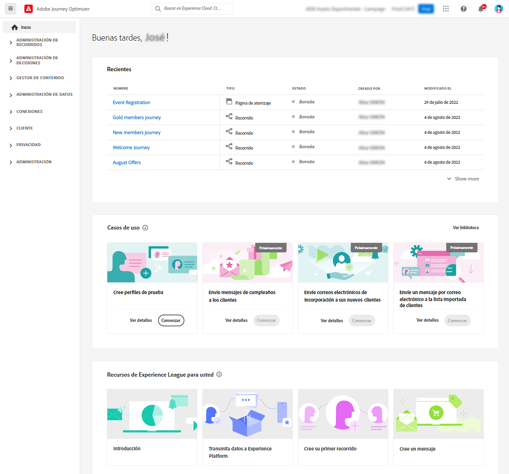

# Navegación por la interfaz {#user-interface}

>[!BEGINSHADEBOX]

**En esta página:** explore la interfaz de Adobe Journey Optimizer (barra superior, página de inicio y navegación izquierda) para que pueda acceder rápidamente a las características y funcionalidades que necesita.

>[!ENDSHADEBOX]

Para acceder a Adobe Journey Optimizer, inicia sesión en [[!DNL Adobe CX Enterprise]](https://experience.adobe.com) con tu Adobe ID y, a continuación, selecciona [!DNL Journey Optimizer].

>[!NOTE]
>
>* Los componentes y las funciones disponibles en su entorno dependen de los [permisos](../administration/permissions.md) y del [paquete de licencias](https://helpx.adobe.com/es/legal/product-descriptions/adobe-journey-optimizer.html){target="_blank"}.
>* Esta documentación se actualiza con frecuencia. Algunas capturas de pantalla pueden diferir ligeramente de la interfaz.

## Recorrido rápido {#quick-tour}

La interfaz de Journey Optimizer consta de cuatro áreas principales:

1. **Navegación izquierda**: acceda a todas las funciones y características organizadas por función
2. **Barra superior**: búsqueda universal, ayuda, notificaciones y configuración
3. **Página de inicio**: acceso rápido a elementos recientes y recursos útiles
4. **Espacio de trabajo principal**: donde crea y administra su contenido

**Sugerencia:** los nuevos usuarios pueden empezar desde la página **Inicio** para acceder a los elementos y casos de uso recientes, o usar el icono **Ayuda** de la barra superior para obtener orientación contextual.

## Características de la barra superior {#top-bar}

### Búsqueda universal {#universal-search}

Utilice el icono de búsqueda para encontrar rápidamente recorridos, campañas, recursos y otros objetos en Journey Optimizer. Escriba palabras clave para ver los resultados relevantes de todas las áreas de la plataforma. [Más información sobre la búsqueda universal](search-filter-categorize.md#unified-search).

### Ayuda y asistencia {#help}

Haga clic en el icono **Ayuda** para:

* Buscar artículos de ayuda y vídeos
* Acceder a la ayuda contextual para la página actual
* Ponerse en contacto con el Servicio de atención al cliente de Adobe
* Compartir comentarios

La ayuda contextual muestra directrices relevantes para la pantalla que está viendo y vínculos directamente a la documentación correspondiente, para que pueda obtener la información correcta sin abandonar el flujo de trabajo.

#### Pautas para los tickets de asistencia {#support-ticket-guidelines}

Al ponerse en contacto con la Asistencia de Adobe, incluya lo siguiente para acelerar el análisis y la resolución de las causas principales:

* **Detalles del entorno**: nombre de la zona protegida, ID de organización y área de producto (por ejemplo, Recorridos, Campañas, Toma de decisiones)
* **Nivel de impacto**: gravedad del problema (por ejemplo, producción bloqueada, funcionalidad limitada, problema estético)
* **Pasos de replicación**: instrucciones paso a paso y claras para reproducir el problema
* **Registros o capturas de pantalla**: mensajes de error relevantes, ID de solicitud o capturas de pantalla que ilustran el problema
* **ID relevantes**: ID de Recorrido, ID de campaña, ID de público u otros identificadores de objeto relacionados con el problema

### Notificaciones {#in-product-uc}

Habilite las notificaciones en el producto y por correo electrónico para mantenerse informado sobre:

* **Alertas**: errores del sistema y problemas de rendimiento
* **Aprobaciones**: solicitudes que requieren su revisión
* **Nuevas versiones**: actualizaciones de productos y nuevas características

Para configurar las notificaciones:

1. Haga clic en el icono de perfil y seleccione **[!UICONTROL Preferencias]**
2. En **[!UICONTROL Notificaciones]**, busque **[!UICONTROL Journey Optimizer]**.
3. Habilite los tipos de notificación que desee recibir

{width="60%" align="center"}

### Preferencias de idioma {#language}

La interfaz está disponible en inglés, francés, alemán, italiano, español, portugués (Brasil), japonés, coreano, chino tradicional y chino simplificado.

Para cambiar el idioma:

1. Haga clic en **[!UICONTROL Preferencias]** en el menú de perfil
2. Seleccione su idioma preferido
3. Si lo desea, seleccione un segundo idioma como alternativa
4. Haga clic en **Guardar**

Los métodos abreviados del teclado y las funciones de accesibilidad están disponibles. [Más información](accessibility.md)

## Página de inicio {#home-page}

La página de inicio proporciona lo siguiente:

* **Recientes**: accesos directos a eventos, recorridos, campañas y otros objetos creados recientemente
* **Casos de uso**: escenarios generados previamente para ayudarle a empezar rápidamente (crear perfiles de prueba, enviar mensajes de cumpleaños, etc.)
* **Recursos**: vínculos a documentación, tutoriales y asistencia

### Casos de uso y flujos de trabajo de inicio rápido {#use-cases}

Los flujos de trabajo de inicio rápido le ayudan a realizar tareas comunes:

* **Creación de perfiles de prueba**: genere perfiles de prueba con plantillas CSV
* **Envío de mensajes de cumpleaños**: envíe automáticamente correos electrónicos de cumpleaños (próximamente)
* **Incorporación de nuevos clientes**: serie de bienvenida para nuevos clientes (próximamente)
* **Envío de notificaciones push a listas importadas**: notificaciones push rápidas desde datos CSV (próximamente)

Haga clic en **[!UICONTROL Ver detalles]** para obtener más información acerca de cada caso de uso o en **[!UICONTROL Empezar]** para comenzar.

## Navegación izquierda {#left-nav}

La navegación de la izquierda organiza las funcionalidades de Journey Optimizer en categorías funcionales. Los elementos de menú disponibles dependen de los permisos y la licencia.

| Sección | Objetivo |
|---------|---------|
| Administración de recorrido | Campañas, recorridos, informes |
| Gestión de decisiones | Ofertas y personalización |
| Administración de contenido | Recursos, plantillas, fragmentos, páginas de destino |
| Administración de datos | Esquemas, conjuntos de datos, consultas |
| Conexiones | Fuentes y destinos |
| Cliente | Públicos, perfiles, identidades |
| Privacidad | Políticas, solicitudes, auditoría |
| Administración | Configuraciones, canales, zonas protegidas |

### Secciones principales {#main-sections}

**Inicio**: punto de partida con acceso rápido a elementos creados recientemente y recursos útiles

**Administración de recorrido** - cree y administre experiencias de los clientes

* **Campañas**: cree mensajes puntuales o programados para públicos específicos. [Comience con las campañas](../campaigns/get-started-with-campaigns.md)
* **Recorridos**: cree experiencias de cliente en canales múltiples y de varios pasos. [Creación de su primer recorrido](../building-journeys/journey-gs.md)
* **Informes**: analice el rendimiento con los informes integrados de Customer Journey Analytics. [Ver documentación de informes](../reports/campaign-global-report-cja.md)

**Gestión de decisiones**: administre ofertas personalizadas. [Conozca la gestión de decisiones](../offers/get-started/starting-offer-decisioning.md)

* **Ofertas**: cree y administre ofertas personalizadas
* **Componentes**: configure ubicaciones, reglas y etiquetas para ofertas

**Administración de contenido**: cree y organice contenido

* **Recursos**: repositorio centralizado para imágenes y medios. [Administración de recursos](../integrations/assets.md)
* **Plantillas de contenido**: plantillas de mensajes reutilizables para campañas y recorridos. [Crear plantillas](../content-management/content-templates.md)
* **Fragmentos**: bloques de contenido que se pueden usar en varios mensajes. [Trabajo con fragmentos](../content-management/fragments.md)
* **Páginas de destino**: formularios web para suscripciones y preferencias. [Diseño de páginas de destino](../landing-pages/get-started-lp.md)
* **Manuales de casos de uso**: flujos de trabajo creados previamente para escenarios de marketing frecuentes. [Explorar manuales de tácticas](ai-features.md#playbooks)

**Administración de datos**: administre su base de datos. [Más información sobre esquemas y conjuntos de datos](../data/get-started-schemas.md)

* **Esquemas**: defina la estructura de datos
* **Conjuntos de datos**: almacene y administre colecciones de datos
* **Consultas**: escriba y ejecute consultas
* **Monitorización**: haga un seguimiento de la ingesta de datos

**Conexiones**: integre con otros sistemas

* **Fuentes**: ingeste datos de sistemas externos. [Configuración de fuentes](get-started-sources.md)
* **Destinos**: exporte datos al almacenamiento en la nube. [Configuración de destinos](../data/export-datasets.md)

**Cliente**: administre públicos y perfiles

* **Públicos**: cree y administre segmentos de clientes. [Trabajo con públicos](../audience/about-audiences.md)
* **Listas de suscripción**: administre listas de inclusión. [Administración de las suscripciones](../landing-pages/subscription-list.md)
* **Perfiles**: vea perfiles de cliente unificados. [Exploración de perfiles](../audience/get-started-profiles.md)
* **Identidades**: administre la resolución de identidades. [Más información sobre las identidades](../audience/get-started-identity.md)

**Privacidad**: controle la privacidad y el cumplimiento. [Información general sobre la privacidad](../privacy/get-started-privacy.md)

* **Directivas**: defina directivas de gobernanza de datos
* **Solicitudes**: administrar solicitudes de privacidad (RGPD, CCPA)
* **Auditoría**: revisar registros de actividad. [Ver registros de auditoría](../privacy/audit-logs.md)
* **Ciclo de vida de datos**: configure la retención de datos

**Administración**: ajuste la configuración del sistema. [Información general sobre el control de acceso](../administration/permissions-overview.md)

* **Configuraciones**: configure eventos, fuentes de datos y acciones. [Configuración de canales](../configuration/get-started-configuration.md)
* **Reglas empresariales**: controle la frecuencia de mensajes y la entrada de recorrido. [Configure las reglas empresariales](../conflict-prioritization/rule-sets.md)
* **Alertas**: vea y administre alertas del sistema. [Monitorización de alertas](../reports/alerts.md)
* **Zonas protegidas**: administre entornos y copie objetos entre zonas protegidas. [Trabajo con zonas protegidas](../administration/sandboxes.md)
* **Canales**: configure los parámetros de canal y la entregabilidad. [Establecer configuraciones de canal](../configuration/channel-surfaces.md) | [Comenzar con la configuración](../configuration/get-started-configuration.md)
* **Etiquetas**: organice y categorice el contenido. [Trabajo con etiquetas unificadas](search-filter-categorize.md#tags)

## Asistente de IA {#ai-assistant}

El Asistente de IA proporciona ayuda instantánea y datos operativos. Haga clic en el icono del Asistente de IA de la barra superior para:

* Obtener respuestas acerca de las funciones del producto
* Recibir datos operativos sobre sus recorridos
* Navegar por conceptos y prácticas recomendadas

[Obtener más información acerca del Asistente de IA](ai-features.md#ai-assistant)

## Temas relacionados {#related-topics}

* [Elegir su ruta de aprendizaje por función](quick-start.md)
* [Buscar, filtrar y categorizar contenido](search-filter-categorize.md)
* [Explicación del funcionamiento de Journey Optimizer](understanding-ajo.md)
* [Funciones de accesibilidad](accessibility.md)

<!--CONTEXTUAL HELP TO DISPATCH IN DOCS ONCE FEATURE LIVE-->

<!--ORCHESTRATED CAMPAIGNS - Overview page-->

<!--OVERVIEW TAB ORCHESTRATED CAMPAIGNS SKU only-->

>[!CONTEXTUALHELP]
>id="ajo_oc_campaign_ovv_1"
>title="Orquestación de campañas"
>abstract="Divida, combine, enriquezca y manipule conjuntos de datos relacionales para definir su público"

>[!CONTEXTUALHELP]
>id="ajo_oc_campaign_ovv_2"
>title="Uso de datos de múltiples entidades"
>abstract="Descubra cómo las campañas orquestadas pueden aprovechar los conjuntos de datos relacionales para enriquecer los datos para la segmentación y personalización."

>[!CONTEXTUALHELP]
>id="ajo_oc_campaign_ovv_3"
>title="Segmentación ad hoc y recuentos exactos"
>abstract="Genere su segmento paso a paso con recuentos exactos"

>[!CONTEXTUALHELP]
>id="ajo_oc_campaign_ovv_4"
>title="Canales disponibles"
>abstract="Correo electrónico, SMS, notificaciones push, correo directo"

<!--OVERVIEW TAB ORCHESTRATED CAMPAIGNS + JOURNEYS SKU -->

>[!CONTEXTUALHELP]
>id="ajo_oc_jo_campaign_ovv_1"
>title="IU guiada para crear y enviar una campaña"
>abstract="Defina una o varias acciones con un canal, elija una audiencia, defina el contenido, defina una programación y estará listo para enviar"

>[!CONTEXTUALHELP]
>id="ajo_oc_jo_campaign_ovv_2"
>title="Canales disponibles"
>abstract="Correo electrónico, SMS, notificaciones push, in-app, web, experiencias basadas en código"

<!--OVERVIEW TAB ORCHESTRATED CAMPAIGNS - API triggered tab -->

>[!CONTEXTUALHELP]
>id="ajo_oc_api_campaign_ovv_1"
>title="Campañas activadas por API transaccionales"
>abstract="Active mensajes en tiempo real mediante llamadas de API"

>[!CONTEXTUALHELP]
>id="ajo_oc_api_campaign_ovv_2"
>title="Mensajes de marketing"
>abstract="Contenido promocional (requiere inclusión, sujeto a las reglas empresariales)"

>[!CONTEXTUALHELP]
>id="ajo_oc_api_campaign_ovv_3"
>title="Mensajes transaccionales"
>abstract="Contenido relacionado con el servicio (confirmación, alertas, no sujeto al consentimiento de marketing)"

>[!CONTEXTUALHELP]
>id="ajo_oc_api_campaign_ovv_4"
>title="Canales disponibles"
>abstract="Correo electrónico, SMS, notificaciones push"

<!--APPROVAL POLICIES-->

>[!CONTEXTUALHELP]
>id="ajo_campaigns_edit_disabled"
>title="Edición deshabilitada"
>abstract="Edición deshabilitada (campañas)"

>[!CONTEXTUALHELP]
>id="ajo_journey_edit_disabled"
>title="Edición deshabilitada"
>abstract="Edición deshabilitada (recorridos)"

>[!CONTEXTUALHELP]
>id="ajo_approval_policy_approval_status"
>title="Estado de aprobación"
>abstract="Estado de aprobación"

>[!CONTEXTUALHELP]
>id="ajo_campaigns_approve"
>title="Aprobar"
>abstract="Aprobar (campañas)"

>[!CONTEXTUALHELP]
>id="ajo_journey_approve"
>title="Aprobar"
>abstract="Aprobar (recorridos)"

>[!CONTEXTUALHELP]
>id="ajo_journey_simulation"
>title="Simulación del recorrido"
>abstract="La simulación de recorrido permite validar los recorridos y ver cómo funcionan antes de activarse. Utiliza datos de un modelo entrenado para proporcionar números en todo el recorrido y ver cómo se comportará el recorrido en un escenario del mundo real."

<!-- WEBHOOKS -->

>[!CONTEXTUALHELP]
>id="ajo_channels_feedback_webhook_settings"
>title="Habilitar webhooks"
>abstract="Habilite los webhooks para recibir comentarios en tiempo real sobre el estado de ejecución de sus mensajes. Antes de activar esta opción, asegúrese de que ha configurado un webhook en el menú **Administración**/**canales**/**webhook de comentarios**."

>[!CONTEXTUALHELP]
>id="ajo_channels_feedback_webhook_settings_create"
>title="Webhooks de comentarios"
>abstract="Los webhooks de comentarios le permiten recibir comentarios en tiempo real sobre el estado de ejecución de los mensajes enviados con campañas transaccionales activadas por API. Solo se permite una configuración de webhook por organización + combinación de zona protegida."

>[!CONTEXTUALHELP]
>id="ajo_channels_feedback_webhook_settings_configuration"
>title="Configuración básica"
>abstract="En esta sección, introduzca un nombre descriptivo para identificar el webhook y seleccione los canales para los que este webhook debe recibir comentarios (correo electrónico o SMS). En el campo URL del webhook, indique el punto final de HTTPS en el que deben entregarse los eventos de comentarios."

>[!CONTEXTUALHELP]
>id="ajo_channels_feedback_webhook_settings_authentication"
>title="Autenticación"
>abstract="Si el punto final requiere autenticación JWT, seleccione **Autenticación JWT** de la lista y proporcione los detalles necesarios."

>[!CONTEXTUALHELP]
>id="ajo_channels_feedback_webhook_settings_header_parameters"
>title="Parámetros de encabezado"
>abstract="En esta sección, puede configurar encabezados personalizados adicionales para que se envíen con cada solicitud de webhook."

<!-- JOURNEYS - GENERATE EXPRESSIONS WITH AI -->

>[!CONTEXTUALHELP]
>id="journeyExpAI"
>title="Generación de expresiones con IA"
>abstract="Utilice la IA para generar y refinar expresiones en Journey Optimizer."

<!-- OC - LOAD FILE ACTIVITY -->

>[!CONTEXTUALHELP]
>id="ajo_orchestration_load_file"
>title="Actividad Cargar archivo"
>abstract="La actividad **Cargar archivo** es una actividad de **segmentación**. Utilícela para cargar un archivo CSV o TXT en el lienzo de campaña orquestada y utilícela como público. Los datos del archivo se consumen en el momento de la ejecución y no se conservan como un conjunto de datos de Adobe Experience Platform. Las filas se reconcilian con los destinatarios existentes mediante una columna de identidad y una dimensión de segmentación."

<!-- OC - LINE ACTIVITY -->

>[!CONTEXTUALHELP]
>id="ajo_orchestration_line"
>title="Actividad de Line"
>abstract="La actividad de **Line** le permite añadir una acción de LINE a su campaña orquestada. Cree contenido personalizado, desde texto y pegatinas hasta imágenes, vídeos, ubicaciones y mensajes de Flex, para atraer a los clientes en LINE."

<!-- Onboarding hub -->

>[!CONTEXTUALHELP]
>id="ajo_migration_connection_name"
>title="Nombre de conexión"
>abstract="Un nombre descriptivo que identifique el sistema de origen (por ejemplo, Marketing-Automation-Prod). Debe comenzar por una letra y contener solo caracteres alfanuméricos, guiones bajos o guiones (de 4 a 50 caracteres)."

>[!CONTEXTUALHELP]
>id="ajo_migration_base_api_url"
>title="URL de API básica"
>abstract="Dirección URL raíz de la API, sin rutas de recursos ni cadenas de consulta, por ejemplo: https://api.example.com."

>[!CONTEXTUALHELP]
>id="ajo_migration_authentication_method"
>title="Elección de un método de autenticación"
>abstract="La clave de API envía una sola credencial con cada solicitud, mientras que OAuth 2.0 utiliza un protocolo basado en tokens más adecuado para las API de empresa y de terceros."

>[!CONTEXTUALHELP]
>id="ajo_migration_client_id"
>title="ID de cliente"
>abstract="El identificador público de su aplicación, emitido al registrarse en el servidor de autorización."

>[!CONTEXTUALHELP]
>id="ajo_migration_client_secret"
>title="Secreto del cliente"
>abstract="Una credencial confidencial conocida solo por su aplicación y el servidor de autorización. Nunca lo exponga en código del lado del cliente."

>[!CONTEXTUALHELP]
>id="ajo_migration_token_url"
>title="URL de token"
>abstract="Extremo del servidor de autorización que emite tokens de acceso para el flujo de credenciales del cliente, que normalmente termina en /oauth/token o /token."
