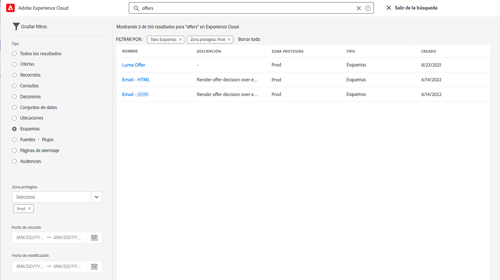

# Interfaz de usuario {#cjm-user-interface}

Conéctese a [Adobe Experience Cloud](http://experience.adobe.com) y busque [!DNL Journey Optimizer].

Los conceptos clave al examinar la interfaz de usuario son habituales en Adobe Experience Platform. Consulte la [documentación de Adobe Experience Platform](https://experienceleague.adobe.com/docs/experience-platform/landing/platform-ui/ui-guide.html?lang=es#adobe-experience-platform-ui-guide) para obtener más información.{target="_blank"}

Los componentes y las funciones disponibles en la IU dependen de los [permisos](../administration/permissions.md) y del [paquete de licencias](https://helpx.adobe.com/legal/product-descriptions/adobe-journey-optimizer.html?lang=es){target="_blank"}. Para cualquier pregunta, póngase en contacto con el Manager de éxito del cliente de Adobe.

>[!NOTE]
>
>Esta documentación se actualiza con frecuencia para reflejar los cambios recientes en la interfaz de usuario del producto. Sin embargo, algunas capturas de pantalla pueden diferir ligeramente de la interfaz de usuario que ve.

## Navegación izquierda {#left-nav}

Examine los vínculos de la izquierda para acceder a las funciones de [!DNL Journey Optimizer].

>[!NOTE]
>
>Las capacidades disponibles pueden variar según los permisos y el acuerdo de licencia.

A continuación, hay la lista completa de servicios y capacidades disponibles en la navegación izquierda y vínculos a las páginas de ayuda asociadas.

**Inicio**

La página principal de [!DNL Journey Optimizer] contiene vínculos clave y recursos para comenzar. La lista **[!UICONTROL Recientes]** proporciona accesos directos a los eventos y recorridos creados recientemente. Esta lista muestra sus fechas de creación y modificación, así como el estado.

**[!UICONTROL ADMINISTRACIÓN DE RECORRIDOS]**

* **[!UICONTROL Recorridos]**: cree, configure y organice los recorridos de cliente. [Más información](../building-journeys/journey-gs.md#jo-build)

* **[!UICONTROL Páginas de aterrizaje]**: cree, diseñe, pruebe y publique páginas de aterrizaje. [Más información](../landing-pages/get-started-lp.md)

**[!UICONTROL GESTIÓN DE DECISIONES]**

* **[!UICONTROL Ofertas]**: acceda a sus fuentes y conjuntos de datos recientes desde este menú. Utilice esta sección para crear nuevas ofertas. [Más información](../offers/offer-library/creating-personalized-offers.md)

* **[!UICONTROL Componentes]**: cree ubicaciones, reglas y etiquetas. [Más información](../offers/offer-library/key-steps.md)

**[!UICONTROL ADMINISTRACIÓN DE CONTENIDO]**

* **[!UICONTROL Recursos]** : [!DNL Adobe Experience Manager Assets Essentials] es un repositorio centralizado de recursos que puede utilizar para rellenar los mensajes. [Más información](../email/assets-essentials.md)

**[!UICONTROL ADMINISTRACIÓN DE DATOS]**

* **[!UICONTROL Esquemas]**: utilice Adobe Experience Platform para crear y administrar esquemas del Modelo de datos de experiencia (XDM) en un lienzo visual interactivo denominado Editor de esquemas. [Más información](../data/get-started-schemas.md)

* **[!UICONTROL Conjuntos de datos]**: todos los datos que se incorporan a Adobe Experience Platform se conservan dentro del lago de datos como conjuntos de datos. Un conjunto de datos es una construcción de almacenamiento y administración para una colección de datos, normalmente una tabla, que contiene un esquema (columnas) y campos (filas). [Más información](../data/get-started-datasets.md)

* **[!UICONTROL Consultas]**: utilice el servicio de consulta de Adobe Experience Platform para escribir y ejecutar consultas, ver consultas ejecutadas anteriormente y acceder a las guardadas por usuarios de su organización. [Más información](../data/get-started-queries.md)

* **[!UICONTROL Monitorización]**: utilice este menú para monitorizar la ingesta de datos en la interfaz de usuario de Adobe Experience Platform. [Más información](https://experienceleague.adobe.com/docs/experience-platform/ingestion/quality/monitor-data-ingestion.html?lang=es){target="_blank"}

**[!UICONTROL CONEXIONES]**

* **[!UICONTROL Fuentes]**: utilice este menú para introducir datos de una variedad de fuentes, como aplicaciones de Adobe, almacenamiento basado en la nube, bases de datos y mucho más, así como estructurar, etiquetar y mejorar los datos entrantes. [Más información](get-started-sources.md)

**[!UICONTROL CLIENTE]**

* **[!UICONTROL Segmentos]**: cree y administre definiciones de segmentos de Experience Platform para aprovecharlas en sus recorridos. [Más información](../segment/about-segments.md)

* **[!UICONTROL Perfiles]**: el perfil del cliente en tiempo real crea una vista integral de cada uno de sus clientes individuales, combinando datos de varios canales, incluidos datos en línea, sin conexión, CRM y de terceros. [Más información](../segment/get-started-profiles.md)

* **[!UICONTROL Identidades]**: el servicio de identidad de Adobe Experience Platform administra la identificación de sus clientes en varios dispositivos, canales cruzados y casi en tiempo real en lo que se conoce como gráfico de identidad dentro de Adobe Experience Platform. [Más información](../segment/get-started-identity.md)

**[!UICONTROL ADMINISTRACIÓN]**

* **[!UICONTROL Administración de recorridos]**: utilice este menú para configurar [eventos](../event/about-events.md), [fuentes de datos](../datasource/about-data-sources.md) y [acciones](../action/action.md) que se utilizarán en los recorridos.

* **[!UICONTROL Zonas protegidas]**: Adobe Experience Platform proporciona entornos limitados que dividen una sola instancia en entornos virtuales independientes para ayudarle a desarrollar aplicaciones de experiencia digital y hacer que evolucionen. [Más información](../administration/sandboxes.md)

* **[!UICONTROL Alertas]**: la interfaz de usuario le permite ver un historial de alertas recibidas en función de las métricas reveladas por Adobe Experience Platform Observability Insights. La IU también le permite ver, habilitar y deshabilitar las reglas de alerta disponibles. [Más información](https://experienceleague.adobe.com/docs/experience-platform/observability/alerts/overview.html?lang=es){target="_blank"}

## Casos de uso dentro del producto {#in-product-uc}

Aproveche los casos de uso de [!DNL Adobe Journey Optimizer] de la página de inicio y proporcione información rápida para crear un recorrido del cliente.

Los casos de uso disponibles son:

* **Cree perfiles de prueba**, para crear perfiles de prueba con la plantilla CSV a fin de probar mensajes y recorridos personalizados. Aprenda a implementar este caso de uso [en esta página](../segment/creating-test-profiles.md#use-case-1).
* **Envíe un mensaje de cumpleaños a los clientes** para que envíen automáticamente un correo electrónico a fin de felicitar a sus clientes. (próximamente)
* **Envíe correos electrónicos para incorporar nuevos clientes** y enviar fácilmente hasta dos correos electrónicos para dar la bienvenida a sus clientes recién registrados. (próximamente)
* **Envíe mensajes push a la lista importada de clientes** para enviar rápidamente una notificación push a una lista de clientes importados desde un archivo CSV. (próximamente)

Haga clic en **[!UICONTROL Ver detalles]** para obtener más información acerca de cada caso de uso.

Haga clic en el botón **[!UICONTROL Comenzar]** para iniciar el caso de uso.

Puede acceder a los casos de uso ejecutados desde el botón **[!UICONTROL Ver biblioteca de casos de uso]**.

## Buscar ayuda y asistencia {#find-help}

Acceda a las páginas de ayuda clave de Adobe Journey Optimizer desde la sección inferior de la página de inicio.

Utilice el icono **Ayuda** para acceder a las páginas de ayuda, ponerse en contacto con el servicio de asistencia técnica y compartir comentarios. Puede buscar artículos de ayuda y vídeos en el campo de búsqueda.

## Navegadores admitidos {#browsers}

La interfaz de Adobe [!DNL Journey Optimizer] está diseñada para funcionar de forma óptima en la última versión de Google Chrome. Es posible que tenga problemas al utilizar determinadas funciones en versiones anteriores u otros navegadores.

## Preferencias de idioma {#language-pref}

Actualmente, la interfaz de usuario está disponible en los siguientes idiomas:

* Inglés
* Francés
* Alemán
* Italiano
* Español
* Portugués (Brasil)
* Japonés
* Coreano

El idioma predeterminado de la interfaz está determinado por el idioma preferido especificado en el perfil de usuario.

Para cambiar el idioma:

* Haga clic en **Preferencias** desde el avatar, en la parte superior derecha.
   
* A continuación, haga clic en el idioma mostrado debajo de su dirección de correo electrónico
* Seleccione el idioma que prefiera y haga clic en **Guardar**. Puede elegir un segundo idioma en caso de que el componente que utilice no esté localizado en su primero.
   

## Buscar{#unified-search}

En cualquier lugar de la interfaz de Adobe Journey Optimizer, utilice la búsqueda unificada de Adobe Experience Cloud en el centro de la barra superior para buscar recursos, recorridos, conjuntos de datos y más en las zonas protegidas.

Empiece a introducir contenido para mostrar los resultados principales. Los artículos de ayuda sobre las palabras clave introducidas también se muestran en los resultados.

Pulse **Entrar** para acceder a todos los resultados y filtrar por objeto empresarial.

## Filtrar listas{#filter-lists}

En la mayoría de las listas, utilice la barra de búsqueda para buscar elementos específicos y defina los criterios de filtrado.

Se puede acceder a los filtros haciendo clic en el icono de filtro en la parte superior izquierda de una lista. El menú de filtros permite filtrar los elementos mostrados según diferentes criterios. Puede elegir mostrar únicamente los elementos de un determinado tipo o estado, los que ha creado o los modificados en los últimos 30 días. Las opciones difieren según el contexto.

En la lista de recorridos, puede filtrarlos según su estado, tipo y versión en **[!UICONTROL Estado y versión de filtros]**. El tipo puede ser: **[!UICONTROL Evento unitario]**, **[!UICONTROL Clasificación del segmento]**, **[!UICONTROL Leer segmento]**, **[!UICONTROL Evento empresarial]** o **[!UICONTROL Ráfaga]**. Puede elegir mostrar solo los recorridos que utilizan un evento, un grupo de campos o una acción en **[!UICONTROL Filtros de actividad]** y **[!UICONTROL Filtros de datos]**. Los **[!UICONTROL Filtros de publicaciones]** permiten seleccionar una fecha de publicación o un usuario. Puede elegir, por ejemplo, mostrar las versiones más recientes de recorridos en directo que se publicaron ayer. [Más información](../building-journeys/using-the-journey-designer.md).

>[!NOTE]
>
>Tenga en cuenta que las columnas mostradas se pueden personalizar mediante el botón de configuración en la parte superior derecha de las listas. La personalización se guarda para cada usuario.

Utilice las columnas **[!UICONTROL Última actualización]** y **[!UICONTROL Última actualización hecha por]** para comprobar cuándo se produjo la última actualización de los recorridos y quién los guardó.

En los paneles Evento, Fuente de datos y Configuración de acciones, el campo **[!UICONTROL Utilizado en]** muestra el número de recorridos que utilizan ese evento, grupo de campos o acción en particular. Puede hacer clic en el botón **[!UICONTROL Ver recorridos]** para mostrar la lista de los recorridos correspondientes.

En las listas, puede realizar acciones básicas por cada elemento. Por ejemplo, puede duplicar o eliminar un elemento.

