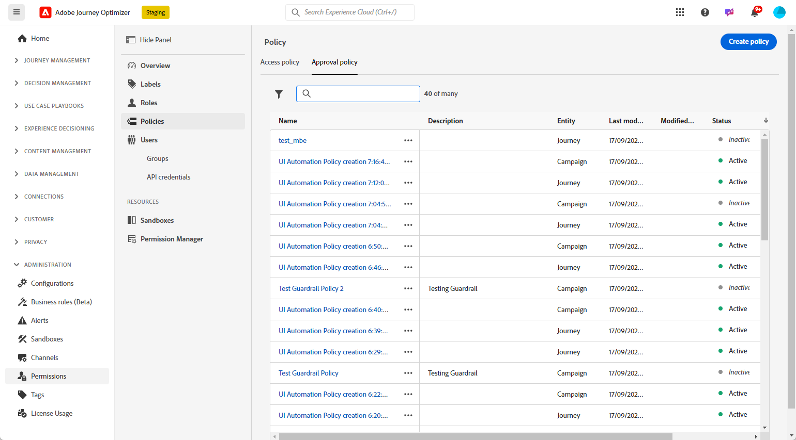
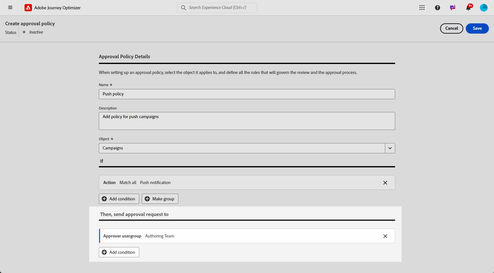

# Creación y administración de políticas de aprobación {#approval-policies}

>[!CONTEXTUALHELP]
>id="ajo_approval_policy_request_approval"
>title="Solicitud de aprobación"
>abstract="Solicitud de aprobación"

>[!CONTEXTUALHELP]
>id="ajo_approval_policy_request_change"
>title="Solicitar cambio"
>abstract="Solicitar cambio"

>[!NOTE]
>
>Para crear directivas de aprobación, debe tener privilegios de administrador de sistemas o productos en Adobe Experience Platform. [Más información](https://experienceleague.adobe.com/es/docs/experience-platform/access-control/home)

Las políticas de aprobación permiten a los administradores establecer un proceso de validación para recorridos y campañas. Este sistema describe condiciones específicas que determinan si un recorrido o una campaña requiere aprobación. Estas políticas pueden variar en complejidad. Simplemente pueden requerir que todas las campañas sean revisadas por un usuario o equipo en particular, o establecer criterios basados en quién creó la campaña.

Puede segmentar las políticas de aprobación utilizando criterios flexibles como etiquetas, nombres de campañas/recorridos, tipos de canales o información sobre solicitantes. Por ejemplo, puede requerir la aprobación de todos los objetos etiquetados con &quot;alto riesgo&quot; o de cualquier campaña que coincida con un patrón de nombre específico.

## Creación de políticas de aprobación {#create-policies}

>[!CONTEXTUALHELP]
>id="ajo_permissions_approval_policy"
>title="Nueva directiva de aprobación"
>abstract="En esta pantalla, introduzca el nombre y seleccione el contexto para la política de aprobación y, a continuación, cree las condiciones para determinar quién puede iniciar la solicitud de aprobación y quién puede validarla."

>[!CONTEXTUALHELP]
>id="ajo_approval_policy_self_approval"
>title="Bloquear aprobación automática"
>abstract="Active esta opción para evitar que los usuarios aprueben sus propias solicitudes de aprobación, incluso cuando pertenezcan a un grupo de usuarios o a una función que se haya designado como revisor."

Para crear una política de aprobación, siga estos pasos:

1. Desde el menú **[!UICONTROL Administración]** de [!DNL Journey Optimizer], accede a **[!UICONTROL Permisos]** y luego a **[!UICONTROL Políticas]**.

   

1. Haga clic en **[!UICONTROL Crear]** en la ficha **[!UICONTROL Directiva de aprobación]**, elija **[!UICONTROL Directiva de aprobación]** y haga clic en **[!UICONTROL Confirmar]**.

1. Escriba un **[!UICONTROL Nombre]** y **[!UICONTROL Descripción]** para la directiva.

1. Seleccione si la directiva se aplicará a **[!UICONTROL Recorridos]** o **[!UICONTROL Campañas]**.

1. Habilite **[!UICONTROL Bloquear autoaprobación]** para evitar que los creadores de Recorrido/campaña aprueben sus propios objetos.

   

Ahora puede restringir las condiciones para especificar quién puede iniciar la solicitud de aprobación y quién puede validarla.

## Establecer condiciones para directivas de aprobación {#conditions}

Las políticas de aprobación ofrecen opciones de segmentación flexibles para satisfacer sus necesidades de gobernanza. Puede crear políticas de aprobación basadas en varios criterios, entre los que se incluyen:

* **Nombres de campaña/Recorrido**: objetos específicos de destino por nombre
* **Etiquetas**: aplique directivas a todas las campañas o recorridos con una etiqueta específica
* **Tipos de canales**: requieren aprobación para acciones específicas (correo electrónico, SMS, push, etc.)
* **Tipos de campaña**: establezca reglas diferentes para [Campañas activadas por acción frente a campañas activadas por API](../campaigns/get-started-with-campaigns.md#campaign-types)
* **Solicitantes**: defina directivas basadas en quién crea la campaña o el recorrido

Para definir las condiciones asociadas a una política de aprobación, siga estos pasos:

1. Acceda a su **[!UICONTROL directiva de aprobación]**.

1. En el menú **[!UICONTROL If]**, haga clic en **[!UICONTROL Agregar condición]** para definir qué objeto o usuario almacenará en déclencheur una solicitud de aprobación.

1. Elija la **[!UICONTROL categoría]**, **[!UICONTROL regla coincidente]** y **[!UICONTROL opciones]** adecuadas.

   Por ejemplo, &quot;si la acción coincide con cualquier correo postal&quot; o &quot;Si el nombre de usuario del solicitante coincide con John Doe&quot;.

   

   +++ Más información sobre las categorías y opciones disponibles
   <table>
    <tr>
      <th>Categoría</th>
      <th>Opción</th>
    </tr>
    <tr>
      <td rowspan="3">Tipo de campaña</td>
      <td>Programado (Marketing)</td>
    </tr>
    <tr>
    <td>Activado por API (marketing)</td>
    </tr>
    <tr>
    <td>Activado por API (transaccional)</td>
    </tr>
    <tr>
    <td rowspan="8">Acción</td>
    <td>in-app</td>
    </tr>
    <tr>
    <td>Notificación push</td>
   </tr>
    <tr>
    <td>SMS</td>
    </tr>
    <tr>
    <td>Correo electrónico</td>
    </tr>
    <tr>
    <td>Correo directo</td>
    </tr>
    <tr>
    <td>Web</td>
    </tr>
    <tr>
    <td>Basado en código</td>
    </tr>
    <tr>
    <td>Tarjeta de contenido</td>
    </tr>
    <tr>
    <td>Etiquetas</td>
    <td>Nombre de la etiqueta utilizada para organizar las audiencias. </td>
    </tr>
    <tr>
    <td>Nombre del objeto</td>
    <td>Nombre del objeto.</td>
    </tr>
    <tr>
    <td>Nombre de usuario del solicitante</td>
    <td>Nombre y dirección de correo electrónico del solicitante designado</td>
    </tr>
    <tr>
    <td>Grupo de usuarios solicitante</td>
    <td>Nombre del grupo de usuarios de los solicitantes designados</td>
    </tr>
    </table>

1. Para agregar más criterios, haga clic en **[!UICONTROL Agregar condición]** para definir reglas adicionales y seleccione **[!UICONTROL And]** o **[!UICONTROL Or]** para especificar cómo se conectan las condiciones.

1. En el menú **[!UICONTROL Entonces, enviar solicitud de aprobación a]**, haga clic en **[!UICONTROL Agregar condición]** para definir qué usuario puede aceptar la solicitud de aprobación.

1. En la lista desplegable **[!UICONTROL Categoría]**, seleccione si desea elegir un grupo de usuarios o un usuario individual.

1. A continuación, en la lista desplegable **[!UICONTROL Opción]**, seleccione el grupo de usuarios o usuario específico.

   El usuario o grupo de usuarios seleccionado será responsable de validar la solicitud de aprobación.

   

1. Para agregar más criterios, haga clic en **[!UICONTROL Agregar condición]** para definir reglas adicionales y seleccione **[!UICONTROL And]** o **[!UICONTROL Or]** para especificar cómo se conectan las condiciones.

1. Una vez que la directiva esté completamente configurada, haga clic en **[!UICONTROL Guardar]**.

Ahora puede activar la directiva de aprobación para aplicarla.

## Activación y administración de directivas de aprobación {#activate-policies}

Para aplicar la directiva de aprobación, debe activarla. Para ello, siga estos pasos:

1. Acceda a su **[!UICONTROL directiva de aprobación]**.

1. A continuación, haga clic en **[!UICONTROL Activar]** para aplicar las condiciones configuradas a su entorno.

   >[!NOTE]
   >
   >Una vez activadas, las directivas no se pueden editar. Para modificar las condiciones, desactive primero la directiva.

   

1. En el menú **[!UICONTROL Directiva]**, abra las opciones avanzadas para **[!UICONTROL Editar]**, **[!UICONTROL Desactivar]** o **[!UICONTROL Duplicar]** la directiva según sea necesario.

   
