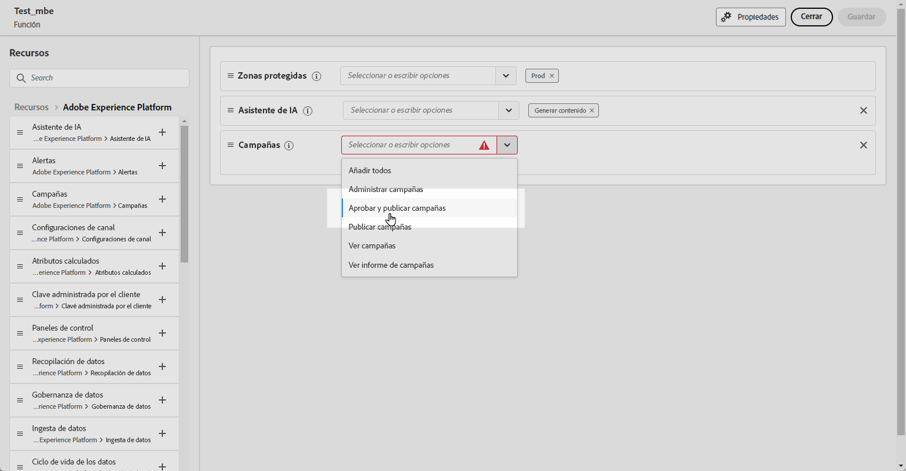
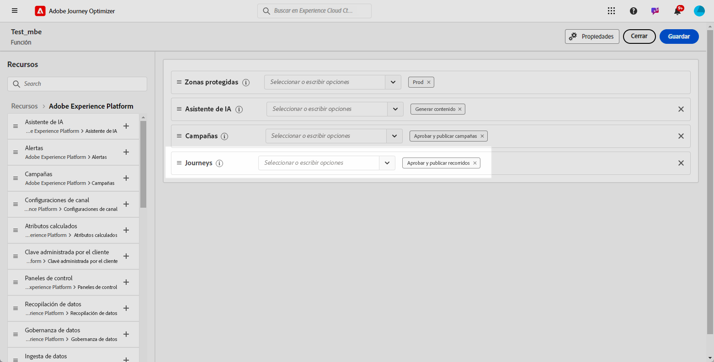
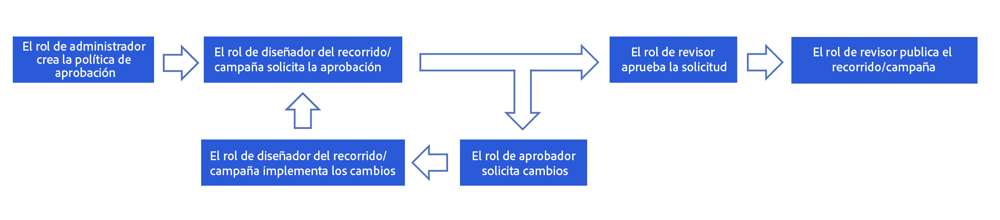
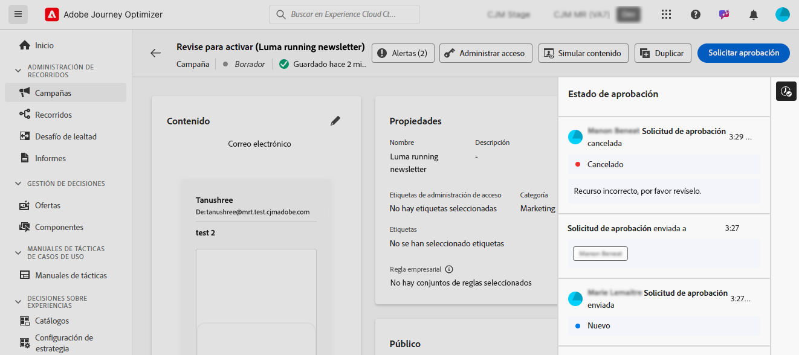

# Introducción a la aprobación de recorridos y campañas {#send-proofs}

## Introducción a las políticas de aprobación {#gs}

Journey Optimizer posibilita configurar un proceso de aprobación que permita a los equipos de marketing asegurarse de que las partes interesadas revisan y aprueban las campañas y los recorridos antes de que se pongan en marcha.

Las políticas de aprobación introducen un flujo de trabajo estructurado directamente en la interfaz de usuario, lo que elimina la necesidad de medios externos, como herramientas de administración de tareas o correo electrónico, y garantiza que todas las aprobaciones se administren y rastreen de forma centralizada.

Además, esta función proporciona un control mejorado sobre la publicación de los recorridos y las campañas: con el proceso de aprobación integrado en Journey Optimizer, las campañas y los recorridos permanecen en estado “bloqueado” durante la revisión, lo que garantiza que no se produzcan cambios ni activaciones no deseados antes de que se establezcan todas las aprobaciones necesarias.

## Requisitos previos {#prerequisites}

Antes de empezar, asegúrese de que se han configurado los permisos siguientes.

Para acceder a los recorridos y campañas de aprobación y publicación, los usuarios deben tener los permisos **Aprobar y publicar campañas** y **Aprobar y publicar recorridos**. [Más información](../administration/permissions.md)

+++  Aprenda a asignar permisos relacionados con la aprobación

1. En el producto **Permisos**, vaya a la pestaña **Funciones** y seleccione la **Función** que desee.

1. Haga clic en **Editar** para modificar los permisos.

1. Añada el recurso **Campañas** y, a continuación, seleccione **Aprobar y publicar campañas** en el menú desplegable.

   {zoomable="yes"}

1. Añada el recurso **Recorridos** y, a continuación, seleccione **Aprobar y publicar recorridos** en el menú desplegable.

   {zoomable="yes"}

1. Haga clic en **Guardar** para aplicar los cambios.

Los permisos de los usuarios que ya estén asignados a esta función se actualizarán automáticamente.

1. Para asignar esta función a nuevos usuarios, vaya a la pestaña **Usuarios** en el panel de control **Funciones** y haga clic en **Añadir usuario**.

1. Introduzca el nombre del usuario y su dirección de correo electrónico, o selecciónelo en la lista, y haga clic en **Guardar**.

1. Si el usuario no estaba ya creado, consulte [esta documentación](https://experienceleague.adobe.com/es/docs/experience-platform/access-control/abac/permissions-ui/users).

El usuario recibirá un correo electrónico con instrucciones para acceder a su instancia.

+++

## Información general del proceso de aprobación {#process}

El proceso de aprobación global es el siguiente:

{zoomable="yes"}

1. **Configuración de políticas de aprobación**

   Un administrador crea una política de aprobación y define las condiciones en las que debe aplicarse a recorridos o campañas. Por ejemplo, puede crear una política de aprobación que requiera que todas las campañas programadas creadas por un usuario determinado se aprueben antes de activarse. [Aprenda a crear políticas de aprobación](approval-policies.md)

1. **Envío de campañas/recorridos para su aprobación**

   Los creadores de campañas/recorridos crean un recorrido o una campaña y la envían para su aprobación. La campaña o el recorrido entran en el estado “En revisión”, durante el cual no se pueden realizar ediciones a menos que se cancele la solicitud. [Aprenda a solicitar la aprobación](request-approval.md)

   >[!NOTE]
   >
   >Las campañas y los recorridos solo deben enviarse para su aprobación si se ha implementado una política de aprobación. Si no se aplica ninguna política de este tipo, el creador puede publicar directamente la campaña o el recorrido sin requerir la aprobación.

1. **Revisión y aprobación**

   Los aprobadores definidos en la política de aprobación que se aplica al recorrido o campaña reciben una notificación. Pueden revisar el recorrido o el contenido, el público y la configuración de la campaña. Si es necesario realizar cambios, el aprobador los solicita y devuelve la campaña a “Borrador” para que se revise. Si están listos, pueden activar e iniciar el recorrido o la campaña. [Aprenda a revisar y aprobar una solicitud](review-approve-request.md)

## Monitorización de solicitudes de aprobación {#monitor}

Puede monitorizar todas las solicitudes de aprobación y cambio que se han enviado para un recorrido o campaña determinados. Para ello, haga clic en el icono **[!UICONTROL Mostrar pista de auditoría]** ubicado en la sección superior derecha del lienzo del recorrido o en la pantalla de revisión de la campaña.

