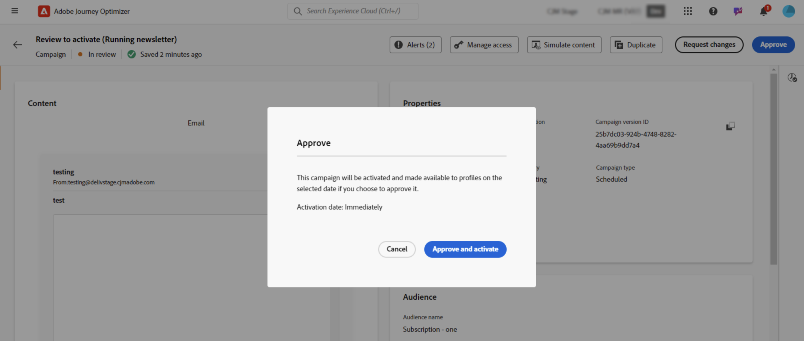

# Revisión y aprobación de una solicitud {#approve-requests}

>[!BEGINSHADEBOX]

**En esta página:** Como aprobador designado, revise un recorrido o campaña enviada y apruébela y publíquela, o bien envíe solicitudes de cambio al creador antes de que se ponga en marcha.

>[!ENDSHADEBOX]

Si se aplica una directiva de aprobación a un recorrido o campaña, debe enviarse para su aprobación para que se publique. Para ello, el creador del recorrido/campaña envía una solicitud a los aprobadores definidos en la directiva de aprobación y el recorrido/campaña obtiene el estado **[!UICONTROL En revisión]**.

Si se le ha seleccionado como aprobador, se le notificará mediante un mensaje de correo electrónico y una alerta de Journey Optimizer, a la cual se puede acceder haciendo clic en el icono de campana en la parte superior derecha de la pantalla, en la pestaña **[!UICONTROL Solicitudes]**.

Para revisar el recorrido/campaña, ábralo desde el correo electrónico o la alerta y compruebe su configuración, como audiencia, contenido o configuración.
Una vez finalizado, puede [aprobar y publicar el recorrido/campaña](#approve) o [solicitar cambios antes de activarlo](#changes).

>[!NOTE]
>
>La revisión de una campaña es un paso de solo lectura: puede visualizar toda su configuración, pero no puede realizar ninguna acción en ella.
>
>Antes de revisar un recorrido o una campaña, asegúrese de que tiene los permisos necesarios.

## Aprobación y publicación de un recorrido/campaña {#approve}

Si un recorrido o una campaña están listos para iniciarse, puede aprobarlos si hace clic en el botón **[!UICONTROL Aprobar]**.

En la ventana que se muestra, haga clic en **[!UICONTROL Aprobar y activar]** para que el recorrido o la campaña se publique.

## Solicitar cambios en un recorrido/campaña {#changes}

Si es necesario realizar cambios en un recorrido o una campaña que se ha enviado para su aprobación, puede enviar una solicitud al creador para que realice los cambios necesarios.

Para ello, haga clic en el botón **[!UICONTROL Solicitar cambios]**. En el panel que se abre, proporciona un mensaje que detalla tu solicitud y haz clic en **[!UICONTROL Enviar]** para enviar la solicitud.

Después de enviar la solicitud, se notifica al creador de la recorrido/campaña por correo electrónico y mediante una alerta de Journey Optimizer. La campaña vuelve al estado Borrador. Una vez integrados los cambios, el recorrido/creador de la campaña puede volver a enviarlos para su aprobación.

>[!NOTE]
>
> Si no recibe la notificación de aprobación por correo electrónico, debe actualizar las preferencias de suscripción en el perfil [!DNL CX Enterprise]. [Más información](https://experienceleague.adobe.com/en/docs/core-services/interface/features/account-preferences)
