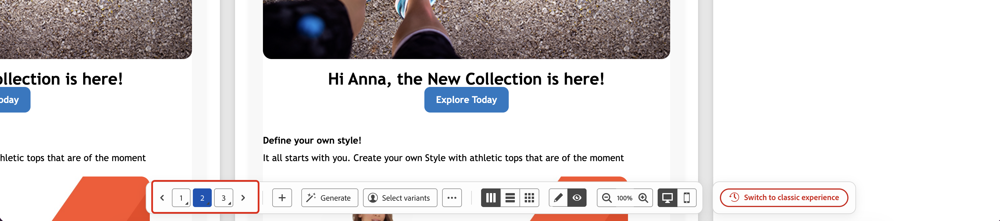
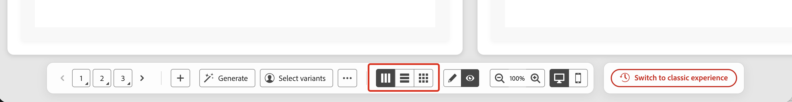

# Simulación de variaciones de contenido {#simulate-content-variations}

>[!BEGINSHADEBOX]

**En esta página:** Obtenga una vista previa de todas las variantes de contenido de un vistazo en una cuadrícula en paralelo, adminístrelas desde una barra de acciones inferior consolidada y vuelva a la experiencia clásica en cualquier momento.

>[!ENDSHADEBOX]

La experiencia **[!UICONTROL Simular variaciones de contenido]** se ha rediseñado para que las pruebas y comparaciones de las variantes sean más rápidas y sencillas. Ahora, todas las variantes se representan juntas en una sola cuadrícula desplazable y todos los controles que necesite están disponibles en una sola barra de acciones inferior.

Para acceder a la nueva experiencia, desde el contenido, haga clic en **[!UICONTROL Simular contenido]** para abrir la pantalla de simulación de contenido. Si las variantes ya están disponibles, la cuadrícula de vista previa se muestra inmediatamente. Si todavía no existe ninguna, se muestra una variante en blanco y puede empezar a crearlas mediante cualquiera de los métodos descritos a continuación.

Si prefiere el diseño anterior, haga clic en **[!UICONTROL Cambiar a la experiencia clásica]** en la barra de acciones inferior en cualquier momento. La documentación de la experiencia clásica está disponible en [Simular variaciones de contenido (experiencia clásica)](simulate-sample-input.md).

## Crear y administrar variantes {#manage-variants}

Las variantes se pueden crear de diferentes maneras: manualmente, una por una o importando un archivo, generándolas con IA o seleccionando usuarios simulados existentes. Puede añadir hasta 30 variantes manualmente o mediante la carga de archivos. Al utilizar la generación de IA, se pueden crear hasta 40 variantes en función de la complejidad del contenido.

### Añadir variantes manualmente {#add-variants}

Para agregar manualmente una variante en blanco, haga clic en **[!UICONTROL +]** en la barra de acciones inferior. Se añade una nueva variante en blanco y puede introducir los valores de atributo directamente.

También puede usar **[!UICONTROL ...]** > **Cargar variantes** para importar un archivo CSV, JSON o JSONLINES donde cada fila o entrada se convierte en una variante. Descargue la plantilla de archivo desde el cuadro de diálogo de carga para utilizar el formato correcto.

### Generar variantes automáticamente {#auto-generate}

Para generar de forma automática variantes mediante IA, haga clic en el botón **[!UICONTROL Generar]** en la barra de acciones inferior. El sistema analiza el contenido, identifica los campos de personalización y las ramas condicionales y genera tantas variantes como sea necesario para cubrirlas con valores realistas. Las variantes generadas por IA se pueden identificar mediante el icono de chispa que se muestra en su tarjeta.

>[!CAUTION]
>
>Al hacer clic en **[!UICONTROL Generar]**, se reemplazarán todas las variantes existentes, incluidas las que se hayan agregado manualmente o desde un archivo.

### Seleccionar variantes de usuarios simulados {#simulated-users}

Puede basar sus variantes en **usuarios simulados** que son entidades de prueba reutilizables y similares a un perfil que se guardan entre sesiones y se pueden compartir con otros usuarios. A diferencia de las variantes introducidas manualmente, los usuarios simulados persisten más allá de la sesión actual del explorador.

Los usuarios simulados se crean y administran desde la característica **[!UICONTROL Simulación]** del recorrido. Para ver el procedimiento completo, consulte [Crear y administrar usuarios simulados](../building-journeys/simulate-journey.md#test-users).

Para utilizar usuarios simulados como variantes:

1. Haga clic en **[!UICONTROL Seleccionar variantes]** en la barra de acciones inferior.
1. Seleccione los usuarios simulados que desee usar en la lista y luego haga clic en **[!UICONTROL Seleccionar]**.

Los usuarios simulados seleccionados se añaden como variantes. Puede editar los valores de atributo de una variante localmente para probarlos, pero esos cambios no se vuelven a guardar en el registro de usuario simulado.

### Exportar variantes {#export-variants}

Puede exportar todas las variantes actuales, tanto si se añaden manualmente, se generan con IA o se seleccionan entre los usuarios simulados, a un archivo CSV. Haga clic en **[!UICONTROL ...]** en la barra de acciones inferior y, a continuación, seleccione **[!UICONTROL Exportar variantes]**.

## Previsualizar variantes {#preview-grid}

### Cambiar entre variantes {#switch-variants}

En el modo de vista previa, todas las variantes se representan en paralelo con un indicador numerado en la parte superior. Para cambiar entre variantes, haga clic en el número o utilice los botones de navegación **&lt; >** de la barra de acciones inferior.

### Mostrar variantes en modo de previsualización o edición {#edit-variants}

Puede mostrar variantes en el modo de vista previa o edición, donde puede editar directamente los valores de contenido y atributos. Haga clic en **[!UICONTROL Vista previa]** o **[!UICONTROL Editar]** en la barra de acciones inferior para cambiar todas las vistas previas a la vez entre los dos modos.

Para alternar una sola variante individualmente, haga clic en el botón **[!UICONTROL Mostrar vista previa]** o **[!UICONTROL Mostrar detalles de la variante]** en la parte superior de la tarjeta, o presione con el botón presionado su número en la barra de acciones inferior (o use Alt + Arriba/Abajo).

### Cambio del diseño {#change-layout}

Para cambiar la forma en que se muestran las variantes, use la **barra de acciones inferior** para cambiar entre diseños paralelos, apilados verticalmente o ajustados.

### Cambiar entre las vistas de escritorio y móvil {#switch-views}

Para mostrar cómo se procesarán las variantes en diferentes dispositivos, haga clic en los iconos de la barra de acciones inferior para cambiar entre las vistas de escritorio y móvil. La cuadrícula de vista previa se actualiza para mostrar el aspecto que tendrán las variantes en el dispositivo seleccionado.

## Funciones adicionales para el canal de correo electrónico {#email-capabilities}

Al simular el contenido del correo electrónico, una barra superior proporciona herramientas adicionales específicas del correo electrónico.

* **[!UICONTROL Informe de correo no deseado]**: analice el contenido del correo electrónico en relación con los filtros de correo no deseado y obtenga una puntuación de entrega. [Más información](../content-management/spam-report.md)
* **[!UICONTROL Procesar correo electrónico]**: obtiene una vista previa del procesamiento de correo electrónico en clientes y dispositivos de correo electrónico populares. [Más información](../content-management/rendering.md)
* **[!UICONTROL Enviar prueba]**: envía una prueba de una o más variantes a un conjunto de destinatarios de correo electrónico. Haga clic en **[!UICONTROL Enviar prueba]**, añada hasta 10 direcciones de destinatario, seleccione las variantes que desee incluir y, a continuación, haga clic en **[!UICONTROL Enviar prueba]** para confirmar. Para revisar las pruebas enviadas anteriormente, haga clic en **[!UICONTROL Ver pruebas]**. [Más información](../content-management/proofs.md)
* **[!UICONTROL Ver detalles de configuración]**: revise la configuración de canal aplicada a este contenido.
