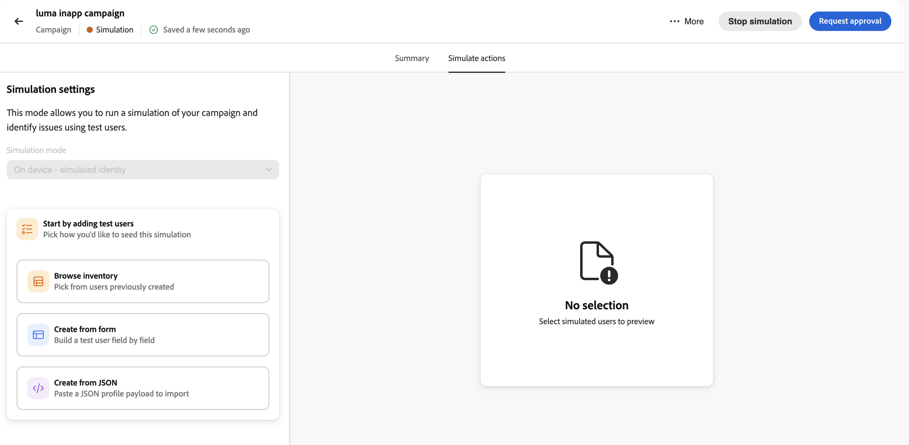
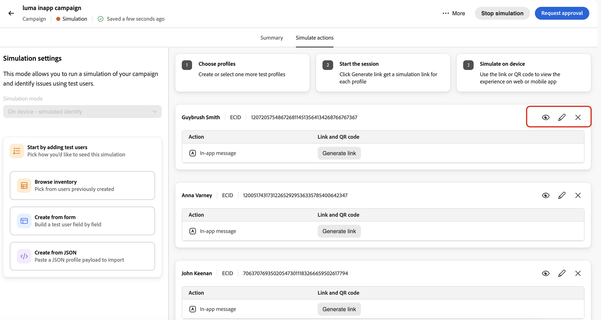
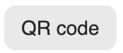

# Simular experiencias entrantes {#simulate-inbound-experiences}

>[!BEGINSHADEBOX]

**En esta página:** Valide las experiencias de campaña de acción entrantes con usuarios simulados antes de lanzarlas, incluida la vista previa de vínculos y QR, el comportamiento de simulación y las limitaciones clave.

>[!ENDSHADEBOX]

>[!AVAILABILITY]
>
>Esta capacidad se encuentra actualmente en Private Beta. Para solicitar acceso, póngase en contacto con su representante de Adobe.

## Información general {#inbound-simulation-overview}

La simulación de experiencia entrante permite validar experiencias entrantes personalizadas para una **campaña de acción** con usuarios simulados antes de que la campaña esté activa. Utilícelo para verificar el direccionamiento, las decisiones, el contenido procesado y solucionar problemas de comportamiento en las rutas de vista previa web y móvil.

Cuando se inicia el modo de simulación, la campaña entra en el estado **[!UICONTROL Simulation]**. Puede salir y volver más tarde mientras la simulación permanece activa y el contenido y la configuración de la campaña están bloqueados para su edición (similar a un estado publicado). Las experiencias simuladas no se exponen a la audiencia de producción.

Para obtener el flujo de revisión de la campaña completo, incluida la vista previa de contenido y el contexto de simulación, consulte [Revisar y activar una campaña de acción](../campaigns/review-activate-campaign.md).

## Entrar y ejecutar el modo de simulación {#enter-simulation-mode}

Para acceder al modo de simulación:

1. En su campaña de acción, acceda a la interfaz **[!UICONTROL Revisar para activar]** y luego seleccione la pestaña **[!UICONTROL Simular acciones]**.

   

1. Seleccione los usuarios simulados que desee utilizar para la simulación mediante uno de los métodos disponibles:

   * **[!UICONTROL Examinar inventario]** - Seleccionar usuarios simulados creados anteriormente.
   * **[!UICONTROL Crear desde formulario]** - Crear un usuario simulado campo por campo.
   * **[!UICONTROL Crear a partir de JSON]**: importe una carga útil de perfil de usuario simulada de archivo JSON.

   

   Para obtener más información sobre cómo crear y administrar usuarios simulados, consulte [Crear y administrar usuarios simulados](../building-journeys/simulate-journey.md#test-users).

1. Una vez seleccionados o creados los usuarios simulados, aparecen en el panel central. Para cada usuario, puede ver los detalles, actualizar la información del usuario o eliminar el usuario de la lista de simulación.

   

1. Para generar la salida simulada para cada usuario, haga clic en el botón **[!UICONTROL Generar vínculo]**. Esto genera:

   * Una URL que se puede compartir para previsualizar la experiencia entrante representada para el usuario seleccionado.
   * Un código QR para escenarios de vista previa para móviles.

1. Para cada usuario simulado, utilice los controles generados para validar la experiencia:

   

   | Botón | Qué hace |
   | --- | --- |
   |  | Abra el vínculo generado en un explorador para previsualizar la experiencia de entrada de ese usuario simulado. |
   |  | Copie el vínculo generado para poder compartirlo o pegarlo en otro explorador o dispositivo. |
   |  | Abra el código QR (si está disponible para el canal), seleccione **[!UICONTROL iOS]** o **[!UICONTROL Android]**, escanee el código con la cámara de su dispositivo e introduzca el código mostrado cuando se le solicite. |
   |  | Abra opciones adicionales para **[!UICONTROL Abrir sesión de garantía]** o **[!UICONTROL Nueva sesión de garantía]** y continúe con la solución de problemas en la interfaz de usuario de Assurance. |

1. Puede salir del modo de simulación en cualquier momento haciendo clic en **[!UICONTROL Detener simulación]** en la barra de acciones de la campaña, por ejemplo, si necesita volver atrás y editar la campaña.
