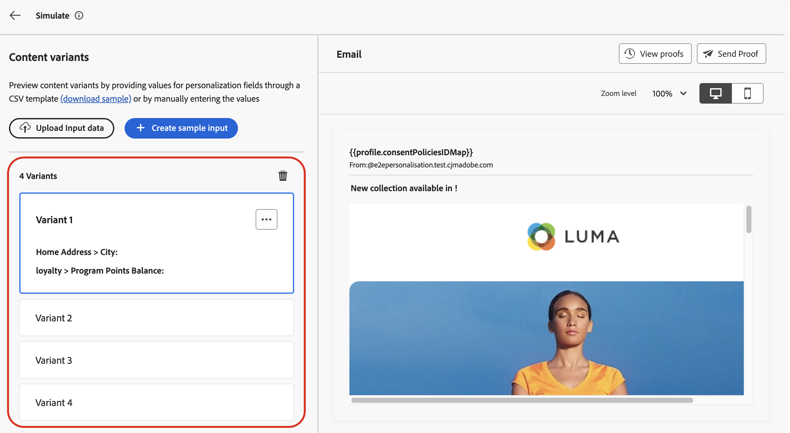
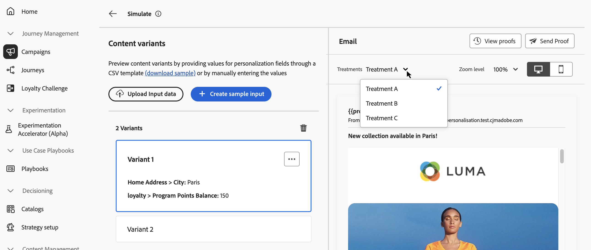

# Simulación de variaciones de contenido {#custom-profiles}

>[!CONTEXTUALHELP]
>id="ajo_simulate_sample_profiles"
>title="Simular mediante entrada de muestra"
>abstract="En esta pantalla, puede probar diferentes variantes del contenido proporcionando valores para los campos de personalización a través de una plantilla CSV o JSON o introduciendo los valores manualmente."

Recorrido Optimizer le permite previsualizar diferentes variaciones de contenido utilizando datos de entrada de muestra cargados desde un archivo CSV o JSON o añadidos manualmente.

El sistema detecta automáticamente todos los atributos utilizados en el contenido para la personalización y los puede utilizar en las pruebas para crear varias variantes. Una variante hace referencia a una versión del contenido con valores diferentes para sus atributos.

>[!NOTE]
>
>Las variantes solo sirven como propósitos de prueba para el contenido actual. No se almacenan en Adobe Experience Platform, sino en la sesión del explorador del usuario, lo que significa que no se muestran al cerrar la sesión o al trabajar desde otro dispositivo.

## Mecanismos de protección y limitaciones {#limitations}

Antes de empezar a probar el contenido con datos de entrada de ejemplo, tenga en cuenta las siguientes protecciones y requisitos previos.

* **Canales**: la simulación de variaciones de contenido solo está disponible para los canales de correo electrónico, SMS y notificaciones push.

* **Funciones compatibles**: las variaciones de contenido se pueden usar con [!DNL Journey Optimizer] funciones de contenido multilingüe y experimento de contenido. Esto le permite probar mensajes en varios idiomas y optimizar el contenido mediante la experimentación.

  También puede aprovechar las variaciones de contenido para probar las plantillas de contenido.

  >[!NOTE]
  >
  >Por ahora, los informes de procesamiento de bandeja de entrada y correo no deseado no están disponibles en la experiencia actual:. Para usar estas características, selecciona el botón **[!UICONTROL Simular contenido]** de tu contenido para acceder a la interfaz de usuario anterior.

* **Atributos**: se admiten atributos contextuales y de perfil.

* **Tipos de datos**: solo se admiten los siguientes tipos de datos al escribir datos para las variantes: número (entero y decimal), cadena, booleano y tipo de fecha. Cualquier otro tipo de datos mostrará un error.

* **Número de variantes**: puede agregar hasta 30 variantes para probar el contenido, ya sea mediante un archivo o manualmente.

## Agregar y previsualizar variaciones de contenido

Para crear variaciones para el contenido y previsualizarlas, haga clic en el botón **[!UICONTROL Simular contenido]** y elija **[!UICONTROL Simular variaciones de contenido]**.


Los pasos principales para probar el contenido son los siguientes:

1. **Agregar variantes** - Agregue hasta 30 variantes con datos de entrada de ejemplo, ya sea cargando un archivo o agregando datos manualmente. [Aprenda a agregar variantes](#profiles)
1. **Previsualizar variaciones de contenido** - Compruebe la vista previa de su contenido usando las diferentes variantes. [Obtenga información sobre cómo obtener una vista previa del contenido](#preview)
1. **Enviar pruebas por correo electrónico**: para el contenido de los correos electrónicos, envía hasta 10 pruebas a las direcciones de correo electrónico que usen las diferentes variantes. [Aprenda a enviar pruebas](#proofs)

### Añadir variantes {#profiles}

Al acceder a la experiencia de variaciones de contenido, todos los campos personalizados utilizados en el contenido se detectan automáticamente y se muestran en una lista de variantes en blanco.

Por ejemplo, si el correo electrónico contiene dos campos de personalización, &quot;Ciudad&quot; y &quot;Saldo de puntos del programa&quot;, aparecerán en la lista. Inicialmente, no se introduce ningún valor y no se muestra ningún contenido personalizado en el panel de vista previa.



Para editar el valor de una variante:

1. Haga clic en el botón de los tres puntos situado junto a la variante.
1. Seleccione **[!UICONTROL Editar]** para proporcionar valores personalizados para cada campo de personalización.
1. El panel de vista previa se actualizará para mostrar cómo se procesa el contenido con los valores introducidos.

Para agregar una nueva variante:

1. Haga clic en el botón **[!UICONTROL Crear entrada de ejemplo]**.
1. Aparece una nueva variante en blanco que contiene todos los campos personalizados detectados.
1. Edite la nueva variante según sea necesario.


También puede cargar un archivo con variantes y valores predefinidos para acelerar el proceso.

1. Haga clic en **[!UICONTROL Descargar muestra]** para descargar una plantilla de archivo.
1. Elija un formato de archivo: CSV, JSON o JSONLINES.
1. Abra el archivo de plantilla y rellene los valores deseados para cada atributo de perfil. La plantilla incluye una columna para cada atributo de perfil utilizado en el contenido para la personalización.

   Ejemplo de sintaxis JSON:

   ```
   {
   "profile": {
       "attributes": {
       "person": {
           "name": {
               "lastName": "Doe",
               "firstName": "John"
               }
           }
       }
   }
   }
   ```

1. Una vez que el archivo esté listo, haga clic en **[!UICONTROL Cargar datos de entrada]** para cargarlo.
1. Después de la carga, se agrega una nueva variante a la lista para cada entrada del archivo.

   

Una vez añadidas las variantes, puede utilizarlas para obtener una vista previa del contenido en el panel derecho y enviar pruebas por correo electrónico.

### Previsualizar variaciones de contenido {#preview}

Para obtener una vista previa del contenido mediante una variante, seleccione la variante correspondiente de la lista para actualizar el contenido en el panel de vista previa con la información introducida para esta variante.

En el ejemplo siguiente, se han añadido dos variantes para la línea de asunto del correo electrónico:

| Selección de variante 1 | Selección de variante 2 |
|----------|-------------|
|  |  |

Para el contenido y la experimentación multilingües, hay disponible una lista desplegable para cambiar entre las diferentes variantes o tratamientos de idioma.



Puede quitar una variante en cualquier momento con el botón de los tres puntos de la esquina superior derecha y seleccionando **[!UICONTROL Quitar]**. Para editar la información de una variante, haga clic en el botón de puntos suspensivos y seleccione **[!UICONTROL Editar]**.

### Envío de pruebas {#proofs}

Journey Optimizer le permite enviar pruebas a las direcciones de correo electrónico mientras suplanta una o varias variantes que haya agregado en la pantalla de simulación. Los pasos son los siguientes:

1. Compruebe que se hayan agregado variantes para probar el contenido y haga clic en el botón **[!UICONTROL Enviar prueba]**.

1. En el campo **[!UICONTROL Destinatarios]**, escriba la dirección de correo electrónico a la que desea enviar la prueba y haga clic en **[!UICONTROL Agregar]**. Repita la operación para enviar la prueba a direcciones de correo electrónico adicionales. Puede añadir hasta 10 destinatarios de prueba.

1. En la sección inferior de la pantalla, seleccione la variante que desee utilizar en la prueba. Puede seleccionar varias variantes, en cuyo caso el correo electrónico incluirá tantas pruebas como variantes seleccionadas.

   Para obtener más información sobre una variante, seleccione el vínculo **[!UICONTROL Ver detalles del perfil]**. Esto le permite mostrar la información introducida en la pantalla anterior para las diferentes variantes.

   

1. Haga clic en el botón **[!UICONTROL Enviar prueba]** para comenzar a enviar la prueba.

1. Para realizar un seguimiento del envío de prueba, haga clic en el botón **[!UICONTROL Ver pruebas]** en la pantalla de simular contenido.


