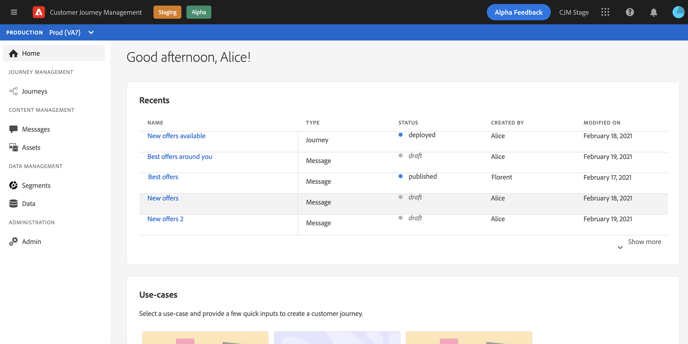

# Interfaz de usuario {#cjm-user-interface}

Una vez conectado a [Adobe Experience Cloud](http://experience.adobe.com), vaya a [!DNL Journey Optimizer].

>[!NOTE]
>
>* Los conceptos clave al examinar la interfaz de usuario son habituales en Adobe Experience Platform. Consulte la [documentación de Adobe Experience Platform](https://experienceleague.adobe.com/docs/experience-platform/landing/platform-ui/ui-guide.html#adobe-experience-platform-ui-guide){target=&quot;_blank&quot;} para obtener más información.
   >
   >
* Esta documentación se actualiza con frecuencia para reflejar los cambios recientes en la interfaz de usuario del producto. Sin embargo, algunas capturas de pantalla pueden diferir ligeramente de la interfaz de usuario que ve.
   >
   > 
* Los componentes y las funciones disponibles en la IU dependen de los permisos y del paquete de licencias. Para cualquier pregunta, póngase en contacto con el administrador de éxito del cliente de Adobe.

## Navegación izquierda

Utilice los vínculos de la izquierda para examinar las funciones.

>[!NOTE]
>
>Las capacidades disponibles pueden variar según los permisos y el acuerdo de licencia.

A continuación, hay la lista completa de servicios y capacidades en el menú izquierdo y los vínculos a la documentación asociada.

**Inicio**

La página principal de [!DNL Journey Optimizer] contiene vínculos clave y recursos para comenzar. La lista **[!UICONTROL Recents]** proporciona accesos directos a los mensajes, eventos y recorridos creados o actualizados recientemente. Esta lista muestra sus fechas de creación y modificación, así como el estado.

**[!UICONTROL JOURNEY MANAGEMENT]**

* **[!UICONTROL Journeys]**: Cree, configure y organice sus recorridos de cliente. [Más información](building-journeys/journey-gs.md#jo-build)

* **[!UICONTROL Messages]**: Cree, diseñe, pruebe y publique mensajes de correo electrónico y push. [Más información](create-message.md)

**[!UICONTROL DECISION MANAGEMENT]**

* **[!UICONTROL Offers]**: Acceda a sus fuentes y conjuntos de datos recientes desde este menú. Utilice esta sección para crear nuevas ofertas. [Más información](offers/offer-library/creating-personalized-offers.md)

* **[!UICONTROL Components]**: Cree ubicaciones, reglas y etiquetas. [Más información](offers/offer-library/key-steps.md)

**[!UICONTROL CONTENT MANAGEMENT]**

* **[!UICONTROL Assets]**: [!DNL Adobe Experience Manager Assets Essentials] es un repositorio centralizado de recursos que puede utilizar para rellenar los mensajes. [Más información](assets-essentials.md)

**[!UICONTROL DATA MANAGEMENT]**

* **[!UICONTROL Schemas]**: Utilice Adobe Experience Platform para crear y administrar esquemas del Modelo de datos de experiencia (XDM) en un lienzo visual interactivo denominado Editor de esquemas. [Más información](get-started-schemas.md)

* **[!UICONTROL Datasets]**: Todos los datos que se incorporan a Adobe Experience Platform se conservan dentro del lago de datos como conjuntos de datos. Un conjunto de datos es una construcción de almacenamiento y administración para una colección de datos, normalmente una tabla, que contiene un esquema (columnas) y campos (filas). [Más información](get-started-datasets.md)

* **[!UICONTROL Queries]**: Utilice el servicio de consulta de Adobe Experience Platform para escribir y ejecutar consultas, ver consultas ejecutadas anteriormente, y acceder a las guardadas por usuarios de su organización. [Más información](get-started-queries.md)

* **[!UICONTROL Monitoring]**: Utilice este menú para controlar la ingesta de datos en la interfaz de usuario de Adobe Experience Platform. [Más información](https://experienceleague.adobe.com/docs/experience-platform/ingestion/quality/monitor-data-ingestion.html?lang=es){target=&quot;_blank&quot;}

**[!UICONTROL CONNECTIONS]**

* **[!UICONTROL Sources]**: Utilice este menú para introducir datos de una variedad de fuentes, como aplicaciones de Adobe, almacenamiento basado en la nube, bases de datos y mucho más, así como estructurar, etiquetar y mejorar los datos entrantes. [Más información](get-started-sources.md)

**[!UICONTROL CUSTOMER]**

* **[!UICONTROL Segments]**: Cree y administre definiciones de segmentos de Experience Platform para aprovecharlas en sus recorridos. [Más información](segment/about-segments.md)

* **[!UICONTROL Profiles]**: Perfil del cliente en tiempo real crea una vista integral de cada uno de sus clientes individuales, combinando datos de varios canales, incluidos datos en línea, sin conexión, CRM y de terceros. [Más información](get-started-profiles.md)

* **[!UICONTROL Identities]**: El servicio de identidad de Adobe Experience Platform administra la identificación de sus clientes en varios dispositivos, canales cruzados y casi en tiempo real en lo que se conoce como gráfico de identidad dentro de Adobe Experience Platform. [Más información](get-started-identity.md)

**[!UICONTROL ADMINISTRATION]**

* **[!UICONTROL Journey Administration]**: Utilice este menú para configurar [eventos](event/about-events.md), [fuentes de ](datasource/about-data-sources.md) datos y  acciones que se utilizarán en los recorridos.

* **[!UICONTROL Sandboxes]**: Adobe Experience Platform proporciona entornos limitados que dividen una sola instancia en entornos virtuales independientes para ayudarle a desarrollar aplicaciones de experiencia digital y hacer que evolucionen. [Más información](administration/sandboxes.md)

## Casos de uso dentro del producto

Aproveche los casos de uso de [!DNL Adobe Journey Optimizer] de la página de inicio y proporcione información rápida para crear un recorrido del cliente.

Los casos de uso disponibles son:

* **Cree perfiles de prueba**, para crear perfiles de prueba con la plantilla CSV a fin de probar mensajes y recorridos personalizados. Aprenda a implementar este caso de uso [en esta página](building-journeys/creating-test-profiles.md#use-case-1).
* **Envíe un mensaje de cumpleaños a los clientes** para que envíen automáticamente un correo electrónico a fin de felicitar a sus clientes. (próximamente)
* **Envíe correos electrónicos a nuevos clientes** para que envíen fácilmente hasta dos correos electrónicos para dar la bienvenida a sus clientes recién registrados. (próximamente)
* **Envíe mensajes push a la lista importada de clientes** para enviar rápidamente una notificación push a una lista de clientes importados desde un archivo CSV. (próximamente)

Haga clic en **[!UICONTROL View details]** para obtener más información acerca de cada caso de uso.

Haga clic en el botón **[!UICONTROL Begin]** para iniciar el caso de uso.

Puede acceder a los casos de uso ejecutados desde el botón **[!UICONTROL View use case library]**.

## Buscar ayuda y asistencia

Acceda a las páginas de ayuda clave de Adobe Journey Optimizer desde la sección inferior de la página de inicio.

Utilice el icono **Ayuda** para acceder a las páginas de ayuda, ponerse en contacto con el servicio de asistencia técnica y compartir comentarios. Puede buscar artículos de ayuda y vídeos en el campo de búsqueda.

## Navegadores admitidos

La interfaz de Adobe [!DNL Journey Optimizer] está diseñada para funcionar de forma óptima en la última versión de Google Chrome. Es posible que tenga problemas al utilizar determinadas funciones en versiones anteriores u otros navegadores.

## Preferencias de idioma

Actualmente, la interfaz de usuario está disponible en los siguientes idiomas:

* Inglés
* Francés
* Alemán

El idioma predeterminado de la interfaz está determinado por el idioma preferido especificado en el perfil de usuario.

Para cambiar el idioma:

* Haga clic en **Preferencias** desde el avatar, en la parte superior derecha.
   
* A continuación, haga clic en el idioma mostrado debajo de su dirección de correo electrónico
* Seleccione el idioma que prefiera y haga clic en **Guardar**. Puede seleccionar un segundo idioma en caso de que el componente que esté utilizando no esté localizado en su primer idioma.
   

## Buscar

Desde la interfaz de Adobe Journey Optimizer, utilice la búsqueda de Adobe Experience Cloud en el centro de la barra superior para encontrar recursos, recorridos o mensajes en los entornos limitados. Empiece a introducir contenido para mostrar los resultados principales.

Pulse **Entrar** para acceder a todos los resultados y filtrar.

## Filtrar listas{#section_lgm_hpz_pgb}

En la mayoría de las listas, una barra de búsqueda le permite buscar un elemento específico y seleccionar criterios de filtrado.

Se puede acceder a los filtros haciendo clic en el icono de filtro en la parte superior izquierda de la lista. El menú de filtros permite filtrar los elementos mostrados según diferentes criterios. Puede elegir mostrar únicamente los elementos de un determinado tipo o estado, los que ha creado o los modificados en los últimos 30 días. Las opciones difieren según el contexto.

En la lista de recorridos, puede filtrar los recorridos según su estado, tipo y versión desde **[!UICONTROL Status and version filters]**. El tipo puede ser: **[!UICONTROL Unitary event]**, **[!UICONTROL Segment qualification]**, **[!UICONTROL Read segment]**, **[!UICONTROL Business event]** o **[!UICONTROL Burst]**. Puede elegir mostrar solo los recorridos que utilizan un evento, un grupo de campos o una acción en particular en **[!UICONTROL Activity filters]** y **[!UICONTROL Data filters]**. Los **[!UICONTROL Publication filters]** permiten seleccionar una fecha de publicación o un usuario. Puede elegir, por ejemplo, mostrar las versiones más recientes de recorridos en directo que se publicaron ayer. [Más información](building-journeys/using-the-journey-designer.md).

>[!NOTE]
>
>Tenga en cuenta que las columnas mostradas se pueden personalizar mediante el botón de configuración en la parte superior derecha de las listas. La personalización se guarda para cada usuario.

Utilice las columnas **[!UICONTROL Last update]** y **[!UICONTROL Last update by]** para comprobar cuándo se produjo la última actualización de los recorridos y quién los guardó.

En los paneles Evento, Fuente de datos y Configuración de acciones, el campo **[!UICONTROL Used in]** muestra el número de recorridos que utilizan ese evento, grupo de campos o acción en particular. Puede hacer clic en **[!UICONTROL View journeys]** para mostrar la lista de los recorridos correspondientes.

En las diferentes listas, puede realizar acciones básicas por cada elemento. Por ejemplo, puede duplicar o eliminar un elemento.

