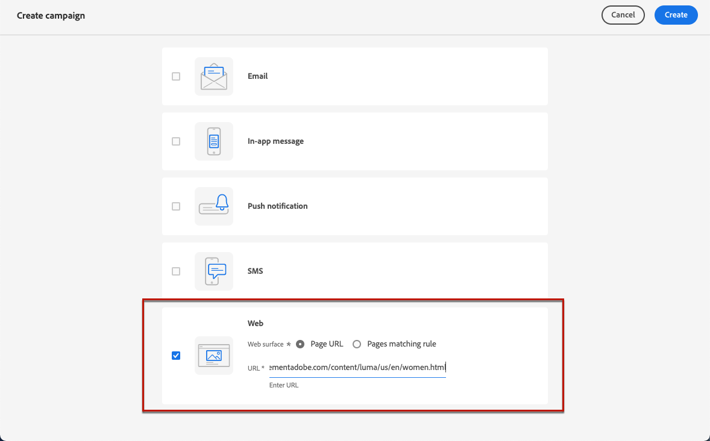
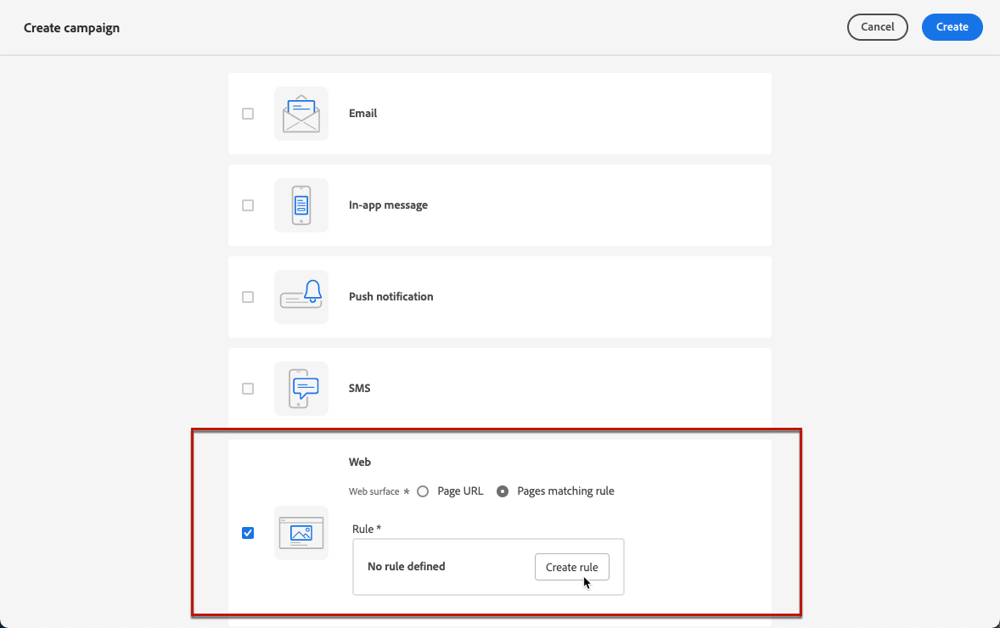

# Creación de experiencias web {#create-web}

>[!BEGINSHADEBOX]

Lo que encontrará en esta documentación:

* [Introducción al canal web](get-started-web.md)
* **[Creación de experiencias web](create-web.md)**
* [Creación de páginas web](author-web.md)
* [Extensión Ayuda de edición visual](visual-editing-helper.md)
* [Creación de informes web](web-report.md)

>[!ENDSHADEBOX]

[!DNL Journey Optimizer] permite personalizar la experiencia web que ofrece a sus clientes a través de campañas web entrantes.

>[!CAUTION]
>
>Actualmente en [!DNL Journey Optimizer] solo puede crear experiencias web con **campañas**.

## Requisitos previos {#prerequesites}

Para poder acceder y crear páginas web en [!DNL Journey Optimizer] Siga los requisitos previos a continuación:

* Para agregar modificaciones al sitio web, debe implementar la variable [SDK web de Adobe Experience Platform](https://experienceleague.adobe.com/docs/platform-learn/implement-web-sdk/overview.html?lang=es){target="_blank"} en su sitio web.

* Para acceder a [!DNL Journey Optimizer] diseñador web, debe descargar el [Ayuda de edición visual de Adobe Experience Cloud](https://chrome.google.com/webstore/detail/adobe-experience-cloud-vi/kgmjjkfjacffaebgpkpcllakjifppnca){target="_blank"} extensión del explorador en Chrome. [Más información](visual-editing-helper.md)

>[!CAUTION]
>
>Google Chrome es el único explorador que admite la creación de páginas web en [!DNL Journey Optimizer].

Para que la experiencia web se entregue correctamente, se debe definir la siguiente configuración:

* En el [Recopilación de datos de Adobe Experience Platform](https://experienceleague.adobe.com/docs/experience-platform/edge/datastreams/overview.html?lang=es){target="_blank"}, asegúrese de que tiene un conjunto de datos definido como en **[!UICONTROL Adobe Experience Platform]** servicio dispone de los dos **[!UICONTROL Segmentación de Edge]** y **[!UICONTROL Adobe Journey Optimizer]** opciones activadas.

   Esto garantiza que Adobe Experience Platform Edge gestione correctamente los eventos entrantes de Journey Optimizer. [Más información](https://experienceleague.adobe.com/docs/experience-platform/edge/datastreams/configure.html?lang=es){target="_blank"}

   

   >[!NOTE]
   >
   >El **[!UICONTROL Adobe Journey Optimizer]** La opción solo se puede activar cuando la opción **[!UICONTROL Segmentación de Edge]** ya está activada la opción.

* Entrada [Adobe Experience Platform](https://experienceleague.adobe.com/docs/experience-platform/profile/home.html?lang=es){target="_blank"}, make sure you have one merge policy with the **[!UICONTROL Active-On-Edge Merge Policy]** option enabled. To do this, select a policy under the **[!UICONTROL Customer]** > **[!UICONTROL Profiles]** > **[!UICONTROL Merge Policies]** Experience Platform menu. [Learn more](https://experienceleague.adobe.com/docs/experience-platform/profile/merge-policies/ui-guide.html#configure){target="_blank"}

   Esta política de combinación la utiliza [!DNL Journey Optimizer] canales entrantes para activar y publicar correctamente campañas entrantes en edge. [Más información](https://experienceleague.adobe.com/docs/experience-platform/profile/merge-policies/ui-guide.html){target="_blank"}

   

## Creación de una campaña web {#create-web-campaign}

>[!CONTEXTUALHELP]
>id="ajo_web_surface"
>title="Definición de una superficie web"
>abstract="Una superficie web puede coincidir con una dirección URL de una sola página o con varias páginas, lo que permite enviar modificaciones de contenido a través de una o varias páginas web."

Para empezar a crear una experiencia web a través de una campaña, siga los pasos a continuación.

1. Creación de una campaña. [Más información](../campaigns/create-campaign.md)

1. Seleccione el **[!UICONTROL Web]** acción.

   

1. Defina una superficie web.

   >[!NOTE]
   >
   >Una superficie web es una propiedad web identificada por una dirección URL a la que se envía el contenido. Puede coincidir con una dirección URL de una sola página o varias páginas, lo que le permite enviar modificaciones en una o varias páginas web.

   Puede introducir una **[!UICONTROL URL de página]** si desea aplicar los cambios solo a una página.

   

1. O puede crear una **[!UICONTROL Regla de coincidencia de páginas]** para dirigirse a varias direcciones URL que coincidan con la misma regla; por ejemplo, si desea aplicar los cambios a un banner a pantalla completa en todo un sitio web o agregar una imagen superior que se muestre en todas las páginas de producto de un sitio web.

   Para ello, seleccione **[!UICONTROL Regla de coincidencia de páginas]** y haga clic en **[!UICONTROL Crear regla]**.

   

1. Defina los criterios de **[!UICONTROL Dominio]** y **[!UICONTROL Página]** campos.

   Por ejemplo, si desea editar elementos que se muestran en todas las páginas de productos de sexo femenino del sitio web de Luma, seleccione **[!UICONTROL Dominio]** > **[!UICONTROL Comienza por]** > `luma` y **[!UICONTROL Página]** > **[!UICONTROL Contains]** > `women`.

   

1. Guarde los cambios. La regla se muestra en la **[!UICONTROL Crear campaña]** pantalla.

   

1. Una vez definida la superficie web, seleccione **[!UICONTROL Crear]**. Ahora puede configurar las propiedades y la configuración de la campaña.

## Configuración de la campaña web {#configure-web-campaign}

1. En el **[!UICONTROL Propiedades]** , puede editar el nombre de la campaña y añadir una descripción si es necesario.

   

1. Para asignar etiquetas de uso de datos personalizadas o principales a la campaña web, seleccione la **[!UICONTROL Administrar acceso]** botón en la parte superior de la pantalla. [Obtenga más información sobre el Control de acceso de nivel de objeto (OLAC)](../administration/object-based-access.md)

1. Puede seleccionar **[!UICONTROL Experimento de contenido]** para probar tratamientos de contenido con partes de la audiencia, a fin de determinar qué tratamiento tiene el mejor rendimiento con respecto a una métrica específica. [Más información](../campaigns/content-experiment.md)

   >[!AVAILABILITY]
   >
   >El **Experimento de contenido** Actualmente, esta función solo está disponible para un conjunto de organizaciones (disponibilidad limitada). Para obtener más información, contacte con su representante de Adobe.

1. Desde el **[!UICONTROL Acción]** de la campaña, seleccione **[!UICONTROL Editar contenido]** para empezar a crear la campaña web. [Más información](author-web.md)

   

1. Desde el **[!UICONTROL Audiencia]** pestaña, defina quién puede ver la campaña web. De forma predeterminada, la campaña web es visible para todos los visitantes.

   

   También puede seleccionar una audiencia específica. Utilice el **[!UICONTROL Seleccionar audiencia]** para mostrar la lista de segmentos de Adobe Experience Platform disponibles. [Más información sobre los segmentos](../segment/about-segments.md)

   >[!NOTE]
   >
   >Para campañas activadas por API, la audiencia debe configurarse mediante una llamada de API. [Más información](../campaigns/api-triggered-campaigns.md)

   

1. En el **[!UICONTROL Área de nombres de identidad]** , elija el área de nombres que desea utilizar para identificar a los individuos del segmento seleccionado. [Más información sobre las Áreas de nombres](../event/about-creating.md#select-the-namespace)

1. Defina un **[!UICONTROL Programación]** para su campaña web. [Más información](../campaigns/create-campaign.md#schedule)

   

   De forma predeterminada, se inicia cuando se activa manualmente y finaliza cuando se detiene manualmente, pero también puede definir fechas y horas específicas para que las modificaciones sean visibles.

   

## Activación de la campaña web {#activate-web-campaign}

Una vez que haya definido su [configuración de campañas web](#configure-web-campaign) y ha editado el contenido como ha deseado utilizando la variable [diseñador web](author-web.md), puede revisar y activar su campaña web. Complete los siguientes pasos.

>[!NOTE]
>
>También puede previsualizar el contenido de la campaña web antes de activarlo. [Más información](author-web.md#test-web-campaign)

1. En la campaña web, seleccione **[!UICONTROL Revisar para activar]**.

   

1. Revise y edite si es necesario el contenido, las propiedades, la superficie, la audiencia y la programación.

1. Seleccionar **[!UICONTROL Activar]**.

   

   >[!NOTE]
   >
   >Después de hacer clic en **[!UICONTROL Activar]**, los cambios en las campañas web pueden tardar hasta 15 minutos en estar disponibles en el sitio web.

La campaña web toma la **[!UICONTROL Activo]** estado y ahora son visibles para la audiencia seleccionada. Cada destinatario de la campaña puede ver las modificaciones agregadas al sitio web mediante el [!DNL Journey Optimizer] diseñador web.

>[!NOTE]
>
>Si ha definido una programación para la campaña web, tiene el **[!UICONTROL Programado]** estado hasta que se alcancen la fecha y la hora de inicio.
>
>Si activa una campaña web que afecte a las mismas páginas que otra campaña que ya está activa, todos los cambios se aplicarán a las páginas web.

Obtenga más información sobre la activación de campañas en [esta sección](../campaigns/review-activate-campaign.md).

## Detener una campaña web {#stop-web-campaign}

Cuando una campaña web está activa, puede detenerla para evitar que la audiencia vea las modificaciones. Complete los siguientes pasos.

1. Seleccione una campaña en directo en la lista.

1. En el menú superior, seleccione **[!UICONTROL Detener campaña]**.

   

1. Las modificaciones que ha añadido ya no serán visibles para la audiencia que ha definido.

>[!NOTE]
>
>Una vez detenida una campaña web, no se puede editar ni activar de nuevo. Solo puede duplicarla y activar la campaña duplicada.
