# Creación de experiencias web {#create-web}

>[!BEGINSHADEBOX]

**En esta página:** Aprenda a crear una experiencia web mediante un recorrido o una campaña, editar y probar su contenido, redirigir a los visitantes a otra dirección URL y publicarla, activarla o detenerla en Adobe Journey Optimizer.

>[!ENDSHADEBOX]

>[!CONTEXTUALHELP]
>id="ajo_journey_action_web"
>title="Acción web"
>abstract="Una acción de entrada de experiencia web muestra una experiencia web a los perfiles cuando llegan a este paso del recorrido. La etiqueta identifica la actividad en el lienzo de recorrido y la acción hace referencia a una configuración web que define el contenido mostrado. La sección **Optimization** puede incluir experimentos de contenido o reglas de segmentación. Se inserta automáticamente un nodo **Wait** después de esta actividad (3 días de forma predeterminada), lo que proporciona a los perfiles tiempo para ver la experiencia web."
>additional-url="https://experienceleague.adobe.com/es/docs/journey-optimizer/using/orchestrate-journeys/about-journey-building/journey-action#add-action" text="Introducción a las acciones del canal"

[!DNL Journey Optimizer] le permite personalizar la experiencia web que entrega a sus clientes a través de recorridos o campañas entrantes.

## Definir una experiencia web a través de un recorrido o una campaña {#create-web-experience}

>[!CONTEXTUALHELP]
>id="ajo_web_surface"
>title="Definir una configuración web"
>abstract="Una configuración web puede coincidir con una dirección URL de una sola página o varias páginas, lo que permite enviar modificaciones de contenido en una o varias páginas web."

>[!CONTEXTUALHELP]
>id="ajo_web_surface_rule"
>title="Creación de páginas que coincidan con una regla"
>abstract="Una regla de coincidencia de páginas permite dirigirse a varias direcciones URL que se ajusten a la misma regla; por ejemplo, si desea aplicar los cambios a un banner principal en todo un sitio web o agregar una imagen superior que se muestre en todas las páginas de producto de un sitio web."

Para empezar a crear una experiencia web a través de una campaña o un recorrido, siga los pasos a continuación.

>[!NOTE]
>
>Si es la primera vez que crea una experiencia web, asegúrese de seguir los requisitos previos descritos en [esta sección](web-prerequisites.md).

>[!BEGINTABS]

>[!TAB Agregar una experiencia web a un recorrido]

Para agregar una actividad **Web** a un recorrido, siga estos pasos:

1. [Crear un recorrido](../building-journeys/journey-gs.md).

1. Inicie el recorrido con una actividad [Event](../building-journeys/general-events.md) o [Read Audience](../building-journeys/read-audience.md).

1. Arrastre y suelte una actividad **[!UICONTROL Action]** desde la sección **[!UICONTROL Actions]** de la paleta. Más información sobre la [actividad de acción](../building-journeys/journey-action.md).

   >[!IMPORTANT]
   >
   >Las actividades heredadas de canales nativos (correo electrónico, push, SMS, en la aplicación, web, experiencia basada en código y tarjeta de contenido) quedaron obsoletas a partir de la versión de marzo de 2026. Los recorridos existentes que utilizan estas actividades siguen funcionando sin ningún cambio; no se requiere ninguna migración.

1. Seleccione **[!UICONTROL Web]** como tipo de acción.

   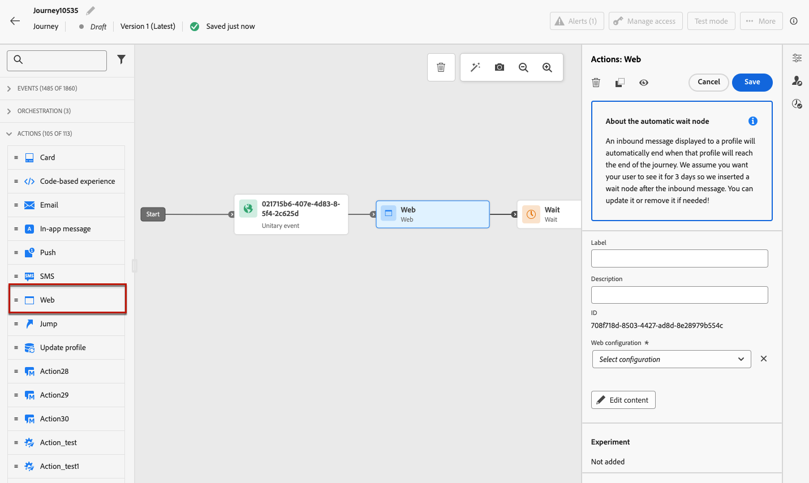

   >[!NOTE]
   >
   >Como **Web** es una actividad de experiencia entrante, viene con una actividad de **Espera** de 3 días. [Más información](../building-journeys/wait-activity.md#auto-wait-node)

1. Escriba una **[!UICONTROL etiqueta]** para identificar la acción en el lienzo de recorrido.

1. Haga clic en el botón **[!UICONTROL Configurar acción]**.

1. Se le dirigirá a la ficha **[!UICONTROL Acciones]**. A partir de ahí, seleccione o cree la [configuración web](web-configuration.md) que desea utilizar.

   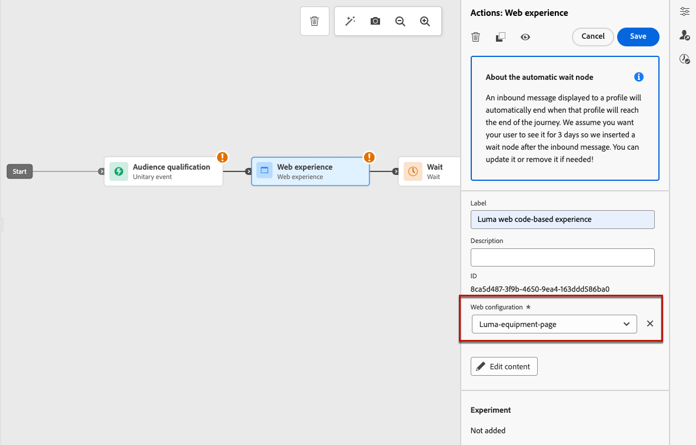

1. Puede agregar una o más acciones entrantes a su experiencia web haciendo clic en el botón **[!UICONTROL Agregar acción]**. [Más información](../building-journeys/journey-action.md#multi-action)

1. Volver al lienzo de recorrido. Si es necesario, complete el flujo de recorrido arrastrando y soltando acciones o eventos adicionales. [Más información](../building-journeys/about-journey-activities.md)

1. Seleccione el botón **[!UICONTROL Editar contenido]** y edite el contenido como desee. [Más información](#edit-web-content)

Para obtener más información sobre cómo crear, configurar y publicar un recorrido, consulte [esta página](../building-journeys/journey-gs.md).

>[!TAB Creación de una campaña web]

Para empezar a crear una experiencia web a través de una campaña, siga los pasos a continuación.

1. Cree una campaña. [Más información](../campaigns/create-campaign.md)

1. Seleccione el tipo de campaña que desea ejecutar

   * **Programado - Marketing**: ejecute la campaña inmediatamente o en una fecha especificada. Las campañas programadas están destinadas a enviar mensajes de marketing. Se configuran y ejecutan desde la interfaz de usuario de.

   * **Activado por API - Marketing/Transaccional**: ejecute la campaña mediante una llamada de API. Las campañas activadas por API están destinadas a enviar mensajes de marketing o transaccionales, es decir, mensajes enviados después de una acción realizada por un individuo: restablecimiento de contraseña, compra en el carro de compras, etc. [Aprenda a almacenar en déclencheur una campaña mediante API](../campaigns/api-triggered-campaigns.md)

1. Complete los pasos para crear una campaña web, como las propiedades de la campaña, [audiencia](../audience/about-audiences.md) y [programación](../campaigns/create-campaign.md#schedule).

1. Seleccione la acción **[!UICONTROL Web]**.

1. Seleccione o cree la configuración web. [Más información acerca de la configuración web](web-configuration.md)

   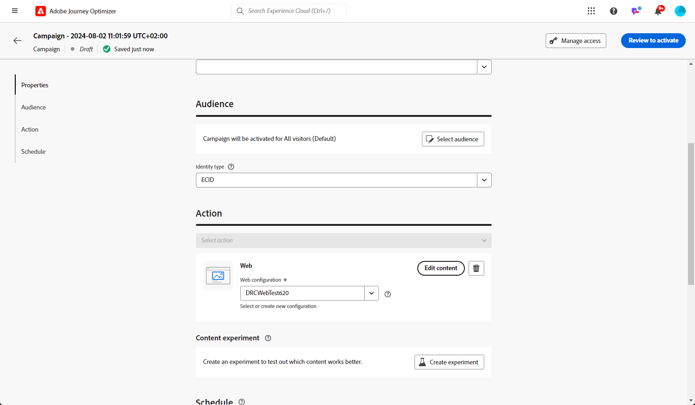

1. Haga clic en el botón **[!UICONTROL Editar contenido]** para editar el contenido como desee. [Más información](#edit-web-content)

   <!--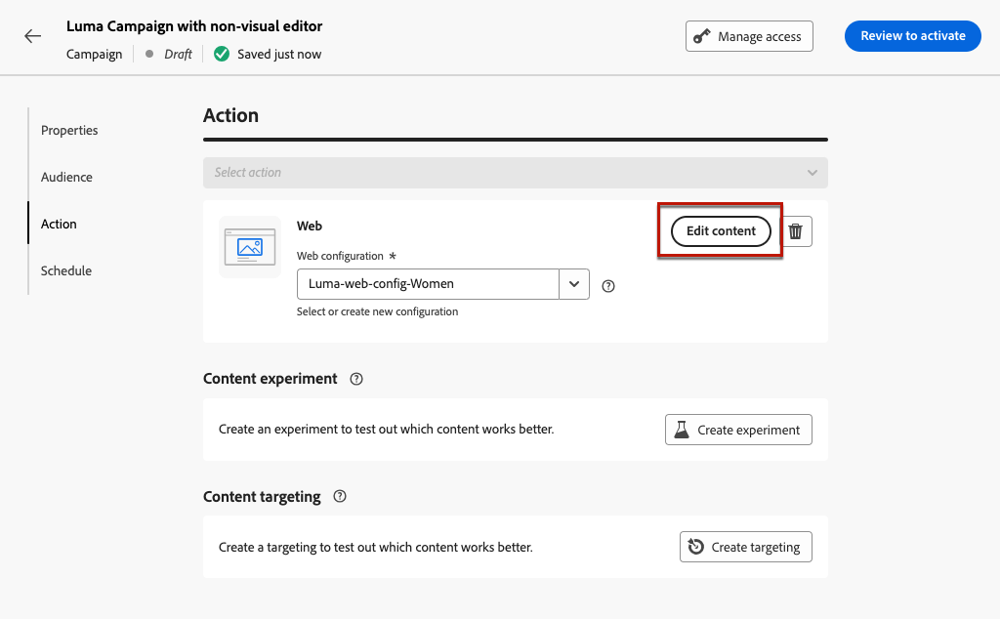-->

Para obtener más información sobre cómo configurar una campaña, consulte [esta página](../campaigns/get-started-with-campaigns.md).

➡️ [Aprenda a crear una campaña web en este vídeo](#video)

>[!ENDTABS]

## Editar contenido web {#edit-web-content}

>[!CONTEXTUALHELP]
>id="ajo_web_url_to_edit_surface"
>title="Confirmar la dirección URL para editar"
>abstract="Confirme la dirección URL de la página web específica que se utilizará para editar el contenido que se aplicará en la configuración web definida anteriormente. La página web debe implementarse mediante el SDK web de Adobe Experience Platform."
>additional-url="https://experienceleague.adobe.com/docs/platform-learn/implement-web-sdk/overview.html?lang=es" text="Más información"

>[!CONTEXTUALHELP]
>id="ajo_web_url_to_edit_rule"
>title="Introduzca la dirección URL para editar"
>abstract="Introduzca la dirección URL de una página web específica que se utilizará para editar el contenido que se aplicará a todas las páginas que coincidan con la regla. La página web debe implementarse mediante el SDK web de Adobe Experience Platform."
>additional-url="https://experienceleague.adobe.com/docs/platform-learn/implement-web-sdk/overview.html?lang=es" text="Más información"

Una vez que [agregaste una acción web](#create-web-experience) a un recorrido o a una campaña, puedes editar el contenido del sitio mediante:

* [diseñador web](web-visual-editor.md), para crear su experiencia con un editor visual;
* o [editor no visual](web-non-visual-editor.md).

Para empezar a crear la experiencia web, siga los pasos a continuación.

1. En la ficha **[!UICONTROL Acción]** de la campaña o en la actividad **[!UICONTROL Web]** del recorrido, seleccione **[!UICONTROL Editar contenido]**.

   

1. Se muestra la pantalla de edición. Puede:

   * Haga clic en el botón **[!UICONTROL Editar página web]** para empezar a crear contenido con el diseñador web para una experiencia visual. [Más información](web-visual-editor.md)

     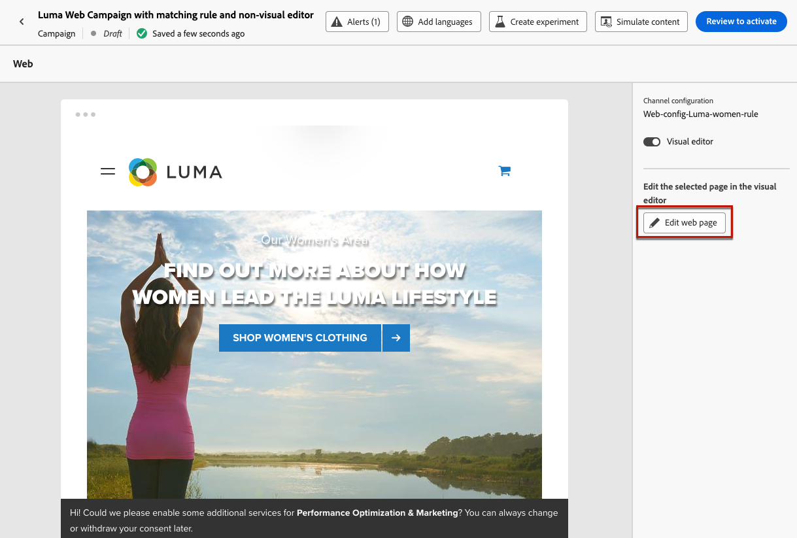

   * Desmarque la opción **[!UICONTROL Editor visual]** para usar el modo de edición no visual y haga clic en **[!UICONTROL Agregar una modificación]** para empezar a editar el contenido web sin cargar el editor visual. [Más información](web-non-visual-editor.md)

     

## Prueba de la experiencia web {#test-web-experience}

>[!CONTEXTUALHELP]
>id="ajo_web_designer_preview"
>title="Previsualizar la experiencia web"
>abstract="Obtenga una simulación del aspecto que tendrá su experiencia web."

Una vez que [haya creado su experiencia web](web-visual-editor.md) con el diseñador web, puede obtener una vista previa de las páginas web modificadas mediante cualquiera de los métodos de simulación:

* Haga clic en **[!UICONTROL Simular contenido]** para probar las variaciones de contenido con datos de entrada de muestra o generación automática de IA. [Aprenda a simular variaciones de contenido](../test-approve/simulate-sample-input.md)
* Haga clic en **[!UICONTROL Simular contenido]** y, a continuación, seleccione **[!UICONTROL Simular contenido (perfiles de AEP)]** en el menú desplegable para previsualizarlo con perfiles de prueba y agregar un perfil de prueba para comprobar su página web.

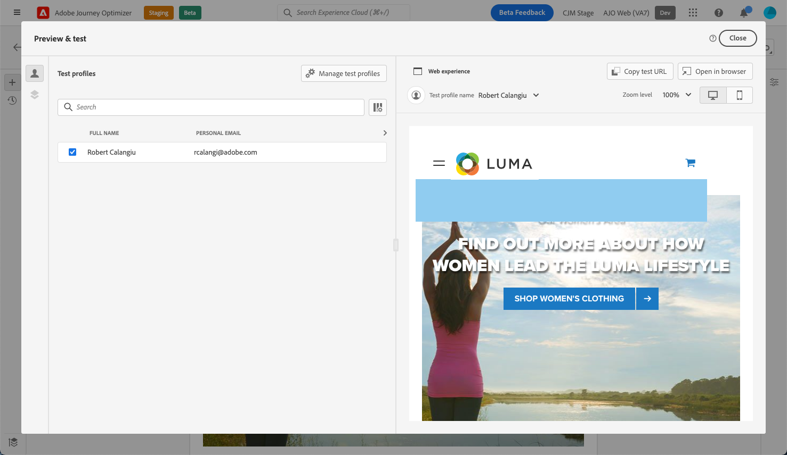

También puede abrirlo en el explorador predeterminado o copiar la dirección URL de prueba para pegarla en cualquier explorador. Esto le permite compartir el vínculo con su equipo y las partes interesadas, que pueden obtener una vista previa de la nueva experiencia web en cualquier explorador antes de que la campaña se ponga en marcha.

>[!NOTE]
>
>Al copiar la dirección URL de prueba, el contenido mostrado es el personalizado para el perfil de prueba utilizado cuando se generó la simulación de contenido en [!DNL Journey Optimizer].

Encontrará información detallada sobre cómo seleccionar perfiles de prueba y obtener una vista previa del contenido en la sección [Administración de contenido](../content-management/preview-test.md).

## Redirigir a URL {#web-redirect-to-url}

>[!CONTEXTUALHELP]
>id="ajo_web_designer_redirect"
>title="Redirigir a otra URL"
>abstract="Introduzca una URL existente a la que desee redirigir a los visitantes de su página."

Al crear una experiencia web, puede redirigir a los visitantes a otra URL existente en lugar de crear una nueva variación en el diseñador web.

Con esta capacidad, puedes ejecutar un [experimento de contenido](../content-management/content-experiment.md) comparando dos experiencias diferentes en lugar de solo cambiar algunos elementos dentro de una página.

Por ejemplo, cree una campaña web con dos tratamientos:

* En **Tratamiento A**, cree una experiencia web con el diseñador web para la mitad de la población objetivo.

* En **Tratamiento B**, seleccione la opción **[!UICONTROL Redirigir a URL]** para la otra mitad de la población de destino. Escriba la dirección URL de una página con un diseño alternativo creado fuera de [!DNL Journey Optimizer].

  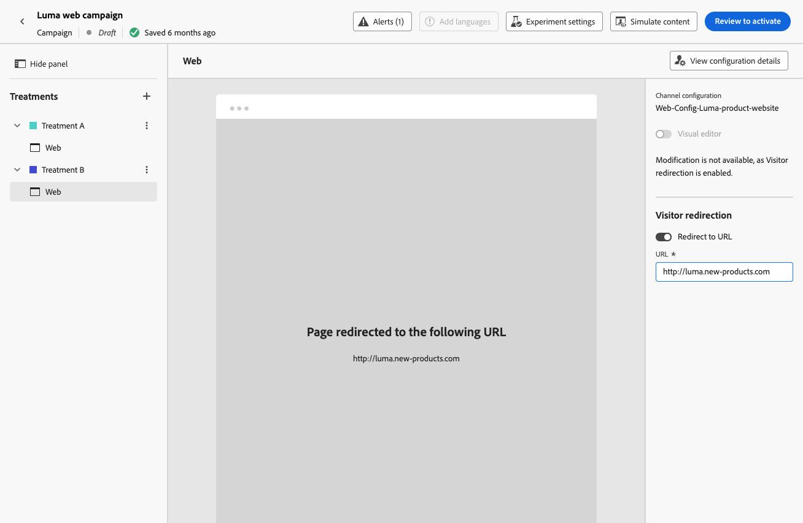

  >[!NOTE]
  >
  >La vista previa del sitio web ya no se muestra y el botón de alternancia **[!UICONTROL Editor visual]** está deshabilitado.

Una vez que la campaña web esté activa, puede rastrear el rendimiento de la experiencia web que creó en [!DNL Journey Optimizer] para los visitantes de la página frente a los que fueron redirigidos a la página de aterrizaje externa. Aprenda con el [informe de campaña de experimentación](../reports/campaign-global-report-cja-experimentation.md)

## Active la experiencia web {#web-experience-live}

>[!IMPORTANT]
>
> Si la campaña está sujeta a una directiva de aprobación, deberá solicitar la aprobación para poder activar las experiencias web. [Más información](../test-approve/gs-approval.md)

Una vez que haya definido la experiencia web y haya editado el contenido como desee, puede activar el recorrido o la campaña para que los cambios sean visibles a la audiencia.

También puede obtener una vista previa del contenido de la experiencia web antes de publicarlo. [Más información](#test-web-experience)

>[!NOTE]
>
>Si activa un recorrido o una campaña web que afecte a las mismas páginas que otro recorrido o campaña que ya esté activo, todos los cambios se aplicarán a las páginas web.
>
>Si varios recorridos o campañas actualizan los mismos elementos del sitio web, la prioridad más alta de recorrido/campaña tiene prioridad.

### Publicación de un recorrido web {#activate-web-journey}

Para que la experiencia web se active desde un recorrido, siga los pasos a continuación.

1. Compruebe que el recorrido sea válido y que no haya ningún error. [Más información](../building-journeys/troubleshooting.md#activity-errors)

1. En el recorrido, seleccione la opción **[!UICONTROL Publicar]**, que se encuentra en el menú desplegable superior derecho.

   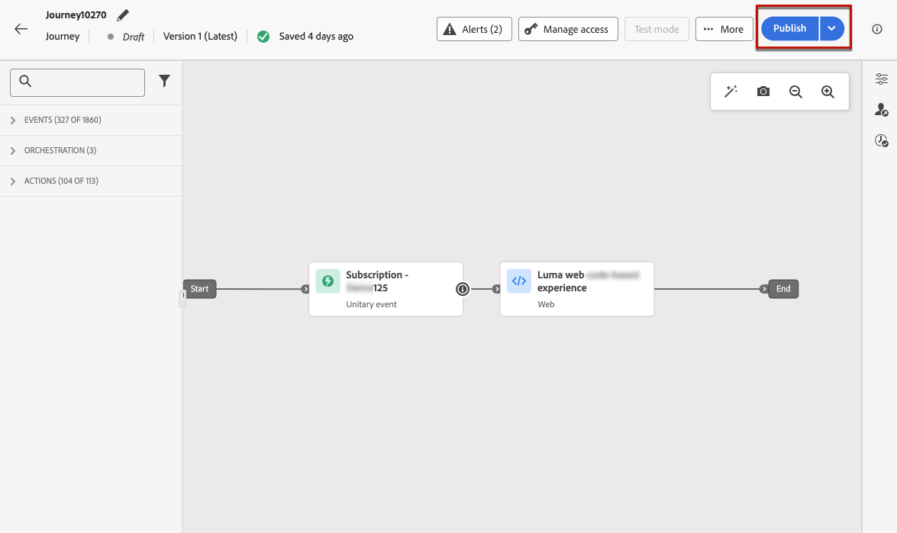

   >[!NOTE]
   >
   >Obtenga más información sobre cómo publicar recorridos en [esta sección](../building-journeys/publish-journey.md).

El recorrido web toma el estado **[!UICONTROL Activo]** y ahora es de solo lectura. Cada destinatario del recorrido puede ver las modificaciones agregadas al sitio web.

>[!NOTE]
>
>Después de hacer clic en **[!UICONTROL Publicar]**, los cambios pueden tardar hasta 15 minutos en estar disponibles en el sitio web.

### Activación de una campaña web {#activate-web-campaign}

Una vez que haya definido la configuración de la campaña web y haya editado el contenido según sus preferencias, puede revisar y activar la campaña web. Siga los pasos a continuación.

1. En su campaña web, seleccione **[!UICONTROL Revisar para activar]**.

1. Compruebe y edite si es necesario el contenido, las propiedades, la configuración, la audiencia y la programación.

1. Seleccione **[!UICONTROL Activar]**.

   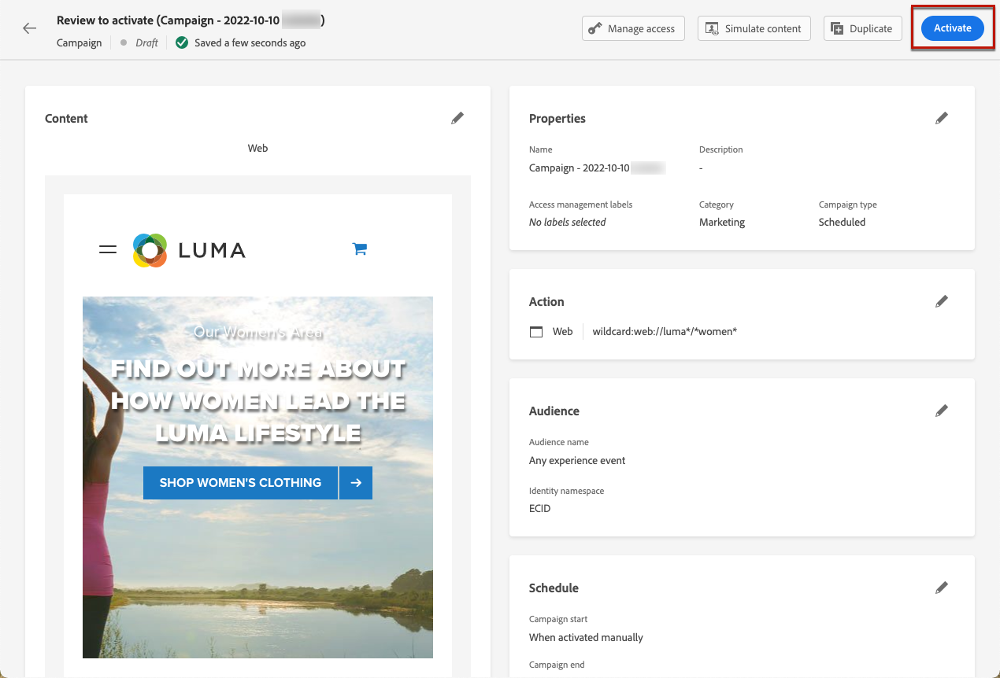

   >[!NOTE]
   >
   >Obtenga más información acerca de la activación de campañas en [esta sección](../campaigns/review-activate-campaign.md).

Su campaña web toma el **[[!UICONTROL estado]](../campaigns/manage-campaigns.md#statuses)&rbrack;** en vivo&lbrack; y ahora es visible para la audiencia seleccionada. Cada destinatario de la campaña puede ver las modificaciones agregadas al sitio web.

>[!NOTE]
>
>Después de hacer clic en **[!UICONTROL Activar]**, los cambios de las campañas web pueden tardar hasta 15 minutos en estar disponibles en el sitio web.
>
>Si ha definido una programación para su campaña web, tiene el **[[!UICONTROL estado]](../campaigns/manage-campaigns.md#statuses)&rbrack;** programado&lbrack; hasta que se alcance la fecha y la hora de inicio.

Una vez que la experiencia esté activa, puede monitorizar los recorridos y campañas web. [Más información](monitor-web-experiences.md)

## Detener un recorrido o una campaña web {#stop-web-experience}

Cuando un recorrido web o una campaña están activos, puede detenerlos para evitar que la audiencia vea las modificaciones. Siga los pasos a continuación.

1. Seleccione un recorrido o una campaña en directo en la lista correspondiente.

1. Realice la acción correspondiente según su caso:

   * En el menú superior de la campaña, seleccione **[!UICONTROL Detener campaña]**.

     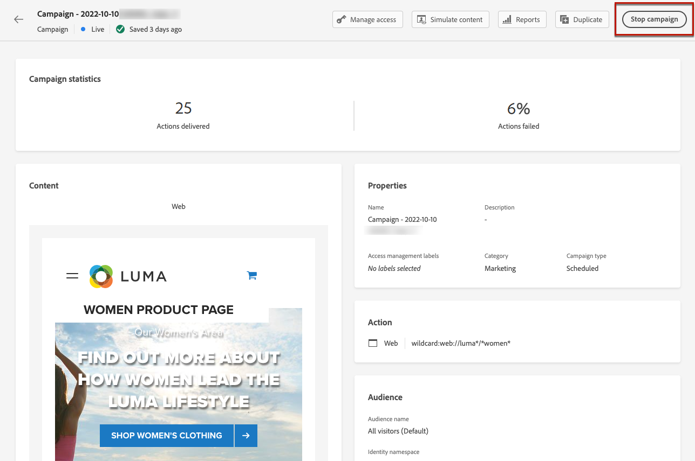

   * En el menú superior del recorrido, haga clic en el botón **[!UICONTROL Más]** y seleccione **[!UICONTROL Detener]**.

     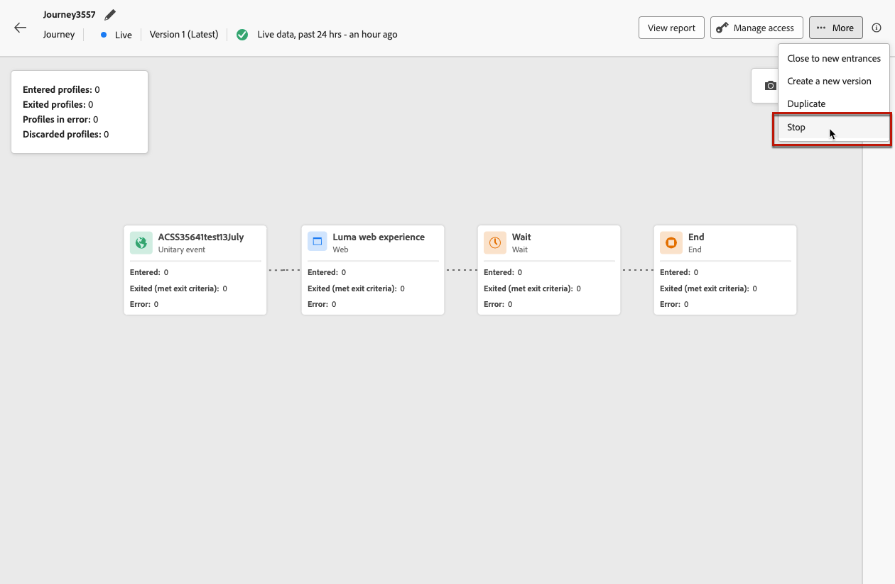

1. Las modificaciones que ha agregado ya no estarán visibles para la audiencia definida.

>[!NOTE]
>
>Una vez que se ha detenido un recorrido web o una campaña, no se puede editar ni activar de nuevo. Solo puede duplicarlo y activar la campaña o el recorrido duplicados.

## Vídeo práctico{#video}

El siguiente vídeo muestra cómo crear una campaña web, configurar sus propiedades, revisarla y publicarla.

>[!VIDEO](https://video.tv.adobe.com/v/3449984/?captions=spa&quality=12&learn=on)