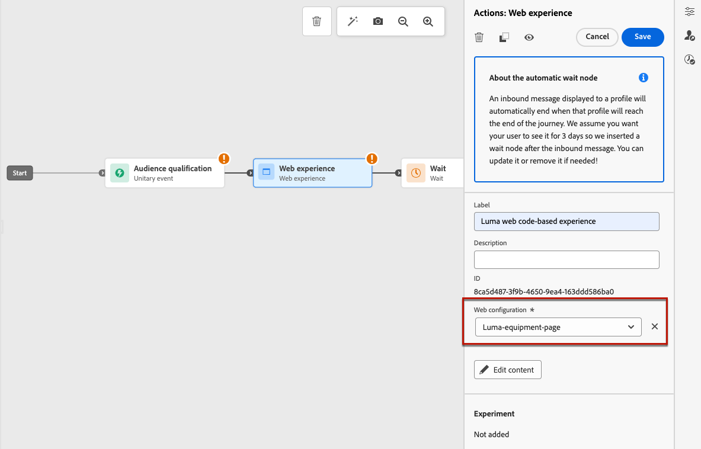
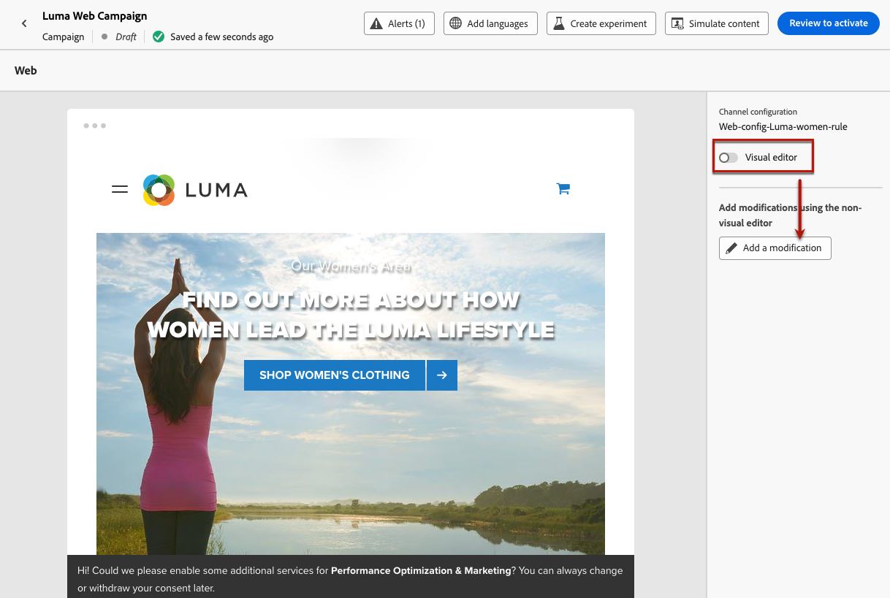

# Creación de experiencias web {#create-web}

[!DNL Journey Optimizer] le permite personalizar la experiencia web que entrega a sus clientes a través de recorridos o campañas entrantes.

## Definición de una experiencia web a través de un recorrido o una campaña {#create-web-experience}

>[!CONTEXTUALHELP]
>id="ajo_web_surface"
>title="Definir una configuración web"
>abstract="Una configuración web puede coincidir con una dirección URL de una sola página o varias páginas, lo que permite enviar modificaciones de contenido en una o varias páginas web."

>[!CONTEXTUALHELP]
>id="ajo_web_surface_rule"
>title="Creación de páginas que coincidan con una regla"
>abstract="Una regla de coincidencia de páginas permite dirigirse a varias direcciones URL que se ajusten a la misma regla; por ejemplo, si desea aplicar los cambios a un banner principal en todo un sitio web o agregar una imagen superior que se muestre en todas las páginas de producto de un sitio web."

Para empezar a crear una experiencia web a través de una campaña o un recorrido, siga los pasos a continuación.

>[!NOTE]
>
>Si es la primera vez que crea una experiencia web, asegúrese de seguir los requisitos previos descritos en [esta sección](web-prerequisites.md).

>[!BEGINTABS]

>[!TAB añadir un experiencia web a un recorrido]

Para agregar un **actividad web** a un viaje, seguir estos pasos:

1. [Crear un viaje](../building-journeys/journey-gs.md).

1. Inicie el recorrido con una actividad [Event](../building-journeys/general-events.md) o [Read Audience](../building-journeys/read-audience.md).

1. Arrastre y suelte una actividad **[!UICONTROL Web]** desde la sección **[!UICONTROL Acciones]** de la paleta.

   

   >[!NOTE]
   >
   >Como **Web** es una actividad de mensaje entrante, viene con una actividad de **Espera** de 3 días. [Más información](../building-journeys/wait-activity.md#auto-wait-node)

1. Escriba una **[!UICONTROL Etiqueta]** y **[!UICONTROL Descripción]** para su mensaje.

1. Seleccione o cree la [configuración](web-configuration.md) web que desea utilizar.

   

1. Seleccione el botón contenido Editar ]**y edite los**[!UICONTROL  contenido según sus preferencias. [Más información](#edit-web-content)

1. Si es necesario, complete el flujo de recorrido arrastrando y soltando acciones o eventos adicionales. [Más información](../building-journeys/about-journey-activities.md)

1. Una vez que la experiencia web esté lista, finalice la configuración y publique el recorrido para activarlo. [Más información](../building-journeys/publishing-the-journey.md)

Para obtener más información sobre cómo configurar un recorrido, consulte [esta página](../building-journeys/journey-gs.md).

>[!TAB Creación de una campaña web]

Para empezar a crear una experiencia web a través de una campaña, siga los pasos a continuación.

1. Cree una campaña. [Más información](../campaigns/create-campaign.md)

1. Seleccione el tipo de campaña que desea ejecutar

   * **Programado - Marketing**: ejecute la campaña inmediatamente o en una fecha especificada. Las campañas programadas están destinadas a enviar mensajes de marketing. Se configuran y ejecutan desde la interfaz de usuario de.

   * **Activado por API - Marketing/Transaccional**: ejecute la campaña mediante una llamada de API. Las campañas activadas por API tienen como objetivo enviar mensajes marketing o transaccionales, es decir, mensajes enviados después de una acción realizada por un individuo: contraseña reinicio, carro de compras compra, etc. [Aprenda cómo activar una campaña mediante API](../campaigns/api-triggered-campaigns.md)

1. Todas las aplicaciones los pasos para crear una campaña web, como las propiedades de campaña, [el audiencia](../audience/about-audiences.md) y [la programación](../campaigns/create-campaign.md#schedule).

1. Seleccione la **[!UICONTROL acción Web]** .

1. Seleccione o cree la configuración web. [Más información sobre la configuración web](web-configuration.md)

   

1. Haga clic en el botón **[!UICONTROL Editar contenido]** para editar el contenido como desee. [Más información](#edit-web-content)

   <!---->

Para obtener más información sobre cómo configurar una campaña, consulte [esta página](../campaigns/get-started-with-campaigns.md).

➡️ [Aprende a crear una campaña web en este video](#video)

>[!ENDTABS]

## Editar contenido web {#edit-web-content}

>[!CONTEXTUALHELP]
>id="ajo_web_url_to_edit_surface"
>title="Confirmar la dirección URL para editar"
>abstract="Confirme la dirección URL de la página web específica que se utilizará para editar el contenido que se aplicará en la configuración web definida anteriormente. La página web debe implementarse mediante el SDK web de Adobe Experience Platform."
>additional-url="https://experienceleague.adobe.com/docs/platform-learn/implement-web-sdk/overview.html?lang=es" text="Más información"

>[!CONTEXTUALHELP]
>id="ajo_web_url_to_edit_rule"
>title="Introduzca la dirección URL para editar"
>abstract="Introduzca la dirección URL de una página web específica que se utilizará para editar el contenido que se aplicará a todas las páginas que coincidan con la regla. La página web debe implementarse mediante el SDK web de Adobe Experience Platform."
>additional-url="https://experienceleague.adobe.com/docs/platform-learn/implement-web-sdk/overview.html?lang=es" text="Más información"

Una vez que haya [agregado una acción](#create-web-experience) web a un recorrido o a un campaña, puede editar el contenido de su sitio mediante:

* el [diseñador](web-visual-editor.md) web, para crear su experiencia utilizando un editor visual;
* o el [editor](web-non-visual-editor.md) no visual.

Para inicio la creación de su experiencia web, seguir los pasos a continuación.

1. En la ficha **[!UICONTROL Acción]** de la campaña o en la actividad **[!UICONTROL Web]** del recorrido, seleccione **[!UICONTROL Editar contenido]**.

   

1. Se muestra la pantalla de edición. Puede:

   * Haga clic en el botón de Página **** web de Editar para inicio la creación de su contenido con el diseñador web para obtener una experiencia visual. [Más información](web-visual-editor.md)

     

   * Anule la selección de la **[!UICONTROL opción editor]** visuales para utilizar en su lugar el modo de edición no visual y haga clic en **[!UICONTROL añadir una modificación]** para inicio la edición del contenido web sin cargar el editor visual. [Más información](web-non-visual-editor.md)

     

## Prueba de la experiencia web {#test-web-experience}

>[!CONTEXTUALHELP]
>id="ajo_web_designer_preview"
>title="Previsualizar la experiencia web"
>abstract="Obtenga una simulación del aspecto que tendrá su experiencia web."

Una vez que [haya creado su experiencia web](web-visual-editor.md) con el diseñador web, puede usar perfiles de prueba para obtener una vista previa de las páginas web modificadas. Si ha insertado contenido personalizado, puede comprobar cómo se muestra este mediante los datos del perfil de prueba.

Para ello, haga clic en **[!UICONTROL Simular contenido]** desde la pantalla de contenido de edición de recorrido o campaña y, a continuación, agregue un perfil de prueba para comprobar la página web mediante los datos del perfil de prueba.

También puede abrirlo en el explorador predeterminado o copiar la dirección URL de prueba para pegarla en cualquier explorador. Esto le permite compartir el vínculo con su equipo y las partes interesadas, que pueden obtener una vista previa de la nueva experiencia web en cualquier explorador antes de que la campaña se ponga en marcha.

>[!NOTE]
>
>Al copiar la dirección URL de prueba, el contenido mostrado es el personalizado para el perfil de prueba utilizado cuando se generó la simulación de contenido en [!DNL Journey Optimizer].

Encontrará información detallada sobre cómo seleccionar perfiles de prueba y obtener una vista previa del contenido en la sección [Administración de contenido](../content-management/preview-test.md).

## Active la experiencia web {#web-experience-live}

>[!IMPORTANT]
>
> Si la campaña está sujeta a una directiva de aprobación, deberá solicitar la aprobación para poder activar las experiencias web. [Más información](../test-approve/gs-approval.md)

Una vez que haya definido su experiencia web y haya editado su contenido como desee, puede activar su viaje o campaña para que sus cambios sean visibles para su audiencia.

También puede previsualización su web experiencia contenido antes de ponerla en marcha. [Más información](#test-web-experience)

>[!NOTE]
>
>Si activa un recorrido o una campaña web que afecte a las mismas páginas que otro recorrido o campaña que ya esté activo, todos los cambios se aplicarán a las páginas web.
>
>Si varios recorridos o campañas actualizan los mismos elementos del sitio web, la prioridad más alta de recorrido/campaña tiene prioridad.

### Publish un recorrido web {#activate-web-journey}

Para que la experiencia web se active desde un recorrido, siga los pasos a continuación.

1. Verifique que su viaje sea válido y que no haya ningún error. [Más información](../building-journeys/troubleshooting.md#checking-for-errors-before-testing)

1. Desde el viaje, seleccione la **[!UICONTROL opción Publish]** , ubicada en el menú desplegable superior derecho.

   

   >[!NOTE]
   >
   >En esta sección](../building-journeys/publishing-the-journey.md) encontrará más información sobre los recorridos por la [publicación.

El recorrido web toma el estado **[!UICONTROL Activo]** y ahora es de solo lectura. Cada destinatario del recorrido puede ver las modificaciones agregadas al sitio web.

>[!NOTE]
>
>Después de hacer clic en **[!UICONTROL Publish]**, los cambios pueden tardar hasta 15 minutos en estar disponibles en el sitio web.

### Activación de una campaña web {#activate-web-campaign}

Una vez que haya definido la configuración de la campaña web y haya editado el contenido según sus preferencias, puede revisar y activar la campaña web. Siga los pasos a continuación.

1. En su campaña web, seleccione **[!UICONTROL Revisar para activar]**.

1. Compruebe y edite si es necesario el contenido, las propiedades, la configuración, la audiencia y la programación.

1. Seleccione **[!UICONTROL Activar]**.

   

   >[!NOTE]
   >
   >Más información sobre cómo activar campañas en [esta sección](../campaigns/review-activate-campaign.md).

La campaña web toma el estado **[!UICONTROL Activo]** y ahora es visible para la audiencia seleccionada. Cada destinatario de la campaña puede ver las modificaciones agregadas al sitio web.

>[!NOTE]
>
>Después de hacer clic en **[!UICONTROL Activar]**, los cambios de las campañas web pueden tardar hasta 15 minutos en estar disponibles en el sitio web.
>
>Si definió una programación para su campaña web, tiene el **[!UICONTROL estado Programado]** hasta que se alcanzan la fecha y hora del inicio.

Una vez que su experiencia esté activo, puede monitor sus campañas y recorridos web. [Más información](monitor-web-experiences.md)

## Parada un viaje web o campaña {#stop-web-experience}

Cuando un recorrido web o una campaña están activos, puede detenerlos para evitar que la audiencia vea las modificaciones. Siga los pasos a continuación.

1. Seleccione un recorrido o una campaña en directo en la lista correspondiente.

1. Realice la acción correspondiente según su caso:

   * En el menú superior de la campaña, seleccione **[!UICONTROL Detener campaña]**.

     

   * En el menú superior del recorrido, haga clic en el botón **[!UICONTROL Más]** y seleccione **[!UICONTROL Detener]**.

     

1. Las modificaciones que ha agregado ya no estarán visibles para la audiencia definida.

>[!NOTE]
>
>Una vez que se ha detenido un recorrido web o una campaña, no se puede editar ni activar de nuevo. Solo puede duplicarlo y activar la campaña o el recorrido duplicados.

## Vídeo explicativo{#video}

El siguiente vídeo muestra cómo crear una campaña web, configurar sus propiedades, revisarla y publicarla.

>[!VIDEO](https://video.tv.adobe.com/v/3418800/?quality=12&learn=on)