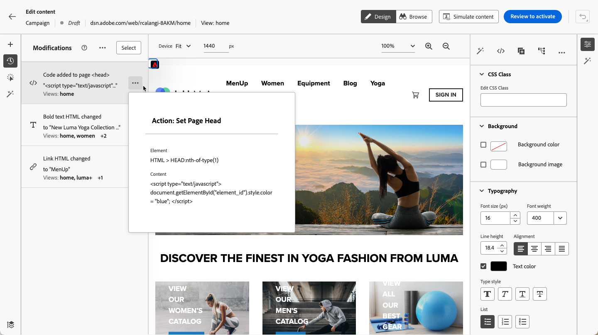

# Administración de modificaciones web {#manage-web-modifications}

>[!CONTEXTUALHELP]
>id="ajo_web_designer_modifications"
>title="Administrar fácilmente todos los cambios"
>abstract="Con este tablero, puede desplazarse por la página web y administrar todos los ajustes y estilos que haya agregado a ella."

Puede administrar fácilmente todos los componentes, ajustes y estilos que agregó a su página web. También puede agregar modificaciones directamente desde el panel dedicado.

## Trabajar con el panel Modificaciones {#use-modifications-pane}

1. Seleccione el icono **[!UICONTROL Modificaciones]** para mostrar el panel correspondiente a la izquierda.

   

1. Puede revisar cada uno de los cambios realizados en la página.

1. Seleccione una modificación no deseada y haga clic en la opción **[!UICONTROL Eliminar modificación]** del botón **[!UICONTROL Más acciones]** para eliminarla.

   

   >[!CAUTION]
   >
   >Proceda con cuidado al eliminar una acción, ya que puede afectar a las acciones posteriores.

1. Si está creando una [aplicación de una sola página](web-spa.md), puede aplicar cualquier modificación a otras vistas. [Más información](web-spa.md#apply-modifications-views)

1. Para eliminar varias modificaciones al mismo tiempo, haga clic en el botón **[!UICONTROL Seleccionar]** en la parte superior del panel **[!UICONTROL Modificaciones]**, compruebe las modificaciones que elija y haga clic en el icono **[!UICONTROL Eliminar]**.

   

1. Use el botón **[!UICONTROL Más acciones]** de la parte superior del panel **[!UICONTROL Modificaciones]** para eliminar todas las modificaciones a la vez.

   

1. También puede eliminar solo las modificaciones no válidas, es decir, los cambios que fueron anulados por otros cambios. Por ejemplo, si modifica el color de un texto y lo elimina, la modificación del color deja de ser válida porque el texto ya no existe.

1. Puede cancelar y rehacer las acciones usando el botón **[!UICONTROL Deshacer/Rehacer]** en la parte superior derecha de la pantalla.

   

   Mantenga presionado el botón para cambiar entre las opciones **[!UICONTROL Deshacer]** y **[!UICONTROL Rehacer]**. A continuación, haga clic en el botón para aplicar la acción deseada.

## Agregar modificaciones desde el panel dedicado {#add-modifications}

Al editar una página con el diseñador web, puede agregar nuevos cambios al contenido directamente desde el panel **[!UICONTROL Modificaciones]**, sin necesidad de seleccionar un componente y editarlo desde la interfaz del diseñador web. Siga los pasos a continuación.

1. En el panel **[!UICONTROL Modificaciones]**, haga clic en el botón **[!UICONTROL Más acciones]**.

1. Seleccione **[!UICONTROL Agregar una modificación]**.

   

1. Seleccione el tipo de modificación:

   * **[!UICONTROL Selector de CSS]** - [Más información](#css-selector)
   * **[!UICONTROL Página`<Head>`]** - [Más información](#page-head)

1. Escribe tu contenido y **[!UICONTROL guarda]** tus cambios.

1. Haga clic en el botón **[!UICONTROL Más acciones]** que está junto a la modificación y seleccione **[!UICONTROL Información]** para mostrar sus detalles.

   

### Selector de CSS {#css-selector}

Para agregar una modificación de tipo **Selector de CSS**, siga los pasos a continuación.

1. Seleccione **[!UICONTROL Selector de CSS]** como tipo de modificación.

1. El campo **[!UICONTROL Selector de elementos CSS]** le ayuda a encontrar y seleccionar los elementos HTML (o nodos del árbol DOM) en los que desea aplicar los cambios. <!--specify the desired CSS element that you want to modify.-->

   

1. Seleccione un tipo de acción (**[!UICONTROL Establecer contenido]** o **[!UICONTROL Establecer atributo]**) y rellene la información o el contenido necesarios.

   * **[!UICONTROL Establecer contenido]**: especifique el contenido que va al elemento identificado por el campo **[!UICONTROL Selector de elementos CSS]**.

   * **[!UICONTROL Establecer atributo]**: especifique un atributo que se asociará con el selector CSS actual para que este selector pueda identificarse también con este atributo. Para ello, escriba un nombre en el campo **[!UICONTROL Nombre del atributo]** y un valor en el campo **[!UICONTROL Contenido]**. Si el atributo ya existe, el valor se actualiza; de lo contrario, se agrega un nuevo atributo con el nombre y valor especificados.

     

### Página `<head>` {#page-head}

>[!CONTEXTUALHELP]
>id="ajo_web_designer_head"
>title="Añadir código personalizado"
>abstract="El elemento HEAD es un contenedor de metadatos que se coloca entre las etiquetas HTML y BODY. Añada solo elementos SCRIPT y STYLE. Si añade las etiquetas DIV y otros elementos, los elementos de HEAD restantes podrían saltar a la sección BODY."

Puede agregar código personalizado utilizando el tipo de modificación **[!UICONTROL Página`<head>`]**.

El elemento `<head>` es un contenedor de metadatos (datos sobre datos) y se coloca entre la etiqueta `<html>` y la etiqueta `<body>`. En este caso, el código no espera eventos body o page-load: se ejecuta al principio de la carga de la página.

El elemento `<head>` se utiliza comúnmente para agregar código JavaScript o CSS al principio de la página. Los selectores para las acciones visuales posteriores dependen de los elementos de HTML agregados en esta pestaña.

Para agregar una modificación de tipo **Página`<head>`**, siga los pasos a continuación.

1. Seleccione **[!UICONTROL Página`<head>`]** como tipo de modificación.

   

1. Agregue su código personalizado en el cuadro **[!UICONTROL Contenido]**.

   >[!CAUTION]
   >
   >Solo puede agregar elementos `<script>` y `<style>` a la sección `<head>`. Si se agregan etiquetas de `<div>` y otros elementos, es posible que `<head>` elementos restantes pasen al `<body>`.

1. Haga clic en el botón **[!UICONTROL Opciones de edición avanzadas]**. Se abre el editor de personalización.

   

   Puede aprovechar el editor de personalización [!DNL Journey Optimizer] con todas sus capacidades de personalización y creación. [Más información](../personalization/personalization-build-expressions.md)

#### Ejemplos de código personalizado {#custom-code-examples}

Puede usar el tipo de modificación **[!UICONTROL Página`<head>`]** para:

* Utilice JavaScript en línea o vincule a un archivo JavaScript externo.

  Por ejemplo, para cambiar el color de un elemento:

  ```
  <script type="text/javascript">
  document.getElementById("element_id").style.color = "blue";
  </script>
  ```

* Configure un estilo en línea o un vínculo a una hoja de estilos externa.

  Por ejemplo, para definir una clase para un elemento de superposición:

  ```
  <style>
  .overlay
  { position: absolute; top:0; left: 0; right: 0; bottom: 0; background: red; }
  </style>
  ```

#### Prácticas recomendadas de código personalizado {#custom-code-best-practices}

+++ **Siempre ajuste el código personalizado en un elemento.**

Por ejemplo:

```
<script>
// Code goes here
</script>
```

En caso de que sea necesario realizar alguna modificación, realice cambios dentro de este contenedor.

Si ya no necesita el código personalizado, deje este contenedor vacío, pero no lo elimine. Esto garantiza que otras modificaciones de la experiencia no se vean afectadas.

+++

+++ **No realice acciones document.write en scripts de código personalizado.**

Los scripts se ejecutan de forma asincrónica. Esto suele hacer que las acciones de document.write aparezcan en el lugar incorrecto de la página. No se recomienda utilizar document.write en scripts creados con código personalizado.

+++

+++ **Si crea un elemento y lo modifica, no elimine el elemento original.**

Cada cambio crea un nuevo elemento en el panel **[!UICONTROL Modificaciones]**. Debido a que la segunda acción modifica al Elemento 1, si elimina el Elemento 1, esa acción ya no tiene nada para modificar, por lo que el cambio ya no funciona.

+++

+++ **Tenga cuidado al usar el tipo de modificación**[!UICONTROL  Página `<head>`]**para dos campañas que afectan a la misma dirección URL.**

Si usa el tipo de modificación **[!UICONTROL Página`<head>`]** para dos campañas que afectan a la misma dirección URL, JavaScript se inserta en la página desde ambas campañas. [!DNL Journey Optimizer] determina automáticamente el orden del contenido enviado. Asegúrese de que el código no dependa de la ubicación. Depende de usted asegurarse de que no haya conflictos en el código.

+++
