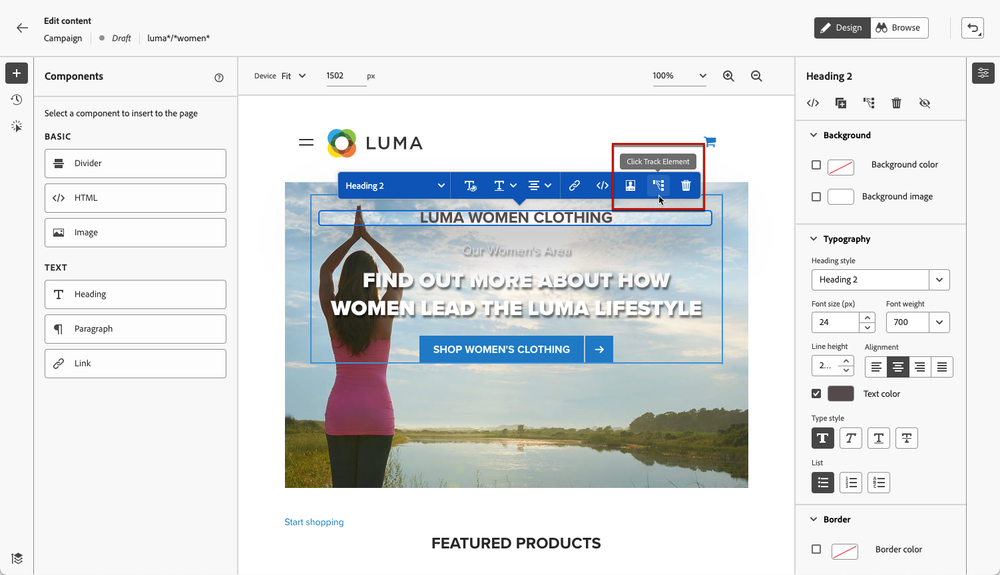

# Monitorización de sus experiencias web {#monitor-web-experiences}

## Consulte los informes web {#check-web-reports}

Una vez que la experiencia web esté activa, puede consultar la pestaña **[!UICONTROL Web]** del [informe de Recorrido](../reports/journey-global-report-cja-web.md) y el [informe de campaña](../reports/campaign-global-report-cja-web.md) para comparar elementos como el número de impresiones, la tasa de clics y el número de interacciones con la página web.

<!--You can check the **[!UICONTROL Web]** tab of the campaign reports. Learn more about the campaign web [live report](../reports/campaign-live-report.md#web-tab) and [global report](../reports/campaign-global-report-cja.md#web).-->

Para mejorar aún más la monitorización de la experiencia web, también puede rastrear los clics en cualquier elemento específico del sitio web. Esto le permite mostrar el número de clics en ese elemento en los informes web. [Descubra cómo](#use-click-tracing)

## Uso del rastreo de clics {#use-click-tracking}

El diseñador web le permite seleccionar cualquier elemento del sitio web y rastrear los clics en ese elemento.

Esta información puede ser útil para mejorar la experiencia de los usuarios del sitio web. Por ejemplo, si los [informes web](../reports/campaign-global-report-cja-web.md) muestran que muchos usuarios hacen clic en un elemento en el que no se puede hacer clic, es posible que desee agregar un vínculo a ese elemento.

1. Seleccione un elemento en su página y elija **[!UICONTROL Haga clic en rastrear elemento]** en el menú contextual.

   

   >[!NOTE]
   >
   >Se puede seleccionar cualquier elemento, activo o no.

1. La acción rastreada correspondiente se mostrará automáticamente en el panel **[!UICONTROL Hacer clic en rastrear]** de la izquierda.

   

1. Añada una etiqueta significativa para administrar todos los elementos rastreados y encontrarlos fácilmente en los informes. El campo **[!UICONTROL Selector de CSS]** muestra información para localizar el elemento seleccionado.

1. Repita los pasos anteriores para seleccionar tantos otros elementos como necesite para el rastreo de clics. Las acciones correspondientes se enumeran todas en el panel izquierdo.

   

1. Para eliminar el rastreo de clics en un elemento, seleccione el icono de eliminación correspondiente.

Una vez que la campaña esté activa, puede comprobar el número de clics de cada elemento en los [informes activos](../reports/campaign-live-report.md#web-tab) y [informes de Customer Journey Analytics](../reports/campaign-global-report-cja-web.md) de la web de la campaña.
