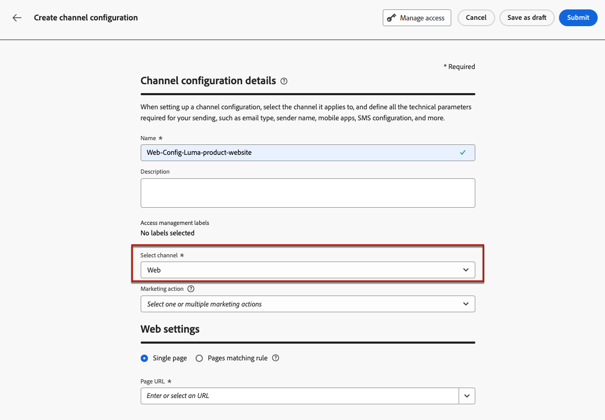

# Creación de una configuración de canal web {#web-configuration}

>[!CONTEXTUALHELP]
>id="ajo_admin_page_rule"
>title="Regla de coincidencia de páginas"
>abstract="Para administrar y segmentar de forma eficaz un grupo de direcciones URL que compartan los mismos criterios, cree una regla de coincidencia de páginas. Esta regla permite consolidar varias direcciones URL bajo una sola guía, lo que simplifica la aplicación de acciones y configuraciones coherentes en todas estas páginas."

>[!CONTEXTUALHELP]
>id="ajo_admin_default_url"
>title="URL de creación y previsualización predeterminadas"
>abstract="Este campo garantiza que las páginas generadas o coincidentes por la regla tengan una URL designada, esencial para crear y previsualizar contenido de forma eficaz."

Una configuración web es una propiedad web identificada por una dirección URL a la que se envía el contenido. Puede coincidir con una dirección URL de una sola página o varias páginas, lo que le permite enviar modificaciones en una o varias páginas web.

1. Acceda al menú **[!UICONTROL Canales]** > **[!UICONTROL Configuración general]** > **[!UICONTROL Configuraciones de canal]** y luego haga clic en **[!UICONTROL Crear configuración de canal]**.

   

1. Introduzca un nombre y una descripción (opcional) para la configuración.

   >[!NOTE]
   >
   > Los nombres deben comenzar por una letra (A-Z). Solo puede contener caracteres alfanuméricos. También puede utilizar caracteres de guion bajo `_`, punto`.` y guión `-`.

1. Para asignar etiquetas de uso de datos principales o personalizadas a la configuración, puedes seleccionar **[!UICONTROL Administrar acceso]**. [Más información sobre el Control de acceso de nivel de objeto (OLAC)](../administration/object-based-access.md).

1. Seleccione el canal **Web**.

   

1. Seleccione **[!UICONTROL Acciones de marketing]** para asociar directivas de consentimiento a los mensajes que usan esta configuración. Todas las políticas de consentimiento asociadas con la acción de marketing se aprovechan para respetar las preferencias de los clientes. [Más información](../action/consent.md#surface-marketing-actions)

1. Puede ingresar una **[!UICONTROL URL de página]** si desea aplicar los cambios solo a una página.

1. O puede generar una **[!UICONTROL regla que coincida con las páginas]** para dirigirse a varias direcciones URL que coincidan con la misma regla; por ejemplo, si desea aplicar los cambios a un banner a pantalla completa en todo un sitio web o agregar una imagen superior que se muestre en todas las páginas de productos de un sitio web.

   Para ello, seleccione **[!UICONTROL Regla de coincidencia de páginas]**.

1. Defina sus criterios para los campos **[!UICONTROL Dominio]** y **[!UICONTROL Página]**.

   Por ejemplo, si desea editar elementos que se muestran en todas las páginas de productos femeninas del sitio web de Luma, seleccione **[!UICONTROL Dominio]** > **[!UICONTROL Comienza con]** > `luma` y **[!UICONTROL Página]** > **[!UICONTROL Contiene]** > `women`.

   

1. Si creó una **[!UICONTROL regla de coincidencia de página]**, debe ingresar la URL de creación y vista previa **Predeterminada**. Este paso garantiza que las páginas generadas o coincidentes por la regla tengan una dirección URL designada tanto para la creación de contenido como para la vista previa. Obtenga más información acerca de la regla de coincidencia de página en la [sección siguiente](#web-page-matching-rule).

1. Guarde los cambios.

Ahora puede seleccionar la configuración al utilizar el canal Web en campañas o recorridos.

## Regla de coincidencia de página {#web-page-matching-rule}

Al crear una regla que coincida con varias páginas para que pueda aplicar los mismos cambios de contenido en varias páginas a la vez, puede usar operadores diferentes en las secciones **Dominio** y **Ruta** para generar la regla que desee. Compruebe los operadores disponibles a continuación.

Operadores disponibles para generar reglas de coincidencia de página:

* **Dominio**

  | Operador  | Descripción  | Ejemplos  |
  |---|---|---|
  | Igual a  | Coincidencia exacta del dominio.  |
  | Comienza por  | Coincide con todos los dominios (incluidos los subdominios) que comienzan con la cadena introducida.  | Ejemplo: &quot;Comienza con: dev&quot; -> coincide con todos los dominios y subdominios que comienzan con &quot;dev&quot;, como: dev.example.com, dev.products.example.com, developer.example.com  |
  | Finaliza con  | Coincide con todos los dominios (incluidos los subdominios) que terminan con la cadena introducida.  | Ejemplo: &quot;Termina con: example.com&quot; -> coincide con todos los dominios y subdominios que terminan con &quot;example.com&quot;, como: stage.example.com, prod.example.com, myexample.com  |
  | Coincidencia de comodines  | El operador &quot;Coincidencia de comodines&quot; permite al usuario definir una coincidencia de comodín en medio de la cadena, como &quot;dev&quot;.*.example.com&quot;. Las reglas de validación establecen que el valor debe contener un único comodín (asterisco) cuando el operador es &quot;comodín coincidente&quot;.  | Ejemplo: &quot;Coincidencia de comodines: dev.*.example.com&quot; -> coincide con dominios como: dev.products.example.com, dev.mytest.products.example.com, dev.blog.example.com  |
  | Cualquiera  | Coincide con todos los dominios, lo que resulta útil al probar una ruta concreta entre dominios  |

* **Ruta**

<table>
    <thead>
    <tr>
        <th><strong>Operador</th>
        <th><strong>Descripción</th>
        <th><strong>Ejemplos</th>
    </tr>
    </thead>
    <tbody>
    <tr>
        <td>Es igual a</td>
        <td>Coincidencia exacta de la ruta. </td>
        <td></td>
    </tr>
    <tr>
        <td>Comienza con</td>
        <td>Coincide con todas las rutas (incluidas las subrutas) que comienzan con la cadena introducida.</td>
        <td></td>
    </tr>
    <tr>
        <td>Termina con</td>
        <td>Coincide con todas las rutas (incluidas las subrutas) que terminan con la cadena introducida.</td>
        <td></td>
    </tr>
    <tr>
        <td>Cualquiera</td>
        <td>Coincide con todas las rutas: útil cuando se segmentan todas las rutas en uno o varios dominios.</td>
        <td></td>
    </tr>
    <tr>
        <td>Coincidencia de comodines</td>
        <td>El operador "Coincidencia de comodines" permite al usuario definir un comodín interno dentro de la ruta, como "/products/*/detail".  El carácter comodín * en el componente ** de ruta coincide con cualquier secuencia de caracteres hasta que se encuentra el primer carácter /.  /*/ coincide con cualquier secuencia de caracteres (incluidas las subrutas)</td>
        <td>Ejemplo: "Coincidencia de comodines: /products/*/detail", coincide con todas las rutas como: <ul><li>example.com/products/yoga/detail</li><li>example.com/products/surf/detail</li><li>example.com/products/tennis/detail</li><li>example.com/products/yoga/pants/detail</li></ul>Ejemplo: "Coincide: /prod*/detail, coincide con todas las rutas como: <ul><li>example.com/products/detail</li><li>example.com/production/detail</li></ul>no coincide con rutas como: <ul><li>example.com/products/yoga/detail</li></ul></td>
    </tr>
    <tr>
        <td>Contains</td>
        <td>"contiene" se traduce a un comodín como "mystring" y coincide con todas las rutas que contienen esta secuencia de caracteres.</td>
        <td>Por ejemplo: "Contiene: product", coincide con todas las rutas que contienen la cadena product, como: <ul><li>example.com/products</li><li>example.com/yoga/perfproduct</li><li>example.com/surf/productdescription</li><li>example.com/home/product/page</li></ul></td>
    </tr>
    </tbody>
</table>

Si el caso de uso no se puede modelar con una regla, tiene la opción de agregar varias reglas de página y puede utilizar entre ellas los operadores &quot;O&quot; o &quot;Excluir&quot;. La opción &quot;Excluir&quot; resulta útil cuando una de las páginas que coincide con la regla definida no debe estar segmentada: por ejemplo, todas las páginas &quot;example.com&quot; que contienen &quot;product&quot;, excluyendo la siguiente página: `https://example.com/blogs/productinfo`.
